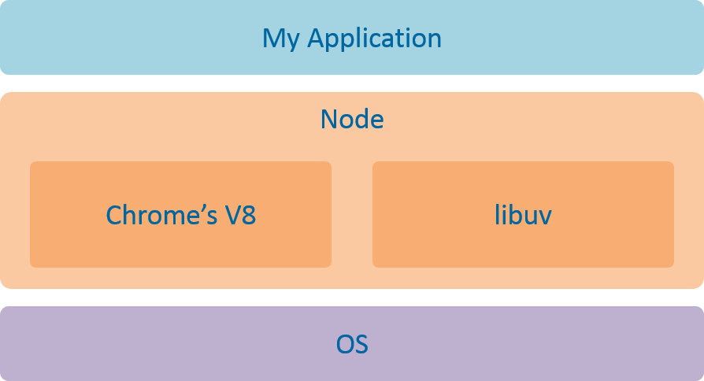
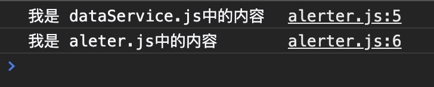

#  Node.js 

<code></code>


> 在学习 Node.js 之前一定要对与 JavaScript ES6 语法有一定的了解和认知

这里不一一展开讲解 ES6 了, 主要列举出 ES6 新特性, 这些新增加的与Node.js 息息相关

#### ES6 概览

- 块级作用域、模版字符串

  - let 和 const 关键字
- 对象扩展、变量的解构赋值
- 类 (class)、模块化(module)等
- 箭头函数

  - 箭头函数中的 this 指向 (保留函数词法作用域)
- 函数参数 (形参) 默认值 (缺省值)
- 展开运算符 `...`

## 为什么要学 Node.js ?

1、Node.js 使用 JavaScript 语言开发服务器端应用，**便于前端同学上手**（一些公司甚至要求前端工程师掌握 Node.js 开发）。

2、实现了前后端的语法统一，**有利于和前端代码整合**，甚至共用部分代码。

比如说，针对接口返回的各种字段，前后端都必须要做校验。此时，如果用 Node.js 来做后台开发的话，前后端可以共用校验的代码。

3、Node.js 性能高、生态系统活跃，提供了大量的开源库。

4、Jeff Atwood 在 2007 年提出了著名的 Atwood 定律：**任何能够用 JavaScript 实现的应用系统，最终都必将用 JavaScript 实现**。 Jeff Atwood 是谁不重要（他是 Stack Overflow 网站的联合创始人），重要的是这条定律。

## 什么是 Node.js ?

### 官方定义

[Node.js](https://nodejs.org/zh-cn/) 是一个基于 **Chrome V8 引擎**的 JavaScript 运行环境。Node.js 使用了一个**事件驱动**、**非阻塞式 I/O**的模型，使其轻量又高效。Node.js 的包管理工具 npm 是全球最大的开源库生态系统。

Node.js 不是一门语言，也不是 JavaScript 的框架，也不是像Nginx一样的Web服务器 ，**Node.js 是 JavaScript 在服务器端的运行环境（平台）**。


## Node.js 的组成 

> 在 Node.js 里运行 JavaScript，跟在 Chrome 里运行 JavaScript 有什么不同？
>

采用的是同样的 JS 引擎。在 Node.js 里写 JS，和在前端写 JS，几乎没有不同。在写法上的区别在于：Node.js 没有浏览器、页面标签相关的 API，但是新增了一些 Node.js 相关的 API。通俗来说，对于开发者而言，在前端写 JS 是用于控制浏览器；而 Node.js **环境**写 JS 可以控制整个计算机。

JavaScript 的组成分为三个部分：

-   ECMAScript

-   DOM：标签元素相关的API

-   BOM：浏览器相关的API

ECMAScript 是 JS 的语法；DOM 和 BOM 浏览器端为 JS 提供的 API。

而 Node.js 的组成分为：

-   **ECMAScript**。ECMAScript 的所有语法在 Node 环境中都可以使用。
-   **Node 环境**提供的一些**附加 API** (包括文件、网络等相关的 API)。


## Node.js 的架构和依赖

Node.js 内部采用 Google Chrome 的 V8 引擎，作为 JavaScript 语言解释器；同时结合自行开发的 libuv 库，**扩展了 JS 在后端的能力（比如 I/O 操作、文件读写、数据库操作等）**。使得 JS 既可以在前端进行 DOM 操作（浏览器前端），又可以在后端调用操作系统资源，是目前最简单的全栈式语言。



### Node.js 运行环境的核心：V8 引擎 和 libuv 库

Node.js 是 JavaScript 在服务器端的运行环境，在这个意义上，Node.js 的地位其实就是 JavaScript 在服务器端的虚拟机，类似于 Java 语言中的 Java 虚拟机。

-   [V8 引擎](https://v8.dev/) ：编译和执行 JS 代码、管理内存、垃圾回收。V8 给 JS 提供了运行环境，可以说是 JS 的虚拟机。V8 引擎本身是用 C++ 写的。

-   [libuv](https://zh.wikipedia.org/wiki/Libuv)： libuv 是一个专注于异步 I/O 的跨平台类库，目前主要在 Node.js 上使用。它是 Node.js 最初的作者 Ryan Dahl 为 Node.js 写的底层类库，也可以称之为虚拟机。libuv 本身是用 C 写的。

### V8 的内存限制

在一般的后端开发语言中，在基本的内存使用上没有什么限制，然而在 Node 中通过 JavaScript 使用内存时就会发现只能使用部分内存（64 位系统下约为 1.4GB，32 位系统下约为 0.7GB）。在这样的限制下，将会导致 Node 无法直接操作大内存对象。

造成这个问题的主要原因在于 Node 基于 V8 构建，所以在 Node 中使用的 JavaScript 对象基本上都是通过 V8 自己的方式来进行分配和管理的。V8 的这套内存管理机制在浏览器的应用场景下使用起来绰绰有余，足以胜任前端页面中的所有需求。但在 Node 中，这却限制了开发者随心所欲使用大内存的想法。

## Node.js 的应用

### 1、BFF 中间层

> BFF，即 Backend For Frontend（服务于前端的后端）
>
> BFF 模式下，整体分工很清晰，**后端通过 Java/C++ 等语言负责服务实现，理想情况下给前端提供的是基于领域模型的 RPC 接口，前端则在 BFF 层直接调用服务端 RPC 接口拿到数据**，按需加工消费数据，并实现人机交互。基于 BFF 模式的研发，很适合拥有前端技术背景的全栈型工程师。这种模式的好处很明显，后端可以专注于业务领域，更多从领域模型的视角去思考问题，页面视角的数据则交给前端型全栈工程师去搞定。**领域模型与页面数据是两种思维模式，通过 BFF 可以很好地解耦开，让彼此更专业高效**。

在 Web 服务里，搭建一个中间层，前端访问中间层的接口，中间层再访问后台的 Java/C++ 服务。这类服务的特点是不需要太强的服务器运算能力，但对程序的灵活性有较高的要求。这两个特点，正好和 Node.js 的优势相吻合。Node.js 非常适合用来做 BFF 层，优势如下：

-   对于前端来说：让前端**有能力自由组装后台数据**，这样可以减少大量的业务沟通成本，加快业务的迭代速度；并且，前端同学能够**自主决定**与后台的通讯方式。

-   对于后台和运维来说，好处是：安全性（不会把主服务器暴露在外面）、降低主服务器的复杂度等。

### 2、服务端渲染

**客户端渲染**（CSR / Client side render）：前端通过一大堆接口请求数据，然后通过 JS 动态处理和生成页面结构和展示。优点是**前后端分离**、减小服务器压力、局部刷新。缺点是不利于 SEO（如果你的页面然后通过 Ajax 异步获取内容，抓取工具并不会等待异步完成后再行抓取页面内容）、首屏渲染慢。

**服务端渲染**（SSR / Server Side Render）：服务器返回的不是接口数据，而是一整个页面（或整个楼层）的 HTML 字符串，浏览器直接显示即可。也就是说，在服务器端直接就渲染好了，然后一次性打包返回给前端。优点是**有利于 SEO、首屏渲染很快**。

**总结： 搜索引擎优化 + 首屏速度优化 = 服务端渲染**。

### 3、做小型服务、小型网站的后端（基于 Express、Koa 框架）


### 4、做项目构建工具

前端正在广泛使用的构建工具 gulp、Webpack，就是基于 Node.js 来实现的。

### 5、 做 PC 端的软件（基于 Electron 框架）

Electron 框架就是基于 Node.js 的。也可以说：Electron 是 Node.js 在PC客户端的技术。

## Node.js 的特点

-   异步、非阻塞 IO 模型

-   事件循环

-   单线程

-   总结：轻量和高效

Node.js 的性能和效率非常高。

传统的 Java 语言是一个请求开启一个线程，当请求处理完毕后就关闭这个线程。而 Node.js 则完全没有采用这种模型，它本质上就是一个单线程。

你可能会疑问：一个线程如何服务于大量的请求、如何处理高并发的呢？这是因为，Node.js 采用的是异步的、非阻塞的模型。

这里所谓的“单线程”，指的是 Node 的主线程只有一个。为了确保主线程不被阻塞，主线程是用于接收客户端请求。但不会处理具体的任务。而 Node 的背后还有一个线程池，线程池会处理长时间运行的任务（比如 IO 操作、网络操作）。线程池里的任务是通过队列和事件循环的机制来执行。

## 使用 Node.js 时的劣势

- 程序运行不稳定，可能会出现服务不可用的情况

- 程序运行效率较低，每秒的请求数维持在一个较低的水平

- 前端同学对服务器端的技术不太熟悉。

# Node.js 的常用命令

查看 node 的版本：

```bash
node -v
```

执行脚本字符串：

```bash
node -e 'console.log("Hello World")'
```

运行脚本文件：

```bash
node index.js
node path/index.js
node path/index
```

查看帮助：

```bash
node --help
```

进入 REPL 环境:

```bash
node
```

REPL 的全称：Read、Eval、 Print、Loop。类似于浏览器的控制台。

<code></code>

如果要退出 REPL 环境，可以输入`.exit` 或 `process.exit()`。

# NPM 和包 Package

## 什么是包?

由于 Node 是一套轻内核的平台，虽然提供了一系列的内置模块，但是不足以满足开发者的需求，于是乎出现了包（package）的概念：
与核心模块类似，就是将一些预先设计好的功能或者说 API 封装到一个文件夹，提供给开发者使用。

Node 本身并没有太多的功能性 API，所以市面上涌现出大量的第三方人员开发出来的 Package。

## 包的加载机制

如果 Node 中自带的包和第三方的包名冲突了，该怎么处理呢？原则是：

-   先在系统核心（优先级最高）的模块中找；

-   然后到当前项目中 node_modules 目录中找。

## NPM 的概念

**NPM**：Node Package Manager。

Node.js 发展到现在，已经形成了一个非常庞大的生态圈。包的生态圈一旦繁荣起来，就必须有工具去来管理这些包。NPM 应运而生。

举个例子，当我们在使用 Java 语言做开发时，需要用到 JDK 提供的内置库，以及第三方库。同样，在使用 JS 做开发时，我们可以使用 NPM 包管理器，方便地使用成熟的、优秀的第三方框架，融合到我们自己的项目中，极大地加速日常开发的构建过程。

随着时间的发展，NPM 出现了两层概念：

-   一层含义是 Node 的开放式模块登记和管理系统，亦可以说是一个生态圈，一个社区。
-   另一层含义是 Node 默认的模块管理器，是一个命令行下的软件，用来安装和管理 Node 模块。

# NPM 的常用命令

查看 npm 当前版本：

```bash
npm -v
```

更新 npm：

```bash
npm install npm@latest -g
# 常用
npm install npm -g
```

项目初始化：（执行完成后，会生成`package.json`文件）

```bash
npm init
# 快速跳过问答式界面，选择默认配置
npm init --yes
npm init -y
```

只在当前工程下安装指定的包：

```bash
# 当前工程安装
npm install [package]
#简单写
npm i
```

在全局安装指定的包：

```bash
# -g全局安装
npm install -g [package]
```

安装的包只用于『开发环境』，不用于生产环境：（会出现在 package.json 文件中的 devDependencies 属性中）

```bash
npm install [package] --save-dev
# 或者
npm install [package] -D
```

安装的包需要发布到『生产环境』：（会出现在 package.json 文件中的 dependencies 属性中）

```bash
npm install [package] --save
# 或者
npm install [package] -S
```

查看当前目录下已安装的 node 包：

```bash
npm list
```

查看全局已经安装的 node 包：

```bash
npm list -g
```

查看 npm 帮助命令：

```bash
npm --help
```

查看指定命令的帮助：

```bash
npm [指定命令] --help
```

更新指定的包：

```bash
npm update [package]
```

卸载指定的包：

```bash
npm uninstall [package]
# 简写
npm un [package]
```

查看配置信息：

```bash
npm config list
```

查看本地安装的指定包的信息，没有则显示 empty：

```bash
npm ls [package]
```

查看全局安装的指定包的信息，没有则显示 empty：

```bash
npm ls [package] -g
```

查看远程 npm 上指定包的所有版本信息：

```bash
npm info [package]
```

查看当前包的安装路径：

```bash
npm root
```

查看全局包的安装路径：

```bash
npm root -g
```

# Node.js 模块化

> Node.js 模块化规范

## 模块化的理解

**概念**：将一个复杂的程序依据一定的规则（规范）封装成几个块（文件），并组合在一起。

模块的内部数据、实现是私有的, 只是向外部暴露一些接口(方法)与外部其它模块通信。

最早的时候，我们会把所有的代码都写在一个js文件里，那么，耦合性会很高（关联性强），不利于维护；而且会造成全局污染，很容易命名冲突。

## 模块化的好处

- 避免命名冲突，减少命名空间污染
- 降低耦合性；更好地分离、按需加载
- **高复用性**：代码方便重用，别人开发的模块直接拿过来就可以使用，不需要重复开发类似的功能。
- **高可维护性**：软件的声明周期中最长的阶段其实并不是开发阶段，而是维护阶段，需求变更比较频繁。使用模块化的开发，方式更容易维护。
- 部署方便

## 模块化规范

模块化，首先可能会想到的思路是：在一个文件中引入多个js文件。如下：

```html
<body>
    <script src="zepto.js"></script>
    <script src="fastClick.js"></script>
    <script src="util/login.js"></script>
    <script src="util/base.js"></script>
    <script src="util/city.js"></script>
</body>
```

!!! 这样做会带来很多问题：

- 请求过多：引入十个 js 文件，就有十次 http 请求。

- 依赖模糊：不同的 js 文件可能会相互依赖，如果改其中的一个文件，另外一个文件可能会报错。

以上两点，最终导致：**难以维护**。 于是，这就引入了模块化规范。

###  模块化的概念解读

模块化起源于 Node.js。Node.js 中把很多 js 打包成 package，需要的时候直接通过 require 的方式进行调用（CommonJS），这就是模块化的方式。

那如何把这种模块化思维应用到前端来呢？这就产生了两种伟大的 js：RequireJS 和 SeaJS。

### 模块化规范

**服务器端规范：**

- CommonJS 规范：是 Node.js 使用的模块化规范。

CommonJS 就是一套约定标准，不是技术。用于约定我们的代码应该是怎样的一种结构。

**浏览器端规范：**

AMD 规范：是 RequireJS 在推广过程中对模块化定义的规范化产出。

> 异步加载模块;
>
> 依赖前置、提前执行：`require([foo,bar],function(foo,bar){});`   
>
> 依赖前置:把所有的包都 require 成功，再继续执行代码。
>
> define 定义模块：`define([require,foo],function(){return});`

CMD 规范：是 SeaJS 在推广过程中对模块化定义的规范化产出。淘宝团队开发。

> 同步加载模块;
>
> 依赖就近，延迟执行：``require(./a) `直接引入。或者`Require.async `异步引入。   
>
> 依赖就近：执行到这一部分的时候，再去加载对应的文件。
>
> define 定义模块， export 导出：``define(function(require, export, module){});``

# Node.js 加载模块流程

<code></code>


Node.js 缓存的是编译和执行后的对象

- 相同：
  Node 模块和非 Node 模块经历的过程都是，有执行后的缓存对象，返回缓存对象

  没有执行后的缓存对象，创建 module 对象，执行模块，存储执行后得到的对象，返回执行后的结果 exports

- 不同：
  缓存对象不同

  加载模块文件方式不同

# CommonJS 的基本语法

> [CommonJS](http://www.commonjs.org/)：是 Node.js 使用的模块化规范。也就是说，Node.js 就是基于 CommonJS 这种模块化规范来编写的。

CommonJS 规范规定：每个模块内部，module 变量代表当前模块。这个变量是一个对象，它的 exports 属性（即 module.exports）是对外的接口对象。加载某个模块，其实是加载该模块的 module.exports 对象。

```js
//module 变量代表当前模块
module = {
  //exports 属性（即 module.exports）是对外的接口对象
  exports: {
    
  }
}
```

在 CommonJS 中，每个文件都可以当作一个模块：

- 在服务器端：模块的加载是运行时同步加载的。

- 在浏览器端: 模块需要提前编译打包处理。首先，既然同步的，很容易引起阻塞；其次，浏览器不认识`require`语法，因此，需要提前编译打包。

## 模块的暴露和引入

Node.js 中只有模块级作用域，两个模块之间的变量、方法，默认是互不冲突，互不影响，这样就导致一个问题：模块 A 要怎样使用模块B中的变量&方法呢？这就需要通过 `exports` 关键字来实现。

Node.js中，每个模块都有一个 exports 接口对象，我们可以把公共的变量、方法挂载到这个接口对象中，其他的模块才可以使用。

## 暴露模块的方式一： export==s==

> 导出来的是 exports 对象的 「公共方法或属性」

> 这是一个对于 `module.exports` 的更简短的引用形式。
>
> `exports` 变量是在模块的文件级作用域内可用的，且在模块执行之前赋值给 `module.exports`。
>
> 如果为 `exports` 赋予了新值，则它将不再绑定到 `module.exports`

`exports`对象用来导出当前模块的**公共方法或属性**。别的模块通过 require 函数调用当前模块时，得到的就是当前模块的 exports 对象。

**语法**：

```js
//相当于是：给 exports 对象添加属性
exports.xxx = value;
//exports.name = 'playlife';
//exports.age = 23;
```

这个 value 可以是任意的数据类型。

**注意**：暴露的关键词是`exports`，不是`export`。其实，这里的 exports 类似于 ES6 中的 export 的用法，都是用来导出一个指定名字的对象。

**Demo example:**

```js
const name = 'playlife';
const fun = function (value) {
	return value * 2;
};
exports.name = name;
exports.fun = fun;
```

## 暴露模块的方式二： ==module.exports==

> 导出来的是默认的 模块 exports 「对象」, 没有指定的对象名

> `module.exports` 用于指定一个模块所导出的内容，即可以通过 `require()` 访问的内容。

`module.exports`用来导出一个默认对象，没有指定对象名。

**语法：**

```js
// 方式一：导出整个 exports 对象
module.exports = value;

// 方式二：给 exports 对象添加属性
module.exports.xxx = value;
```

这个 value 可以是任意的数据类型。

**Demo example:**

```js
// 方式1
module.exports = {
    name: '我是 playlife module1',
    fun(){
        console.log(this.name);
    }
}
// 我们不能再继续写 module.exports = value2。因为重新赋值，会把 exports 对象 之前的赋值覆盖掉。

// 方式2
const age = 23;
module.exports.age = age;
```

`module.exports` 还可以修改模块的原始导出对象。比如当前模块原本导出的是一个对象，我们可以通过 module.exports 修改为导出一个函数。如下：

```js
module.exports = function () {
    console.log('Now I am a function');
}
```

## exports 和 module.exports 的区别

> 想要完全弄明白 exports 和 module.exports 的区别, 就要理解两者代表了什么

Node 的模块系统遵循 CommonJS 规范

CommonJS 定义的模块分为: 模块标识(module)、模块定义(exports) 、模块引用(require)

在 Node 执行一个文件时，会给这个文件内生成一个 `exports` 和 `module`对象， 而`module`又有一个`exports`属性。它们都指向一块{}内存区域。


`exports `只是辅助 `module.exports` 操作内存中的数据 最后真正被 `require` 出去的内容还是``module.exports`

`exports` 变量是在模块的文件级作用域内可用的，且在模块执行之前赋值给 `module.exports`。

它允许使用快捷方式，因此 `module.exports.f = ...` 可以更简洁地写成 `exports.f = ...`。 但是，如果为 `exports` 赋予了新值，则它将不再绑定到 `module.exports`

当 `module.exports` 属性被新对象完全替换时，通常也会重新赋值 `exports`

### 总结:

**最重要的区别：**

- 使用exports时，只能单个设置属性 `exports.a = a;`
- 使用module.exports时，既单个设置属性 `module.exports.a`，也可以整个赋值 `module.exports = obj`。

**其他要点：**

- Node中每个模块的最后，都会执行 `return: module.exports`。

- Node中每个模块都会把 `module.exports`指向的对象赋值给一个变量 `exports`，也就是说 `exports = module.exports`。

- `module.exports = XXX`，表示当前模块导出一个单一成员，结果就是XXX。

- 如果需要导出多个成员，则必须使用 `exports.add = XXX; exports.foo = XXX`。或者使用 `module.exports.add = XXX; module.export.foo = XXX`。

### 问题: 暴露的模块到底是谁？

**答案**：暴露的本质是`exports`对象。

比如，方式一的 `exports.a = a` 可以理解成是，**给 exports 对象添加属性**。方式二的 `module.exports = a`可以理解成是给整个 exports 对象赋值。方式二的 `module.exports.c = c`可以理解成是给 exports 对象添加属性。

Node.js 中每个模块都有一个 module 对象，module 对象中的有一个 exports 属性称之为**接口对象**。我们需要把模块之间公共的方法或属性挂载在这个接口对象中，方便其他的模块使用。


## 引入模块的方式：require

require函数用来在一个模块中引入另外一个模块。传入模块名，返回模块导出对象。

**语法:**

```js
const module1 = require(id);
```

- `id` :  `<string>`模块的名称或路径。
- 返回: `<any>`导入的模块内容。

> 用于引入模块、 `JSON`、或本地文件。 可以从 `node_modules` 引入模块。 可以使用相对路径（例如 `./`、 `./foo`、 `./bar/baz`、 `../foo`）引入本地模块或 JSON 文件，路径会根据 `__dirname` 定义的目录名或当前工作目录进行处理。

解释：

- 内置模块：require的是**包名**。

- 下载的第三方模块：require的是**包名**。

- 自定义模块：require的是**文件路径**。文件路径既可以用绝对路径，也可以用相对路径。后缀名`.js`可以省略。

**Demo example:**

```js
//自定义模块:
//id: 相对路径
const module1 = require('./main.js');
//id: 相对路径 省略.js 后缀名
const module2 = require('./main');
//id: 绝对路径
const module3 = require('Demo/src/main.js');
```

**require()函数的两个作用**：

- 执行导入的模块中的代码。
- 返回导入模块中的接口对象。

使用 `require()` 加载模块后，会缓存起来，下次再调用 `require()`加载相同模块的时候，直接使用缓存，而不是从新加载，从而大大提高了性能。

**注意事项**：

- 无论是什么模块，我们都要使用 `require()` 去加载，然后才能使用。
- 加载自定义的模块，需要加 `./` ，而且可以省略后缀 `.js`

## require() 基本用法

当 Node 遇到 require(X) 时，按下面的顺序处理。

（1）如果 X 是内置模块（比如 require('http'）)
　　a. 返回该模块。
　　b. 不再继续执行。

（2）如果 X 以 "./" 或者 "/" 或者 "../" 开头
　　a. 根据 X 所在的父模块，确定 X 的绝对路径。
　　b. 将 X 当成文件，依次查找下面文件，只要其中有一个存在，就返回该文件，不再继续执行。

> - X
> - X.js
> - X.json
> - X.node

　　c. 将 X 当成目录，依次查找下面文件，只要其中有一个存在，就返回该文件，不再继续执行。

> - X/package.json（main字段）
> - X/index.js
> - X/index.json
> - X/index.node

（3）如果 X 不带路径
　　a. 根据 X 所在的父模块，确定 X 可能的安装目录。
　　b. 依次在每个目录中，将 X 当成文件名或目录名加载。

（4） 抛出 "not found"

## 主模块

> 主模块是整个程序执行的入口，可以调度其他模块。

```bash
# 运行main.js启动程序。此时，main.js就是主模块
node main.js
```

## 模块的初始化

一个模块中的 JS 代码仅在模块**第一次被使用时**执行一次，并且在使用的过程中进行初始化，然后会被缓存起来，便于后续继续使用。

**Demo example:**

(1) module.js

```js
var a = 1;
function add () {
	return ++a;
}
exports.add = add;
```

(2) 主模块 main.js

命令行`node main.js`  执行一下主模块

```js
var mod1 = require('./module.js');
var mod2 = require('./module.js');
cconsole.log(mod1.add());// 打印2
cconsole.log(mod2.add());// 打印3
```

从打印结果中可以看出，`module.js` 模块虽然被引用了两次，但只初始化了一次。


# CommonJS 实现举例

## CommonJS 服务器端实现

### 1、初始化项目

在工程文件中新建如下目录和文件：

```txt
.
├── app.js
└── modules
    ├── mod1.js
    ├── mod2.js
    └── mod3.js
```

在根目录下执行如下命令：

```bash
npm init
```

然后根据提示，依次输入如下内容：

- 包名：可以自己起包名，也可以用默认的包名。注意，包名里不能有中文，不能有大写。
- 版本：可以用默认的版本 1.0.0，也可以自己修改版本号。

剩下的参数，可以直接回车，默认即可。


根目录下会自动生成`package.json`这个文件:

```json
{
  "name": "firt_commonjs",
  "version": "0.0.1",
  "description": "",
  "main": "app.js",
  "scripts": {
    "test": "echo \"Error: no test specified\" && exit 1"
  },
  "author": "",
  "license": "ISC"
}
```

### 2、导入第三方包

`uniq`这个第三方包的作用是保证唯一性（用来举例）。在当前工程目录下，输入如下命令进行安装：ç

```bash
npm install	uniq
```

> 高版本的 npm 会自动添加依赖， 低版本的需要手动添加依赖

```bash
# --save 自动添加依赖
npm install uniq --save
```

`uniq`用法:

```js
var arr = [1, 1, 2, 2, 3, 5]
require("uniq")(arr)
console.log(arr)
//Prints:
//
//  1,2,3,5
//
```

### 3、自定义模块

(1) mod1.js

```js
module.exports = {
    name:'我是mod1',
    foo(){
        console.log(this.name);
    }
}
```

(2) mod2.js

```js
module.exports= ()=>{
    console.log('我是mod2');
}
```

(2) mod3.js

```js
exports.fn1 = () => {
    console.log('mod3里面的fn1');
};
exports.fn2 = () => {
    console.log('mod3里面的fn2');
};

exports.arr = [9, 9, 8, 8, 168, 326, 997];
```

(4) app.js

```js
let uniq = require('uniq');
let mod1 = require('./modules/mod1');
let mod2 = require('./modules/mod2');
let mod3 = require('./modules/mod3');
mod1.foo();
mod2();
mod3.fn1();
mod3.fn2();
uniq(mod3.arr);
console.log(mod3.arr);
```

在命令后工程文件下输入

```bash
node app。js
```


## CommonJS 浏览器端实现

### 1、初始化项目

在工程文件中新建如下目录和文件：

```text
.
├── index.html //基域浏览器端实现CommonJS，js文件要在浏览器上执行，所以需要有一个html页面
└── js
    ├── dist //打包生成文件的目录
    └── src
        ├── app.js //应用源主文件，主模块
        ├── mod1.js
        ├── mod2.js
        └── mod3.js
```

在根目录下执行如下命令：

```bash
npm init
```

然后根据提示，依次输入如下内容：

- 包名：可以自己起包名，也可以用默认的包名。注意，包名里不能有中文，不能有大写。
- 版本：可以用默认的版本 1.0.0，也可以自己修改版本号。

剩下的参数，可以直接回车，默认即可。

根目录下会自动生成`package.json`这个文件:

```json
{
  "name": "bower_commonjs",
  "version": "0.0.1",
  "description": "",
  "main": "index.js",
  "scripts": {
    "test": "echo \"Error: no test specified\" && exit 1"
  },
  "author": "",
  "license": "ISC"
}

```

### 2、下载第三方包：Browserify

> 需要用到[Browserify](http://browserify.org/)这个工具进行编译打包。Browserify 称为 CommonJS 的浏览器端的打包工具。

输入如下命令进行安装：

```bash
# 全局安装 Browserify 打包工具
npm install browserify -g 
```

```bash
# 局部（为本工程）添加开发依赖
npm install browserify --save-dev
```

- 开发依赖：当前这个包，只在开发环境下使用。

- 运行依赖：当前这个包，是在生产环境下使用。

### 3、自定义模块 & 代码运行

(1) mod1.js

```js
module.exports = {
    name:'我是mod1',
    foo(){
        console.log(this.name);
    }
}
```

(2) mod2.js

```js
module.exports= ()=>{
    console.log('我是mod2');
}
```

(2) mod3.js

```js
exports.fn1 = () => {
    console.log('mod3里面的fn1');
};
exports.fn2 = () => {
    console.log('mod3里面的fn2');
};

```

(4) app.js

```js
let mod1 = require('./mod1');
let mod2 = require('./mod2');
let mod3 = require('./mod3');
mod1.foo();
mod2();
mod3.fn1();
mod3.fn2();
```

主要代码就写完了。

但是，我们并不能直接在 index.html 中引入 app.js  如下

```html
<!DOCTYPE html>
<html lang="en">
<head>
    <meta charset="UTF-8">
    <meta name="viewport" content="width=device-width, initial-scale=1.0">
    <meta http-equiv="X-UA-Compatible" content="ie=edge">
    <title>Document</title>
</head>
<body>
    <script src="./js/src/app.js"></script>
</body>
</html>
```

因为 浏览器不认识 `require` 关键字，这是 node 为我们提供的，浏览器并没有这个方法。

所以，我们需要将代码打包生成浏览器可以识别的代码，所以需要用到了直接所安装第三方包：`Browserify`

在工程文件下输入命令行指令：

```bash
# 这是 browserify 为我们提供的命令行工具，执行后会在 js/dist/ 目录下生成浏览器可以识别的代码文件 bundle.js
# 其他指令 请查阅 browserify 官方文档
browserify js/src/app.js -o js/dist/bundle.js
```

在 index.html 引入打包好的文件

```html
<script src="./js/dist/bundle.js"></script>
```

用浏览器打开 index.html

控制台内容：

<code></code>

浏览器可以识别，执行。

# Node.js 模块

Node.js 应用由模块组成，采用 CommonJS 模块规范。Node.js 中的模块分为三种：

- 内置模块

- 第三方模块

- 自定义模块

## 全局对象

> 这些对象在所有的模块中都可用。

以下的变量虽然看似全局的，但实际上不是。 它们仅存在于模块的作用域中，

- `__dirname`
- `__filename`
- `exports`
- `module`
- `require()`

### global

类似于客户端 JavaScript 运行环境中的 window。


### process

用于获取当前的 Node 进程信息，一般用于获取环境变量之类的信息。

### console

Node 中内置的 console 模块，提供操作控制台的输入输出功能，常见使用方式与客户端类似。

## 全局函数

- setInterval(callback, millisecond)

- clearInterval(timer)

- setTimeout(callback, millisecond)

- clearTimeout(timer)

- Buffer：Class
  - 用于操作二进制数据
  - ...

## 内置模块

```js
const fs = require('fs');
const path = require('path');
```

常见的内置模块包括：

- `fs`：文件系统模块，操作（CRUD）文件系统。
- path：路径模块，处理文件路径。
- OS：操作系统相关
- net：网络相关
- `http`：提供 HTTP 服务器功能。
- `child_process`：新建子进程。
- `util`：提供一系列实用小工具。
- `url`：用于解析 URL。
- `querystring`：解析 URL 中的查询字符串。
- `crypto`：提供加密和解密功能。

## 第三方模块

```js
const express = require('express');
```

`require` 加载第三方包的机制：

（1）第三方包安装好后，这个包一般会存放在当前项目的 `node_modules` 文件夹中。我们找到这个包的 `package.json` 文件，并且找到里面的`main`属性对应的入口模块，这个入口模块就是这个包的入口文件。

（2）如果第三方包中没有找到`package.json`文件，或者`package.json`文件中没有main属性，则默认加载第三方包中的`index.js`文件。

（3）如果在 `node_modules` 文件夹中没有找到这个包，或者以上所有情况都没有找到，则会向上一级父级目录下查找`node_modules`文件夹，查找规则如上一致。

（4）如果一直找到该模块的磁盘根路径都没有找到，则会报错：can not find module xxx。

# ----------内置模块----------

# fs 文件模块

使用文件模块之前，先导入

```
// 导入文件模块
const fs = require('fs');
```

fs 的英文全称是 File System。fs 模块提供了很多 api 方法，我们首先应该学习的方法是**文件读取**。

## 读取文件

> 当路径是目录时，则 `fs.readFile()` 和 `fs.readFileSync()`的行为是特定于平台的。 在 macOS、Linux 和 Windows 上，会返回错误。在 FreeBSD 上，会返回目录内容的表示。

### 异步读取文件 fs.readFile()

```js
fs.readFile(path[, options], callback(error, data))
```

参数：

- `path`：`<string>`|`<Buffer>` | `<URL>` | `<integer>`文件名或文件描述符。必选参数，需要指定一个文件路径的字符串，表示要读取哪个路径对应的文件。
- `options`：`<Object>` | `<string>`可选参数，表示以什么编码格式来读取文件。
  - `encoding`:  `<string>` | `<null>` **默认值: null**。
  - `flag`:  `<string>` 参见文件系统 flag 的支持。 **默认值: 'r'**。
- `callback`:  `<Function>`必选参数，文件读取完成后，通过回调函数拿到读取的结果。
  - `err`:  `<Error>`
  - `data`:  `<string>` | `<Buffer>`

注意： 

回调会传入两个参数 `(err, data)`，其中 `data` 是文件的内容。

如果没有指定字符编码，则返回原始的 buffer。

如果 `options` 是字符串，则它指定字符编码：

```js
fs.readFile('/etc/passwd', (err, data) => {
  if (err) throw err;
  console.log(data);
});
```

异步地读取文件的全部内容。

> 如果需要嵌套读取多个文件，可以用 promise 或者 async ... await 进行封装

#### promise 封装 fs.readFile()

```js
const fs = require('fs');

function fsRead(path) {
    return new Promise((resolve, reject) => {
        fs.readFile(path, { flag: 'r', encoding: 'utf-8' }, (err, data) => {
            if (err) {
                //失败执行的内容
                reject(err);
            } else {
                //成功执行的内容
                resolve(data);
            }
        });
    });
}

const promise = fsRead('hello1.txt');
promise
    .then((res) => {
        console.log(res);
        return fsRead('hello2.txt');
    })
    .then((res) => {
        console.log(res);
        return fsRead('hello3.txt');
    })
    .then((res) => {
        console.log(res);
    });

```

#### async ... await 封装 fs.readFile()

```js
const fs = require('fs');

function fsRead(path) {
    return new Promise((resolve, reject) => {
        fs.readFile(path, { flag: 'r', encoding: 'utf-8' }, (err, data) => {
            if (err) {
                //失败执行的内容
                reject(err);
            } else {
                //成功执行的内容
                resolve(data);
            }
        });
    });
}

async function ReadList() {
    var res1 = await fsRead('hello1.txt');
    console.log(res1);
    var res2 = await fsRead('hello2.txt');
    console.log(res2);
    var res3 = await fsRead('hello3.txt');
    console.log(res3);
}
// 执行方法
ReadList();
```

### 同步读取文件 fs.readFileSync()

语法：

```js
fs.readFileSync(path[, options])
```

参数：

- `path`：`<string>`|`<Buffer>` | `<URL>` | `<integer>`文件名或文件描述符。必选参数，需要指定一个文件路径的字符串，表示要读取哪个路径对应的文件。
- `options`：`<Object>` | `<string>`可选参数，表示以什么编码格式来读取文件。
  - `encoding`:  `<string>` | `<null>` **默认值: null**。
  - `flag`:  `<string>` 参见文件系统 flag 的支持。 **默认值: 'r'**。

- 返回: `<string>` | `<Buffer>`

返回 `path` 的内容。

注意：如果指定了 `encoding` 选项，则此函数返回字符串。 否则，返回 buffer。

## 写入文件

###  fs.write()

语法 ：

```js
fs.write(fd, string[, position[, encoding]], callback)
```

- `fd`:  `<integer>` 文件描述符
- `string`:  `<string>` | `<Object>`
- `position`:  `<integer>`
- `encoding`:  `<string>` **默认值:  ‘utf8' **。

- `callback`:  `<Function>`
  - `err`: `<Error>`
  - `written`:  `<integer>`
  - `string`: `<string>`

将 `string` 写入到 `fd` 指定的文件。 如果 `string` 不是字符串或具有自有 `toString` 函数属性的对象，则抛出异常。

`position` 指定文件开头的偏移量（数据要被写入的位置）。 如果 `typeof position !== 'number'`，则数据会被写入当前的位置。 

`encoding` 是期望的字符串编码。

回调会接收到参数 `(err, written, string)`，其中 `written` 指定传入的字符串中被要求写入的字节数。 被写入的字节数不一定与被写入的字符串字符数相同。

不等待回调就对同一个文件多次使用 `fs.write()` 是不安全的。

###  fs.writeFile() 向指定的文件中写入内容

语法 ：

```js
fs.writeFile(file, data[, options], callback)
```

参数：

- `file`：`<string>`|`<Buffer>` | `<URL>` | `<integer>` 文件名或文件描述符。必选参数，需要指定一个文件路径的字符串，表示要读取哪个路径对应的文件。
- `data`:  `<string>` | `<Buffer>` | `<TypedArray>` | `<DataView>`

- `options`：`<Object>` | `<string>`可选参数，表示以什么编码格式来读取文件。
  - `encoding`:  `<string>` | `<null>` **默认值: null**。
  - `mode`: `<integer>` **默认值: 0o666。**
  - `flag`:  `<string>` 参见文件系统 flag 的支持。 **默认值: 'r'**。
- `callback`:  `<Function>`必选参数，文件读取完成后，通过回调函数拿到读取的结果。
  - `err`:  `<Error>`

当 `file` 是文件名时，则异步地写入数据到文件（如果文件已存在，则覆盖文件）。 `data` 可以是字符串或 buffer。

当 `file` 是文件描述符时，则其行为类似于直接调用 `fs.write()`（建议使用）。

如果 `data` 是 buffer，则 `encoding` 选项会被忽略。

如果 `options` 是字符串，则它指定字符编码：

```js
const fs = require('fs');
fs.writeFile('./hello.txt', 'hello node', (err) => {
    // 判断是否写入成功
    if (err) return console.log(err);
    console.log('写入成功');
});
```

#### async ... await 封装：

```js
const fs = require('fs');

function writeFs(path, content) {
    return new Promise(function (resolve, reject) {
        fs.writeFile(path, content, { flag: 'a', encoding: 'utf-8' }, function (
            err
        ) {
            if (err) {
                //console.log("写入内容出错")
                reject(err);
            } else {
                resolve(err);
                //console.log("写入内容成功")
            }
        });
    });
}
async function writeList() {
    await writeFs('1.html', '<h1>playlife</h1>');
    await writeFs('2.html', '<h1>Johnny</h1>');
    await writeFs('3.html', '<h1>Stay hungry. Stay foolish.</h1>');
}
writeList();
```

### 使用 fs.writeFile() 与文件描述符

当 `file` 是一个文件描述符时，行为几乎与直接调用 `fs.write()` 类似：

```js
fs.write(fd, Buffer.from(data, options.encoding), callback);
```

与直接调用 `fs.write()` 的区别在于，在某些异常情况下， `fs.write()` 可能只写入部分 buffer，需要重试以写入剩余的数据，而 `fs.writeFile()` 将会重试直到数据完全写入（或发生错误）。

这种影响是混淆的常见原因。 在文件描述符的情况下，文件不会被替换！ 数据不一定写入到文件的开头，文件的原始数据可以保留在新写入的数据之前和/或之后。

例如，如果连续两次调用 `fs.writeFile()`，首先写入字符串 `'Hello'`，然后写入字符串 `', World'`，则该文件将会包含 `'Hello, World'`，并且可能包含文件的一些原始数据（取决于原始文件的大小和文件描述符的位置）。 如果使用了文件名而不是描述符，则该文件将会保证仅包含 `', World'`。

## 删除文件

语法：

```js
fs.unlink(path, callback)
```

参数：

- `path`:  `<string>` | `<Buffer>` | `<URL>`
- `callback`:  `<Function>`
  - `err`:  `<Error>`

异步地删除文件或符号链接。 除了可能的异常，完成回调没有其他参数。

```js
// 假设 '文件.txt' 是普通的文件。
fs.unlink('文件.txt', (err) => {
  if (err) throw err;
  console.log('文件已被删除');
});
```

`fs.unlink()` 对空或非空的目录均不起作用。 若要删除目录，则使用 `fs.rmdir()`

## Buffer

`Buffer` 对象用于表示固定长度的字节序列。 许多 Node.js API 都支持 `Buffer`。

`Buffer` 类是 JavaScript 的 `Uint8Array` 类的子类，且继承时带上了涵盖额外用例的方法。 只要支持 `Buffer` 的地方，Node.js API 都可以接受普通的 `Uint8Array`。

`Buffer` 类在全局作用域中，因此无需使用 `require('buffer').Buffer`。

> 通过 Buffer 开辟的内存空间，都是连续的内存空间，所以效率比较高。

```js
Buffer.from(array)
Buffer.from(string[, encoding])
```

参数：
- `array` `<integer[]>`
- `string`： `<string>`要编码的字符串。
- `encoding`:  `<string>`  `string` 的字符编码。**默认值:** `'utf8'`。

使用 `0` – `255` 范围内的字节数组 `array` 来分配一个新的 `Buffer`。 超出该范围的数组条目会被截断以适合它。

创建一个包含 `string` 的新 `Buffer`。 `encoding` 参数指定用于将 `string` 转换为字节的字符编码。

```js
// 将字符串转成 buffer 对象
const str = 'playlife';
let buffer = Buffer.from(str);

console.log(buffer); // 输出16进制编码
console.log(buffer.toString()); // 输出字符串：playlife
```

如果 `string` 不是一个字符串或适用于 `Buffer.from()` 变量的其他类型，则抛出 `TypeError`。

```js
Buffer.alloc(size[, fill[, encoding]])
```

`encoding`: `<string>` 如果 fill 是一个字符串，则这是它的字符编码。默认值: 'utf8'。

参数：

- `size`：  `<integer>`新 `Buffer` 的所需长度。
- `fill`: `<string>` | `<Buffer>` | `<Uint8Array>` | `<integer>` 用于预填充新 Buffer 的值。**默认值: 0。**
- `encoding`: `<string>` 如果 fill 是一个字符串，则这是它的字符编码。**默认值: 'utf8'。**

## 创建目录

> 异步地创建目录。

语法：

```js
fs.mkdir(path[, options], callback)
```

参数：

- `path`：  `<string>` | `<Buffer>` | `<URL>` 文件路径
- `options`: `<Object>` | `<integer>`	
  - `recursive`: `<boolean>` **默认值: false。**
  - `mode`: `<string>` | `<integer>` 在 Windows 上不支持。**默认值: 0o777。**
- `callback`: `<Function>`
  - `err`: `<Error>`

回调会传入可能的异常、以及创建的第一个目录的路径（如果 `recursive` 为 `true`）， `(err, [path])`。

可选的 `options` 参数可以是整数（指定 `mode`（权限和粘滞位））、或对象（具有 `mode` 属性和 `recursive` 属性（指示是否要创建父目录））。 当 `path` 是已存在的目录时，调用 `fs.mkdir()` 仅在 `recursive` 为 false 时才会导致错误。

## 读取指定目录

 读取目录的内容。 回调有两个参数 (err, files)，其中 files 是目录中文件的名称的数组（不包括 '.' 和 '..'）

语法：

```js
fs.readdir(path[, options], callback)
```

参数：

- `path`：  `<string>` | `<Buffer>` | `<URL>` 文件路径
- `options`: `<string>` | `<Object>`	
  - `encoding`:  `<string>`  **默认值:** `'utf8'`。
  - `withFileTypes`:  `<boolean>` 默认值: false。
- `callback`: `<Function>`
  - `err`: `<Error>`
  - `files`: `<string[]>` | `<Buffer[]>` | `<fs.Dirent[]>`

可选的 `options` 参数可以是字符串（指定字符编码）、或具有 `encoding` 属性（指定用于传给回调的文件名的字符编码）的对象。 如果 `encoding` 被设置为 `'buffer'`，则返回的文件名会作为 `Buffer` 对象传入。

如果 `options.withFileTypes` 被设置为 `true`，则 `files` 数组会包含 `fs.Dirent`对象。

# path 路径模块

`path` 模块提供了一些实用工具，用于处理文件和目录的路径。

语法：

```js
const path = require('path');
```

## basename(path[, ext]) 获取路径最后一部分

语法：

```js
path.basename(path[, ext])
```

参数 ：

- `path`: `<string>`
- `ex`: `<string>` 可选的文件扩展名。
- `返回`: `<string>`

`path.basename()` 方法会返回 `path` 的最后一部分，类似于 Unix 的 `basename` 命令。 尾部的目录分隔符会被忽略

```js
path.basename('/目录1/目录2/文件.html');
// 返回: '文件.html'
path.basename('/目录1/目录2/文件.html', '.html');
// 返回: '文件'
```

 Windows 通常以不区分大小写的方式处理文件名（包括文件扩展名），但是此函数不会这样。 例如， `C:\\文件.html` 和 `C:\\文件.HTML` 指向相同的文件，但是 `basename` 会将扩展名视为区分大小写的字符串：

```js
path.win32.basename('C:\\文件.html', '.html');
// 返回: '文件'
path.win32.basename('C:\\文件.HTML', '.html');
// 返回: '文件.HTML'
```

注意：如果 `path` 不是字符串、或给定了 `ext` 但不是字符串，则抛出 `TypeError`。

## path.extname(path) 获取文件/路径的扩展名

语法：

```js
path.extname(path)
```

参数 ：

- `path`: `<string>`
- `返回`: `<string>`

`path.extname()` 方法会返回 `path` 的扩展名，即 `path` 的最后一部分中从最后一次出现 `.`（句点）字符直到字符串结束。 如果在 `path` 的最后一部分中没有 `.`，或者如果 `path` 的基本名称（参见 `path.basename()`）除了第一个字符以外没有 `.`，则返回空字符串。

```js
path.extname('index.html');
// 返回: '.html'
path.extname('index.coffee.md');
// 返回: '.md'
path.extname('index.');
// 返回: '.'
path.extname('index');
// 返回: ''
path.extname('.index');
// 返回: ''
path.extname('.index.md');
// 返回: '.md'
```

注意：如果 `path` 不是字符串，则抛出 `TypeError`。

## path.resolve([...paths]) 生成完成的绝对路径

> path.resolve() 方法会将路径或路径片段的序列解析为绝对路径。

语法：

```js
path.resolve([...paths])
```

参数 ：

- `...paths`: `<string>`
- `返回`: `<string>`

给定的路径序列会从右到左进行处理，后面的每个 `path` 会被追加到前面，直到构造出绝对路径。 例如，给定的路径片段序列：`/目录1`、 `/目录2`、 `目录3`，调用 `path.resolve('/目录1', '/目录2', '目录3')` 会返回 `/目录2/目录3`，因为 `'目录3'` 不是绝对路径，但 `'/目录2' + '/' + '目录3'` 是。

注意：

- 如果在处理完所有给定的 `path` 片段之后还未生成绝对路径，则会使用当前工作目录。

- 生成的路径会被规范化，并且尾部的斜杠会被删除（除非路径被解析为根目录）。

- 零长度的 `path` 片段会被忽略。

如果没有传入 `path` 片段，则 `path.resolve()` 会返回当前工作目录的绝对路径。

```js
path.resolve('/目录1/目录2', './目录3');
// 返回: '/目录1/目录2/目录3'

path.resolve('/目录1/目录2', '/目录3/目录4/');
// 返回: '/目录3/目录4'

path.resolve('目录1', '目录2/目录3/', '../目录4/文件.gif');
// 如果当前工作目录是 /目录A/目录B，
// 则返回 '/目录A/目录B/目录1/目录2/目录4/文件.gif'
```

注意：如果 `path` 不是字符串，则抛出 `TypeError`。

## 几个常见路径

- `__dirname`：这是一个常量，表示：当前执行文件所在**完整目录**。

- `__filename`：这是一个常量。表示：当前执行文件的**完整目录 + 文件名**。

- `process.cwd()`：获取当前执行 Node命令 时的目录名。`process.cwd()` 方法会返回 Node.js 进程的当前工作目录。

`process` 对象是一个全局变量，提供了有关当前 Node.js 进程的信息并对其进行控制。 作为全局变量，它始终可供 Node.js 应用程序使用，无需使用 `require()`。 它也可以使用 `require()` 显式地访问：

```js
const process = require('process');
```

## path.join([...paths]) 将多个路径进行拼接

`path.join()` 方法会将所有给定的 `path` 片段连接到一起（使用平台特定的分隔符作为定界符），然后规范化生成的路径。

语法：

```js
path.join([...paths])
```

参数 ：

- `...paths`: `<string>`
- `返回`: `<string>`

`path.join()` 方法会将所有给定的 `path` 片段连接到一起（使用平台特定的分隔符作为定界符 windows:\ Mac:/），然后规范化生成的路径。

长度为零的 `path` 片段会被忽略。 如果连接后的路径字符串为长度为零的字符串，则返回 `'.'`，表示当前工作目录。

```js
path.join('/目录1', '目录2', '目录3/目录4', '目录5', '..');
// 返回: '/目录1/目录2/目录3/目录4'
path.join('目录1', {}, '目录2');
// 抛出 'TypeError: Path must be a string. Received {}'
// ------------------------------------------------------
console.log( path.join('a', 'b', '../c', 'index.html') );
// 返回： 'a/c/index.html'
console.log(__dirname); 
// node自带的全局变量，表示当前js文件所在的绝对路径
console.log( path.join(__dirname, '成绩.txt') ); // ------ 最常用的
// 拼接成绩.txt的绝对路径
```

如果任何的路径片段不是字符串，则抛出 `TypeError`。

# OS 系统模块

`os` 模块提供了与操作系统相关的实用方法和属性。 使用方法如下：

```js
const os = require('os');
```

## os.networkInterfaces() 查看网络地址

语法：

```js
os.networkInterfaces()

```

参数：无

返回：`<Object>`

返回一个对象，该对象包含已分配了网络地址的网络接口。

返回的对象上的每个键都标识了一个网络接口。 关联的值是一个对象数组，每个对象描述了一个分配的网络地址。

分配的网络地址的对象上可用的属性包括：

- `address`: `<string>` 分配的 IPv4 或 IPv6 地址。
- `netmask`: `<string>` IPv4 或 IPv6 的子网掩码。
- `family`: `<string>` IPv4 或 IPv6。
- `mac`: `<string>` 网络接口的 MAC 地址。
- `internal`: `<boolean>` 如果网络接口是不可远程访问的环回接口或类似接口，则为 true，否则为 false。
- `scopeid`: `<number>` 数值型的 IPv6 作用域 ID（仅当 family 为 IPv6 时指定）。
- `cidr`: `<string>` 以 CIDR 表示法分配的带有路由前缀的 IPv4 或 IPv6 地址。如果 netmask 无效，则此属性会被设为 null。

```js
{
  lo: [
    {
      address: '127.0.0.1',
      netmask: '255.0.0.0',
      family: 'IPv4',
      mac: '00:00:00:00:00:00',
      internal: true,
      cidr: '127.0.0.1/8'
    },
    {
      address: '::1',
      netmask: 'ffff:ffff:ffff:ffff:ffff:ffff:ffff:ffff',
      family: 'IPv6',
      mac: '00:00:00:00:00:00',
      scopeid: 0,
      internal: true,
      cidr: '::1/128'
    }
  ],
  eth0: [
    {
      address: '192.168.1.108',
      netmask: '255.255.255.0',
      family: 'IPv4',
      mac: '01:02:03:0a:0b:0c',
      internal: false,
      cidr: '192.168.1.108/24'
    },
    {
      address: 'fe80::a00:27ff:fe4e:66a1',
      netmask: 'ffff:ffff:ffff:ffff::',
      family: 'IPv6',
      mac: '01:02:03:0a:0b:0c',
      scopeid: 1,
      internal: false,
      cidr: 'fe80::a00:27ff:fe4e:66a1/64'
    }
  ]
}
```

# http 模块

http 模块是 Node.js 官方提供的、用来创建web 服务器和客户端的模块。若要使用 HTTP 服务器和客户端，则可以 `require('http')`。

语法：

```js
const http = require('http')
```

Node.js 中的 HTTP 接口旨在支持许多传统上难以使用的协议的特性。 特别是，大块的（且可能是块编码的）消息。 接口永远不会缓冲整个请求或响应，所以用户==可以流式地传输数据==。

## 创建服务器

语法：

```js
http.createServer([options][, requestListener])
```

参数：

- `options`: `<Object>`
  - `IncomingMessage`: `<http.IncomingMessage>` 指定要使用的 `IncomingMessage` 类。 对于扩展原始的 `IncomingMessage` 很有用。 **默认值: `IncomingMessage`。**
  - `ServerResponse`: `<http.ServerResponse>` 指定要使用的 `ServerResponse` 类。 对于扩展原始的 `ServerResponse` 很有用。 **默认值: `ServerResponse`。**
  - `insecureHTTPParser`: `<boolean>` 使用不安全的 HTTP 解析器，当为 `true` 时可以接受无效的 `HTTP` 请求头。 应避免使用不安全的解析器。 详见 `--insecure-http-parser`。 **默认值: `false`。**
  - `maxHeaderSize`: `<number>` 可选地重写 `--max-http-header-size`（用于服务器接收的请求）的值，即请求头的最大长度（以字节为单位）。 **默认值: 16384（16KB）。**
- `requestListener` `<Function>`
- 返回: `<http.Server>`

`requestListener` 是一个函数，会被自动添加到 `'request'` 事件。

返回新的 `http.Server` 实例。

## 创建 web 实现

> http.Server 类

```js
//http.Server 类
server.listen()
```

启动 HTTP 服务器用于监听连接。

```js
// ① 导入 http 模块 
const http = require('http');

// ② 创建 web 服务器实例 
const server = http.createServer();

// ④ 启动服务器
server.listen(3000, () => {
    console.log('my server start work');
});

// ③ 为服务器实例绑定 request 事件，监听客户端的请求 
// 当客户端发送请求到服务器的时候，会触发这个事件
server.on('request', () => {
    // 这里要处理客户端的请求
    console.log('哈哈哈，你是不是一直在转圈呀？');
});
```

只要服务器接收到了客户端的请求，就会调用通过`server.on('request', () => {}) `为服务器绑定的request 事件处理函数。

## 端口号

所谓的端口，就好像是门牌号一样，客户端可以通过ip地址找到对应的服务器端，但是服务器端是有很多端口的，每个应用程序对应一个端口号，通过类似门牌号的端口号，客户端才能真正的访问到该服务器。为了对端口进行区分，将每个端口进行了编号，这就是端口号  。

注意：每个端口号不能同时被多个web服务占用。

## Request 请求对象

只要服务器接收到了客户端的请求，就会调用通过`server.on('request', () => {}) `为服务器绑定的request 事件处理函数。

如果想在事件处理函数中，访问与客户端相关的数据或属性，可以使用如下的方式：

```js
// 加载 http 模块
const http = require('http');
// 创建服务器
const server = http.createServer();
// 开始服务监听端口
server.listen(8001, () => console.log('服务器开启了'));
// 监听请求
server.on('request',(req,res)=>{
  // req参数，request请求的意思。所有和请求相关的信息，都可以通过req对象获取到
  // 请求行(请求方式、url)、头（...）、体(POST方式才有请求体，请求体就是客户端提交的数据)
  // 获取请求方式  req.method // GET / POST
  // 获取请求的url  req.url
  // 获取请求头  req.headers ，得到一个对象
  // console.log(req.headers.Authorization); // 获取客户端携带的token
  // 设置响应头和状态码
	res.writeHead(200, {
        'Content-Type': 'text/html; charset=utf-8'
    });
	// 做出响应 必须存在
  res.end('你的请求我又收到了');
}
```

## Response 响应对象

```js
// 1. 加载 http 模块
const http = require('http');
// 2. 创建server 对象
const server = http.createServer();
// 3. 监听端口，开启服务器
server.listen(3000, () => console.log('my server running'));
// 4. 注册server的request事件，准备处理浏览器的请求
server.on('request', (req, res) => {
    // req request  请求，通过req对象可以获取到所有和请求相关的信息
    // res response 响应，通过res对象可以做出响应以及设置一些和响应相关的内容
    // // 设置响应头
    // res.setHeader('Content-Type', 'text/html; charset=utf-8');
    // res.setHeader('Author', 'laotang'); // 自己设置响应头，不要用中文
    // // 设置响应状态码
    // res.statusCode = 200;
		res.setHeader('Content-Type', 'text/html; charset=utf-8');
    // 综合性的设置响应状态码和响应头的方法
    res.writeHead(200, {
        'Content-Type': 'text/html; charset=utf-8',
        'Author': 'laotang123'
    });
    // write方法，也可以设置响应体，但是没有做出响应的意思，只是单纯的设置响应体
    res.write('1234');
    res.write('5678');
    // res.end(响应体); // 做出响应
    res.end('hello，你的请求我收到了');
    // 做出响应之后，不能再有其他代码。
});
```

### 解决中文乱码问题

当调用 res.end() 方法，向客户端发送中文内容的时候，会出现乱码问题，此时，需要手动设置内容的编码格式：

```js
res.setHeader('Content-Type', 'text/html; charset=utf-8');
```

### 根据不同的 url 响应不同的 html 内容

```js
const http = require('http');
const server = http.createServer();
server.listen(3000, () => console.log('my server running'));
server.on('request', (req, res) => {
    res.setHeader('Content-Type', 'text/html; charset=utf-8');
    const url = req.url // 获取请求的url地址
    if (url === '/' || url === 'index.html') {
        res.end('<h1>首页</h1>');
    } else if (url === '/about.html') {
        res.end('<h1>关于我们</h1>');
    } else {
        res.end('<h1>404</h1>');
    }
    
});
```

# ---------第三方模块---------

# Express

> Express 是一个基于 Node.js 平台的第三方模块，用于快速搭建服务器，Express 保留了 http 模块的基本API，使用 Express 的时候，也能使用 http 的 API。
>
> Express 提供了中间件功能，其他很多强大的第三方模块都是基于 Express 开发的

## 使用 Express 构造 Web 服务器

1. 加载 Express 模块
2. 创建 Express 服务器
3. 开启服务器
4. 监听浏览器等客户端请求并进行处理

Code：

```js
// 使用Express 搭建web服务器
//1 加载 Express 模块
const express = require('express');

//2 创建 Express 服务器
const app = express();

//3 开启服务器
app.listen(3006, () => console.log('express服务器开始工作了'));

//4 监听客户端请求并进行处理
app.get('GET请求的地址', 处理函数);
app.post('POST请求的地址', 处理函数);
```

# Express API

## express()

> **express()** 用来创建一个 Express的程序。**express()** 方法是**express**模块导出的顶层方法。

```js
var express = require('express')
var app = express()
```

### Methods

| Methods              | Description    |
| -------------------- | -------------- |
| express.static()     | 开放静态资源   |
| express.urlencoded() | 获取POST请求体 |
| ...                  |                |

### express.static(root)

> **express.static** 是 Express 中唯一的内建中间件。

负责托管 Express 应用内的静态资源。 参数**root**为静态资源的所在的根目录。

```js
express.static(root, [options])
```

Express 中唯一内置的中间件函数是 `express.static`。此函数基于 serve-static，负责提供 Express 应用程序的静态资源。

`root` 自变量指定从其中提供静态资源的根目录。

以下示例将使用了 `express.static` 中间件，并且提供了一个详细的’options’对象（作为示例）：

```js
var options = {

    //是否对外输出文件名以点（.）开头的文件。有效值包括“allow”、“deny”和“ignore”
    //类型：字符串 缺省值：“ignore”
    dotfiles: 'ignore',

    //启用或禁用 etag 生成
    //布尔	true
    etag: false,

    //用于设置后备文件扩展名。
    //数组	[]
    extensions: ['htm', 'html'],
    //发送目录索引文件。设置为 false 可禁用建立目录索引。
    //混合	“index.html”
    index: false,

    //设置 Cache-Control 头的 max-age 属性（以毫秒或者 ms 格式中的字符串为单位）
    //数字	0
    maxAge: '1d',

    //当路径名是目录时重定向到结尾的“/”。
    //布尔	true
    redirect: false,
    
    //用于设置随文件一起提供的 HTTP 头的函数。
    setHeaders: function (res, path, stat) {
        res.set('x-timestamp', Date.now());
    },
};

app.use(express.static('public', options));

```

对于每个应用程序，可以有多个静态目录：

```js
app.use(express.static('public'));
app.use(express.static('uploads'));
app.use(express.static('files'));
```

## Application

> **app**对象一般用来表示Express程序。通过调用Express模块导出的顶层的**express()**方法来创建它:

```js
var express = require('express');
var app = express();

app.get('/', function(req, res) {
    res.send('hello world!');
});

app.listen(3000);
```

### Methods

| Methods                                   | Description          |
| ----------------------------------------- | -------------------- |
| app.get(path, callback [, callback ...])  | 处理客户端的GET请求  |
| app.post(path, callback [, callback ...])  | 处理客户端的POST请求  |
| express.urlencoded()                      | 获取POST请求体       |
| app.route(path)                           | 配置中间件           |
| app.use([path,] callback [, callback...]) | 设置应用级别的中间件 |
| app.listen([port[, host[, backlog]]] [, callback])                                         | 绑定程序监听端口到指定的主机和端口号 |
| app.param() | 给路由参数添加回调触发器 |
| app.render() | 渲染HTML视图 |
| app.engine() | 注册模板引擎 |
| ... |  |

### Properties

`app.locals`

> app.locals对象是一个javascript对象，它的属性就是程序本地的变量。

`app.mountpath`

> app.mountpath 属性是子程序挂载的路径模式。

### app.get()

> 路由**HTTP GET**请求到有特殊回调的特殊路径。

```js
app.get(path, callback [, callback ...])
```

Demo

```js
// app.get('请求的URL', callback);
app.get('/api/getbooks', (req, res) => {
    // 处理GET方式的/api/getbooks接口
});

app.get('/', (req, res) => {
    // 客户端没有指定请求的url，在这里处理。
});

app.get('*', (req, res) => {
    // 处理所有的GET请求
})
//他能够匹配到所有的GET请求，所以把它放到所有接口的最后。
```

`‘*’ ` 他能够匹配到所有的GET请求，所以把它放到所有接口的最后。

### app.post()

> 路由**HTTP POST**请求到有特殊回调的特殊路径。

```js
app.post(path, callback [, callback ...])
```

Demo

```js
// app.post('请求的URL', callback);
app.post('/api/addbook', (req, res) => {
    // 处理POST方式的/api/addbook接口
});

app.post('*', (req, res) => {
    // 处理所有的POST请求
})
```

### app.use()

> 挂载中间件方法到路径上。如果路径未指定，那么默认为"/"。

```js
app.use([path,], function [, function...])
```

example:

```js
// 配置--获取post请求体
// 可以帮我们接收 content-type: application/x-www-form-urlencoded 类型的请求体
// 编码过后的查询字符串
app.use(express.urlencoded({extended: false}));
```

## Request

> **req** 对象代表了一个HTTP请求，其具有一些属性来保存请求中的一些数据，比如 **query string**，**parameters**，**body**，**HTTP headers** 等等。按照惯例，这个对象总是简称为**req** (http响应简称为**res**)，但是它们实际的名字由这个回调方法在那里使用时的参数决定。

```js
app.get('/user/:id', function (req, res) {
  res.send('user ' + req.params.id)
})
```

或者

```
app.get('/user/:id', function (request, response) {
  response.send('user ' + request.params.id)
})
```

### Properties

#### req.baseUrl

>  一个路由实例挂载的Url路径。

```js
var greet = express.Router();
greet.get('/jp', function(req, res) {
    console.log(req.baseUrl); // greet
    res.send('Konichiwa!');
});
app.use('/greet', greet);
```

#### req.body  

> 获取POST请求体 | GET方式没有请求体，POST方式才有请求体。
>
> 请求体，即客户端提交的数据。
>
> 我们仍然可以使用http模块中的语法，获取请求体。

查询字符串: `Content-Type: application/x-www-form-urlencoded`

FormData 对象: `Content-Type: multipart/form-data; --XXADFsdfssf`

```js
// 写接口之前，配置
// 可以帮我们接收 content-type: application/x-www-form-urlencoded 类型的请求体
app.use(express.urlencoded({extended: false}));
// 后续，任何一个POST接口，都可以通过req.body获取到请求体的内容
app.post('/test', (req, res) => {
    // 获取请求体
    console.log(req.body);
    res.send('你的请求体收到了');
});
```

**获取FormData类型的请求体**，需要使用第三方模块（multer）才能够获取到。

#### req.params 

>  获取GET请求动态参数 

获取 url/`:id/:name/:age`

这种方式的参数，叫做动态参数

请求地址的写法：`http://localhost:3006/test/3/zs/30`

要求请求的url参数必填，否则不能和定义的接口匹配

```js
// GET /user/tj
req.params.name
// => "tj"
```

```js
// 1个参数
// 浏览器的请求  http://localhost/test/3
// 测试接口，获取动态参数
app.get('/test/:id', (req, res) => {
	console.log(req.params); // 可以获取所有的动态参数 { id: 3 }
    res.send('收到参数');
});

// 多个参数
// 浏览器的请求  http://localhost/test2/3/zhangsan/20
// 测试接口，获取多个动态参数
app.get('/test2/:id/:name/:age', (req, res) => {
    console.log(req.params); // 可以获取所有的动态参数  
    // { id: '4', name: 'zhangsan', age: '20' }
    res.send('全部收到');
});
```

#### req.query 

> 获取GET请求参数(获取查询字符串参数)

获取url`?参数=值&参数=值`

这种方式的参数，比较常规，参数部分也叫做查询字符串

请求地址的写法：` http://localhost:3006/test?id=3&bookname=zxx&age=20`

```js
// 写接口
app.get('/test', (req, res) => {   
    console.log(req.query); // { id: '3', bookname: 'zxx', age: '20' }  
});
```

```js
// GET /search?q=tobi+ferret
req.query.q
// => "tobi ferret"
// GET /shoes?order=desc&shoe[color]=blue&shoe[type]=converse
req.query.order
// => "desc"
req.query.shoe.color
// => "blue"
req.query.shoe.type
// => "converse"
```

#### req.path 

> 包含请求URL的部分路径。

### Methods

...

## Response

> **res** 对象代表了当一个HTTP请求到来时，**Express** 程序返回的 HTTP 响应。按照惯例，这个对象总是简称为 **res** ( http 请求简称为 **req** )，但是它们实际的名字由这个回调方法在那里使用时的参数决定。 

```js
app.get('/user/:id', function (req, res) {
  res.send('user ' + req.params.id)
})
```

或者

```js
app.get('/user/:id', function (request, response) {
  response.send('user ' + request.params.id)
})
```

### Properties

#### res.app

> 这个属性持有express程序实例的一个引用，其可以在中间件中使用。
>
> res.app和请求对象中的req.app属性是相同的

#### res.headersSent

> 布尔类型的属性，指示这个响应是否已经发送HTTP头部。

...

### Methods

#### res.set(field)

> 设置响应对象的HTTP头部**field**为**value**。为了一次设置多个值，那么可以传递一个对象为参数。
>
> 不能设置状态码

语法：

```js
res.set(field [, value])
```

example:

```js
res.set('Content-Type', 'text/plain');
res.set({
    'Content-Type':'text/plain',
    'Content-Length':'123',
    'ETag':'123456'
})
```

其和res.header(field [,value])效果一致。

#### res.end()

> 结束本响应的过程。

用来快速结束请求，没有任何的数据。如果你需要发送数据，可以使用 res.send() 和 res.json()这类的方法。

语法：

```js
res.end([data] [, encoding])
```
example:

```js
res.end();
res.status(404).end();
```

#### res.send()

> 发送HTTP响应。会自动设置响应头

语法：

```js
res.send([body])
```

**body**参数可以是一个**Buffer**对象，一个字符串，一个对象，或者一个数组

对于数组、对象等，会自动`JSON.stringify()`

example：

```js
res.send(new Buffer('whoop'));
res.send({some:'json'});
res.send('<p>some html</p>');
res.status(404).send('404 NOT FOUND!');
res.status(500).send({ error: 'something blew up' });
```

对于一般的非流请求，这个方法可以执行许多有用的的任务：比如，它自动给 Content-LengthHTTP 响应头赋值(除非先前定义)，也支持自动的 HEAD 和 HTTP 缓存更新。

当参数是一个 Buffer 对象，这个方法设置 Content-Type 响应头为 application/octet-stream ，除非事先提供，如下所示:

```js
res.set('Content-Type', 'text/html');
res.send(new Buffer('<p>some html</p>'));
```

当参数是一个字符串，这个方法设置 Content-Type 响应头为 text/html ：

```js
res.send('<p>play life</p>');
```

当参数是一个对象或者数组，Express 使用 JSON 格式来表示：

```js
res.send({user:'playlife'});
res.send([1, 2, 3]);
```

#### res.sendFile(path)

> 传输 **path** 指定的文件。

语法：

```js
res.sendFile(path [, options] [, fn])
```

根据文件的扩展名设置 **Content-Type** HTTP 头部。除非在 **options** 中有关于**root **的设置，**path** 一定是关于文件的绝对路径。

example：

```js
res.sendFile(path.join(__dirname, 'books.json'));
```

#### res.json()

> 发送一个json的响应。这个方法和将一个对象或者一个数组作为参数传递给**res.send()**方法的效果相同。不过，你可以使用这个方法来转换其他的值到json，例如**null**，**undefined**。(虽然这些都是技术上无效的JSON)。

语法：

```js
res.json([body])
```

example：

```js
res.json(null);
res.json({user:'tobi'});
res.status(500).json({error:'message'});
```

#### res.jsonp()

> 发送一个json的响应，并且支持JSONP。这个方法和res.json()效果相同，除了其在选项中支持JSONP回调。

语法：

```js
res.jsonp([body])
```

example：

```
res.jsonp(null)
// => null
res.jsonp({user:'tobi'})
// => {"user" : "tobi"}
res.status(500).jsonp({error:'message'})
// => {"error" : "message"}
```

默认情况下，jsonp的回调方法简单写作callback。可以通过 jsonp callback name 设置来重写它。

下面是一些例子使用JSONP响应，使用相同的代码:

```js
// ?callback=foo
res.jsonp({user:'tobo'})
// => foo({"user":"tobi"})
app.set('jsonp callback name', 'cb')
// ?cb=foo
res.status(500).jsonp({error:'message'})
// => foo({"error":"message"})
```

#### res.status(code)

> 使用这个方法来设置响应对象的HTTP status。

```js
res.status(403).end();
res.status(400).send('Bad Request');
res.status(404).sendFile('/absolute/path/to/404.png');
```

#### res.type(type)

> 程序将设置 **Content-Type** HTTP 头部的 MIME type，如果这个设置的 **type** 能够被解析成正确的**Content-Type**。

```js
res.type('.html');              // => 'text/html'
res.type('html');               // => 'text/html'
res.type('json');               // => 'application/json'
res.type('application/json');   // => 'application/json'
res.type('png');                // => image/png:
```

如果**type**中包含了**/**字符，那么程序会直接设置 **Content-Type** 为 **type**

#### res.get()

> 返回 **field** 指定的HTTP响应的头部。匹配是区分大小写。

语法：

```js
res.get(field)
```

example:

```js
res.get('Content-Type');
// => "text/plain"
```

#### res.append()

> 在指定的**field**的HTTP头部追加特殊的值**value**。如果这个头部没有被设置，那么将用**value**新建这个头部。**value**可以是一个字符串或者数组。
>
> 注意：在**res.append()**之后调用**app.set()**函数将重置前面设置的值。

语法：

```js
res.append(field [, value])
```

example:

```js
res.append('Link', ['<http://localhost/>', '<http://localhost:3000/>'])
res.append('Set-Cookie', 'foo=bar; Path=/; HttpOnly')
res.append('Warning', '199 Miscellaneous warning')
```

#### res.cookie()

> 设置**name**和**value**的**cookie**，**value**参数可以是一串字符或者是转化为json字符串的对象。

语法：

```js
res.cookie(name, value [,options])
```

example：

```js
res.cookie('name', 'tobi', { domain: '.example.com', path: '/admin', secure: true })
res.cookie('rememberme', '1', { expires: new Date(Date.now() + 900000), httpOnly: true })
```

#### res.clearCookie()

> 根据指定的**name**清除对应的cookie

语法：

```
res.clearCookie(name [,options])
```

example：

```js
res.cookie('name', 'tobi', {'path':'/admin'});
res.clearCookie('name', {'path':'admin'});
```

#### res.sendStatus(statusCode)

> 设置响应对象的 **HTTP status code** 为 **statusCode** 并且发送 **statusCode** 的相应的字符串形式作为响应的 Body。

```js
res.sendStatus(200); // equivalent to res.status(200).send('OK');
res.sendStatus(403); // equivalent to res.status(403).send('Forbidden');
res.sendStatus(404); // equivalent to res.status(404).send('Not Found');
res.sendStatus(500); // equivalent to res.status(500).send('Internal Server Error')
```

如果一个不支持的状态被指定，这个HTTP status依然被设置为**statusCode**并且用这个code的字符串作为Body。

```js
res.sendStatus(2000); // equivalent to res.status(2000).send('2000');
```

#### res.redirect(path)

> 重定向来源于指定 **path** 的URL，以及指定的 HTTP status code。如果你没有指定 **status**，status code默认为"302 Found"。

语法：

```js
res.redirect([status,] path)
```

example：

```js
res.redirect('/foo/bar');
res.redirect('http://example.com');
res.redirect(301, 'http://example.com');
res.redirect('../login');
```

重定向也可以是完整的URL，来重定向到不同的站点。

重定向也可以相对于当前的URL

## Router

> 一个 **router** 对象是一个单独的实例关于中间件和路由。你可以认为其是一个 "mini-application"（迷你程序）其具有操作中间件和路由方法的能力。每个 Express 应用程序都有一个内置的应用路由器。

 路由自身表现为一个中间件，所以你可以使用它作为 **app.use()** 方法的一个参数或者作为另一个路由的 **use()** 的参数。 顶层的 **express** 对象有一个 **Router()** 方法，你可以使用**Router()** 来创建一个新的 **router** 对象。

### Router()

> 创建一个路由

```js
const router = express.Router([options]);
```

### Methods

#### router.all(path, callback)

> 这个方法和**router.METHOD()**方法一样，除了这个方法会匹配所有的HTTP动作。

语法：

```
router.all(path, [callback, ...] callback)
```

#### router.METHOD(path, callback)

#### router.get()

> **router.METHOD()**方法提供了路由方法在**Express**中，这里的**METHOD**是HTTP方法中的一个，比如**GET**，**PUT**，**POST**等等，但**router**中的METHOD是小写的。所以，实际的方法是**router.get()**，**router.put()**，**router.post()**等等。

语法：

```js
router.METHOD(path, [callback, ...] callback)
```

你可以提供多个回调函数，它们的行为和中间件一样，除了这些回调可以通过调用**next('router')**来绕过剩余的路由回调。

```js
router.get('/', function(req, res) {
    res.send('Hello World');
});
```


#### router.param(name, callback)

> 给路由参数添加回调触发器，这里的**name**是参数名，**function**是回调方法。

#### router.route(path)

> 返回一个单例模式的路由的实例，之后你可以在其上施加各种HTTP动作的中间件。

使用**router.route()**这个单例方法来避免同一个路径多个路由实例。

```js
const router = express.Router();
router.param('user_id', function(req, res, next, id) {
    // sample user, would actually fetch from DB, etc...
    req.user = {
        id:id,
        name:"TJ"
    };
    next();
});
router.route('/users/:user_id')
    .all(function(req, res, next) {
        // runs for all HTTP verbs first
        // think of it as route specific middleware!
        next();
    })
    .get(function(req, res, next) {
        res.json(req.user);
    })
    .put(function(req, res, next) {
        // just an example of maybe updating the user
        req.user.name = req.params.name;
        // save user ... etc
        res.json(req.user);
    })
    .post(function(req, res, next) {
        next(new Error('not implemented'));
    })
    .delete(function(req, res, next) {
        next(new Error('not implemented'));
    })
```

#### router.use(function)

> 给可选的**path**参数指定的路径挂载给定的中间件方法，未指定**path**参数，默认值为**/**。
>
> 这个方法类似于**app.use()**。

# Express 中间件

> 中间件（Middleware）本质上一个函数。
>
> 很多第三方模块，都可以当做express的中间件，配合express，开发更简单。
>
> Express 应用程序基本上是一系列中间件函数调用。

中间件函数可以执行以下任务：

- 执行任何代码。
- 对请求和响应对象进行更改。
- 结束请求/响应循环。
- 调用堆栈中的下一个中间件。

如果当前中间件函数没有结束请求/响应循环，那么它必须调用 `next()`，以将控制权传递给下一个中间件函数。否则，请求将保持挂起状态。

Express 应用程序可以使用以下类型的中间件：

- 应用层中间件
- 路由器层中间件
- 错误处理中间件
- 内置中间件
- 第三方中间件

您可以使用可选安装路径来装入应用层和路由器层中间件。 还可以将一系列中间件函数一起装入，这样会在安装点创建中间件系统的子堆栈。


## 中间件语法

中间件函数能够访问「请求对象」`req`、「响应对象」`res` 以及应用程序的 请求/响应 循环中的下一个中间件函数。下一个中间件函数通常由名为 `next` 的变量来表示。

```js
([err,]req,res[,next])=>{
// Middleware
}

app.use(([err,]req,res[,next])=>{
// Middleware
})
```

中间件函数中有四个基本参数， err、req、res、next

- 很多情况下，err 都会省略 ：错误信息
- req 就是请求相关的对象
- res 就是响应相关的对象
- next：它是一个函数，某些时候，可以省略

example:

```js
// app.get('/api/getbooks',  中间件函数);
app.get('/api/getbooks', (req, res) => {
    
})
// app.use([path],  中间件函数);
app.use((req, res, next) => {
    
});

app.use('/my', (req, res, next) => {
    
});
```

- 应用级中间件：应用所有请求都执行
- 路由级中间件：只执行当前匹配到请求

## 中间件的特点

- 每个中间件函数，共享req对象、共享res对象
  - js代码中，所有的req对象是一个对象；所有的res是一个对象

- 不调用`next()`，则程序执行到当前中间件函数后，不再向后执行
  - 注意中间件的顺序，因为有可能因为顺序原因，你的中间件函数不会执行
  - 为了防止代码逻辑混乱，调用`next()`函数后不要再写额外的代码
- 客户端发送过来的请求，可能连续调用多个中间件进行处理
- 使用 `app.use()` 注册的中间件，GET 和 POST 请求都可以触发

## 回顾获取请求体的方法

统一获取post请求体

```js
app.use(express.urlencoded({extended: false}));
```

express.urlencoded() 这也是一个函数，而且也是一个中间件函数。

它的实现原理：

```js
app.use((req, res, next) => {
    if (req.method === 'POST') {
        var str = '';
      //每次有数据传输过来会触发
        req.on('data', chunk => {
            str += chunk;
        });
      //数据传输完成会触发
        req.on('end', () => {
            const querystring = require('querystring')
            req.body = querystring.parse(str);
            next();
        })
    } else {
        next();
    }
});
```

## 中间件开放静态资源

开放静态资源: 开放，即允许客户端来访问

静态资源:

- css文件
- 图片文件
- js文件
- ...

具体做法: 比如，允许客户端访问 public 文件夹里面的文件

```js
app.use(express.static('public'))
```

### express.static(root)

```js
express.static(root, [options])
```

Express 中唯一内置的中间件函数是 `express.static`。此函数基于 serve-static，负责提供 Express 应用程序的静态资源。

`root` 自变量指定从其中提供静态资源的根目录。

以下示例将使用了 `express.static` 中间件，并且提供了一个详细的’options’对象（作为示例）：

```js
var options = {

    //是否对外输出文件名以点（.）开头的文件。有效值包括“allow”、“deny”和“ignore”
    //类型：字符串 缺省值：“ignore”
    dotfiles: 'ignore',

    //启用或禁用 etag 生成
    //布尔	true
    etag: false,

    //用于设置后备文件扩展名。
    //数组	[]
    extensions: ['htm', 'html'],
    //发送目录索引文件。设置为 false 可禁用建立目录索引。
    //混合	“index.html”
    index: false,

    //设置 Cache-Control 头的 max-age 属性（以毫秒或者 ms 格式中的字符串为单位）
    //数字	0
    maxAge: '1d',

    //当路径名是目录时重定向到结尾的“/”。
    //布尔	true
    redirect: false,
    
    //用于设置随文件一起提供的 HTTP 头的函数。
    setHeaders: function (res, path, stat) {
        res.set('x-timestamp', Date.now());
    },
};

app.use(express.static('public', options));

```

对于每个应用程序，可以有多个静态目录：

```js
app.use(express.static('public'));
app.use(express.static('uploads'));
app.use(express.static('files'));
```

## 中间件接收POST请求体

POST请求体的类型（Content-Type）

- `application/x-www-form-urlencoded` 比如：`id=1&name=zs&age=20`

- `form-data`  比如，提交的是 FormData 对象
- `application/json`  比如，提交的是 `{"id": 1, "name": "zs", "age": 20}`
- 其他...

服务器端接收不同类型的请求体，使用的方式是不同的

- `urlencoded` :     `app.use(express.urlencoded({extended: false}));`
- `application/json`:    `app.use(express.json());`  
- `form-data`:   服务器端使用第三方模块处理（`multer`）

## 使用第三方中间件

> 实现跨域资源共享，可以使用一个叫做  cors 的第三方模块。推荐使用它来实现跨域资源共享。

下载安装 cors 

```js
npm i cors
```

加载模块

```js
const cors = require('cors');
```

注册中间件即可

```js
app.use(cors());
```

## 中间件返回 404 页面

- 服务器的代码，你的接口要写到前面
- 当浏览器的请求到达服务器，优先使用你的接口
- 如果请求的不是你的接口，则返回 404 页面
- 所以，处理 404 要放到代码的最后。

```js
app.use('*',(req,res)=>{
	res.status(404).send('404 NOT FOUND!');
})
```

# Express 路由

> 路由：广义上来讲，路由就是**映射关系**。

在 Express 中，路由指的是客户端的请求与服务器处理函数之间的映射关系。

Express 中的路由分 3 部分组成，分别是请求的类型、请求的 URL 地址、处理函数，格式如下：

```js
// 路径 ，就是我们之前说的接口的处理程序
app.get('/api/getbooks', (req, res) => {
    // 每当一个请求到达服务器之后，需要先经过路由的匹配，只有匹配成功之后，才会调用对应的处理函数。
});

app.post('/api/addbook', (req, res) => {
    // 每当一个请求到达服务器之后，需要先经过路由的匹配，只有匹配成功之后，才会调用对应的处理函数。
});
```

每当一个请求到达服务器之后，需要先经过路由的匹配，只有匹配成功之后，才会调用对应的处理函数。

在匹配时，会按照路由的顺序进行匹配，如果请求类型和请求的 URL 同时匹配成功，则 Express 会将这次请求，转 交给对应的 function 函数进行处理。

## 模块化路由

为了方便对路由进行模块化的管理，Express **不建议**将路由直接挂载到 app 上，而是推荐将路由抽离为单独的模块。 将路由抽离为单独模块的步骤如下:

1. 创建路由模块对应的 js 文件
   - 创建router/login.js  存放 登录、注册、验证码 三个路由
   - 创建router/heroes.js 存放 和英 雄 相关的所有路由

2. 在路由模块的 js 文件内

   1. 调用 express.Router() 函数创建路由对象

   ```js
   const express = require('express');
   const router = express.Router();
   ```

   2. 向路由对象上挂载具体的路由

   ```js
   // 把app换成router，比如
   router.get('/xxx/xxx', (req, res) => {});
   router.post('/xxx/xxx', (req, res) => {});
   ```

   3. 使用 module.exports 向外共享路由对象

   ```js
   module.exports = router;
   ```

3.  在应用 app.js 文件内使用 app.use() 注册路由模块

   ```js
   // app.js 中，将路由导入，注册成中间件
   const login = require('./router/logon.js');
   app.use(login)
   
   // app.use(require('./router/heroes.js'));
   app.use( require(path.join(__dirname, 'router', 'heores.js')) );
   ```

## 为路由模块添加前缀

我们可以省略路由模块中的 `/api` 前缀，而是在注册中间件的时候，统一设置。

```js
app.use('/api', router);
```

具体：app.js

```js
// 导入路由模块，并注册成中间件
app.use('/api', require(path.join(__dirname, 'router', 'login.js')));
app.use('/my', require(path.join(__dirname, 'router', 'heroes.js')));
```

路由文件中，把前缀 `/api`  和 `/my` 去掉

## 使用路由模块的好处

- 分模块管理路径，提高了代码的可读性
- 可维护性更强
- 减少路由的匹配次数
- 权限管理更方便
- etc...

# MySQL

## 连接 MySQL

安装 mysql 包：

```bash
# 局部安装 / -g 全局安装
npm install mysql
```

引入 mysql 包：

```js
const mysql = require("mysql");
```

建立连接：

```js
const mysql = require("mysql");
const options = {
  host: "localhost",
  //port:"3306", // 端口 可选，默认3306
  user: "root", // 用户名
  password: 'xxx', // 密码
  database: "database_name", // 要连接的数据库名称
};
//创建与数据库进行连接的连接对象
const connection = mysql.createConnection(options);

//建立连接
connection.connect((err) => {
  if (err) {
    // 数据库连接成功
    console.log(err);
  } else {
    // 数据库连接失败
    console.log("数据库连接成功");
  }
});
```

常来说，运行程序后，应该会提示`数据库连接成功`。

如果在运行时提示错误`Client does not support authentication protocol requested by server`，解决办法如下：(在终端进入 sql 之后，输入如下命令)

```bash
# 注意，这里的 'root' 请填你的user账号， 'localhost' 请填 你的 host， 'password' 请填你的密码
ALTER USER 'root'@'localhost' IDENTIFIED WITH mysql_native_password BY 'password';

# 然后执行如下命令
flush privileges;
```

## Node.js 增删改查 MySQL

### 查询表

```js
const queryStr = 'select * from table_name'; //mysql 语句
connection.query(queryStr, (err, result, fields) => {
    if (err) {
        // 表查询失败
        console.log(err);
    } else {
        // 表查询成功
        console.log('表查询结果：' + JSON.stringify(result));
        console.log('fields:' + JSON.stringify(fields));
    }
})
```

### 删除表

```js
const dropStr = 'drop table table_name';
connection.query(dropStr, (err, result) => {
    if (err) {
        // 表删除失败
        console.log(err);
    } else {
        // 表删除成功
        console.log('表删除成功：' + result);
    }
});
```

### 删除数据库

```js
const dropDb= 'drop database database_name';
connection.query(dropDb, (err, result) => {
    if (err) {
        // 表删除失败
        console.log(err);
    } else {
        // 表删除成功
        console.log('表删除成功：' + result);
    }
});
```

### 新建数据库

```js
const createDb = 'create database database_name';
connection.query(createDb, (err, result) => {
    if (err) {
        console.log(err);
    } else {
        console.log('新建数据库成功：' + JSON.stringify(result));
    }

});
```

### 新建表

**mysql 语句**

```mysql
CREATE TABLE `mytable5` (
    `id` int NOT NULL AUTO_INCREMENT,
    `name` varchar(255) DEFAULT NULL,
    `age` int DEFAULT NULL,
    PRIMARY KEY (`id`)
);
```

**js**

```js
// 注意，在 js 代码中，sql 语句要存放在字符串里的同一行。
const createTb = 'CREATE TABLE `mytable5` (`id` int NOT NULL AUTO_INCREMENT,`name` varchar(255) DEFAULT NULL,`age` int DEFAULT NULL,PRIMARY KEY (`id`));'

connection.query(createTb, (err, result) => {
    if (err) {
        // 新建表失败
        console.log(err);
    } else {
        // 新建表成功
        console.log('qianguyihao 新建表成功：' + JSON.stringify(result));
    }
})


```

### 在指定的表中插入数据

```js
// 在指定的表中插入数据
const insertTb = "insert into mytable (name, age) values ('playlife', '23')";

connection.query(insertTb, (err, result) => {
    if (err) {
        // 插入数据失败
        console.log(err);
    } else {
        // 在指定的表中插入数据成功
        console.log('在指定的表中插入数据成功：' + JSON.stringify(result));
    }
});
```

如果插入的数据是变量（比如是用户提交上来的数据），那么，sql 语句可以这样写：

```js
// 在指定的表中插入数据
const insertTb = "insert into mytable (name, age) values ( ?, ? )";

connection.query(insertTb, ['playlife', '23'] ,(err, result) => {
    if (err) {
        // 插入数据失败
        console.log(err);
    } else {
        // 在指定的表中插入数据成功
        console.log('在指定的表中插入数据成功：' + JSON.stringify(result));
    }
});
```


# Node.js 的运行机制

> Node.js 是一个基于 Chrome V8 引擎的 JavaScript 运行环境。Node.js 使用了一个事件驱动、非阻塞式 I/O 的模型，使其轻量又高效。

理解：Node.js 是一个事件驱动、采用非阻塞机制来执行 I/O 等操作的 JavaScript 运行环境。要实现非阻塞机制，就要使用异步操作一些需要同步的任务。

## 非阻塞机制  (异步编程)：

> 采用异步操作实现非阻塞机制（异步编程）

Node.js 应用程序运行于单个进程中，无需为每个请求创建新的线程。 

Node.js 在其标准库中提供了一组异步的 I/O 原生功能（用以防止 JavaScript 代码被阻塞），并且 Node.js 中的库通常是使用非阻塞的范式编写的（从而使阻塞行为成为例外而不是规范）。

当 Node.js 执行 I/O 操作时（例如从网络读取、访问数据库或文件系统）采用异步操作（asynchronous operation），Node.js 会在响应返回时恢复操作，即任务不是马上执行，而是插在任务队列的尾部，等到前面的任务运行完后再执行，而不是阻塞线程并浪费 CPU 循环等待。

> Node 中将所有的阻塞操作交给了内部线程池实现。 
>
> Node 主线程本身，主要就是不断的**往返调度**。

### 回调函数

> Node.js 异步编程的直接体现就是回调。
>
> 异步编程依托于回调来实现，但不能说使用了回调后程序就异步化了。

- 回调函数在完成任务后就会被调用，Node 使用了大量的回调函数，Node 所有 API 都支持回调函数。
- 回调函数一般作为函数的最后一个参数出现

由于系统永远不知道用户什么时候会输入内容，所以代码不能永远停在一个地方。

Node.js 中的就是以异步回调的方式解决无状态的问题。

#### 错误优先

> 回调函数的设计：错误优先

异步操作中，错误无法通过 try catch 捕获异常。

这是因为回调函数主要用于异步操作，当回调函数运行时，前期的操作早结束了，错误的执行栈早就不存在了，传统的错误捕捉机制try…catch对于异步操作行不通，所以只能把错误交给回调函数处理

**统一约定：**

回调函数的第一个参数默认接收错误信息，第二个参数才是真正的回调数据（便于外界获取调用的错误情况）：

```js
fs.readFile('playlife.txt', 'utf-8', (err, data) => {
    // 判断是否读取成功
    if (err) return console.log(err);
    console.log(data); 
});

//最后一个为 回调函数，回调函数第一个参数是错误信息
```

### 回调函数的问题

> 相比较于传统的代码

异步事件驱动的代码：

- 不容易阅读
- 不容易调试
- 不容易维护

会造成回调地狱 （Callback Hell）:

```js
getData((a) => {
    getMoreData(a, (b) => {
        getMoreData(b, (c) => {
            getMoreData(c, (d) => {
                getMoreData(d, (e) => {
                    console.log(e);
                });
            });
        });
    });
});
```

## 事件驱动

Node.js 使用事件驱动模型，当服务器接收到请求，就把它 (请求) “关闭” 然后进行处理，然后去服务下一个 web 请求。

当这个请求完成，它被放回处理队列，当到达队列开头，这个结果被返回给用户。

这个模型非常高效可扩展性非常强，因为服务器一直接受请求而不等待任何读写操作。（这也称之为非阻塞式IO或者事件驱动IO）

在事件驱动模型中，会生成一个主循环来监听事件，当检测到事件时触发回调函数。（事件循环）

### 事件循环

> Node.js 是单进程单线程应用程序，但是因为 V8 引擎提供的异步执行回调接口，通过这些接口可以处理大量的并发，所以性能非常高。

> Node.js 几乎每一个 API 都是支持回调函数的。

Node.js 基本上所有的事件机制都是用设计模式中观察者模式实现。

Node.js 单线程类似进入一个 while(true) 的事件循环，直到没有事件观察者退出，每个异步事件都生成一个事件观察者，如果有事件发生就调用该回调函数.

注意：Node.js 的主进程和 Event Loop 是分开的，主进程执行完同步代码就不执行了，剩下的就交给事件循环去做了。

Node.js 执行之后会初始化一个事件循环，执行代码程序（这些程序可能会造成异步调用、定时器或者process.nextTick()），然后开始执行事件循环。

**事件循环的执行循序:**


**注意**：每个方框将被称为事件循环的 “阶段”。

每个阶段都有一个执行回调的 FIFO (先入先出 first in，first out) 队列。

**阶段概述:**

- timer（定时器）：此阶段执行由`setTimeout()`和`setInterval()`定义的回调。

> 计时器指定时间之后可以执行提供的回调，但不会立即执行，只是把回调放入timers阶段的队列中。
> 注意：技术上讲，轮询阶段控制何时执行定时器

- I/O callbacks（I/O 回调）：此阶段执行几乎所有的回调，除了关闭回调，定时器和 `setImmediate()`。

> 此阶段为某些系统操作（读写文件等）执行回调。

- idle, prepare： 只在内部使用。

- poll（轮询）：检索新的I / O事件。检查是否有定时器到期。

  该阶段有两个主要功能:

  1. 执行以及到时间的定时器
  2. 处理轮询队列中的事件
  
  > 当进入此阶段并且没有定时器时：
  
  > 如果轮询队列不为空，则事件循环将遍历其回调队列，同步执行它们，直到队列耗尽或达到系统相关硬限制。
  >
  > 如果轮询队列为空，则会发生以下两件事之一：
  >
  > - 如果setImmediate()已经被调用，那就结束轮询阶段进入检查阶段
  >
  >  	-  如果没有setImmediate()调用，事件循环将等待回调被添加到队列中，然后立即执行它们
  
  一旦轮询队列为空，事件循环将检查已达到时间的定时器。如果一个或多个定时器准备就绪，则事件循环将回退到定时器阶段以执行这些定时器的回调。

- check（检查）：`setImmediate()`在这里调用回调。

  > 执行`setImmediate()`的阶段

- close callbacks（关闭回调）：`socket.on('close', …)`等。

- 微任务

  Node.js 里面的微任务有 `then` 和 `nextTick`

  ==它们不是事件循环里面的一部分==！

  微任务有自己的队列，无论事件循环在任何阶段，微任务队列都将在当前操作完成后处理。也就是当前阶段结束，下一个阶段开始之前清空微任务队列。


## Node.js 的运行机制:


1. V8 引擎解析 JavaScript 脚本。
2. 解析后的代码，调用 Node API。
3. libuv 库负责 Node API 的执行。它将不同的任务分配给不同的线程，形成一个Event Loop（事件循环），以异步的方式将任务的执行结果返回给 V8 引擎。
4. V8引擎再将结果返回给用户。

*注意：Node.js 的主进程和 Event Loop 是分开的，主进程执行完同步代码就不执行了，剩下的就交给事件循环去做了。*


# WebSocket

> WebSocket 是一种网络通信协议，很多高级功能都需要它。
>

## 为什么需要 WebSocket？

> HTTP 协议有一个缺陷：通信只能由客户端发起。

背景分析：

HTTP 协议是无状态的，服务器只会响应来自客户端的请求，但是它与客户端之间不具备持续连接。

当用户在浏览器上进行操作时，可以请求服务器上的 API。

但是反过来却不可能：服务器端发生了一个事件，无法将这个事件的信息**实时主动**地通知客户端。

只有在客户端查询服务器当前状态时，所发生事件的信息才会从服务器传递到客户端。

如何实时地知道服务器的状态？

（1）**轮询**：客户端每隔很短的时间，都会对服务器发出请求，查看是否有新的消息，只要轮询速度足够快，例如1秒，就能给人造成交互是实时进行的印象。这种做法是无奈之举，实际上对服务器、客户端双方都造成了大量的性能浪费。

（2）**长连接**：客户端只请求一次，但是服务器会将连接保持，不会返回结果。当服务器有了新数据时，实时地发给客户端，而一直保持挂起状态。这种做法的也造成了大量的性能浪费。

基于这种背景 WebScoket 协议诞生了

## WebSocket 协议

> 最新的 HTML5协议，制定了 WebSocket 协议标准，允许客户端和服务器端以**全双工**的方式进行通信。
>
> WebSocket 是 HTML5 开始提供的一种在单个 TCP 连接上进行全双工通讯的协议。

WebSocket 协议在2008年诞生，2011年成为国际标准。所有浏览器都已经支持了。

它的最大特点就是，服务器可以主动向客户端推送信息，客户端也可以主动向服务器发送信息，是真正的双向平等对话，属于服务器推送技术的一种。

WebSocket 的原理非常简单：利用HTTP请求产生握手，HTTP头部含有 WebSocket 协议的请求，握手之后，二者转用TCP协议进行交流。

## WebSocket 与 HTTP 长连接区别

- **HTTP1.1**通过使用 `Connection: keep-alive` 进行长连接，**HTTP 1.1**默认进行持久连接。

  在一次 TCP 连接中可以完成多个 HTTP 请求，但是对每个请求**仍然要单独发请求头**，Keep-Alive 不会永久保持连接，它有一个保持时间，可以在不同的服务器软件（如：Apache）中设定这个时间。

- **WebSocket** 是一个真正的全双工。长连接第一次 TCP 链路建立之后，后续数据可以双方都进行发送，**不需要发送请求头**。

  keep-alive 双方并没有建立正真的连接会话，服务端可以在任何一次请求完成后关闭。WebSocket 它本身就规定了是正真的、双工的长连接，两边都必须要维持住连接的状态。

## 服务端的实现

> Node.js 从诞生之日起，就支持 WebSocket 协议。

在 Node.js 环境下的服务端可以，使用第三方包 Socket.IO 实现 WebSocket 协议

Socket.IO 的使用，具体的查阅官方文档


# ---------JavaScript 模块---------

# AMD

**AMD**（Asynchronous Module Definition）：异步模块定义。AMD专门用于浏览器端，模块的加载是异步的。

**AMD规范**：是 **RequireJS**在推广过程中对模块化定义的规范化产出。

RequireJS：一个基于AMD规范实现的模块化开发解决方案。

## AMD 基本语法

### 暴露模块的方式

**定义没有依赖的模块**：（参数只有一个 function）

```js
define(function () {
    return //模块;
});
```

**定义有依赖的模块**：（参数有两个：模块名、function）

```js
//定义有依赖的模块：第一个参数为数组

define(['module', 'module_another'], function (mod1, mod2) {
  	//在方法内使用前面依赖的模块：module、module_another
    return // 模块;
});
```

参数：

- `modules` : `<Array>`  必须是数组，里面存放的是，需要依赖的其他的模块
- `function` : `function` 第二个参数是 `function`，里面带了形参 `mod1` 和 `mod2`，分别代表了 module 和 module_another。这个形参的作用是，前面依赖的模块一旦声明了，就可以一一对应地注入到 function中去，从而在 function 内部使用依赖的模块。这种方式称之为**显式声明依赖注入**。

### 引入模块的方式

```js
//在主模块中引入其他的模块
require(['module1', 'module2'], function (m1, m2) {
   // 使用m1 / m2
})
```

## RequireJS 的使用举例

> RequireJS：是AMD的实现

(1) 创建项目结构：

```text
.
├──  index.html
└── js
    ├── libs
    ├── main.js
    └── modules
        ├── alerter.js
        └── dataService.js
```

(2) 下载`require.js`并导入，将`require.js`文件拷贝到项目的`js/libs/`目录中。

(3) 自定义模块

​	(1) dataService.js：

```js
//定义没有依赖的模块
define(function () {
    let name = '我是 dataService.js中的内容';
    function getName() {
        return name;
    }

    //暴露模块
    return { getName };
});
```

​	(2) alerter.js：

```js
//定义有依赖的模块
define(['myDataService'], function (dataService) {
    let msg = '我是 aleter.js中的内容';
    function showMsg() {
        console.log(dataService.getName());  //调用了 myDataService 模块中的内容
        console.log(msg);
    }

    //暴露模块
    return { showMsg };

});
```

这个模块，依赖了`myDataService`这个模块，模块名是我自己起的。稍后，我们会在main.js中做映射，将`myDataService`这个名字和`dataService.js`文件关联起来。

​	(3) main.js：

> 主模块

``` js
requirejs.config({
    //baseUrl: 'js/',     //基本路径
    paths: {    //配置路径
        myDataService: './modules/dataService',
        myAlerter: './modules/alerter'
    }
});

requirejs(['myAlerter'], function (alerter) {
    alerter.showMsg();
})();
```

这个模块，依赖了`myAlerter`这个模块，模块名是我自己起的。并且，我们在文件的上方做了映射，将`myAlerter`这个名字和`alerter.js`文件关联了起来。


我们来讲一下最上方的几行代码（即`requirejs.config`里的内容）的意思：

- 我们可以看到，文件（3）依赖了文件（2），文件（2）依赖了文件（1）。

- `paths`里做的就是映射：将键`myDataService`和文件`dataService.js`进行关联，将键`myAlerter`和文件`alerter.js`进行关联。

另外，再讲一下注释里的`baseUrl`的用法：如果没有这个注释，那么`paths`里的路径，是从**当前这个文件**（main.js）的角度出发的；如果加了一行`baseUrl`，表明它是 paths 里所有路径的最开头的部分，`baseUrl`的路径是从**项目的根目录**的角度出发的。

​	（4）index.html:

```html
<!DOCTYPE html>
<html lang="en">
    <head>
        <meta charset="UTF-8" />
        <meta name="viewport" content="width=device-width, initial-scale=1.0" />
        <title>RequireJS 自定义模块/title>
    </head>
    <body>
        <!-- 先通过 src 引入 require.js 文件，然后通过 data-main 引入主模块（main.js） -->
        <script data-main="js/main.js" src="js/libs/require.js"></script>
    </body>
</html>
```

有了上面这种引入的方式，我们就不用再老土地引入多个`<script>`标签了。



# CMD

**CMD**（Common Module Definition）：同步模块定义。CMD专门用于浏览器端，模块的加载是同步的。模块在使用时才会加载执行。

**CMD规范**：是 **SeaJS** 在推广过程中对模块化定义的规范化产出。

SeaJS: 一个基于CMD规范实现的模块化开发解决方案。

## 暴露模块的方式

> 不管是定义没有依赖的模块，还是定义有依赖的模块，参数只有一个，那就是 function。

**定义没有依赖的模块**：

```js
define(function (require, exports, module) {

    exports.xxx = value
    //暴露模块

})
```

参数只有一个，那就是 function。function 里有三个参数：

- 通过 require 引入依赖
- 通过 exports 对外提供接口
- 或者通过 module.exports 提供整个接口

**定义有依赖的模块**：

```js
// 所有模块都通过 define 来定义
define(function(require, exports, module) {

  // 通过 require 引入依赖 (同步的方式)
  var $ = require('jquery');
  var Spinning = require('./spinning');
  //引入依赖的模块(异步的方式)
  require.async('./module3', function (m3) {

  })

  // 通过 exports 对外提供接口
  exports.doSomething = ...

  // 或者通过 module.exports 提供整个接口
  module.exports = ...

});
```

有两种引入的方式：同步和异步。

## 引入模块的方式

```js
 var m1 = require('./module1')
 var m4 = require('./module4')
```

## SeaJS的使用举例

(1) 创建项目结构

```text
.
├── index.html
└── js
    ├── libs
    │   └── sea.js
    └── modules
        ├── main.js
        ├── module1.js
        ├── module2.js
        ├── module3.js
        └── module4.js
```

(2) 下载SeaJS，并导入。在官网下载`sea.js`文件，然后将其拷贝到项目的`js/libs/`目录中

(3) 自定义模块

​	(1) module1.js：

```js
//定义没有依赖的模块
define(function (require, exports, module) {
    let name = '我是 module1 中的内容';
    function foo1() {
        return name;
    }
    //暴露模块
    module.exports = { foo1 };  //暴露出去的是 foo1这个函数对象
});
```

​	(2) module2.js：

```js
//定义没有依赖的模块
define(function (require, exports, module) {
    let name = '我是 module2 中的内容';
    function foo2() {
        console.log(name);
    }

    //暴露模块
    module.exports = foo2;  //可以理解成：exports就是 foo2 这个函数
});
```

​	(3) module3.js：

```js
//定义没有依赖的模块
define(function (require,exports,module) {
    let data = '我是 module3 中的内容';
    function foo3() {
        console.log(data);
    }

    //暴露模块
    exports.module3 = { foo3 };  //可以理解成：给 export 对象暴露了 module3 这个属性，这个属性里有foo3 这个函数。
});
```

（4）module4.js：

> 这个模块依赖了 module2 和 module3。

```js
//定义有依赖的模块
define(function (require, exports, module) {
    let name = '我是 module4 中的内容';

    //同步的方式引入 module2
    let myModule2 = require('./module2');
    myModule2();

    //异步的方式引入 module3
    require.async('./module3', function (myModule3) {
        myModule3.module3.foo3();
    });

    function foo4() {
        console.log(name);
    }

    exports.foo4 = foo4;
})
```

（5）main.js：

- `module1.js`没有依赖其他的模块，它是独立的

- `module4.js`依赖了`module2`和`module3`。

因此，让`main.js`依赖`module1.js`和`module4`就够了。

```js
//主模块（主模块不需要导出）
define(function (require) {

    //导入 module1
    let module1 = require('./module1');
    console.log(module1.foo1());  //执行foo1函数后，将返回值打印

    //导入 module4
    let module4 = require('./module4');
    module4.foo4();

});
```

（6）index.js：

```html
<!DOCTYPE html>
<html lang="en">
    <head>
        <meta charset="UTF-8" />
        <meta name="viewport" content="width=device-width, initial-scale=1.0" />
        <title>SeaJS</title>
    </head>
    <body>
        <!-- 引入 sea.js库 -->
        <script src="js/libs/sea.js"></script>
        <script>
            // 引入主模块
            seajs.use('./js/modules/main.js');
        </script>
    </body>
</html>

```

<code></code>


# AMD 与 CMD 的区别

- AMD 是 RequireJS 在推广过程中对模块定义的规范化产出。
- CMD 是 SeaJS 在推广过程中对模块定义的规范化产出。

两者都是 JavaScript 在浏览器端模块化开发所定义出的规范。

区别：

- 对于依赖的模块：
  - AMD 是提前执行，

    > RequireJS 从 2.0 开始，也可以延迟执行

  - CMD 是延迟执行。

- CMD 推崇依赖就近 

  > 什么时候用，什么时候加载

- AMD 推崇依赖前置

  > 依赖必须一开始就写好

  

- AMD 的 API 默认是一个当多个用

  > AMD 里，require 分全局 require 和局部 require，都叫 require。

- CMD 的 API 严格区分，推崇职责单一。

  > CMD 里，没有全局 require，而是根据模块系统的完备性，提供 seajs.use 来实现模块系统的加载启动。
  
  

来自 SeaJS 作者玉伯原话：

**相同之处：**

RequireJS 和 Sea.js 都是模块加载器，倡导模块化开发理念，核心价值是让 JavaScript 的模块化开发变得简单自然。

**不同之处：**

两者的主要区别如下：

1. **定位有差异**。RequireJS 想成为浏览器端的模块加载器，同时也想成为 Rhino / Node 等环境的模块加载器。Sea.js 则专注于 Web 浏览器端，同时通过 Node 扩展的方式可以很方便跑在 Node 环境中。
2. **遵循的规范不同**。RequireJS 遵循 AMD（异步模块定义）规范，Sea.js 遵循 CMD （通用模块定义）规范。规范的不同，导致了两者 API 不同。Sea.js 更贴近 CommonJS Modules/1.1 和 Node Modules 规范。
3. **推广理念有差异**。RequireJS 在尝试让第三方类库修改自身来支持 RequireJS，目前只有少数社区采纳。Sea.js 不强推，采用自主封装的方式来“海纳百川”，目前已有较成熟的封装策略。
4. **对开发调试的支持有差异**。Sea.js 非常关注代码的开发调试，有 nocache、debug 等用于调试的插件。RequireJS 无这方面的明显支持。
5. **插件机制不同**。RequireJS 采取的是在源码中预留接口的形式，插件类型比较单一。Sea.js 采取的是通用事件机制，插件类型更丰富。

总之，如果说 RequireJS 是 Prototype 类库的话，则 Sea.js 致力于成为 jQuery 类库。

# CommonJS 与 ES6 模块

- CommonJS 模块输出的是一个值的拷贝，ES6 模块输出的是值的引用。

- CommonJS 模块是运行时加载，ES6 模块是编译时输出接口。

- CommonJs 是单个值导出，ES6 Module可以导出多个

- CommonJs 是动态语法可以写在判断里，ES6 Module 静态语法只能写在顶层

- CommonJs 的 this 是当前模块，ES6 Module的 this 是 undefined

# ES6 Module

> 声明：以下内容来自《[ECMAScript 6 入门](https://es6.ruanyifeng.com/)》作者：[阮一峰](http://www.ruanyifeng.com/)

**概述：**

历史上，JavaScript 一直没有模块（module）体系，无法将一个大程序拆分成互相依赖的小文件，再用简单的方法拼装起来。其他语言都有这项功能，但是 JavaScript 任何这方面的支持都没有，这对开发大型的、复杂的项目形成了巨大障碍。

在 ES6 之前，社区制定了一些模块加载方案，最主要的有 CommonJS 和 AMD 两种。前者用于服务器，后者用于浏览器。ES6 在语言标准的层面上，实现了模块功能，而且实现得相当简单，完全可以取代 CommonJS 和 AMD 规范，成为浏览器和服务器通用的模块解决方案。

ES6 模块的设计思想是尽量的静态化，使得编译时就能确定模块的依赖关系，以及输入和输出的变量。CommonJS 和 AMD 模块，都只能在运行时确定这些东西。比如，CommonJS 模块就是对象，输入时必须查找对象属性。

ES6 模块不是对象，而是通过`export`命令显式指定输出的代码，再通过`import`命令输入。

```js
import { stat, exists, readFile } from 'fs';
```

上面代码的实质是从`fs`模块加载 3 个方法，其他方法不加载。这种加载称为“编译时加载”或者静态加载，即 ES6 可以在编译时就完成模块加载，效率要比 CommonJS 模块的加载方式高。当然，这也导致了没法引用 ES6 模块本身，因为它不是对象。

由于 ES6 模块是编译时加载，使得静态分析成为可能。有了它，就能进一步拓宽 JavaScript 的语法，比如引入宏（macro）和类型检验（type system）这些只能靠静态分析实现的功能。

除了静态加载带来的各种好处，ES6 模块还有以下好处。

- 不再需要`UMD`模块格式了，将来服务器和浏览器都会支持 ES6 模块格式。目前，通过各种工具库，其实已经做到了这一点。
- 将来浏览器的新 API 就能用模块格式提供，不再必须做成全局变量或者`navigator`对象的属性。
- 不再需要对象作为命名空间（比如`Math`对象），未来这些功能可以通过模块提供。

## ES6 Module 使用严格模式

ES6 的模块自动采用严格模式，不管你有没有在模块头部加上`"use strict";`。

严格模式主要有以下限制。

- 变量必须声明后再使用
- 函数的参数不能有同名属性，否则报错
- 不能使用`with`语句
- 不能对只读属性赋值，否则报错
- 不能使用前缀 0 表示八进制数，否则报错
- 不能删除不可删除的属性，否则报错
- 不能删除变量`delete prop`，会报错，只能删除属性`delete global[prop]`
- `eval`不会在它的外层作用域引入变量
- `eval`和`arguments`不能被重新赋值
- `arguments`不会自动反映函数参数的变化
- 不能使用`arguments.callee`
- 不能使用`arguments.caller`
- 禁止`this`指向全局对象
- 不能使用`fn.caller`和`fn.arguments`获取函数调用的堆栈
- 增加了保留字（比如`protected`、`static`和`interface`）

上面这些限制，模块都必须遵守。

其中，尤其需要注意`this`的限制。ES6 模块之中，顶层的`this`指向`undefined`，即不应该在顶层代码使用`this`。

## export 命令

模块功能主要由两个命令构成：`export`和`import`。`export`命令用于规定模块的对外接口，`import`命令用于输入其他模块提供的功能。

一个模块就是一个独立的文件。

该文件内部的所有变量，外部无法获取。如果你希望外部能够读取模块内部的某个变量，就必须使用`export`关键字输出该变量。下面是一个 JS 文件，里面使用`export`命令输出变量。

```js
// profile.js
export var firstName = 'Michael';
export var lastName = 'Jackson';
export var year = 1958;
```

上面代码是`profile.js`文件，保存了用户信息。ES6 将其视为一个模块，里面用`export`命令对外部输出了三个变量。

`export`的写法，除了像上面这样，还有另外一种。

```js
// profile.js
var firstName = 'Michael';
var lastName = 'Jackson';
var year = 1958;

export { firstName, lastName, year };
```

上面代码在`export`命令后面，使用大括号指定所要输出的一组变量。它与前一种写法（直接放置在`var`语句前）是等价的，但是应该优先考虑使用这种写法。因为这样就可以在脚本尾部，一眼看清楚输出了哪些变量

`export`命令除了输出变量，还可以输出函数或类（class）。

```javascript
export function multiply(x, y) {
  return x * y;
};
```

上面代码对外输出一个函数`multiply`。

通常情况下，`export`输出的变量就是本来的名字，但是可以使用`as`关键字重命名。

```javascript
function v1() { ... }
function v2() { ... }

export {
  v1 as streamV1,
  v2 as streamV2,
  v2 as streamLatestVersion
};
```

上面代码使用`as`关键字，重命名了函数`v1`和`v2`的对外接口。重命名后，`v2`可以用不同的名字输出两次。

需要特别注意的是，`export`命令规定的是对外的接口，必须与模块内部的变量建立一一对应关系。

```javascript
// 报错
export 1;

// 报错
var m = 1;
export m;
```

上面两种写法都会报错，因为没有提供对外的接口。第一种写法直接输出 1，第二种写法通过变量`m`，还是直接输出 1。`1`只是一个值，不是接口。正确的写法是下面这样。

```javascript
// 写法一
export var m = 1;

// 写法二
var m = 1;
export {m};

// 写法三
var n = 1;
export {n as m};
```

上面三种写法都是正确的，规定了对外的接口`m`。其他脚本可以通过这个接口，取到值`1`。它们的实质是，在接口名与模块内部变量之间，建立了一一对应的关系。

同样的，`function`和`class`的输出，也必须遵守这样的写法。

```javascript
// 报错
function f() {}
export f;

// 正确
export function f() {};

// 正确
function f() {}
export {f};
```

另外，`export`语句输出的接口，与其对应的值是动态绑定关系，即通过该接口，可以取到模块内部实时的值。

```javascript
export var foo = 'bar';
setTimeout(() => foo = 'baz', 500);
```

上面代码输出变量`foo`，值为`bar`，500 毫秒之后变成`baz`。

这一点与 CommonJS 规范完全不同。CommonJS 模块输出的是值的缓存，不存在动态更新

最后，`export`命令可以出现在模块的任何位置，只要处于模块顶层就可以。

如果处于块级作用域内，就会报错，`import`命令也是如此。

因为处于条件代码块之中，就没法做静态优化了，违背了 ES6 模块的设计初衷。

```javascript
function foo() {
  export default 'bar' // SyntaxError
}
foo()
```

上面代码中，`export`语句放在函数之中，结果报错。

```javascript
function foo() {
  export default 'bar' // SyntaxError
}
foo()
```

上面代码中，`export`语句放在函数之中，结果报错。


## import 命令

使用`export`命令定义了模块的对外接口以后，其他 JS 文件就可以通过`import`命令加载这个模块。

```javascript
// main.js
import { firstName, lastName, year } from './profile.js';

function setName(element) {
  element.textContent = firstName + ' ' + lastName;
}
```

上面代码的`import`命令，用于加载`profile.js`文件，并从中输入变量。`import`命令接受一对大括号，里面指定要从其他模块导入的变量名。大括号里面的变量名，必须与被导入模块（`profile.js`）对外接口的名称相同。

如果想为输入的变量重新取一个名字，`import`命令要使用`as`关键字，将输入的变量重命名。

```javascript
import { lastName as surname } from './profile.js';
```

`import`命令输入的变量都是只读的，因为它的本质是输入接口。也就是说，不允许在加载模块的脚本里面，改写接口。

```javascript
import {a} from './xxx.js'

a = {}; // Syntax Error : 'a' is read-only;
```

上面代码中，脚本加载了变量`a`，对其重新赋值就会报错，因为`a`是一个只读的接口。但是，如果`a`是一个对象，改写`a`的属性是允许的。

```javascript
import {a} from './xxx.js'

a.foo = 'hello'; // 合法操作
```

面代码中，`a`的属性可以成功改写，并且其他模块也可以读到改写后的值。不过，这种写法很难查错，建议凡是输入的变量，都当作完全只读，不要轻易改变它的属性。

`import`后面的`from`指定模块文件的位置，可以是相对路径，也可以是绝对路径，`.js`后缀可以省略。如果只是模块名，不带有路径，那么必须有配置文件，告诉 JavaScript 引擎该模块的位置。

```javascript
import {myMethod} from 'util';
```

上面代码中，`util`是模块文件名，由于不带有路径，必须通过配置，告诉引擎怎么取到这个模块。

注意，`import`命令具有提升效果，会提升到整个模块的头部，首先执行。

```javascript
foo();

import { foo } from 'my_module';
```

上面的代码不会报错，因为`import`的执行早于`foo`的调用。这种行为的本质是，`import`命令是编译阶段执行的，在代码运行之前。

由于`import`是静态执行，所以不能使用表达式和变量，这些只有在运行时才能得到结果的语法结构。

```javascript
// 报错
import { 'f' + 'oo' } from 'my_module';

// 报错
let module = 'my_module';
import { foo } from module;

// 报错
if (x === 1) {
  import { foo } from 'module1';
} else {
  import { foo } from 'module2';
}
```

上面三种写法都会报错，因为它们用到了表达式、变量和`if`结构。在静态分析阶段，这些语法都是没法得到值的。

最后，`import`语句会执行所加载的模块，因此可以有下面的写法。

最后，`import`语句会执行所加载的模块，因此可以有下面的写法。

```javascript
import 'lodash';
```

上面代码仅仅执行`lodash`模块，但是不输入任何值。

如果多次重复执行同一句`import`语句，那么只会执行一次，而不会执行多次。

```javascript
import 'lodash';
import 'lodash';
```

上面代码加载了两次`lodash`，但是只会执行一次。如果多次重复执行同一句`import`语句，那么只会执行一次，而不会执行多次。

```javascript
import 'lodash';
import 'lodash';
```

上面代码加载了两次`lodash`，但是只会执行一次。

```javascript
import { foo } from 'my_module';
import { bar } from 'my_module';

// 等同于
import { foo, bar } from 'my_module';
```

上面代码中，虽然`foo`和`bar`在两个语句中加载，但是它们对应的是同一个`my_module`实例。也就是说，`import`语句是 Singleton 模式。

目前阶段，通过 Babel 转码，CommonJS 模块的`require`命令和 ES6 模块的`import`命令，可以写在同一个模块里面，但是最好不要这样做。因为`import`在静态解析阶段执行，所以它是一个模块之中最早执行的。下面的代码可能不会得到预期结果。

```javascript
require('core-js/modules/es6.symbol');
require('core-js/modules/es6.promise');
import React from 'React';
```

## 模块的整体加载

除了指定加载某个输出值，还可以使用整体加载，即用星号（`*`）指定一个对象，所有输出值都加载在这个对象上面。

下面是一个`circle.js`文件，它输出两个方法`area`和`circumference`。

```javascript
// circle.js

export function area(radius) {
  return Math.PI * radius * radius;
}

export function circumference(radius) {
  return 2 * Math.PI * radius;
}
```

现在，加载这个模块。

```javascript
// main.js

import { area, circumference } from './circle';

console.log('圆面积：' + area(4));
console.log('圆周长：' + circumference(14));
```

上面写法是逐一指定要加载的方法，整体加载的写法如下。

```javascript
import * as circle from './circle';

console.log('圆面积：' + circle.area(4));
console.log('圆周长：' + circle.circumference(14));
```

注意，模块整体加载所在的那个对象（上例是`circle`），应该是可以静态分析的，所以不允许运行时改变。下面的写法都是不允许的。

```javascript
import * as circle from './circle';

// 下面两行都是不允许的
circle.foo = 'hello';
circle.area = function () {};
```


## export default 命令

从前面的例子可以看出，使用`import`命令的时候，用户需要知道所要加载的变量名或函数名，否则无法加载。但是，用户肯定希望快速上手，未必愿意阅读文档，去了解模块有哪些属性和方法。

为了给用户提供方便，让他们不用阅读文档就能加载模块，就要用到`export default`命令，为模块指定默认输出。

```javascript
// export-default.js
export default function () {
  console.log('foo');
}
```

上面代码是一个模块文件`export-default.js`，它的默认输出是一个函数。

其他模块加载该模块时，`import`命令可以为该匿名函数指定任意名字。

```javascript
// import-default.js
import customName from './export-default';
customName(); // 'foo'
```

上面代码的`import`命令，可以用任意名称指向`export-default.js`输出的方法，这时就不需要知道原模块输出的函数名。需要注意的是，这时`import`命令后面，==不使用大括号==。

`export default`命令用在非匿名函数前，也是可以的。

```javascript
// export-default.js
export default function foo() {
  console.log('foo');
}

// 或者写成

function foo() {
  console.log('foo');
}

export default foo;
```

上面代码中，`foo`函数的函数名`foo`，在模块外部是无效的。加载的时候，视同匿名函数加载。

**下面比较一下默认输出和正常输出：**

```javascript
// 第一组
export default function crc32() { // 输出
  // ...
}

import crc32 from 'crc32'; // 输入

// 第二组
export function crc32() { // 输出
  // ...
};

import {crc32} from 'crc32'; // 输入
```

上面代码的两组写法：

第一组是使用`export default`时，对应的`import`语句不需要使用大括号；

第二组是不使用`export default`时，对应的`import`语句需要使用大括号。

`export default`命令用于指定模块的默认输出。显然，一个模块只能有一个默认输出，因此`export default`命令==只能使用一次==。所以，import命令后面才不用加大括号，因为只可能唯一对应`export default`命令。

本质上，`export default`就是输出一个叫做`default`的变量或方法，然后系统允许你为它取任意名字。所以，下面的写法是有效的。

```javascript
// modules.js
function add(x, y) {
  return x * y;
}
export {add as default};
// 等同于
// export default add;

// app.js
import { default as foo } from 'modules';
// 等同于
// import foo from 'modules';
```

正是因为`export default`命令其实只是输出一个叫做`default`的变量，所以它后面不能跟变量声明语句。

```javascript
// 正确
export var a = 1;

// 正确
var a = 1;
export default a;

// 错误
export default var a = 1;
```

上面代码中，`export default a`的含义是将变量`a`的值赋给变量`default`。所以，最后一种写法会报错。

同样地，因为`export default`命令的本质是将后面的值，赋给`default`变量，所以可以直接将一个值写在`export default`之后。

```javascript
// 正确
export default 42;

// 报错
export 42;
```

上面代码中，后一句报错是因为没有指定对外的接口，而前一句指定对外接口为`default`。

有了`export default`命令，输入模块时就非常直观了，以输入 lodash 模块为例。

```javascript
import _ from 'lodash';
```

如果想在一条`import`语句中，同时输入默认方法和其他接口，可以写成下面这样。

```javascript
import _, { each, forEach } from 'lodash';
```

对应上面代码的`export`语句如下。

```javascript
export default function (obj) {
  // ···
}

export function each(obj, iterator, context) {
  // ···
}

export { each as forEach };
```

上面代码的最后一行的意思是，暴露出`forEach`接口，默认指向`each`接口，即`forEach`和`each`指向同一个方法。

`export default`也可以用来输出类。

```javascript
// MyClass.js
export default class { ... }

// main.js
import MyClass from 'MyClass';
let o = new MyClass();
```


## export 和 import 的复合写法

如果在一个模块之中，先输入后输出同一个模块，`import`语句可以与`export`语句写在一起。

```javascript
export { foo, bar } from 'my_module';

// 可以简单理解为
import { foo, bar } from 'my_module';
export { foo, bar };
```

上面代码中，`export`和`import`语句可以结合在一起，写成一行。

但需要注意的是，写成一行以后，`foo`和`bar`实际上并没有被导入当前模块，只是相当于对外转发了这两个接口，导致当前模块==不能直接使用==`foo`和`bar`。

模块的接口改名和整体输出，也可以采用这种写法。

```javascript
// 接口改名
export { foo as myFoo } from 'my_module';

// 整体输出
export * from 'my_module';
```

默认接口的写法如下。

```javascript
export { default } from 'foo';
```

具名接口改为默认接口的写法如下。

```javascript
export { es6 as default } from './someModule';

// 等同于
import { es6 } from './someModule';
export default es6;
```

同样地，默认接口也可以改名为具名接口。

```javascript
export { default as es6 } from './someModule';
```

ES2020 之前，有一种`import`语句，没有对应的复合写法。

```javascript
import * as someIdentifier from "someModule";
```

[ES2020](https://github.com/tc39/proposal-export-ns-from)补上了这个写法。

```javascript
export * as ns from "mod";

// 等同于
import * as ns from "mod";
export {ns};
```

## 模版的继承

> 模块之间也可以继承。

假设有一个`circleplus`模块，继承了`circle`模块。

```javascript
// circleplus.js

export * from 'circle';
export var e = 2.71828182846;
export default function(x) {
  return Math.exp(x);
}
```

上面代码中的`export *`，表示再输出`circle`模块的所有属性和方法。

注意，`export *`命令会忽略`circle`模块的`default`方法。

然后，上面代码又输出了自定义的`e`变量和默认方法。

这时，也可以将`circle`的属性或方法，改名后再输出。

```javascript
// circleplus.js

export { area as circleArea } from 'circle';
```

加载上面模块的写法如下。

```javascript
// main.js

import * as math from 'circleplus';
import exp from 'circleplus';
console.log(exp(math.e));
```

上面代码中的`import exp`表示，将`circleplus`模块的默认方法加载为`exp`方法。

## 跨模块常量

如果想设置跨模块的常量（即跨多个文件），或者说一个值要被多个模块共享，可以采用下面的写法。

```javascript
// constants.js 模块
export const A = 1;
export const B = 3;
export const C = 4;

// test1.js 模块
import * as constants from './constants';
console.log(constants.A); // 1
console.log(constants.B); // 3

// test2.js 模块
import {A, B} from './constants';
console.log(A); // 1
console.log(B); // 3
```

如果要使用的常量非常多，可以建一个专门的`constants`目录，将各种常量写在不同的文件里面，保存在该目录下。

```javascript
// constants/db.js
export const db = {
  url: 'http://my.couchdbserver.local:5984',
  admin_username: 'admin',
  admin_password: 'admin password'
};

// constants/user.js
export const users = ['root', 'admin', 'staff', 'ceo', 'chief', 'moderator'];
```

然后，将这些文件输出的常量，合并在`index.js`里面。

```javascript
// constants/index.js
export {db} from './db';
export {users} from './users';
```

使用的时候，直接加载`index.js`就可以了。

```javascript
// script.js
import {db, users} from './constants/index';
```

## import()	ES2020

> 异步加载

`import`命令会被 JavaScript 引擎静态分析，先于模块内的其他语句执行（`import`命令叫做“连接” binding 其实更合适）。所以，下面的代码会报错。

```javascript
// 报错
if (x === 2) {
  import MyModual from './myModual';
}
```

上面代码中，引擎处理`import`语句是在编译时，这时不会去分析或执行`if`语句，所以`import`语句放在`if`代码块之中毫无意义，因此会报句法错误，而不是执行时错误。也就是说，`import`和`export`命令只能在模块的顶层，不能在代码块之中（比如，在`if`代码块之中，或在函数之中）。

这样的设计，固然有利于编译器提高效率，但也导致无法在运行时加载模块。在语法上，条件加载就不可能实现。如果`import`命令要取代 Node 的`require`方法，这就形成了一个障碍。因为`require`是运行时加载模块，`import`命令无法取代`require`的动态加载功能。

```javascript
const path = './' + fileName;
const myModual = require(path);
```

上面的语句就是动态加载，`require`到底加载哪一个模块，只有运行时才知道。`import`命令做不到这一点。

[ES2020提案](https://github.com/tc39/proposal-dynamic-import) 引入`import()`函数，支持动态加载模块。

```javascript
import(specifier)
```

上面代码中，`import`函数的参数`specifier`，指定所要加载的模块的位置。`import`命令能够接受什么参数，`import()`函数就能接受什么参数，两者区别主要是后者为动态加载。

`import()`返回一个 Promise 对象。下面是一个例子。

```javascript
const main = document.querySelector('main');

import(`./section-modules/${someVariable}.js`)
  .then(module => {
    module.loadPageInto(main);
  })
  .catch(err => {
    main.textContent = err.message;
  });
```

`import()`函数可以用在任何地方，不仅仅是模块，非模块的脚本也可以使用。

它是==运行时执行==，也就是说，什么时候运行到这一句，就会加载指定的模块。另外，`import()`函数与所加载的模块没有静态连接关系，这点也是与`import`语句不相同。

`import()`类似于 Node 的`require`方法，区别主要是前者是异步加载，后者是同步加载。

### 适用场合

`import()`的一些适用场合。

1）按需加载。

`import()`可以在需要的时候，再加载某个模块。

```javascript
button.addEventListener('click', event => {
  import('./dialogBox.js')
  .then(dialogBox => {
    dialogBox.open();
  })
  .catch(error => {
    /* Error handling */
  })
});
```

上面代码中，`import()`方法放在`click`事件的监听函数之中，只有用户点击了按钮，才会加载这个模块。

（2）条件加载

`import()`可以放在`if`代码块，根据不同的情况，加载不同的模块。

```javascript
if (condition) {
  import('moduleA').then(...);
} else {
  import('moduleB').then(...);
}
```

上面代码中，如果满足条件，就加载模块 A，否则加载模块 B。

（3）动态的模块路径

`import()`允许模块路径动态生成。

```javascript
import(f())
.then(...);
```

上面代码中，根据函数`f`的返回结果，加载不同的模块。

### 注意点

`import()`加载模块成功以后，这个模块会作为一个对象，当作`then`方法的参数。因此，可以使用对象解构赋值的语法，获取输出接口。

```javascript
import('./myModule.js')
.then(({export1, export2}) => {
  // ...·
});
```

上面代码中，`export1`和`export2`都是`myModule.js`的输出接口，可以解构获得。

如果模块有`default`输出接口，可以用参数直接获得。

```javascript
import('./myModule.js')
.then(myModule => {
  console.log(myModule.default);
});
```

上面的代码也可以使用具名输入的形式。

```javascript
import('./myModule.js')
.then(({default: theDefault}) => {
  console.log(theDefault);
});
```

如果想同时加载多个模块，可以采用下面的写法。

```javascript
Promise.all([
  import('./module1.js'),
  import('./module2.js'),
  import('./module3.js'),
])
.then(([module1, module2, module3]) => {
   ···
});
```

`import()`也可以用在 async 函数之中。

```javascript
async function main() {
  const myModule = await import('./myModule.js');
  const {export1, export2} = await import('./myModule.js');
  const [module1, module2, module3] =
    await Promise.all([
      import('./module1.js'),
      import('./module2.js'),
      import('./module3.js'),
    ]);
}
main();
```


# ----------Web 开发----------

> Web 开发过程中涉及的相关知识

# Web 开发模式

目前主流的 Web 开发模式有两种，分别是: 

1. 基于服务端渲染的传统 Web 开发模式 （SSR）
2. 基于前后端分离的新型 Web 开发模式 （CSR）

## 服务端渲染的开发模式 SSR

在服务端渲染的模式下，当用户第一次请求页面时，由服务器把需要的组件或页面渲染成 HTML 字符串，然后把它返回给客户端。（渲染生成页面发生在服务器，客户端浏览器仅作解析展示）

客户端拿到手的，是可以直接渲染然后呈现给用户的 HTML 内容，不需要为了生成 DOM 内容自己再去跑一遍 JS 代码。页面上呈现的内容，我们在 html 源文件里也能找到。

特点：

- 所有的web资源由同一个服务器统一管理（前后端代码必须放到一起）

- 页面和页面中使用的数据，由服务器组装，最后将完整的HTML页面响应给客户端

优点：

1. 首屏渲染快
2. 利于SEO
3. 前端耗时少，因为服务器端负责动态生成 HTML 内容，浏览器只需要直接渲染页面即可。尤其是移动端，更省电。

缺点：

1. 增加了服务器的计算压力，消耗服务器性能，
2. 不容易维护，前后端分工不明，开发效率低，不能进行良好的并行开发。

## 前后端分离的开发模式 CSR

> 客户端渲染

在前后端分离的客户端渲染模式下，服务端把渲染的静态文件给到客户端。

> html 仅仅作为静态文件，客户端在请求时，服务端不做任何处理，直接以原文件的形式返回给客户端客户端，然后根据 html 上的 JavaScript，生成 DOM 插入 html。

客户端拿到服务端发送过来的文件自己跑一遍 JS 代码，根据 JS 运行结果，生成相应 DOM，然后渲染给用户。（渲染生成页面发生在客户端：浏览器）

特点：

- 依赖于 Ajax 技术
- 后端不提供完整的 HTML 页面内容，而 是提供一些 API 接口
- 前端通过 Ajax 调用后端提供的 API 接口，拿到 JSON 数据 之后再在前端进行 HTML 页面的拼接，最终展示在浏览器上。

> 简而言之，前后端分离的 Web 开发模式，就是**后端只负责提供** **API** **接口，前端使用** **Ajax** **调用接口**的开发模式。

优点：

1. 网络传输数据量小、减少了服务器压力
2. 减轻了服务器端的渲染压力，页面最终是在每个用户的浏览器中生成的。
3. 开发体验好、前后端分离，前端专注于 UI 页面的开发，后端专注于api 的开发，且前端有更多的选择性。
4. 用户体验好，Ajax 技术的广泛应用，极大的提高了用户的体验，局部刷新，无需每次请求完整页面、交互好可实现各种效果

缺点：

- **不利于SEO。**因为完整的 HTML 页面需要在客户端动态拼接完成，所以爬虫对无法爬取页面的有效信息。

  > 解决方案:利用 Vue、React 等前端框架的 **SSR** (server side render)技术能够很好的解决 SEO 问题!

### 如何选择 Web 开发模式

- 比如企业级网站（公司的网站），主要功能是展示而没有复杂的交互，并且需要良好的 SEO，则这时我们就需要使用服务器端渲染; 
- 而类似后台管理页面，交互性比较强，不需要 SEO 的考虑，那么就可以使用前后端分离的开发模式。

- 另外，具体使用何种开发模式并不是绝对的，为了**同时兼顾**了**首页的渲染速度**和**前后端分离的开发效率**，一些网站采用了 首屏服务器端渲染，即对于用户最开始打开的那个页面采用的是服务器端渲染，而其他的页面采用前后端分离开发模式。

# 身份认证机制

对于服务端渲染和前后端分离这两种开发模式来说，分别有着不同的身份认证方案: 

- 服务端渲染推荐使用 **Session** 认证机制（Session也会用到Cookie）
- 前后端分离推荐使用  **JWT** 认证机制

## Cookie

> Cookie，有时也用其复数形式 Cookies。类型为“**小型文本文件**”，是某些网站为了辨别用户身份，进行Session跟踪而储存在用户本地终端上的数据（通常经过加密），由用户客户端计算机暂时或永久保存的信息 。

Cookie是一段不超过 ==4KB== 的小型文本数据，由一个名称（Name）、一个值（Value）和其它几个用于控制Cookie有效期、安全性、使用范围的可选属性组成

> Node.js 中 Express 框架可以使用 cookie-parser 中间件。

```js
const express = require('express');
const cookieParser = require('cookie-parser');
app.use(cookieParser())
```


### 有效期

默认：浏览 session （会话）结束（也就是关闭浏览器）

设置有效期： `res.cookie('isLogin', 1, {maxAge: 毫秒数});`

如：`res.cookie('isLogin', 1, {maxAge: 2*60*1000});`

## 优缺点

优点

- 体积小，大小不超过 4KB
- 客户端存放，不占用服务器空间，存储在客户端本地
- 浏览器会自动携带，不需要写额外的代码，比较方便，客户端每一次请求都会自动带上该网站上所有没过期的 Cookie

缺点

- 客户端保存，安全性较低。但可以存放加密的字符串来解决
- 可以实现跨域，但是难度大，难理解，代码难度高
- 不适合前后端分离式的开发

### 适用场景

- 传统的服务器渲染模式
- 存储安全性较低的数据，比如视频播放位置等

## Session

Session：在计算机中，尤其是在网络应用中，称为“会话控制”。Session 对象存储特定用户会话所需的属性及配置信息。

这样，当用户在应用程序的Web页之间跳转时，存储在 Session 对象中的变量将不会丢失，而是在整个用户会话中一直存在下去。

当用户请求来自应用程序的 Web 页时，如果该用户还没有会话，则 Web 服务器将自动创建一个 Session 对象。当会话过期或被放弃后，服务器将终止该会话。

Session 对象最常见的一个用法就是存储用户的首选项。例如，如果用户指明不喜欢查看图形，就可以将该信息存储在 Session 对象中。

> Node.js 中使用 Express 和 Express-session

```js
app.use(session({
    //传递session的加密秘钥，一般情况下随便填一个字符串。
    secret: 'asdf23sfsd23',
    // 下面两项，设置成true或者false，都可以。使用内存存储session的时候，下面两项没作用
    saveUninitialized: false,
    resave: false
}));
```


### 有效期

默认：浏览会话结束（也就是关闭浏览器）

### 优缺点

- 优点
  - 服务端存放，安全性较高
  - 浏览器会自动携带 Cookie，不需要写额外的代码，比较方便
  - 适合服务器端渲染模式
- 缺点
  - 会占用服务器端空间
  - Session 实现离不开 Cookie，如果浏览器禁用 Cookie，Session不好实现
  - 不适合前后端分离式的开发

### 适用场景

- 传统的服务器渲染模式
- 安全性要求较高的数据可以使用session存放，比如用户私密信息、验证码等

## JWT

> JSON Web Token（缩写 JWT）是目前最流行的跨域认证解决方案

JWT 的原理是，服务器认证以后，生成一个 JSON 对象，发回给用户，就像下面这样。

> ```json
> {
>   "name": "playlife",
>   "role": "admin",
>   "Deadline": "2020年10月19日0点0分"
> }
> ```

以后，用户与服务端通信的时候，都要发回这个 JSON 对象。服务器完全只靠这个对象认定用户身份。为了防止用户篡改数据，服务器在生成这个对象的时候，会加上签名（详见后文）。

服务器就不保存任何 session 数据了，也就是说，服务器变成无状态了，从而比较容易实现扩展。

### 实现身份认证

`Node.js` 实现 JWT 方式的身份认证，我们需要下面两个第三方模块

- `jsonwebtoken` 是用来生成 `token` 给客户端的
- `express-jwt` 是用来验证 `token` 的。

### 优缺点

优点:

- token由客户端保存，不会占用服务器端空间

缺点

- 客户端发送请求的时候，需要手动编写代码，携带token

### 适用场景

- 适合前后端分离模式的开发

### JWT 的使用方式

客户端收到服务器返回的 JWT，可以储存在 Cookie 里面，也可以储存在 localStorage。

此后，客户端每次与服务器通信，都要带上这个 JWT。你可以把它放在 Cookie 里面自动发送，但是这样不能跨域，所以更好的做法是放在 HTTP 请求的头信息`Authorization`字段里面。

> ```javascript
> Authorization: Bearer <token>
> ```

另一种做法是，跨域的时候，JWT 就放在 POST 请求的数据体里面。

### JWT 的几个特点

（1）JWT 默认是不加密，但也是可以加密的。生成原始 Token 以后，可以用密钥再加密一次。

（2）JWT 不加密的情况下，不能将秘密数据写入 JWT。

（3）JWT 不仅可以用于认证，也可以用于交换信息。有效使用 JWT，可以降低服务器查询数据库的次数。

（4）JWT 的最大缺点是，由于服务器不保存 session 状态，因此无法在使用过程中废止某个 token，或者更改 token 的权限。也就是说，一旦 JWT 签发了，在到期之前就会始终有效，除非服务器部署额外的逻辑。

（5）JWT 本身包含了认证信息，一旦泄露，任何人都可以获得该令牌的所有权限。为了减少盗用，JWT 的有效期应该设置得比较短。对于一些比较重要的权限，使用时应该再次对用户进行认证。

（6）为了减少盗用，JWT 不应该使用 HTTP 协议明码传输，要使用 HTTPS 协议传输。

### Token 的作用

1. 防止表单重复提交
2. 进行登录认证
3. 进行权限验证、防止“翻墙操作”
4. 预防跨站点请求伪造 CSRF

# Node.js 实战开发案例

> 大事件服务器端开发

### 如何获取客户端携带的请求参数

| 请求方式 | 参数类型   | 服务端如何获取    | 谁控制的                                         |
| -------- | ---------- | ----------------- | ------------------------------------------------ |
| POST     | 查询字符串 | req.body          | `app.use(express.urlencoded({extended: false}))` |
| POST     | FormData   | req.body/req.file | `multer` 中间件                                  |
| GET      | 查询字符串 | req.query         | express 封装的属性                               |
| GET      | 动态参数   | req.params        | express 封装的属性                               |
| GET/POST | token      | req.user          | express-jwt 中间件控制的                         |

> 服务端获取到的数据都是对象类型

使用的 Node 第三方包：

## express 用于搭建服务器

> 快速搭建起一个监听端口3007的本地服务器

```js
// Node 内置模块路径模块
const path = require('path');
// 第三方模块用于快速搭建服务器，Express 保留了 http 模块的基本API，使用 Express 的时候，也能使用 http 的 API。
const express = require('express');
const app = express();
app.listen(3007, () => console.log('Server Start'));
```

> 配置 express 应用级中间件

```js
const cors = require('cors');
// 加载路由模块之前，设置应用级别的中间件
// 接收 urlencoded 类型的请求体 -> 编码过后的查询字符串
app.use(express.urlencoded({ extended: false }));
// 开放静态资源（uploads）uploads 文件夹要放上传的图片
app.use(express.static('uploads'));

//---------------------------------------------------
// 错误中间件，统一处理tokne的问题
app.use((err, req, res, next) => {
    // 真的token问题，做判断
    if (err.name === 'UnauthorizedError') {
        console.log(err.message);
        res.json({
            status: 1,
            message: '身份认证失败！',
        });
    }
});
//-------------第三方包------------------------
// 解决跨域
app.use(cors());
```

> 配置路由基本中间件

```js
// 加载路由模块，并注册成中间件
app.use('/api', require(path.join(__dirname, 'routers', 'login')));
app.use('/api', require(path.join(__dirname, 'routers', 'register')));
app.use('/my/article', require(path.join(__dirname, 'routers', 'category')));
app.use('/my/article', require(path.join(__dirname, 'routers', 'article')));
app.use('/my', require(path.join(__dirname, 'routers', 'user')));
```

> 路由模块实现

```js
/**
 * 1. 加载express
 * 2. 创建路由对象
 * 3. 把路由挂载到路由对象上
 * 4. 导出路由对象
 */
const express = require('express');
const router = express.Router();
//使用到了个人封装的自定义包
const db = require('../utils/db');

//修改（更新）用户信息
router.post('/usrinfo', async (req, res) => {
    let obj = {
        nickname: req.body.nickname,
        email: req.body.email,
    };
    let result = await db('UPDATE user SET ? WHERE id = ?', [obj, req.body.id]);
    result.affectedRows > 0
        ? res.json({
              status: 0,
              message: '修改用户信息成功',
          })
        : res.json({
              status: 1,
              message: '修改用户信息失败',
          });
});
//导出路由
module.exports = router;
```

## mysql 用于操作数据库

mysql 查询语句中占位符与参数对应关系

1. SQL中有 1 个占位符，则 `query(sql,params)` 方法的第二个参数设置为一个值

2. SQL中有 多 个占位符，则` query(sql,params)`方法的第二个参数设置为数组，数组中的值按顺序分别传递给每个占位符

3. SQL中，如果 `字段 = 值,字段 = 值...`使用 `?` 站位了，则，则` query(sql,params)`方法的第二个参数设置为对象，并且对象的属性名与数据库表字段名一一对应

```js
//将 mysql 相关操作封装成个人包
/**
 * 导出函数，作用是完成mysql操作（增删改查）
 * @param sql SQL语句
 * @param params 为SQL语句中的占位符传递的值，默认是null
 * @returns Promise对象
 */
module.exports = (sql, params = null) => {
  	//第一个加载包会有缓存，以后每次加载都直接读取缓存
    const mysql = require('mysql');
  	//创建 mysql 连接，参数为配置连接信息
    const conn = mysql.createConnection({
    	//数据库所在主机位置，本地的当然是 localhost 了
        host: 'localhost',
    	// 端口号   
      	port:'3306',
      //用户名
        user: 'root',
      //密码
        password: '1160343823',
      //默认操作的数据库
        database: 'big-event',
    });
  //使用异步的 Promise 来执行数据相关操作
    return new Promise((resolve, reject) => {
        conn.connect();
     //占位符 
        conn.query(sql, params, (err, res) => {
            err ? reject(err) : resolve(res);
        });
        conn.end();
    }).catch((err) => {
        console.log(err);
    });
};

```


## cors 用于解决跨域

> CORS 是用于解决 cros 跨域问题的 Express 中间件

使用：

```js
var express = require('express')
var cors = require('cors')
var app = express()
 
app.use(cors())
 
app.get('/products/:id', function (req, res, next) {
  res.json({msg: 'This is CORS-enabled for all origins!'})
})
 
app.listen(80, function () {
  console.log('CORS-enabled web server listening on port 80')
})
```


## multer 用于完成文件上传

Multer 是一个 node.js 中间件，用于处理 `multipart/form-data` 类型的表单数据，它主要用于上传文件。它是写在 busboy 之上非常高效。

**注意**: Multer 不会处理任何非 `multipart/form-data` 类型的表单数据。

基本使用方法:

```js
const express = require('express')
const multer  = require('multer')
const upload = multer({ dest: 'uploads/' })

const app = express()

app.post('/profile', upload.single('avatar'), function (req, res, next) {
  // req.file 是 `avatar` 文件的信息
  // req.body 将具有文本域数据，如果存在的话
})

app.post('/photos/upload', upload.array('photos', 12), function (req, res, next) {
  // req.files 是 `photos` 文件数组的信息
  // req.body 将具有文本域数据，如果存在的话
})

var cpUpload = upload.fields([{ name: 'avatar', maxCount: 1 }, { name: 'gallery', maxCount: 8 }])
app.post('/cool-profile', cpUpload, function (req, res, next) {
  // req.files 是一个对象 (String -> Array) 键是文件名，值是文件数组
  //
  // 例如：
  //  req.files['avatar'][0] -> File
  //  req.files['gallery'] -> Array
  //
  // req.body 将具有文本域数据，如果存在的话
})

//如果你需要处理一个只有文本域的表单，你应当使用 .none():
app.post('/profile', upload.none(), function (req, res, next) {
  // req.body 包含文本域
})
```

`.single(fieldname)`

 接受一个以 `fieldname` 命名的文件。这个文件的信息保存在 `req.file`。

`.array(fieldname[, maxCount])`

接受一个以 `fieldname` 命名的文件数组。可以配置 `maxCount` 来限制上传的最大数量。这些文件的信息保存在 `req.files`。

`.fields(fields)`

接受指定 `fields` 的混合文件。这些文件的信息保存在 `req.files`。

`fields` 应该是一个对象数组，应该具有 `name` 和可选的 `maxCount` 属性。

Example:

```js
[
  { name: 'avatar', maxCount: 1 },
  { name: 'gallery', maxCount: 8 }
]
```

`.none()`

只接受文本域。如果任何文件上传到这个模式，将发生 "LIMIT_UNEXPECTED_FILE" 错误。这和 `upload.fields([])` 的效果一样。

`.any()`

接受一切上传的文件。文件数组将保存在 `req.files`。

**警告:** 确保你总是处理了用户的文件上传。 永远不要将 multer 作为全局中间件使用，因为恶意用户可以上传文件到一个你没有预料到的路由，应该只在你需要处理上传文件的路由上使用。

## express-jwt  用于`解密`token字符串

使用 `express-jwt` 实现解密 `token`， 通过 `req.user` 可获取到 `token` 数据。并且可以配置排除接口的规则

```js
/* 
express-jwt步骤：
  1 引入 const expressJWT = require('express-jwt')
  2 配置 app.use( expressJWT({secret: 'bigevent-9760', algorithms: ['HS256']}).unless({path: /^\/api/}))
*/
// 
const expressJWT = require('express-jwt')
/* 
secret: 秘钥 和 加密的时候 要统一。
algorithms： 配置加密的方法 ，默认['HS256']即可
unless： 排除
  字符串： '/api'  排除以/api开头的 接口
  数组： ['/api', '/user'] 排除数组项中配置的接口
  正则： /^\/api/  配置符合正则表达式规则的接口 不需要验证
*/
app.use(
  expressJWT({
    secret: '密钥', 
    //加密算法 HS256
    algorithms: ['HS256']
  }).unless({path: /^\/api/})
)
```

## jsonwebtoken 用于加密 token 字符串

在需要权限的请求 API 每次请求要在请求头带上 Authorization ，值是token。

```js
const expressJWT = require('express-jwt');
/* 
*token ：需要以'Bearer '开头 后面是 jwt.sign
*jwt.sign 参数：
*参数1 要保存的数据
*参数2 加密的秘钥
*参数3 配置项 expiresIn（失效时间）: 字符串为毫秒数  数值为 秒数 
*/
      token: 'Bearer ' + jwt.sign({username:req.body.username , id: r[0].id}, '密钥', {expiresIn: 72000})

//使用 req.user.username 可以去除参数1保存的数据
```

## moment 处理添加时间

> npm install moment
>
> Moment.js 是一个 JavaScript 日期处理类库，用于解析、检验、操作、以及显示日期

```js
var moment = require('moment');
moment().format();
obj.pub_date = moment().format('YYYY-MM-DD hh:mm:ss');
```

