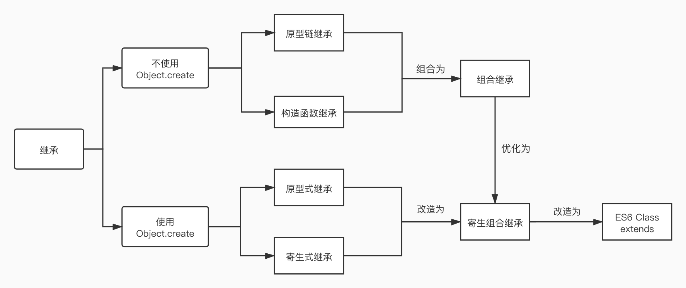

# JavaScript 中的继承

在 JavaScript 中的继承可以以是否使用`Object.create`大致分为两类：

  

不使用`Object.create`：

1. 原型链继承
2. 构造函数继承
3. 组合继承

使用`Object.create`：

4. 原型式继承
5. 寄生式继承
6. 寄生组合继承

以及ES6 Class 继承

# Object.create

**`Object.create()`**方法创建一个新对象，使用现有的对象来提供新创建的对象的 `__proto__`。

语法：

```js
Object.create(proto，[propertiesObject])
```

参数:

- `proto`

   新创建对象的原型对象。

- `propertiesObject`

  可选。需要传入一个对象，该对象的属性类型参照[`Object.defineProperties()`](https://developer.mozilla.org/zh-CN/docs/Web/JavaScript/Reference/Global_Objects/Object/defineProperties)的第二个参数。

返回值:

一个新对象，带着指定的原型对象和属性。

`Object.create()`的 Polyfill 方法：

```js
function object(o){
  function F(){}
  F.prototype = o
  return new F()
}
//等价于
Object.create(o)
```

# 继承

首先，先准备一个父类：

```js
// 定义一个动物类
function Animal (name) {
  // 属性
  this.name = name || 'Animal'
  // 实例方法
  this.sleep = function(){
    console.log(this.name + '正在睡觉！')
  }
}
// 原型方法
Animal.prototype.eat = function(food) {
  console.log(this.name + '正在吃：' + food)
};
```

# 1、原型链继承

> 核心： 将父类的实例作为子类的原型

```js
function Cat(){ 
}
Cat.prototype = new Animal()
Cat.prototype.name = 'cat'

//　Test Code
var cat = new Cat()
console.log(cat.name);
cat.eat('fish')
cat.sleep()
console.log(cat instanceof Animal) //true 
console.log(cat instanceof Cat) //true 
```

特点：

1. 非常纯粹的继承关系，实例是子类的实例，也是父类的实例
2. 父类新增原型方法/原型属性，子类都能访问到
3. 简单，易于实现

缺点：

1. 要想为子类新增属性和方法，必须要在`new Animal()`这样的语句之后执行，不能放到构造器中
   无法实现多继承
2. 来自原型对象的引用属性是所有实例共享的
3. 创建子类实例时，无法向父类构造函数传参

# 2、构造继承

> 核心：使用父类的构造函数来增强子类实例，等于是复制父类的实例属性给子类（没用到原型）

```js
function Cat(name){
  Animal.call(this)
  this.name = name || 'Tom'
}

// Test Code
var cat = new Cat()
console.log(cat.name)
cat.sleep()
console.log(cat instanceof Animal) // false
console.log(cat instanceof Cat) // true
```

特点：

1. 解决了「原型链继承」中，子类实例共享父类引用属性的问题
2. 创建子类实例时，可以向父类传递参数
3. 可以实现多继承（call多个父类对象） 

缺点：

1. 实例并不是父类的实例，只是子类的实例
2. 只能继承父类的实例属性和方法，不能继承原型属性/方法
3. 无法实现函数复用，每个子类都有父类实例函数的副本，影响性能

# 3、组合继承

> 核心：通过调用父类构造，继承父类的属性并保留传参的优点，然后通过将父类实例作为子类原型，实现函数复用

```js
function Cat(name){
  Animal.call(this)
  this.name = name || 'Tom'
}
Cat.prototype = new Animal()//组合继承也是需要修复构造函数指向的。
Cat.prototype.constructor = Cat
// Test Code
var cat = new Cat()
console.log(cat.name)
cat.sleep()
console.log(cat instanceof Animal) // true
console.log(cat instanceof Cat) // true
```

特点：

1. 弥补了「构造继承」的缺陷，可以继承实例属性/方法，也可以继承原型属性/方法
2. 既是子类的实例，也是父类的实例
3. 不存在引用属性共享问题
4. 可传参
5. 函数可复用

缺点：

1. 调用了两次父类构造函数，生成了两份实例（子类实例将子类原型上的那份屏蔽了）

# 4、原型式继承

> 核心：原型式继承的 object方法 本质上是对参数对象的一个浅复制。

```js
//利用一个空对象作为中介，将某个对象直接赋值给空对象构造函数的原型。
//就是 ES5 Object.create 的模拟实现，将传入的对象作为创建的对象的原型。
function object(o){
  function F(){}
  F.prototype = o
  return new F()
}
var person = {
  name: "Nicholas",
  friends: ["Shelby", "Court", "Van"]
}

var anotherPerson = object(person)
anotherPerson.name = "Greg"
anotherPerson.friends.push("Rob")

var yetAnotherPerson = object(person)
yetAnotherPerson.name = "Linda"
yetAnotherPerson.friends.push("Barbie")

alert(person.friends);  //"Shelby,Court,Van,Rob,Barbie"

//注意：修改anotherPerson.name的值，yetAnotherPerson.name的值并未发生改变，并不是因为anotherPerson 和 yetAnotherPerson 有独立的 name 值，而是因为 anotherPerson.name = "Greg"，给anotherPerson添加了 name 值，并非修改了原型上的 name 值。
```

缺点：

1. 包含引用类型的属性值始终都会共享相应的值，这点跟原型链继承一样。

# 5、寄生继承

> 创建一个仅用于封装继承过程的函数，该函数在内部以某种方式来增强对象，最后再像真地是它做了所有工作一样返回对象。

```js
// 寄生继承
function Cat(name) {
    Animal.call(this)
    this.name = name || 'Tom'
}
// function object(o) {
//     function F(){}
//     F.prototype = o
//     return new F()
// }

function createAnother(original) {
    // 通过调用函数创建一个新对象
    var clone = Object.create(original)
    // 以某种方式来增强这个对象
    clone.sayHi = function() {
        alert("hi")
    }
	clone.name = 'Tom'
    return clone
}

// Test Code
var cat = createAnother(new Animal())
console.log(cat.name)
cat.sayHi()
console.log(cat instanceof Animal) // true
console.log(cat instanceof Cat)
```

特点：

1. 可以增强子例对象功
2. 例子中使用的 Object.create(original) 函数不是必须的，可以使用任何能够返回新对象的函数都适用于此模式

缺点：

1. 不能做到函数复用而降低效率
2. 只是借用了一个没有属性子类实例作为原型，并没有真正的意义上的子类，constructor 依然指向父类

## 6、寄生组合继承

> 核心：通过寄生方式，砍掉父类的实例属性，这样，在调用两次父类的构造的时候，就不会初始化两次实例方法/属性，避免的组合继承的缺点

```js
// 寄生组合继承
// 该实现没有修复constructor
function Cat(name) {
    Animal.call(this)
    this.name = name || 'Tom'
}
/**
 * @param {Class} Father 父类构造函数
 * @param {Class} Son 子类构造函数
 * @return {Object} 子类实例 
 */
function parasiteExtend(Father, Son) {
    // 没有实例方法的临时类
    // let Super = function () {}
    // Super.prototype = Father.prototype
		// Son.prototype = new Super()
    Son.prototype = Object.create(Father.prototype)
    // 修复constructor
    Son.prototype.constructor = Son
    return new Son()
}

// Test Code
var cat = parasiteExtend(Animal,Cat)
console.log(cat.name)
cat.sleep()
console.log(cat instanceof Animal) // true
console.log(cat instanceof Cat) // true
```

特点：

1. 堪称完美

缺点：

1. 实现较为复杂

# ES6 Class extends

> 核心： ES6继承的结果和寄生组合继承相似，本质上，ES6继承是一种语法糖。

```js
class Cat extends Animal {
  constructor(name, gender) {
    super(name)
    this.gender = gender
  }
  like() {
    console.log('cat like fish')
  }
}
//　Test Code

var cat = new Cat('Tom','Man')
console.log(cat.name)//Tom
console.log(cat.gender)//Man
cat.eat('fish')//Tom正在吃fish
cat.sleep()//我的name是Tom
cat.like()//cat like fish
console.log(cat instanceof Animal)//true
console.log(cat instanceof Cat)//true
```

寄生组合继承是先创建子类实例 this 对象，然后再对其增强；

而 ES6 先将父类实例对象的属性和方法，加到 this 上面（所以必须先调用super方法），然后再用子类的构造函数修改this。

```js
class A {}

class B extends A {
  constructor() {
    super();
  }
}
```

ES6 实现继承的具体原理：

```js
class A {
}

class B {
}

Object.setPrototypeOf = function (obj, proto) {
  obj.__proto__ = proto;
  return obj;
}

// B 的实例继承 A 的实例
Object.setPrototypeOf(B.prototype, A.prototype);

// B 继承 A 的静态属性
Object.setPrototypeOf(B, A);
```

ES6 继承与 ES5 继承的异同：
相同点：

- 本质上ES6继承是ES5继承的语法糖

不同点：

- ES6 继承中子类的构造函数的原型链指向父类的构造函数，ES5 中使用的是构造函数复制，没有原型链指向。
- ES6 子类实例的构建，基于父类实例，ES5 中不是。

# ES5/ES6 的继承除了写法以外还有什么区别？

1. `class` 声明会提升，但不会初始化赋值。`Foo` 进入暂时性死区，类似于 `let`、`const` 声明变量。
2. `class` 声明内部会启用严格模式。
3. `class` 的所有方法（包括静态方法和实例方法）都是不可枚举的。
4. `class` 的所有方法（包括静态方法和实例方法）都没有原型对象 prototype，所以也没有`[[construct]]`，不能使用 `new` 来调用。
5. 必须使用 `new` 调用 `class`。
6. `class` 内部无法重写类名

