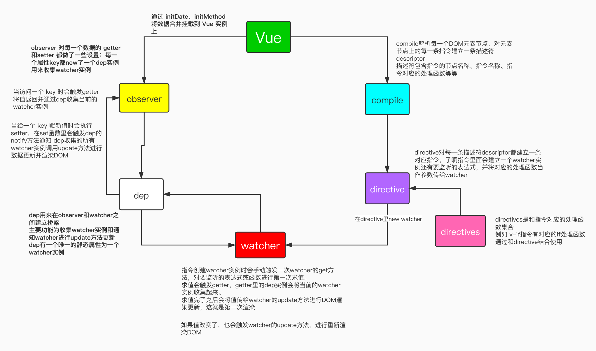

# Object.defineProperty

Vue 在3.0版本之前是利用了 JavaScript ES5 提供的元编程接口 `Object.defineProperty`进行数据劫持，从而将数据变成了「响应式」的。

基于「响应式数据」实现了`MVVM` 数据双向绑定，所谓`MVVM` 数据双向绑定主要是指：数据变化更新视图，视图变化更新数据。

## Object.defineProperty 的作用

Vue 2.X 的数据双向绑定都是依据 `Object.defineProperty()`这一方法来做的

```js
Object.defineProperty(obj, prop, descriptor)
```

`Object.defineProperty` 方法接收三个参数：

- **obj**

  要定义属性的对象。

- **prop**

  要定义或修改的属性的名称或 `Symbol` 。

- **descriptor**

  要定义或修改的属性描述符。

返回值：

被传递给函数的对象。

------

通过这个方法我们可以进行，JavaScript 语言级别的编程（即：对 JavaScript 语言进行编程，使其一些原生的操作可以按我们的逻辑进行执行）。

简单的说就是可以用这个方法，对一个对象的某个属性的描述符进行定义。

Vue 进行数据劫持将数据变为响应式的就使用到了描述符当中的 `getter` 和 `setter`。

- `get`: 当查找某个对象属性时，该对象属性将会与被调用函数绑定。

- `set`: 当试图设置该属性时，对象属性与被调用函数绑定。

```js
const obj = {
  name: 'playlife',
  age: 23
}
obj.age //23
obj.age = 18
```

像代码中的两个操作：读取和赋值，就是在访问 `obj.age` 的 `getter` 和 `setter`。

```js
Object.defineProperty(obj, 'age', {
  get: function () {
    return 18 //永远18岁
  },
  set: function (newValue) {
    console.log('不让你设置', newValue)
  }
})
console.log(obj.age)//18
obj.age = 1//不让你设置 1
```

`getter` 和 `setter` 都是方法函数，所以可以这么写

```js
Object.defineProperty(obj, 'age', {
  get() {
    return 18
  },
  set(newValue) {
    console.log('不让你设置', newValue)
  }
})
```

Vue 的「双向数据绑定」就是根据上面的原理来实现的。

只要在读取值时收集「观察者」在赋值时触发「观察者的更新函数」就可以实现数据变更，从而实现 DOM 重新渲染。

# Vue 实现双向数据绑定

在Vue主线里和数据双向绑定有关的有以下几个模块

- Vue 构造函数 `new Vue()`
- 观察者 `observer`
- 观察者 `watcher`
- 指令系统 `directive类`和`directives指令函数`集合
- DOM 解析 `compile`
- `watcher` 与 `observer` 之间的联系者 `dep`



结合以上 Vue 源码各模块函数关系图来复述一个 Vue的实现过程：

## 实例化之前

在引入Vue文件时 Vue本身会有几个类函数和一个处理函数集合

- observer
- watcher
- dep
- directive
- directives 

## 实例化过程

首先会调用 `initData()`  `initMethods()`等一系列方法，将数据挂载到 Vue实例上。这样就可以通过 `vm.xxx` 或者 `vm.$xxx`直接读取数据和调用函数。

接下来会调用`observe(data)`对数据进行监听。其实就是使用`Object.defineProperty()`方法，对每一个 **key** 都建立一个 `dep`实例。

并且在 `getter`和`setter`作了一些设置，当访问这一个 `key` 的 `getter`就会触发 `getter` 函数里的 `dep.depend`方法收集依赖 (`watcher`实例)。 

当对这一个 **key** 赋值时：就会触发`setter` 里的 `dep.notify`方法，通知 `dep` 收集的所有 `watcher`实例调用`update`方法进行更新。`dep` 有一个 `watcher`实例数组，触发更新遍历这个数组，执行`watcher.update()`方法。

上面完成之后就会调用`compile`函数开始对 DOM 进行解析了。首先会解析节点，然后再解析节点里的`{{插值表达式}}` 、`v-if`等指令。

解析`{{插值表达式}}` 时会生成一个 `text` 指令。并把`{{插值表达式}}` 替换为一个空的文本节点，然后生成一个描述符对象。

描述符对象收集了后面生成指令实例时所需要的数据、要监听的表达式、对应的文本节点,和指令对应的处理函数。

然后会将这个描述符当作参数传入`directive` 类，生成一个指令实例。指令实例执行`bind`方法，`bind`方法会将表达式、指令处理函数以及相关的一些参数传给 `watcher`生成一个`watcher`实例。

`watcher` 首次会执行 `get` 方法对表达式进行求值，然后将得到的值将给 `update`方法。

`update` 方法将值传入处理函数对 DOM 进行更新，这样就完成了第一次渲染。

## 实例化完成后

以后每一次更改的数据值，都会触发数据所对应对象属性这个 **key** 的 `setter` 方法。

`setter` 方法再触发 `dep.notify` 通知对应的 `watcher` 调用`update`方法进行更新。

`update`方法再把值传给对应的处理函数，再一次进行 DOM 渲染，如此循环往复。

其他的指令也是按照这一流程来运行的！


> 此时，看着这张图就不会再一脸懵逼了！


# Object.defineProperty 的缺陷

> Vue3.0 采用了 Proxy，抛弃了Object.defineProperty？


1. `Object.defineProperty`无法监控到数组下标的变化，导致通过数组下标添加元素，不能实时响应；
2. `Object.defineProperty`只能劫持对象的属性，从而需要对每个对象，每个属性进行遍历，如果，属性值是对象，还需要深度遍历。`Proxy`可以劫持整个对象，并返回一个新的对象。
3. `Proxy`不仅可以代理对象，还可以代理数组。还可以代理动态增加的属性。

## 对于数组

`Object.defineProperty` 无法监控到数组下标的变化，导致直接通过数组的下标给数组设置值，不能实时响应。 为了解决这个问题，经过 Vue 内部处理后可以使用以下几种方法来监听数组:

```js
push()
pop()
shift()
unshift()
splice()
sort()
reverse()
```

> 由于只针对了以上八种方法进行了hack处理,所以其他数组的属性也是检测不到的，还是具有一定的局限性。

## 对于对象

`Object.defineProperty` 还无法监控到对象属性的添加或移除。由于 Vue 会在初始化实例时对 property 执行 getter/setter 转化，所以 property 必须在 `data` 对象上存在才能让 Vue 将它转换为响应式的。

对于已经创建的实例，Vue 不允许动态添加根级别的响应式 property。但是，可以使用 `Vue.set(object, propertyName, value)` 方法向嵌套对象添加响应式 property。

还可以使用 `vm.$set` 实例方法，这也是全局 `Vue.set` 方法的别名

# Proxy 实现的双向绑定的特点

语法：

```js
const p = new Proxy(target, handler)
```

- handler：包含捕捉器（trap）的占位符对象，可译为处理器对象。
- target：被 Proxy 代理的对象。

Proxy 的优点：

Proxy 可以直接监听对象而非属性

Proxy 可以直接监听数组的变化

Proxy 有多达13种拦截方法,不限于apply、ownKeys、deleteProperty、has等等是`Object.defineProperty`不具备的。