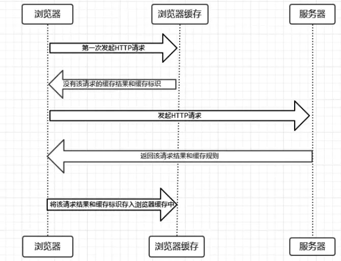
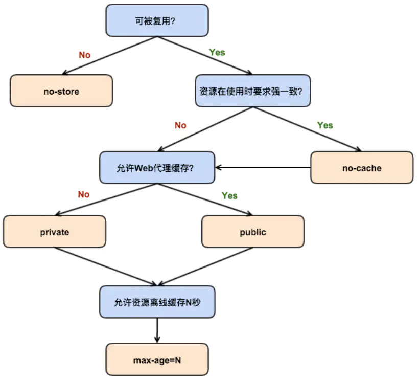
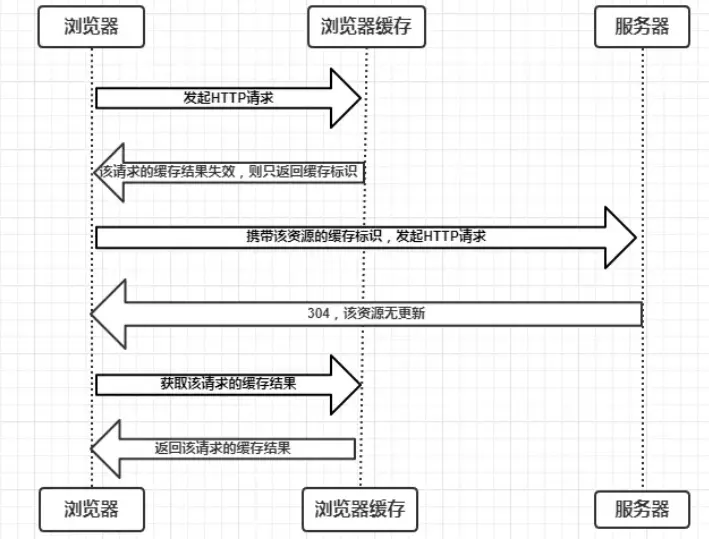
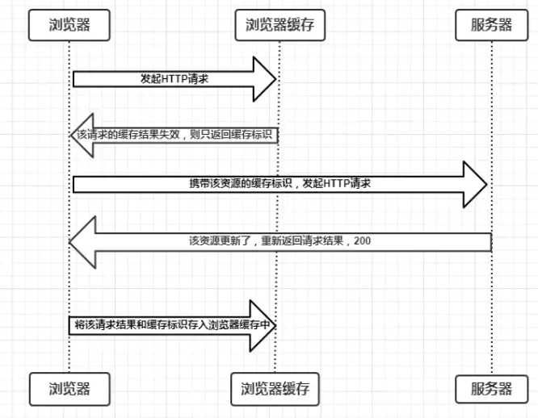

# 浏览器缓存机制

> 浏览器缓存作为性能优化的重要一环，对于前端而言，重要性不言而喻。

缓存可以说是性能优化中简单高效的一种优化方式了。

一个优秀的缓存策略可以缩短网页请求资源的距离，减少延迟，并且由于缓存文件可以重复利用，还可以减少带宽，降低网络负荷。

对于一个数据请求来说，可以分为：

1. 发起网络请求

2. 后端处理

3. 浏览器响应

三个步骤。浏览器缓存可以帮助我们在第一和第三步骤中优化性能。

比如说直接使用缓存而不发起请求，或者发起了请求但后端存储的数据和前端一致，那么就没有必要再将数据回传回来，这样就减少了响应数据。


# 缓存位置

从缓存位置上来说分为四种，并且各自有优先级，当依次查找缓存且都没有命中的时候，才会去请求网络。

- `Service Worker` 是运行在浏览器背后的独立线程，一般可以用来实现缓存功能
- `Memory Cache` 是内存中的缓存，主要是页面上已经下载的样式、脚本、图片等已经抓取到的资源。
- `Disk Cache` 是存储在硬盘中的缓存，读取速度相对慢点。
- `Push Cache` 是 `HTTP/2` 中的内容，当以上 3 种缓存都没有命中的时候，它才会被使用。


# Service Worker

`Service Worker` 是运行在浏览器背后的独立线程，一般可以用来实现缓存功能。

注意点：

1. 必须是 `HTTPS`。因为它涉及请求拦截，所以必须使用 `HTTPS` 协议来保障安全。
2. `Service Worker` 缓存不同于其他机制，它可以让我们自由控制缓存哪些文件、如何匹配缓存、如何读取缓存，并且缓存是持续性的。

实现：

Service Worker 实现缓存功能一般分为三个步骤：

首先需要先注册 Service Worker，然后监听到 install 事件以后就可以缓存需要的文件，那么在下次用户访问的时候就可以通过拦截请求的方式查询是否存在缓存，存在缓存的话就可以直接读取缓存文件，否则就去请求数据。

当 Service Worker 没有命中缓存的时候，我们需要去调用 fetch 函数获取数据。

如果我们没有在 Service Worker 命中缓存的话，会根据缓存查找优先级去查找数据。但是不管我们是从 Memory Cache 中还是从网络请求中获取的数据，浏览器都会显示我们是从 Service Worker 中获取的内容。


# Memory Cache

> `Memory Cache`：内存中的缓存，主要是页面上已经下载的样式、脚本、图片等已经抓取到的资源。

注意点：

1. 读取内存中的数据肯定比磁盘快，读取高效。
2. 缓存持续性很短，会随着进程的释放而释放。关闭页面内存中的缓存也就释放了。

当我们访问过页面以后，再次刷新页面，可以发现很多数据都来自于内存缓存

内存缓存中有一块重要的缓存资源是 `preloader`相关指令（例如`<link rel="prefetch">`）下载的资源。

`preloader` 的相关指令已经是页面优化的常见手段之一，它可以一边解析 js/css 文件，一边网络请求下一个资源。

内存缓存在缓存资源时并不关心返回资源的 HTTP 缓存头 `Cache-Control` 是什么值，同时资源的匹配也并非仅仅是对 **URL** 做匹配，还可能会对 **Content-Type**，**CORS** 等其他特征做校验。


# Disk Cache

`Disk Cache` 是存储在硬盘中的缓存，读取速度相对慢点。

注意点：

1. 比起 `Memory Cache` 胜在容量和存储时效性上。

在所有浏览器缓存中，`Disk Cache` 覆盖面基本是最大的。

它会根据 HTTP Header 中的字段判断哪些资源需要缓存，哪些资源可以不请求直接使用，哪些资源已经过期需要重新请求。并且即使在跨站点的情况下，相同地址的资源一旦被硬盘缓存下来，就不会再次去请求数据。

绝大部分的缓存都来自 `Disk Cache`

- 对于大文件来说，大概率是不存储在内存中的，反之优先
- 当前系统内存使用率高的话，文件优先存储进硬盘


# Push Cache

`Push Cache`（推送缓存） 是 `HTTP/2` 中的内容，当以上 3 种缓存都没有命中的时候，它才会被使用。

注意点：

1. 它只在会话（`Session`）中存在，一旦会话结束就被释放，并且缓存也很短暂。

`Push Cache`是 HTTP/2 中的内容，当以上三种缓存都没有命中时，它才会被使用。它只在会话（Session）中存在，一旦会话结束就被释放，并且缓存时间也很短暂，在 Chrome浏览器中只有 5分钟左右，同时它也并非严格执行 HTTP头中的缓存指令。

如果以上四种缓存都没有命中的话，那么只能发起请求来获取资源了。

**通常浏览器缓存策略分为两种：强缓存和协商缓存，并且缓存策略都是通过设置 HTTP Header 来实现的。**


# 缓存过程分析

浏览器第一次向服务器发起该请求后拿到请求结果后，将请求结果和缓存标识存入浏览器缓存，**浏览器对于缓存的处理是根据第一次请求资源时返回的响应头来确定的**。

- 浏览器每次发起请求，都会先在浏览器缓存中查找该请求的结果以及缓存标识

- 浏览器每次拿到返回的请求结果都会将该结果和缓存标识存入浏览器缓存中

  

过程：

1. **浏览器** 发起一次 HTTP 请求
2. **浏览器缓存** 告诉浏览器这边没有该请求的缓存结果和缓存标识
3. **浏览器** 向 **服务器** 发起 HTTP 请求
4. **服务器** 返回该请求结果和缓存规则
5. **浏览器** 将该请求结果和缓存标识存入浏览器缓存中


# 缓存机制

缓存分为 **强缓存** 和 **协商缓存**。

**强缓存**优先于**协商缓存**进行，若**强制缓存**生效则直接使用缓存，若不生效则进行**协商缓存**。

**协商缓存**由服务器决定是否使用缓存，若**协商缓存**失效，那么该请求的缓存失效，返回 200，重新返回资源和缓存标识，再存入浏览器中；生效则返回 304，继续使用缓存。

如果强缓存和协商缓存都没有设置，那么浏览器会采用启发式的算法，通常会取响应头中的 `Date` 减去 `Last-Modified` 的值的 `10%` 作为缓存时间。

当浏览器再次访问一个已经访问过的资源时，它会这样做：

1. 看看是否命中强缓存，如果命中，就直接使用缓存了；
2. 如果没有命中强缓存，就发请求到服务器检查是否命中协商缓存；
3. 如果命中协商缓存，服务器会返回 `304` 告诉浏览器使用本地缓存；
4. 否则，返回最新的资源。


# 强缓存

**强缓存**：不会向服务器发送请求，直接从缓存中读取资源。

**强缓存** 判断是否缓存的依据来自于是否超出某个时间或者某个时间段，而不关心服务器端文件是否已经更新，这可能会导致加载文件不是服务器端最新的内容（如果需要判断，那就要用 **协商缓存**）。

**强缓存**可以通过设置两种 HTTP请求头实现：`Expires` 和 `Cache-Control`。

- **表示方式**：在 Chrome 控制台的 Network 选项中可以看到该请求返回 `200` 状态码，并且 `Size` 显示为 `from disk cache` 或者 `from memory cache`。
- **实现方式**：

1. `Expires`
2. `Cache-Control`

## Expires

缓存过期时间，用来指定资源到期的时间，是服务器端的具体的时间点。

`Expires = max-age + 请求时间`，需要和 `Last-modified` 结合使用。

`Expires` 是 Web服务器 响应消息头字段，在响应 HTTP请求时告诉浏览器在过期时间前浏览器可以直接从浏览器缓存取数据，而无需再次请求。

`Expires` 是 HTTP/1 的产物，受限于本地时间，如果修改了本地时间，可能会造成缓存失效。

## Cache-Control

在 HTTP/1.1中，`Cache-Control` 是最重要的规则，主要用于控制网页缓存。

比如当`Cache-Control:max-age=300` 时，则代表在这个请求正确返回时间（浏览器也会记录下来）的5分钟内再次加载资源，就会命中强缓存。

Cache-Control 可以在请求头或者响应头中设置，并且可以组合使用多种指令：

- public：所有内容都将被缓存（客户端和代理服务器都可缓存）。

- private：所有内容只有客户端可以缓存，Cache-Control的默认取值。

- no-cache：客户端缓存内容，是否使用缓存则需要经过协商缓存来验证决定。

  > 设置了no-cache之后，并不是说浏览器就不再缓存数据，只是浏览器在使用缓存数据时，需要先确认一下数据是否还跟服务器保持一致。

- no-store：所有内容都不会被缓存，即不使用强制缓存，也不使用协商缓存

- max-age：max-age=xxx (xxx is numeric)表示缓存内容将在xxx秒后失效

- s-maxage（单位为s)：同max-age作用一样，只在代理服务器中生效（比如CDN缓存）。

- max-stale：能容忍的最大过期时间。

- min-fresh：能够容忍的最小新鲜度。



通过设置不同的指令组合，可以达到不同的效果。


## Expires和Cache-Control两者对比

区别就在于 `Expires` 是 http1.0的产物，`Cache-Control` 是 HTTP1.1的产物。

两者同时存在的话，`Cache-Control` 优先级高于 `Expires`；

在某些不支持 HTTP1.1的环境下，`Expires` 就会发挥用处。所以 `Expires` 其实是过时的产物，现阶段它的存在只是一种兼容性的写法。


# 协商缓存

协商缓存就是强制缓存失效后，浏览器携带缓存标识向服务器发起请求，由服务器根据缓存标识决定是否使用缓存的过程。

主要有以下两种情况：

- 协商缓存生效，返回304和Not Modified

  


1. **浏览器** 发起 HTTP 请求，先经过 **浏览器缓存**
2. **浏览器缓存** 判断该请求的缓存结果，返回缓存标识
3. **浏览器** 携带该标识，向 **服务器** 发起 HTTP 请求
4. **服务器** 返回 304 告诉 **浏览器** 资源没有更新
5. **浏览器** 再次请求这个缓存结果
6. **浏览器缓存** 返回该请求的缓存结果


- 协商缓存失效，返回200和请求结果

  

1. **浏览器** 发起 HTTP 请求，先经过 **浏览器缓存**
2. **浏览器缓存** 判断该请求的缓存结果失效，返回缓存标识
3. **浏览器** 携带该标识，向 **服务器** 发起 HTTP 请求
4. **服务器** 返回 200 告诉 **浏览器** 资源可以更新了
5. **浏览器** 读取并将请求结果和缓存标识存入 **浏览器缓存** 中


## Last-Modified 和 If-Modified-Since

浏览器第一次请求资源的时候，服务器返回的响应头上会带有一个 `Last-Modified` 字段，表示资源**最后修改**的时间。

```http
Last-Modified: Fri, 27 Oct 2017 07:55:30 GMT
```

当浏览器再次请求该资源时，请求头中会带有一个 `If-Modified-Since` 字段，这个值是第一次请求返回的 `Last-Modified` 的值。

服务器收到这个请求后，将 `If-Modified-Since` 和当前的 `Last-Modified` 进行对比。

如果相等，则说明资源未修改，返回 `304`，浏览器使用本地缓存。

这个方法也是有缺点的：

- 最小单位是秒。也就是说如果我短时间内资源发生了改变，`Last-Modified` 并不会发生变化；
- 周期性变化。如果这个资源在一个周期内修改回原来的样子了，我们认为是可以使用缓存的，但是 `Last-Modified` 可不这样认为。

所以，后来又引入一个 `Etag`。

## Etag

`Etag` 一般是由文件内容 `hash` 生成的，也就是说它可以保证资源的唯一性，资源发生改变就会导致 `Etag` 发生改变。

同样地，在浏览器第一次请求资源时，服务器会返回一个 `Etag` 标识。

当再次请求该资源时， 会通过 `If-no-match` 字段将 `Etag` 发送回服务器，然后服务器进行比较，如果相等，则返回 `304` 表示未修改。

`Last-Modified` 和 `Etag` 是可以同时设置的，服务器会优先校验 `Etag`，如果 `Etag` 相等就会继续比对 `Last-Modified`，最后才会决定是否返回 `304`。


# 实际场景应用缓存策略

1. 频繁变动的资源

> `Cache-Control: no-cache`

对于频繁变动的资源，首先需要使用 `Cache-Control: no-cache` 使浏览器每次都请求服务器，然后配合 `ETag`或者 `Last-Modified` 来验证资源是否有效。这样的做法虽然不能节省请求数量，但是能显著减少响应数据大小。

2. 不常变化的资源

> `Cache-Control: max-age=31536000`

通常在处理这类资源时，给它们的 `Cache-Control` 配置一个很大的 `max-age=31536000` (一年)，这样浏览器之后请求相同的 URL 会命中强制缓存。

而为了解决更新的问题，就需要在文件名(或者路径) 中添加 hash， 版本号等动态字符，之后更改动态字符，从而达到更改引用 URL 的目的，让之前的强制缓存失效 (其实并未立即失效，只是不再使用了而已)。

在线提供的类库 (如 `jquery-3.3.1.min.js`, `lodash.min.js` 等) 均采用这个模式。

# 用户行为对浏览器缓存的影响

用户在浏览器如何操作时，会触发 3种缓存策略 ：

- 打开网页，地址栏输入地址： 查找 **disk cache** 中是否有匹配。如有则使用；如没有则发送网络请求。
- 普通刷新 (F5)：因为 TAB 并没有关闭，因此 **memory cache** 是可用的，会被优先使用(如果匹配的话)。其次才是 **disk cache**。
- 强制刷新 (Ctrl + F5)：浏览器不使用缓存，因此发送的请求头部均带有 `Cache-control: no-cache` (为了兼容，还带了 `Pragma: no-cache`),服务器直接返回 200 和最新内容。

