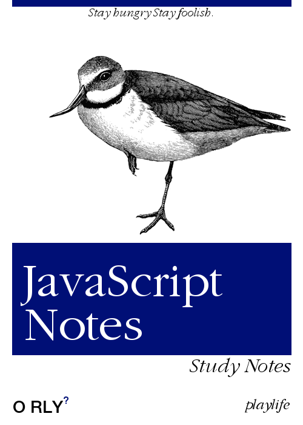

# 目录

```txt
.
├── Ajax
├── 数据结构
├── HTML&CSS
├── JavaScript
├── Node
├── Q&A
├── README.md
├── TypeScript
├── Vue
├── Webpack
├── jQuery
└── React
```

# 概述

> Stay foolish. Stay hungry.  —— Steve Jobs
>

> 没有经过整理的知识才是徒然浪费时间，伤透脑筋！—— 司徒正美

## playlife 学习笔记库

> Cover design by playlife
>

 


🦾 保持学习的热情，以及对于技术的追求。


