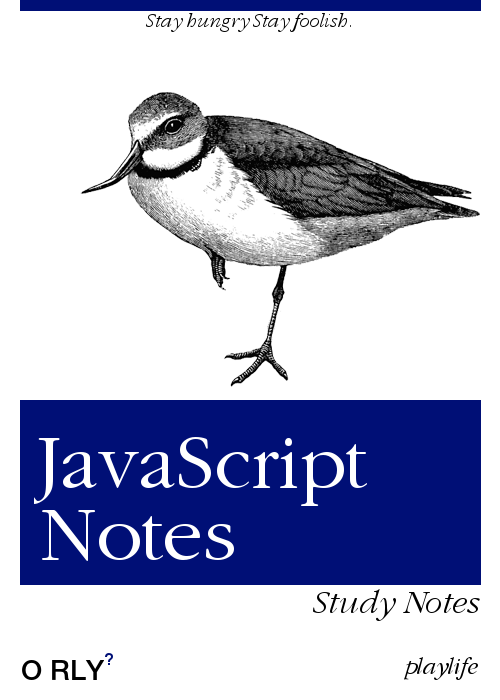

# 项目目录

> 10.7 更新

```
├── Ajax 
│   └── Ajax.md
├── README.md
├── jQuery
│   └── jQuery.md
└── notes
    ├── BOM 和 DOM.md
    ├── ES6 和补充.md
    ├── JavaScript.md
    └── media (图片文件)
```


# 概述

这个 repository 是我在学习 JavaScript 时所整理的笔记, 配合 Typora 大纲视图快速定位到知识点, 稳固而知新.

同时随着自己的对于  JavaScript 学习和理解的不断加深, 其中的内容也在不断的更新.


PS: 前些日子在 浏览 github 时,无意中翻到了司徒正美前辈的主页,

受前辈一句话鼓舞:

> 没有经过整理的知识才是徒然浪费时间，伤透脑筋！🙏愿前辈安息 R.I.P.

特意将自己的笔记整理出来, 分享到 github, 一是备份、二是分享.

本人水平有限, 随着不断的学习, 笔记还会不断的更新!



上面这张图, 是我用 O’REILLY 系列图书封面生成器所生成的笔记封面

> (并不知道这是什么鸟)

O’REILLY 系列的图书都非常经典,值的多看, 不断学习

2020. 10.2 新上传了 jQuery Ajax 和一些单独拿出来的 JS部分笔记 
大家中秋🎑&&国庆🎉 双节快乐! (迟到的祝福㊗️) 😊


2020. 10.7 更新项目目录

```txt
├── Ajax 
│   └── Ajax.md
├── README.md
├── jQuery
│   └── jQuery.md
└── notes
    ├── BOM 和 DOM.md
    ├── ES6 和补充.md
    ├── JavaScript.md
    └── media (图片文件)
```

