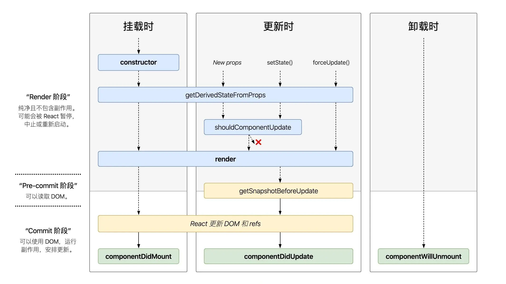

# React

> **React** 是一个用于构建用户界面的 JavaScript 库。它来自于 Facebook 的开源。

## React 的特点

- Declarative（声明式编码）

- Component-Based（组件化编码）

- Learn Once, Write Anywhere（支持客户端、服务器端渲染）

- 高效的DOM Diff算法，最小化页面重绘

- 单向数据流

## React 高效的原因

- 虚拟DOM：不总是直接操作DOM

- 高效的 DOM Diff 算法：最小化页面重绘（即“局部渲染”）。

## 虚拟 DOM

根据浏览器的渲染机制，我们的数据即使只发生一点点的变化，也会被强制重建整颗 DOM 树，这么做，会涉及到很多元素的重绘和重排，导致性能浪费严重。

频繁的操作 DOM，引起大量的重绘、重排严重的影响我们的 Web 应用性能。

为了解决这个问题，我们需要提前拿到页面更新前的内存中的 DOM 树，和页面更新前的新渲染出来的内存 DOM树；

然后对比两者的不同，找到那些需要被重新创建和修改的元素即可。这样就能实现 DOM 的**按需更新**。

但是，浏览器并没有提供相关读取 DOM 的 API。所以我们可以用 JavaScript 代码来模拟这两颗 DOM 树，这就是虚拟 DOM。

**总结**：

- 虚拟DOM的**本质**：使用 JS 对象模拟DOM树。

- 虚拟DOM的**目的**：为了实现 DOM 节点的高效更新。

React 内部已经实现了虚拟 DOM

虚拟 DOM 指的是：在真实 DOM 的上一层**映射**一层虚拟 DOM。我们操作的是映射关系，而不是真实的 DOM。假设页面的样式做了修改（比如新增了一个标签），此时修改的是虚拟 DOM 的样式，真实的 DOM 并未发生变化。那什么时候，真实的DOM会发生变化呢？ 当我把所有的内容操作完之后，转化为真实的 DOM，此时要打包统一的渲染页面，于是真实的 DOM 发生变化，然后渲染一次。 这样做的话，可以减少页面的渲染次数。

## diff 算法

> 在对比两颗 DOM 树时，如何提高效率成了影响 Web性能的新因素。

在 对比 两颗 DOM 树时采用了 diff 算法来提高 patch 的效率。

 - tree diff：新旧 DOM 树，逐层对比的方式，就叫做 tree diff。每当我们从前到后，把所有层的节点对比完后，必然能够找到那些 需要被更新的元素。

 - component diff：在对比每一层的时候，组件之间的对比，叫做 component diff。当对比组件的时候，如果两个组件的类型相同，则暂时认为这个组件不需要被更新，如果组件的类型不同，则立即将旧组件移除，新建一个组件，替换到被移除的位置。

 - element diff：在组件中，每个元素之间也要进行对比，那么，元素级别的对比，叫做 element diff。

 - key：key 这个属性，可以把 页面上的 DOM 节点 和 虚拟 DOM 中的对象，做一层关联关系。

`key` 是给每一个 **VNode** 的唯一 `id`，可以依靠 `key`，在 **diff 算法** 执行时更快的找到对应的节点。

更准确、更快的拿到 **OldVNode** 中对应的 **VNode** 节点。

在数据变化时强制更新组件，以避免 ”原地复用“ 带来的副作用，使用 `key` 时，它会基于 `key` 的变化重新排列元素顺序，并且会移除 `key`不存在的元素。

## React 生态对比 Vue 生态

- Vue生态：Vue + Vue-Router + Vuex + Axios + Babel + Webpack

- React生态：React + React-Router + Redux + Axios + Babel + Webpack

## React 模块化、组件化

### 模块

- 理解：向外提供特定功能的 js 程序, 一般就是一个 js 文件

- 理由：js 代码更多更复杂

- 作用：简化 js 的编写，阅读，提高运行效率

### 组件

- 理解：用来实现特定功能效果的代码集合(html/css/js)

- 理由：一个界面的功能更复杂

- 作用：复用，简化项目编码，提高运行效率

### 模块化与组件化

- 模块化：当应用的 js 都以模块来编写的, 这个应用就是一个模块化的应用

- 组件化：当应用是以多组件的方式实现功能, 这上应用就是一个组件化的应用

# JSX 简介

```jsx
const element = <h1>Hello, world!</h1>;
```

这个有趣的标签语法既不是字符串也不是 HTML。

它被称为 JSX，是一个 JavaScript 的语法扩展。我们建议在 React 中配合使用 JSX，JSX 可以很好地描述 UI 应该呈现出它应有交互的本质形式。JSX 可能会使人联想到模版语言，但它具有 JavaScript 的全部功能。

JSX 可以生成 React “元素”

## 在 JSX 中嵌入表达式

在下面的例子中，我们声明了一个名为 `name` 的变量，然后在 JSX 中使用它，并将它包裹在大括号中：

```jsx
const name = 'Josh Perez';const element = <h1>Hello, {name}</h1>;
ReactDOM.render(
  element,
  document.getElementById('root')
);
```

在 JSX 语法中，你可以在`{}`内放置任何有效的 JavaScript 表达式。例如，`2 + 2`，`user.firstName` 或 `formatName(user)` 都是有效的 JavaScript 表达式。

在下面的示例中，我们将调用 JavaScript 函数 `formatName(user)` 的结果，并将结果嵌入到 `<h1>` 元素中。

```jsx
function formatName(user) {
  return user.firstName + ' ' + user.lastName;
}

const user = {
  firstName: 'Harper',
  lastName: 'Perez'
};

const element = (
  <h1>
    Hello, {formatName(user)}!
  </h1>
);

ReactDOM.render(
  element,
  document.getElementById('root')
);
```

## JSX 也是一个表达式

在编译之后，JSX 表达式会被转为普通 JavaScript 函数调用，并且对其取值后得到 JavaScript 对象。

也就是说，你可以在 `if` 语句和 `for` 循环的代码块中使用 JSX，将 JSX 赋值给变量，把 JSX 当作参数传入，以及从函数中返回 JSX：

```jsx
function getGreeting(user) {
  if (user) {
    return <h1>Hello, {formatName(user)}!</h1>;  }
  return <h1>Hello, Stranger.</h1>;}
```

## JSX 特定属性

你可以通过使用引号`""`，来将属性值指定为**字符串字面量**：

```jsx
const element = <div tabIndex="0"></div>;
```

也可以使用大括号`{}`，来在属性值中插入一个 JavaScript 表达式：

```jsx
const element = </img>;
```

在属性中嵌入 JavaScript 表达式时，不要在大括号外面加上引号 `"{}"` 是不对的❌。

你应该仅使用引号（对于**字符串值**）或大括号（对于**表达式**）中的一个，对于同一属性不能同时使用这两种符号。

> **警告：**
>
> 因为 JSX 语法上更接近 JavaScript 而不是 HTML，所以 React DOM 使用 `camelCase`（小驼峰命名）来定义属性的名称，而不使用 HTML 属性名称的命名约定。
>
> 例如，JSX 里的 `class` 变成了 `className`，而 `tabindex` 则变为 `tabIndex`。

## 使用 JSX 指定子元素

假如一个标签里面没有内容，你可以使用 `/>` 来闭合标签，就像 XML 语法一样：

```jsx
const element = ;
```

JSX 标签里能够包含很多子元素:

```jsx
const element = (
  <div>
    <h1>Hello!</h1>
    <h2>Good to see you here.</h2>
  </div>
);
```

## JSX 防止注入攻击

你可以安全地在 JSX 当中插入用户输入内容：

```jsx
const title = response.potentiallyMaliciousInput;
// 直接使用是安全的：
const element = <h1>{title}</h1>;
```

React DOM 在渲染所有输入内容之前，默认会进行转义。它可以确保在你的应用中，永远不会注入那些并非自己明确编写的内容。所有的内容在渲染之前都被转换成了字符串。这样可以有效地防止XSS（cross-site-scripting, 跨站脚本）攻击。

## JSX 表示对象

Babel 会把 JSX 转译成一个名为 `React.createElement()` 函数调用。

以下两种示例代码完全等效：

```jsx
const element = (
  <h1 className="greeting">
    Hello, world!
  </h1>
);
```

> 通过Babel转译后两者完全等价

```js
const element = React.createElement(
  'h1',
  {className: 'greeting'},
  'Hello, world!'
);
```

`React.createElement()` 会预先执行一些检查，以帮助你编写无错代码，但实际上它创建了一个这样的对象：

```js
// 注意：这是简化过的结构
const element = {
  type: 'h1',
  props: {
    className: 'greeting',
    children: 'Hello, world!'
  }
};
```

这些对象被称为 “React 元素”。它们描述了你希望在屏幕上看到的内容。React 通过读取这些对象，然后使用它们来构建 DOM 以及保持随时更新。

# 元素渲染

> 元素是构成 React 应用的最小砖块。

元素描述了你在屏幕上想看到的内容。

```jsx
const element = <h1>Hello, world</h1>;
```

与浏览器的 DOM 元素不同，React 元素是创建开销极小的普通对象。React DOM 会负责更新 DOM 来与 React 元素保持一致。

## 将一个元素渲染为 DOM

假设你的 HTML 文件某处有一个 `<div>`：

```html
<div id="root"></div>
```

我们将其称为“根” DOM 节点，因为该节点内的所有内容都将由 React DOM 管理。

仅使用 React 构建的应用通常只有单一的根 DOM 节点。如果你在将 React 集成进一个已有应用，那么你可以在应用中包含任意多的独立根 DOM 节点。

想要将一个 React 元素渲染到根 DOM 节点中，只需把它们一起传入 `ReactDOM.render()`：

```jsx
const element = <h1>Hello, world</h1>;
ReactDOM.render(element, document.getElementById('root'));
```

## 更新已渲染的元素

React 元素是不可变对象。一旦被创建，你就无法更改它的子元素或者属性。一个元素就像电影的单帧：它代表了某个特定时刻的 UI。

更新 UI 唯一的方式是创建一个全新的元素，并将其传入 `ReactDOM.render()`。

```jsx
function tick() {
  const element = (
    <div>
      <h1>Hello, world!</h1>
      <h2>It is {new Date().toLocaleTimeString()}.</h2>
    </div>
  );
  ReactDOM.render(element, document.getElementById('root'));
}

setInterval(tick, 1000);
```

这个例子会在 `setInterval()`回调函数，每秒都调用 `ReactDOM.render()`。

> **注意：**
>
> 在实践中，大多数 React 应用只会调用一次`ReactDOM.render()`。

## React 只更新它需要更新的部分

React DOM 会将元素和它的子元素与它们之前的状态进行比较，并只会进行必要的更新来使 DOM 达到预期的状态。

尽管每一秒我们都会新建一个描述整个 UI 树的元素，React DOM 只会更新实际改变了的内容，也就是例子中的文本节点。

考虑 UI 在任意给定时刻的状态，而不是随时间变化的过程，能够消灭一整类的 bug。

# 组件 & Props

> 组件允许你将 UI 拆分为独立可复用的代码片段，并对每个片段进行独立构思。

组件，从概念上类似于 JavaScript 函数。它接受任意的入参（即 “props”），并返回用于描述页面展示内容的 React 元素。

## 函数组件与 class 组件

定义组件最简单的方式就是编写 JavaScript 函数：

```jsx
function Welcome(props) {
  return <h1>Hello, {props.name}</h1>;
}
```

该函数是一个有效的 React 组件，因为它接收唯一带有数据的 “props”（代表属性）对象与并返回一个 React 元素。这类组件被称为“函数组件”，因为它本质上就是 JavaScript 函数。

你同时还可以使用 ES6 的 class 来定义组件：

```jsx
class Welcome extends React.Component {
  render() {
    return <h1>Hello, {this.props.name}</h1>;
  }
}
```

上述两个组件在 React 里是等效的。

## 渲染组件

之前，我们遇到的 React 元素都只是 DOM 标签：

```jsx
const element = <div />;
```

不过，React 元素也可以是用户自定义的组件：

```jsx
const element = <Welcome name="Sara" />;
```

当 React 元素为用户自定义组件时，它会将 JSX 所接收的属性（attributes）以及子组件（children）转换为单个对象传递给组件，这个对象被称之为 “props”。

```jsx
function Welcome(props) {
  return <h1>Hello, {props.name}</h1>;
}

const element = <Welcome name="Sara" />;
ReactDOM.render(
  element,
  document.getElementById('root')
);
```

1. 我们调用 `ReactDOM.render()` 函数，并传入 `<Welcome name="Sara" />` 作为参数。
2. React 调用 `Welcome` 组件，并将 `{name: 'Sara'}` 作为 props 传入。
3. `Welcome` 组件将 `<h1>Hello, Sara</h1>` 元素作为返回值。
4. React DOM 将 DOM 高效地更新为 `<h1>Hello, Sara</h1>`。

> **注意：** 组件名称必须以大写字母开头。
>
> React 会将以小写字母开头的组件视为原生 DOM 标签。例如，`<div />` 代表 HTML 的 div 标签，而 `<Welcome />` 则代表一个组件，并且需在作用域内使用 `Welcome`。

## 组合组件

组件可以在其输出中引用其他组件。这就可以让我们用同一组件来抽象出任意层次的细节。

按钮，表单，对话框，甚至整个屏幕的内容：在 React 应用程序中，这些通常都会以组件的形式表示。

我们可以创建一个可以多次渲染 `Welcome` 组件的 `App` 组件：

```jsx
function Welcome(props) {
  return <h1>Hello, {props.name}</h1>;
}

function App() {
  return (
    <div>
      <Welcome name="Sara" />
      <Welcome name="Cahal" />
      <Welcome name="Edite" />
    </div>
  );
}

ReactDOM.render(
  <App />,
  document.getElementById('root')
);
```

通常来说，每个新的 React 应用程序的顶层组件都是 `App` 组件。但是，如果你将 React 集成到现有的应用程序中，你可能需要使用像 `Button` 这样的小组件，并自下而上地将这类组件逐步应用到视图层的每一处。

## 提取组件

将组件拆分为更小的组件。

```jsx
function Comment(props) {
  return (
    <div className="Comment">
      <div className="UserInfo">
        
        <div className="UserInfo-name">
          {props.author.name}
        </div>
      </div>
      <div className="Comment-text">
        {props.text}
      </div>
      <div className="Comment-date">
        {formatDate(props.date)}
      </div>
    </div>
  );
}
```

该组件用于描述一个社交媒体网站上的评论功能，它接收 `author`（对象），`text` （字符串）以及 `date`（日期）作为 props。

该组件由于嵌套的关系，变得难以维护，且很难复用它的各个部分。因此，让我们从中提取一些组件出来。

首先，我们将提取 `Avatar` 组件：

```jsx
function Avatar(props) {
  return (
    
  );
}
```

`Avatar` 不需知道它在 `Comment` 组件内部是如何渲染的。因此，我们给它的 props 起了一个更通用的名字：`user`，而不是 `author`。

我们建议从组件自身的角度命名 props，而不是依赖于调用组件的上下文命名。

我们现在针对 `Comment` 做些微小调整：

```jsx
function Comment(props) {
  return (
    <div className="Comment">
      <div className="UserInfo">
        <Avatar user={props.author} />
        <div className="UserInfo-name">
          {props.author.name}
        </div>
      </div>
      <div className="Comment-text">
        {props.text}
      </div>
      <div className="Comment-date">
        {formatDate(props.date)}
      </div>
    </div>
  );
}
```

接下来，我们将提取 `UserInfo` 组件，该组件在用户名旁渲染 `Avatar` 组件

```jsx
function UserInfo(props) {
  return (
    <div className="UserInfo">
      <Avatar user={props.user} />
      <div className="UserInfo-name">
        {props.user.name}
      </div>
    </div>
  );
}
```

进一步简化 `Comment` 组件：

```jsx
function Comment(props) {
  return (
    <div className="Comment">
      <UserInfo user={props.author} />
      <div className="Comment-text">
        {props.text}
      </div>
      <div className="Comment-date">
        {formatDate(props.date)}
      </div>
    </div>
  );
}
```

最初看上去，提取组件可能是一件繁重的工作，但是，在大型应用中，构建可复用组件库是完全值得的。根据经验来看，如果 UI 中有一部分被多次使用（`Button`，`Panel`，`Avatar`），或者组件本身就足够复杂（`App`，`FeedStory`，`Comment`），那么它就是一个可复用组件的候选项。

## Props 的只读性

组件无论是使用函数声明还是通过 class 声明，都决不能修改自身的 props。来看下这个 `sum` 函数：

```js
function sum(a, b) {
  return a + b;
}
```

这样的函数被称为“纯函数”，因为该函数不会尝试更改入参，且多次调用下相同的入参始终返回相同的结果。

相反，下面这个函数则不是纯函数，因为它更改了自己的入参：

```js
function withdraw(account, amount) {
  account.total -= amount;
}
```

React 非常灵活，但它也有一个严格的规则：

**所有 React 组件都必须像纯函数一样保护它们的 props 不被更改。**

# State & 生命周期

我们只了解了一种更新 UI 界面的方法。通过调用 `ReactDOM.render()` 来修改我们想要渲染的元素：

```jsx
function tick() {
  const element = (
    <div>
      <h1>Hello, world!</h1>
      <h2>It is {new Date().toLocaleTimeString()}.</h2>
    </div>
  );
  ReactDOM.render(
    element,
    document.getElementById('root')
  );
}

setInterval(tick, 1000);
```


封装真正可复用的 `Clock` 组件。它将设置自己的计时器并每秒更新一次。

从封装时钟的外观开始：

```jsx
function Clock(props) {
  return (
    <div>
      <h1>Hello, world!</h1>
      <h2>It is {props.date.toLocaleTimeString()}.</h2>
    </div>
  );
}

function tick() {
  ReactDOM.render(
    <Clock date={new Date()} />,
    document.getElementById('root')
  );
}

setInterval(tick, 1000);
```

`Clock` 组件需要设置一个计时器，并且需要每秒更新 UI。

理想情况下，我们希望只编写一次代码，便可以让 `Clock` 组件自我更新：

```jsx
ReactDOM.render(
  <Clock />,
  document.getElementById('root')
);
```

我们需要在 `Clock` 组件中添加 “state” 来实现这个功能。

State 与 props 类似，但是 state 是私有的，并且完全受控于当前组件。

## 将函数组件转换成 class 组件

通过以下五步将 `Clock` 的函数组件转成 class 组件：

1. 创建一个同名的 ES6 class，并且继承于 `React.Component`。
2. 添加一个空的 `render()` 方法。
3. 将函数体移动到 `render()` 方法之中。
4. 在 `render()` 方法中使用 `this.props` 替换 `props`。
5. 删除剩余的空函数声明。

```jsx
class Clock extends React.Component {
  render() {
    return (
      <div>
        <h1>Hello, world!</h1>
        <h2>It is {this.props.date.toLocaleTimeString()}.</h2>
      </div>
    );
  }
}
```

现在 `Clock` 组件被定义为 class，而不是函数。

每次组件更新时 `render` 方法都会被调用，但只要在相同的 DOM 节点中渲染 `<Clock />` ，就仅有一个 `Clock` 组件的 class 实例被创建使用。这就使得我们可以使用如 state 或生命周期方法等很多其他特性。

## 向 class 组件中添加局部的 state

我们通过以下三步将 `date` 从 props 移动到 state 中：

1. 把 `render()` 方法中的 `this.props.date` 替换成 `this.state.date` ：

```jsx
class Clock extends React.Component {
  render() {
    return (
      <div>
        <h1>Hello, world!</h1>
        <h2>It is {this.state.date.toLocaleTimeString()}.</h2>
      </div>
    );
  }
}
```

2. 添加一个 class 构造函数，然后在该函数中为 `this.state` 赋初值：

```jsx
class Clock extends React.Component {
  constructor(props) {
    super(props);
    this.state = {date: new Date()};
  }

  render() {
    return (
      <div>
        <h1>Hello, world!</h1>
        <h2>It is {this.state.date.toLocaleTimeString()}.</h2>
      </div>
    );
  }
}
```

通过以下方式将 `props` 传递到父类的构造函数中：

```jsx
 constructor(props) {
    super(props);
    this.state = {date: new Date()};
  }
```

Class 组件应该始终使用 `props` 参数来调用父类的构造函数。

3. 移除 `<Clock />` 元素中的 `date` 属性：

```jsx
ReactDOM.render(
  <Clock />,
  document.getElementById('root')
);
```

我们之后会将计时器相关的代码添加到组件中。

代码如下：

```jsx
class Clock extends React.Component {
  constructor(props) {
    super(props);
    this.state = {date: new Date()};
  }

  render() {
    return (
      <div>
        <h1>Hello, world!</h1>
        <h2>It is {this.state.date.toLocaleTimeString()}.</h2>
      </div>
    );
  }
}

ReactDOM.render(
  <Clock />,
  document.getElementById('root')
);
```

## 将生命周期方法添加到 Class 中

在具有许多组件的应用程序中，当组件被销毁时释放所占用的资源是非常重要的。

当 `Clock` 组件第一次被渲染到 DOM 中的时候，就为其设置一个计时器。这在 React 中被称为“挂载（mount）”。

同时，当 DOM 中 `Clock` 组件被删除的时候，应该清除计时器。这在 React 中被称为“卸载（unmount）”。

我们可以为 class 组件声明一些特殊的方法，当组件挂载或卸载时就会去执行这些方法：

```jsx
class Clock extends React.Component {
  constructor(props) {
    super(props);
    this.state = {date: new Date()};
  }

  componentDidMount() {
  }

  componentWillUnmount() {
  }

  render() {
    return (
      <div>
        <h1>Hello, world!</h1>
        <h2>It is {this.state.date.toLocaleTimeString()}.</h2>
      </div>
    );
  }
}
```

这些方法叫做“生命周期方法”。

`componentDidMount()` 方法会在组件已经被渲染到 DOM 中后运行，所以，最好在这里设置计时器：

```jsx
componentDidMount() {
	this.timerID = setInterval(() => this.tick(),1000);
}
```

接下来把计时器的 ID 保存在 `this` 之中（`this.timerID`）。

尽管 `this.props` 和 `this.state` 是 React 本身设置的，且都拥有特殊的含义，但是其实你可以向 class 中随意添加不参与数据流（比如计时器 ID）的额外字段。

我们会在 `componentWillUnmount()` 生命周期方法中清除计时器：

```jsx
componentWillUnmount() {
	clearInterval(this.timerID);
}
```

最后，我们会实现一个叫 `tick()` 的方法，`Clock` 组件每秒都会调用它。

使用 `this.setState()` 来时刻更新组件 state：

```jsx
class Clock extends React.Component {
  constructor(props) {
    super(props);
    this.state = {date: new Date()};
  }

  componentDidMount() {
    this.timerID = setInterval(
      () => this.tick(),
      1000
    );
  }

  componentWillUnmount() {
    clearInterval(this.timerID);
  }

  tick() {
    this.setState({
      date: new Date()
    });
  }

  render() {
    return (
      <div>
        <h1>Hello, world!</h1>
        <h2>It is {this.state.date.toLocaleTimeString()}.</h2>
      </div>
    );
  }
}

ReactDOM.render(
  <Clock />,
  document.getElementById('root')
);
```

现在时钟每秒都会刷新。

让我们来快速概括一下发生了什么和这些方法的调用顺序：

1. 当 `<Clock />` 被传给 `ReactDOM.render()`的时候，React 会调用 `Clock` 组件的构造函数。因为 `Clock` 需要显示当前的时间，所以它会用一个包含当前时间的对象来初始化 `this.state`。我们会在之后更新 state。
2. 之后 React 会调用组件的 `render()` 方法。这就是 React 确定该在页面上展示什么的方式。然后 React 更新 DOM 来匹配 `Clock` 渲染的输出。
3. 当 `Clock` 的输出被插入到 DOM 中后，React 就会调用 `ComponentDidMount()` 生命周期方法。在这个方法中，`Clock` 组件向浏览器请求设置一个计时器来每秒调用一次组件的 `tick()` 方法。
4. 浏览器每秒都会调用一次 `tick()` 方法。 在这方法之中，`Clock` 组件会通过调用 `setState()` 来计划进行一次 UI 更新。得益于 `setState()` 的调用，React 能够知道 state 已经改变了，然后会重新调用 `render()` 方法来确定页面上该显示什么。这一次，`render()` 方法中的 `this.state.date` 就不一样了，如此以来就会渲染输出更新过的时间。React 也会相应的更新 DOM。
5. 一旦 `Clock` 组件从 DOM 中被移除，React 就会调用 `componentWillUnmount()` 生命周期方法，这样计时器就停止了。

## 正确地使用 State

关于 `setState()` 你应该了解三件事：

### 不要直接修改 State

例如，此代码不会重新渲染组件：

```jsx
// Wrong
this.state.comment = 'Hello';
```

而是应该使用 `setState()`:

```jsx
// Correct
this.setState({comment: 'Hello'});
```

构造函数是唯一可以给 `this.state` 赋值的地方：

### State 的更新可能是异步的

出于性能考虑，React 可能会把多个 `setState()` 调用合并成一个调用。

因为 `this.props` 和 `this.state` 可能会异步更新，所以你不要依赖他们的值来更新下一个状态。

例如，此代码可能会无法更新计数器：

```jsx
// Wrong
this.setState({
  counter: this.state.counter + this.props.increment,
});
```

要解决这个问题，可以让 `setState()` 接收一个函数而不是一个对象。这个函数用上一个 state 作为第一个参数，将此次更新被应用时的 props 做为第二个参数：

```jsx
// Correct
this.setState((state, props) => ({
  counter: state.counter + props.increment
}));
```

上面使用了箭头函数，不过使用普通的函数也同样可以：

```
// Correct
this.setState(function(state, props) {
  return {
    counter: state.counter + props.increment
  };
});
```

### State 的更新会被合并

当你调用 `setState()` 的时候，React 会把你提供的对象合并到当前的 state。

例如，你的 state 包含几个独立的变量：

```jsx
constructor(props) {
    super(props);
    this.state = {
      posts: [],
      comments: []
    };
  }
```

然后你可以分别调用 `setState()` 来单独地更新它们：

```jsx
componentDidMount() {
    fetchPosts().then(response => {
      this.setState({
        posts: response.posts
      });
    });

    fetchComments().then(response => {
      this.setState({
        comments: response.comments
      });
    });
  }
```

这里的合并是浅合并，所以 `this.setState({comments})` 完整保留了 `this.state.posts`， 但是完全替换了 `this.state.comments`。

## 数据是向下流动的

不管是父组件或是子组件都无法知道某个组件是有状态的还是无状态的，并且它们也并不关心它是函数组件还是 class 组件。

这就是为什么称 state 为局部的或是封装的的原因。除了拥有并设置了它的组件，其他组件都无法访问。

组件可以选择把它的 state 作为 props 向下传递到它的子组件中：

```jsx
<h2>It is {this.state.date.toLocaleTimeString()}.</h2>
```

这对于自定义组件同样适用：

```jsx
<FormattedDate date={this.state.date} />
```

`FormattedDate` 组件会在其 props 中接收参数 `date`，但是组件本身无法知道它是来自于 `Clock` 的 state，或是 `Clock` 的 props，还是手动输入的：

```jsx
function FormattedDate(props) {
  return <h2>It is {props.date.toLocaleTimeString()}.</h2>;
}
```

这通常会被叫做「自上而下」或是「单向」的数据流。任何的 state 总是所属于特定的组件，而且从该 state 派生的任何数据或 UI 只能影响树中“低于”它们的组件。

如果你把一个以组件构成的树想象成一个 props 的数据瀑布的话，那么每一个组件的 state 就像是在任意一点上给瀑布增加额外的水源，但是它只能向下流动。

为了证明每个组件都是真正独立的，我们可以创建一个渲染三个 `Clock` 的 `App` 组件：

```jsx
function App() {
  return (
    <div>
      <Clock />
      <Clock />
      <Clock />
    </div>
  );
}

ReactDOM.render(
  <App />,
  document.getElementById('root')
);
```

每个 `Clock` 组件都会单独设置它自己的计时器并且更新它。

在 React 应用中，组件是有状态组件还是无状态组件属于组件实现的细节，它可能会随着时间的推移而改变。你可以在有状态的组件中使用无状态的组件，反之亦然。

# 事件处理

React 元素的事件处理和 DOM 元素的很相似，但是有一点语法上的不同：

- React 事件的命名采用小驼峰式（camelCase），而不是纯小写。
- 使用 JSX 语法时你需要传入一个函数作为事件处理函数，而不是一个字符串。

例如，传统的 HTML：

```html
<button onclick="activateLasers()">
  Activate Lasers
</button>
```

在 React 中略微不同：

```jsx
<button onClick={activateLasers}>
  Activate Lasers
</button>
```

在 React 中另一个不同点是你不能通过返回 `false` 的方式**阻止默认行为**。你必须显式的使用 `preventDefault` 。例如，传统的 HTML 中阻止链接默认打开一个新页面，你可以这样写：

```html
<a href="#" onclick="console.log('The link was clicked.'); return false">
  Click me
</a>
```

在 React 中，可能是这样的：

```jsx
function ActionLink() {
  function handleClick(e) {
    e.preventDefault();
    console.log('The link was clicked.');
  }

  return (
    <a href="#" onClick={handleClick}>
      Click me
    </a>
  );
}
```

在这里，`e` 是一个合成事件。

使用 React 时，你一般不需要使用 `addEventListener` 为已创建的 DOM 元素添加监听器。事实上，你只需要在该元素初始渲染的时候添加监听器即可。

当你使用 ES6 class 语法定义一个组件的时候，通常的做法是将事件处理函数声明为 class 中的方法。例如，下面的 `Toggle` 组件会渲染一个让用户切换开关状态的按钮

```jsx
class Toggle extends React.Component {
  constructor(props) {
    super(props);
    this.state = {isToggleOn: true};

    // 为了在回调中使用 `this`，这个绑定是必不可少的
    this.handleClick = this.handleClick.bind(this);
  }

  handleClick() {
    this.setState(state => ({
      isToggleOn: !state.isToggleOn
    }));
  }

  render() {
    return (
      <button onClick={this.handleClick}>
        {this.state.isToggleOn ? 'ON' : 'OFF'}
      </button>
    );
  }
}

ReactDOM.render(
  <Toggle />,
  document.getElementById('root')
);
```

你必须谨慎对待 JSX 回调函数中的 `this`，在 JavaScript 中，class 的方法默认不会绑定 `this`。如果你忘记绑定 `this.handleClick` 并把它传入了 `onClick`，当你调用这个函数的时候 `this` 的值为 `undefined`。

这并不是 React 特有的行为；这其实与 JavaScript 函数工作原理有关。通常情况下，如果你没有在方法后面添加 `()`，例如 `onClick={this.handleClick}`，你应该为这个方法绑定 `this`。

如果觉得使用 `bind` 很麻烦，这里有两种方式可以解决。如果你正在使用实验性的 public class fields 语法，你可以使用 class fields 正确的绑定回调函数：

```jsx
class LoggingButton extends React.Component {
  // 此语法确保 `handleClick` 内的 `this` 已被绑定。  // 注意: 这是 *实验性* 语法。  handleClick = () => {    console.log('this is:', this);  }
  render() {
    return (
      <button onClick={this.handleClick}>
        Click me
      </button>
    );
  }
}
```

Create React App 默认启用此语法。

如果你没有使用 class fields 语法，你可以在回调中使用箭头函数❌：

```jsx
class LoggingButton extends React.Component {
  handleClick() {
    console.log('this is:', this);
  }

  render() {
    // 此语法确保 `handleClick` 内的 `this` 已被绑定。
    return (
      <button onClick={() => this.handleClick()}>
        Click me
      </button>
    );
  }
}
```

此语法问题在于每次渲染 `LoggingButton` 时都会创建不同的回调函数。在大多数情况下，这没什么问题，但如果该回调函数作为 prop 传入子组件时，这些组件可能会进行额外的重新渲染。我们通常建议在构造器中绑定或使用 class fields 语法来避免这类性能问题。

## 向事件处理程序传递参数

在循环中，通常我们会为事件处理函数传递额外的参数。例如，若 `id` 是你要删除那一行的 ID，以下两种方式都可以向事件处理函数传递参数：

```jsx
<button onClick={(e) => this.deleteRow(id, e)}>Delete Row</button>

<button onClick={this.deleteRow.bind(this, id)}>Delete Row</button>
```

上述两种方式是等价的，分别通过箭头函数和 `Function.prototype.bind` 来实现。

在这两种情况下，React 的事件对象 `e` 会被作为第二个参数传递。

如果通过箭头函数的方式，事件对象必须显式的进行传递，而通过 `bind` 的方式，事件对象以及更多的参数将会被隐式的进行传递。

# 条件渲染

> 在 React 中，你可以创建不同的组件来封装各种你需要的行为。然后，依据应用的不同状态，你可以只渲染对应状态下的部分内容。

React 中的条件渲染和 JavaScript 中的一样，使用 JavaScript 运算符 `if` 或者条件运算符去创建元素来表现当前的状态，然后让 React 根据它们来更新 UI。

观察这两个组件:

```jsx
function UserGreeting(props) {
  return <h1>Welcome back!</h1>;
}

function GuestGreeting(props) {
  return <h1>Please sign up.</h1>;
}
```

再创建一个 `Greeting` 组件，它会根据用户是否登录来决定显示上面的哪一个组件。

```jsx
function Greeting(props) {
  const isLoggedIn = props.isLoggedIn;
  if (isLoggedIn) {
    return <UserGreeting />;
  }
  return <GuestGreeting />;
}

ReactDOM.render(
  // Try changing to isLoggedIn={true}:
  <Greeting isLoggedIn={false} />,
  document.getElementById('root')
);
```

这个示例根据 `isLoggedIn` 的值来渲染不同的问候语。

## 元素变量

你可以使用变量来储存元素。 它可以帮助你有条件地渲染组件的一部分，而其他的渲染部分并不会因此而改变。

观察这两个组件，它们分别代表了注销和登录按钮：

```jsx
function LoginButton(props) {
  return (
    <button onClick={props.onClick}>
      Login
    </button>
  );
}

function LogoutButton(props) {
  return (
    <button onClick={props.onClick}>
      Logout
    </button>
  );
}
```

在下面的示例中，我们将创建一个名叫 `LoginControl` 的有状态的组件。

它将根据当前的状态来渲染 `<LoginButton />` 或者 `<LogoutButton />`。同时它还会渲染上一个示例中的 `<Greeting />`。

```jsx
class LoginControl extends React.Component {
  constructor(props) {
    super(props);
    this.handleLoginClick = this.handleLoginClick.bind(this);
    this.handleLogoutClick = this.handleLogoutClick.bind(this);
    this.state = {isLoggedIn: false};
  }

  handleLoginClick() {
    this.setState({isLoggedIn: true});
  }

  handleLogoutClick() {
    this.setState({isLoggedIn: false});
  }

  render() {
    const isLoggedIn = this.state.isLoggedIn;
    let button;
    if (isLoggedIn) {
      button = <LogoutButton onClick={this.handleLogoutClick} />;
    } else {
      button = <LoginButton onClick={this.handleLoginClick} />;
    }

    return (
      <div>
        <Greeting isLoggedIn={isLoggedIn} />
        {button}
      </div>
    );
  }
}

ReactDOM.render(
  <LoginControl />,
  document.getElementById('root')
);
```

声明一个变量并使用 `if` 语句进行条件渲染是不错的方式，但有时你可能会想使用更为简洁的语法。接下来，我们将介绍几种在 JSX 中内联条件渲染的方法。

## 与运算符 &&

通过花括号包裹代码，你可以在 JSX 中嵌入任何表达式。这也包括 JavaScript 中的逻辑与 (&&) 运算符。它可以很方便地进行元素的条件渲染。

```jsx
function Mailbox(props) {
  const unreadMessages = props.unreadMessages;
  return (
    <div>
      <h1>Hello!</h1>
      {unreadMessages.length > 0 &&
        <h2>
          You have {unreadMessages.length} unread messages.
        </h2>
      }
    </div>
  );
}

const messages = ['React', 'Re: React', 'Re:Re: React'];
ReactDOM.render(
  <Mailbox unreadMessages={messages} />,
  document.getElementById('root')
);
```

之所以能这样做，是因为在 JavaScript 中，`true && expression` 总是会返回 `expression`, 而 `false && expression` 总是会返回 `false`

因此，如果条件是 `true`，`&&` 右侧的元素就会被渲染，如果是 `false`，React 会忽略并跳过它。

## 三目运算符

另一种内联条件渲染的方法是使用 JavaScript 中的三目运算符 `condition ? true : false`。

在下面这个示例中，我们用它来条件渲染一小段文本

```jsx
render() {
  const isLoggedIn = this.state.isLoggedIn;
  return (
    <div>
      The user is <b>{isLoggedIn ? 'currently' : 'not'}</b> logged in.
    </div>
  );
}
```

同样的，它也可以用于较为复杂的表达式中，虽然看起来不是很直观：

```jsx
render() {
  const isLoggedIn = this.state.isLoggedIn;
  return (
    <div>
      {isLoggedIn
        ? <LogoutButton onClick={this.handleLogoutClick} />
        : <LoginButton onClick={this.handleLoginClick} />
      }
    </div>
  );
}
```

就像在 JavaScript 中一样，你可以根据团队的习惯来选择可读性更高的代码风格。需要注意的是，如果条件变得过于复杂，那你应该考虑如何提取组件。

## 阻止组件渲染

在极少数情况下，你可能希望能隐藏组件，即使它已经被其他组件渲染。若要完成此操作，你可以让 `render` 方法直接返回 `null`，而不进行任何渲染。

下面的示例中，`<WarningBanner />` 会根据 prop 中 `warn` 的值来进行条件渲染。如果 `warn` 的值是 `false`，那么组件则不会渲染:

```jsx
function WarningBanner(props) {
  if (!props.warn) {
    return null;
  }

  return (
    <div className="warning">
      Warning!
    </div>
  );
}

class Page extends React.Component {
  constructor(props) {
    super(props);
    this.state = {showWarning: true};
    this.handleToggleClick = this.handleToggleClick.bind(this);
  }

  handleToggleClick() {
    this.setState(state => ({
      showWarning: !state.showWarning
    }));
  }

  render() {
    return (
      <div>
        <WarningBanner warn={this.state.showWarning} />
        <button onClick={this.handleToggleClick}>
          {this.state.showWarning ? 'Hide' : 'Show'}
        </button>
      </div>
    );
  }
}

ReactDOM.render(
  <Page />,
  document.getElementById('root')
);
```

在组件的 `render` 方法中返回 `null` 并不会影响组件的生命周期。例如，上面这个示例中，`componentDidUpdate` 依然会被调用。

# 列表 & Key

如下代码，我们使用 `map()`函数让数组中的每一项变双倍，然后我们得到了一个新的列表 `doubled` 并打印出来：

```jsx
const numbers = [1, 2, 3, 4, 5];
const doubled = numbers.map((number) => number * 2);
console.log(doubled);
```

代码打印出 `[2, 4, 6, 8, 10]`。

在 React 中，把数组转化为元素列表的过程是相似的。

## 渲染多个组件

你可以通过使用 `{}` 在 JSX 内构建一个元素集合。

下面，我们使用 Javascript 中的 `map()` 方法来遍历 `numbers` 数组。将数组中的每个元素变成 `<li>` 标签，最后我们将得到的数组赋值给 `listItems`：

```js
const numbers = [1, 2, 3, 4, 5];
const listItems = numbers.map((number) =>
  <li>{number}</li>
);
```

我们把整个 `listItems` 插入到 `<ul>` 元素中，然后渲染进 DOM：

```jsx
ReactDOM.render(
  <ul>{listItems}</ul>,
  document.getElementById('root')
);
```

这段代码生成了一个 1 到 5 的项目符号列表。

## 基础列表组件

通常你需要在一个组件中渲染列表。

我们可以把前面的例子重构成一个组件，这个组件接收 `numbers` 数组作为参数并输出一个元素列表。

```jsx
function NumberList(props) {
  const numbers = props.numbers;
  const listItems = numbers.map((number) =>
    <li>{number}</li>
  );
  return (
    <ul>{listItems}</ul>
  );
}

const numbers = [1, 2, 3, 4, 5];
ReactDOM.render(
  <NumberList numbers={numbers} />,
  document.getElementById('root')
);
```

当我们运行这段代码，将会看到一个警告 `a key should be provided for list items`，意思是当你创建一个元素时，必须包括一个特殊的 `key` 属性。

来给每个列表元素分配一个 `key` 属性来解决上面的那个警告：

```jsx
function NumberList(props) {
  const numbers = props.numbers;
  const listItems = numbers.map((number) =>
    <li key={number.toString()}>
      {number}
    </li>
  );
  return (
    <ul>{listItems}</ul>
  );
}

const numbers = [1, 2, 3, 4, 5];
ReactDOM.render(
  <NumberList numbers={numbers} />,
  document.getElementById('root')
);
```

## key

*key* 帮助 React 识别哪些元素改变了，比如被添加或删除。因此你应当给数组中的每一个元素赋予一个确定的标识。

```jsx
const numbers = [1, 2, 3, 4, 5];
const listItems = numbers.map((number) =>
  <li key={number.toString()}>
    {number}
  </li>
);
```

一个元素的 *key* 最好是这个元素在列表中拥有的一个独一无二的字符串。通常，我们使用数据中的 *id* 来作为元素的 *key*：

```jsx
const todoItems = todos.map((todo) =>
  <li key={todo.id}>
    {todo.text}
  </li>
);
```

当元素没有确定 id 的时候，万不得已你可以使用元素索引 index 作为 key：

```jsx
const todoItems = todos.map((todo, index) =>
  // Only do this if items have no stable IDs
  <li key={index}>
    {todo.text}
  </li>
);
```

如果列表项目的顺序可能会变化，我们不建议使用索引来用作 *key* 值，因为这样做会导致性能变差，还可能引起组件状态的问题。

## 用 key 提取组件

元素的 *key* 只有放在就近的数组上下文中才有意义。

比方说，如果你提取出一个 `ListItem` 组件，你应该把 *key* 保留在数组中的这个 `<ListItem />` 元素上，而不是放在 `ListItem` 组件中的 `<li>` 元素上。

**例子：不正确的使用 key 的方式**

```jsx
function ListItem(props) {
  const value = props.value;
  return (
    // 错误！你不需要在这里指定 key：
    <li key={value.toString()}>
      {value}
    </li>
  );
}

function NumberList(props) {
  const numbers = props.numbers;
  const listItems = numbers.map((number) =>
    // 错误！元素的 key 应该在这里指定：
    <ListItem value={number} />
  );
  return (
    <ul>
      {listItems}
    </ul>
  );
}

const numbers = [1, 2, 3, 4, 5];
ReactDOM.render(
  <NumberList numbers={numbers} />,
  document.getElementById('root')
);
```

**例子：正确的使用 key 的方式**

```jsx
function ListItem(props) {
  // 正确！这里不需要指定 key：
  return <li>{props.value}</li>;
}

function NumberList(props) {
  const numbers = props.numbers;
  const listItems = numbers.map((number) =>
    // 正确！key 应该在数组的上下文中被指定
    <ListItem key={number.toString()} value={number} />

  );
  return (
    <ul>
      {listItems}
    </ul>
  );
}

const numbers = [1, 2, 3, 4, 5];
ReactDOM.render(
  <NumberList numbers={numbers} />,
  document.getElementById('root')
);
```

一个好的经验法则是：在 `map()` 方法中的元素需要设置 key 属性。

## key 只是在兄弟节点之间必须唯一

数组元素中使用的 *key* 在其兄弟节点之间应该是独一无二的。然而，它们不需要是全局唯一的。当我们生成两个不同的数组时，我们可以使用相同的 *key* 值

```jsx
function Blog(props) {
  const sidebar = (
    <ul>
      {props.posts.map((post) =>
        <li key={post.id}>
          {post.title}
        </li>
      )}
    </ul>
  );
  const content = props.posts.map((post) =>
    <div key={post.id}>
      <h3>{post.title}</h3>
      <p>{post.content}</p>
    </div>
  );
  return (
    <div>
      {sidebar}
      <hr />
      {content}
    </div>
  );
}

const posts = [
  {id: 1, title: 'Hello World', content: 'Welcome to learning React!'},
  {id: 2, title: 'Installation', content: 'You can install React from npm.'}
];
ReactDOM.render(
  <Blog posts={posts} />,
  document.getElementById('root')
);
```

*key* 会传递信息给 React ，但不会传递给你的组件。如果你的组件中需要使用 `key` 属性的值，请用其他属性名显式传递这个值：

```jsx
const content = posts.map((post) =>
  <Post
    key={post.id}
    id={post.id}
    title={post.title} />
);
```

上面例子中，`Post` 组件可以读出 `props.id`，但是不能读出 `props.key`。

## 在 JSX 中嵌入 map()

在上面的例子中，我们声明了一个单独的 `listItems` 变量并将其包含在 JSX 中：

```jsx
function NumberList(props) {
  const numbers = props.numbers;
  const listItems = numbers.map((number) =>
    <ListItem key={number.toString()}
              value={number} />
  );
  return (
    <ul>
      {listItems}
    </ul>
  );
}
```

JSX 允许在大括号中嵌入任何表达式，所以我们可以内联 `map()` 返回的结果：

```jsx
function NumberList(props) {
  const numbers = props.numbers;
  return (
    <ul>
      {numbers.map((number) =>
        <ListItem key={number.toString()}
                  value={number} />
      )}
    </ul>
  );
}
```

这么做有时可以使你的代码更清晰，但有时这种风格也会被滥用。就像在 JavaScript 中一样，何时需要为了可读性提取出一个变量，这完全取决于你。但请记住，如果一个 `map()` 嵌套了太多层级，那可能就是你提取组件的一个好时机。

# 表单

在 React 里，HTML 表单元素的工作方式和其他的 DOM 元素有些不同，这是因为表单元素通常会保持一些内部的 state。例如这个纯 HTML 表单只接受一个名称：

```html
<form>
  <label>
    名字:
    <input type="text" name="name" />
  </label>
  <input type="submit" value="提交" />
</form>
```

此表单具有默认的 HTML 表单行为，即在用户提交表单后浏览到新页面。如果你在 React 中执行相同的代码，它依然有效。但大多数情况下，使用 JavaScript 函数可以很方便的处理表单的提交， 同时还可以访问用户填写的表单数据。实现这种效果的标准方式是使用“受控组件”。

## 受控组件

在 HTML 中，表单元素（如`<input>`、 `<textarea>` 和 `<select>`）之类的表单元素通常自己维护 state，并根据用户输入进行更新。

而在 React 中，可变状态（mutable state）通常保存在组件的 state 属性中，并且只能通过使用 `setState()`来更新。

我们可以把两者结合起来，使 React 的 state 成为“唯一数据源”。

渲染表单的 React 组件还控制着用户输入过程中表单发生的操作。被 React 以这种方式控制取值的表单输入元素就叫做“受控组件”。

例如，如果我们想让前一个示例在提交时打印出名称，我们可以将表单写为受控组件：

```jsx
class NameForm extends React.Component {
  constructor(props) {
    super(props);
    this.state = {value: ''};
    this.handleChange = this.handleChange.bind(this);
    this.handleSubmit = this.handleSubmit.bind(this);
  }

  handleChange(event) {
    this.setState({value: event.target.value});
  }

  handleSubmit(event) {
    alert('提交的名字: ' + this.state.value);
    event.preventDefault();
  }

  render() {
    return (
      <form onSubmit={this.handleSubmit}>
        <label>
          名字:
          <input type="text" value={this.state.value} onChange={this.handleChange} />
        </label>
        <input type="submit" value="提交" />
      </form>
    );
  }
}
```

由于在表单元素上设置了 `value` 属性，因此显示的值将始终为 `this.state.value`，这使得 React 的 state 成为唯一数据源。由于 `handlechange` 在每次按键时都会执行并更新 React 的 state，因此显示的值将随着用户输入而更新。

对于受控组件来说，输入的值始终由 React 的 state 驱动。你也可以将 value 传递给其他 UI 元素，或者通过其他事件处理函数重置，但这意味着你需要编写更多的代码。

## textarea 标签

在 HTML 中, `<textarea>` 元素通过其子元素定义其文本:

```html
<textarea>
  你好， 这是在 text area 里的文本
</textarea>
```

而在 React 中，`<textarea>` 使用 `value` 属性代替。这样，可以使得使用 `<textarea>` 的表单和使用单行 input 的表单非常类似：

```jsx
class EssayForm extends React.Component {
  constructor(props) {
    super(props);
    this.state = {
      value: '请撰写一篇关于你喜欢的 DOM 元素的文章.'
    };
    this.handleChange = this.handleChange.bind(this);
    this.handleSubmit = this.handleSubmit.bind(this);
  }

  handleChange(event) {
    this.setState({value: event.target.value});
  }

  handleSubmit(event) {
    alert('提交的文章: ' + this.state.value);
    event.preventDefault();
  }

  render() {
    return (
      <form onSubmit={this.handleSubmit}>
        <label>
          文章:
          <textarea value={this.state.value} onChange={this.handleChange} />
        </label>
        <input type="submit" value="提交" />
      </form>
    );
  }
}
```

请注意，`this.state.value` 初始化于构造函数中，因此文本区域默认有初值。

## select 标签

在 HTML 中，`<select>` 创建下拉列表标签。例如，如下 HTML 创建了水果相关的下拉列表：

```html
<select>
  <option value="grapefruit">葡萄柚</option>
  <option value="lime">酸橙</option>
  <option selected value="coconut">椰子</option>
  <option value="mango">芒果</option>
</select>
```

请注意，由于 `selected` 属性的缘故，椰子选项默认被选中。React 并不会使用 `selected` 属性，而是在根 `select` 标签上使用 `value` 属性。这在受控组件中更便捷，因为您只需要在根标签中更新它。例如：

```jsx
class FlavorForm extends React.Component {
  constructor(props) {
    super(props);
    this.state = {value: 'coconut'};
    this.handleChange = this.handleChange.bind(this);
    this.handleSubmit = this.handleSubmit.bind(this);
  }

  handleChange(event) {
    this.setState({value: event.target.value});
  }

  handleSubmit(event) {
    alert('你喜欢的风味是: ' + this.state.value);
    event.preventDefault();
  }

  render() {
    return (
      <form onSubmit={this.handleSubmit}>
        <label>
          选择你喜欢的风味:
          <select value={this.state.value} onChange={this.handleChange}>
            <option value="grapefruit">葡萄柚</option>
            <option value="lime">酸橙</option>
            <option value="coconut">椰子</option>
            <option value="mango">芒果</option>
          </select>
        </label>
        <input type="submit" value="提交" />
      </form>
    );
  }
}
```

总的来说，这使得 `<input type="text">`, `<textarea>` 和 `<select>` 之类的标签都非常相似—它们都接受一个 `value` 属性，你可以使用它来实现受控组件。

> 注意:
>
> 你可以将数组传递到 `value` 属性中，以支持在 `select` 标签中选择多个选项：

```jsx
<select multiple={true} value={['B', 'C']}>
```

## 文件 input 标签

在 HTML 中，`<input type="file">` 允许用户从存储设备中选择一个或多个文件，将其上传到服务器，或通过使用 JavaScript 的 File API 进行控制。

```jsx
<input type="file" />
```

因为它的 value 只读，所以它是 React 中的一个**非受控**组件。

在 React 中，`<input type="file" />` 始终是一个非受控组件，因为它的值只能由用户设置，而不能通过代码控制。

您应该使用 File API 与文件进行交互。下面的例子显示了如何创建一个 DOM 节点的 ref 从而在提交表单时获取文件的信息。

```jsx
class FileInput extends React.Component {
  constructor(props) {
    super(props);
    this.handleSubmit = this.handleSubmit.bind(this);
    this.fileInput = React.createRef();
  }
  handleSubmit(event) {
    event.preventDefault();
    alert(
      `Selected file - ${this.fileInput.current.files[0].name}`
    );
  }

  render() {
    return (
      <form onSubmit={this.handleSubmit}>
        <label>
          Upload file:
          <input type="file" ref={this.fileInput} />
        </label>
        <br />
        <button type="submit">Submit</button>
      </form>
    );
  }
}

ReactDOM.render(
  <FileInput />,
  document.getElementById('root')
);
```

## 处理多个输入

当需要处理多个 `input` 元素时，我们可以给每个元素添加 `name` 属性，并让处理函数根据 `event.target.name` 的值选择要执行的操作。

例如:

```jsx
class Reservation extends React.Component {
  constructor(props) {
    super(props);
    this.state = {
      isGoing: true,
      numberOfGuests: 2
    };

    this.handleInputChange = this.handleInputChange.bind(this);
  }

  handleInputChange(event) {
    const target = event.target;
    const value = target.name === 'isGoing' ? target.checked : target.value;
    const name = target.name;

    this.setState({
      [name]: value
    });
  }

  render() {
    return (
      <form>
        <label>
          参与:
          <input
            name="isGoing"
            type="checkbox"
            checked={this.state.isGoing}
            onChange={this.handleInputChange} />
        </label>
        <br />
        <label>
          来宾人数:
          <input
            name="numberOfGuests"
            type="number"
            value={this.state.numberOfGuests}
            onChange={this.handleInputChange} />
        </label>
      </form>
    );
  }
}
```

这里使用了 ES6 计算属性名称的语法更新给定输入名称对应的 state 值：

例如:

```jsx
this.setState({
  [name]: value
});
```

等同 ES5:

```jsx
var partialState = {};
partialState[name] = value;
this.setState(partialState);
```

另外，由于 `setState()` 自动将部分 state 合并到当前 state, 只需调用它更改部分 state 即可。

## 受控输入空值

在受控组件上指定 value 的 prop 会阻止用户更改输入。如果你指定了 `value`，但输入仍可编辑，则可能是你意外地将`value` 设置为 `undefined` 或 `null`。 

下面的代码演示了这一点。（输入最初被锁定，但在短时间延迟后变为可编辑。）

```jsx
ReactDOM.render(<input value="hi" />, mountNode);

setTimeout(function() {
  ReactDOM.render(<input value={null} />, mountNode);
}, 1000);
```

## 受控组件的替代品

有时使用受控组件会很麻烦，因为你需要为数据变化的每种方式都编写事件处理函数，并通过一个 React 组件传递所有的输入 state。

当你将之前的代码库转换为 React 或将 React 应用程序与非 React 库集成时，这可能会令人厌烦。在这些情况下，你可能希望使用非受控组件, 这是实现输入表单的另一种方式。

# 状态提升

> 通常，多个组件需要反映相同的变化数据，这时我们建议将共享状态提升到最近的共同父组件中去。让我们看看它是如何运作的。

创建一个用于计算水在给定温度下是否会沸腾的温度计算器。

先从一个名为 `BoilingVerdict` 的组件开始，它接受 `celsius` 温度作为一个 prop，并据此打印出该温度是否足以将水煮沸的结果。

```jsx
function BoilingVerdict(props) {
  if (props.celsius >= 100) {
    return <p>The water would boil.</p>;
  }
  return <p>The water would not boil.</p>;
}
```

接下来, 我们创建一个名为 `Calculator` 的组件。它渲染一个用于输入温度的 `<input>`，并将其值保存在 `this.state.temperature` 中。

另外, 它根据当前输入值渲染 `BoilingVerdict` 组件。

```jsx
class Calculator extends React.Component {
  constructor(props) {
    super(props);
    this.handleChange = this.handleChange.bind(this);
    this.state = {temperature: ''};
  }

  handleChange(e) {
    this.setState({temperature: e.target.value});
  }

  render() {
    const temperature = this.state.temperature;
    return (
      <fieldset>
        <legend>Enter temperature in Celsius:</legend>
        <input
          value={temperature}
          onChange={this.handleChange} />
        <BoilingVerdict
          celsius={parseFloat(temperature)} />
      </fieldset>
    );
  }
}
```

## 添加第二个输入框

我们的新需求是，在已有摄氏温度输入框的基础上，我们提供华氏度的输入框，并保持两个输入框的数据同步。

我们先从 `Calculator` 组件中抽离出 `TemperatureInput` 组件，然后为其添加一个新的 `scale` prop，它可以是 `"c"` 或是 `"f"`：

```jsx
const scaleNames = {
  c: 'Celsius',
  f: 'Fahrenheit'
};

class TemperatureInput extends React.Component {
  constructor(props) {
    super(props);
    this.handleChange = this.handleChange.bind(this);
    this.state = {temperature: ''};
  }

  handleChange(e) {
    this.setState({temperature: e.target.value});
  }

  render() {
    const temperature = this.state.temperature;
    const scale = this.props.scale;
    return (
      <fieldset>
        <legend>Enter temperature in {scaleNames[scale]}:</legend>
        <input value={temperature}
               onChange={this.handleChange} />
      </fieldset>
    );
  }
}
```

我们现在可以修改 `Calculator` 组件让它渲染两个独立的温度输入框组件：

```jsx
class Calculator extends React.Component {
  render() {
    return (
      <div>
        <TemperatureInput scale="c" />
        <TemperatureInput scale="f" />
      </div>
    );
  }
}
```

我们现在有了两个输入框，但当你在其中一个输入温度时，另一个并不会更新。这与我们的要求相矛盾：我们希望让它们保持同步。

另外，我们也不能通过 `Calculator` 组件展示 `BoilingVerdict` 组件的渲染结果。因为 `Calculator` 组件并不知道隐藏在 `TemperatureInput` 组件中的当前温度是多少。

## 编写转换函数

首先，我们将编写两个可以在摄氏度与华氏度之间相互转换的函数：

```jsx
function toCelsius(fahrenheit) {
  return (fahrenheit - 32) * 5 / 9;
}

function toFahrenheit(celsius) {
  return (celsius * 9 / 5) + 32;
}
```

上述两个函数仅做数值转换。而我们将编写另一个函数，它接受字符串类型的 `temperature` 和转换函数作为参数并返回一个字符串。我们将使用它来依据一个输入框的值计算出另一个输入框的值。

当输入 `temperature` 的值无效时，函数返回空字符串，反之，则返回保留三位小数并四舍五入后的转换结果：

```jsx
function tryConvert(temperature, convert) {
  const input = parseFloat(temperature);
  if (Number.isNaN(input)) {
    return '';
  }
  const output = convert(input);
  const rounded = Math.round(output * 1000) / 1000;
  return rounded.toString();
}
```

例如，`tryConvert('abc', toCelsius)` 返回一个空字符串，而 `tryConvert('10.22', toFahrenheit)` 返回 `'50.396'`。

## 状态提升

到目前为止, 两个 `TemperatureInput` 组件均在各自内部的 state 中相互独立地保存着各自的数据。

```jsx
class TemperatureInput extends React.Component {
  constructor(props) {
    super(props);
    this.handleChange = this.handleChange.bind(this);
    this.state = {temperature: ''};
  }

  handleChange(e) {
    this.setState({temperature: e.target.value});
  }

  render() {
    const temperature = this.state.temperature;
    // ...  	
```

然而，我们希望两个输入框内的数值彼此能够同步。当我们更新摄氏度输入框内的数值时，华氏度输入框内应当显示转换后的华氏温度，反之亦然。

在 React 中，将多个组件中需要共享的 state 向上移动到它们的最近共同父组件中，便可实现共享 state。这就是所谓的“状态提升”。接下来，我们将 `TemperatureInput` 组件中的 state 移动至 `Calculator` 组件中去。

如果 `Calculator` 组件拥有了共享的 state，它将成为两个温度输入框中当前温度的“数据源”。它能够使得两个温度输入框的数值彼此保持一致。由于两个 `TemperatureInput` 组件的 props 均来自共同的父组件 `Calculator`，因此两个输入框中的内容将始终保持一致。

首先，我们将 `TemperatureInput` 组件中的 `this.state.temperature` 替换为 `this.props.temperature`。现在，我们先假定 `this.props.temperature` 已经存在，尽管将来我们需要通过 `Calculator` 组件将其传入：

```jsx
render() {
    // Before: const temperature = this.state.temperature;
    const temperature = this.props.temperature;
    // ...
}
```

我们知道 props 是只读的。当 `temperature` 存在于 `TemperatureInput` 组件的 state 中时，组件调用 `this.setState()` 便可修改它。然而，`temperature` 是由父组件传入的 prop，`TemperatureInput` 组件便失去了对它的控制权。

在 React 中，这个问题通常是通过使用“受控组件”来解决的。与 DOM 中的 `<input>` 接受 `value` 和 `onChange` 一样，自定义的 `TemperatureInput` 组件接受 `temperature` 和 `onTemperatureChange` 这两个来自父组件 `Calculator` 的 props。

现在，当 `TemperatureInput` 组件想更新温度时，需调用 `this.props.onTemperatureChange` 来更新它：

```jsx
handleChange(e) {
    // Before: this.setState({temperature: e.target.value});
    this.props.onTemperatureChange(e.target.value);
    // ...
}
```

> 注意：
>
> 自定义组件中的 `temperature` 和 `onTemperatureChange` 这两个 prop 的命名没有任何特殊含义。我们可以给它们取其它任意的名字，例如，把它们命名为 `value` 和 `onChange` 就是一种习惯。

`onTemperatureChange` 的 prop 和 `temperature` 的 prop 一样，均由父组件 `Calculator` 提供。它通过修改父组件自身的内部 state 来处理数据的变化，进而使用新的数值重新渲染两个输入框。我们将很快看到修改后的 `Calculator` 组件效果。

在深入研究 `Calculator` 组件的变化之前，让我们回顾一下 `TemperatureInput` 组件的变化。

我们移除组件自身的 state，通过使用 `this.props.temperature` 替代 `this.state.temperature` 来读取温度数据。

当我们想要响应数据改变时，我们需要调用 `Calculator` 组件提供的 `this.props.onTemperatureChange()`，而不再使用 `this.setState()`。

```jsx
class TemperatureInput extends React.Component {
  constructor(props) {
    super(props);
    this.handleChange = this.handleChange.bind(this);
  }

  handleChange(e) {
    this.props.onTemperatureChange(e.target.value);
  }

  render() {
    const temperature = this.props.temperature;
    const scale = this.props.scale;
    return (
      <fieldset>
        <legend>Enter temperature in {scaleNames[scale]}:</legend>
        <input value={temperature}
               onChange={this.handleChange} />
      </fieldset>
    );
  }
}
```

现在，让我们把目光转向 `Calculator` 组件。

我们会把当前输入的 `temperature` 和 `scale` 保存在组件内部的 state 中。这个 state 就是从两个输入框组件中“提升”而来的，并且它将用作两个输入框组件的共同“数据源”。这是我们为了渲染两个输入框所需要的所有数据的最小表示。

例如，当我们在摄氏度输入框中键入 37 时，`Calculator` 组件中的 state 将会是：

```jsx
{
  temperature: '37',
  scale: 'c'
}
```

如果我们之后修改华氏度的输入框中的内容为 212 时，`Calculator` 组件中的 state 将会是：

```jsx
{
  temperature: '212',
  scale: 'f'
}
```

我们可以存储两个输入框中的值，但这并不是必要的。我们只需要存储最近修改的温度及其计量单位即可，根据当前的 `temperature` 和 `scale` 就可以计算出另一个输入框的值。

由于两个输入框中的数值由同一个 state 计算而来，因此它们始终保持同步：

```jsx
class Calculator extends React.Component {
  constructor(props) {
    super(props);
    this.handleCelsiusChange = this.handleCelsiusChange.bind(this);
    this.handleFahrenheitChange = this.handleFahrenheitChange.bind(this);
    this.state = {temperature: '', scale: 'c'};
  }

  handleCelsiusChange(temperature) {
    this.setState({scale: 'c', temperature});
  }

  handleFahrenheitChange(temperature) {
    this.setState({scale: 'f', temperature});
  }

  render() {
    const scale = this.state.scale;
    const temperature = this.state.temperature;
    const celsius = scale === 'f' ? tryConvert(temperature, toCelsius) : temperature;
    const fahrenheit = scale === 'c' ? tryConvert(temperature, toFahrenheit) : temperature;

    return (
      <div>
        <TemperatureInput
          scale="c"
          temperature={celsius}
          onTemperatureChange={this.handleCelsiusChange} />
        <TemperatureInput
          scale="f"
          temperature={fahrenheit}
          onTemperatureChange={this.handleFahrenheitChange} />
        <BoilingVerdict
          celsius={parseFloat(celsius)} />
      </div>
    );
  }
}
```

现在无论你编辑哪个输入框中的内容，`Calculator` 组件中的 `this.state.temperature` 和 `this.state.scale` 均会被更新。其中一个输入框保留用户的输入并取值，另一个输入框始终基于这个值显示转换后的结果。

让我们来重新梳理一下当你对输入框内容进行编辑时会发生些什么：

- React 会调用 DOM 中 `<input>` 的 `onChange` 方法。在本实例中，它是 `TemperatureInput` 组件的 `handleChange` 方法。
- `TemperatureInput` 组件中的 `handleChange` 方法会调用 `this.props.onTemperatureChange()`，并传入新输入的值作为参数。其 props 诸如 `onTemperatureChange` 之类，均由父组件 `Calculator` 提供。
- 起初渲染时，用于摄氏度输入的子组件 `TemperatureInput` 中的 `onTemperatureChange` 方法与 `Calculator` 组件中的 `handleCelsiusChange` 方法相同，而，用于华氏度输入的子组件 `TemperatureInput` 中的 `onTemperatureChange` 方法与 `Calculator` 组件中的 `handleFahrenheitChange` 方法相同。因此，无论哪个输入框被编辑都会调用 `Calculator` 组件中对应的方法。
- 在这些方法内部，`Calculator` 组件通过使用新的输入值与当前输入框对应的温度计量单位来调用 `this.setState()` 进而请求 React 重新渲染自己本身。
- React 调用 `Calculator` 组件的 `render` 方法得到组件的 UI 呈现。温度转换在这时进行，两个输入框中的数值通过当前输入温度和其计量单位来重新计算获得。
- React 使用 `Calculator` 组件提供的新 props 分别调用两个 `TemperatureInput` 子组件的 `render` 方法来获取子组件的 UI 呈现。
- React 调用 `BoilingVerdict` 组件的 `render` 方法，并将摄氏温度值以组件 props 方式传入。
- React DOM 根据输入值匹配水是否沸腾，并将结果更新至 DOM。我们刚刚编辑的输入框接收其当前值，另一个输入框内容更新为转换后的温度值。

得益于每次的更新都经历相同的步骤，两个输入框的内容才能始终保持同步。

## 学习小结

在 React 应用中，任何可变数据应当只有一个相对应的唯一“数据源”。通常，state 都是首先添加到需要渲染数据的组件中去。然后，如果其他组件也需要这个 state，那么你可以将它提升至这些组件的最近共同父组件中。你应当依靠自上而下的数据流，而不是尝试在不同组件间同步 state。

虽然提升 state 方式比双向绑定方式需要编写更多的“样板”代码，但带来的好处是，排查和隔离 bug 所需的工作量将会变少。由于“存在”于组件中的任何 state，仅有组件自己能够修改它，因此 bug 的排查范围被大大缩减了。此外，你也可以使用自定义逻辑来拒绝或转换用户的输入。

如果某些数据可以由 props 或 state 推导得出，那么它就不应该存在于 state 中。

举个例子，本例中我们没有将 `celsiusValue` 和 `fahrenheitValue` 一起保存，而是仅保存了最后修改的 `temperature` 和它的 `scale`。这是因为另一个输入框的温度值始终可以通过这两个值以及组件的 `render()` 方法获得。这使得我们能够清除输入框内容，亦或是，在不损失用户操作的输入框内数值精度的前提下对另一个输入框内的转换数值做四舍五入的操作。

当你在 UI 中发现错误时，可以使用 [React 开发者工具](https://github.com/facebook/react/tree/master/packages/react-devtools) 来检查问题组件的 props，并且按照组件树结构逐级向上搜寻，直到定位到负责更新 state 的那个组件。

# 组合 vs 继承

> React 有十分强大的组合模式。我们推荐使用组合而非继承来实现组件间的代码重用。

## 包含关系

有些组件无法提前知晓它们子组件的具体内容。在 `Sidebar`（侧边栏）和 `Dialog`（对话框）等展现通用容器（box）的组件中特别容易遇到这种情况。

我们建议这些组件使用一个特殊的 `children` prop 来将他们的子组件传递到渲染结果中：

```jsx
function FancyBorder(props) {
  return (
    <div className={'FancyBorder FancyBorder-' + props.color}>
      {props.children}
    </div>
  );
}
```

这使得别的组件可以通过 JSX 嵌套，将任意组件作为子组件传递给它们。

```jsx
function WelcomeDialog() {
  return (
    <FancyBorder color="blue">
      <h1 className="Dialog-title">
        Welcome
      </h1>
      <p className="Dialog-message">
        Thank you for visiting our spacecraft!
      </p>
    </FancyBorder>
  );
}
```

`<FancyBorder>` JSX 标签中的所有内容都会作为一个 `children` prop 传递给 `FancyBorder` 组件。因为 `FancyBorder` 将 `{props.children}` 渲染在一个 `<div>` 中，被传递的这些子组件最终都会出现在输出结果中。

少数情况下，你可能需要在一个组件中预留出几个“洞”。这种情况下，我们可以不使用 `children`，而是自行约定：将所需内容传入 props，并使用相应的 prop。

```jsx
function SplitPane(props) {
  return (
    <div className="SplitPane">
      <div className="SplitPane-left">
        {props.left}
      </div>
      <div className="SplitPane-right">
        {props.right}
      </div>
    </div>
  );
}

function App() {
  return (
    <SplitPane
      left={
        <Contacts />
      }
      right={
        <Chat />
      } />
  );
}
```

`<Contacts />` 和 `<Chat />` 之类的 React 元素本质就是对象（object），所以你可以把它们当作 props，像其他数据一样传递。这种方法可能使你想起别的库中“槽”（slot）的概念，但在 React 中没有“槽”这一概念的限制，你可以将任何东西作为 props 进行传递。

## 特例关系

有些时候，我们会把一些组件看作是其他组件的特殊实例，比如 `WelcomeDialog` 可以说是 `Dialog` 的特殊实例。

在 React 中，我们也可以通过组合来实现这一点。“特殊”组件可以通过 props 定制并渲染“一般”组件：

```jsx
function Dialog(props) {
  return (
    <FancyBorder color="blue">
      <h1 className="Dialog-title">
        {props.title}
      </h1>
      <p className="Dialog-message">
        {props.message}
      </p>
    </FancyBorder>
  );
}

function WelcomeDialog() {
  return (
    <Dialog
      title="Welcome"
      message="Thank you for visiting our spacecraft!" />
  );
}
```

组合也同样适用于以 class 形式定义的组件。

```jsx
function Dialog(props) {
  return (
    <FancyBorder color="blue">
      <h1 className="Dialog-title">
        {props.title}
      </h1>
      <p className="Dialog-message">
        {props.message}
      </p>
      {props.children}
    </FancyBorder>
  );
}

class SignUpDialog extends React.Component {
  constructor(props) {
    super(props);
    this.handleChange = this.handleChange.bind(this);
    this.handleSignUp = this.handleSignUp.bind(this);
    this.state = {login: ''};
  }

  render() {
    return (
      <Dialog title="Mars Exploration Program"
              message="How should we refer to you?">
        <input value={this.state.login}
               onChange={this.handleChange} />
        <button onClick={this.handleSignUp}>
          Sign Me Up!
        </button>
      </Dialog>
    );
  }

  handleChange(e) {
    this.setState({login: e.target.value});
  }

  handleSignUp() {
    alert(`Welcome aboard, ${this.state.login}!`);
  }
}
```

## 那么继承呢？

Props 和组合为你提供了清晰而安全地定制组件外观和行为的灵活方式。注意：组件可以接受任意 props，包括基本数据类型，React 元素以及函数。

如果你想要在组件间复用非 UI 的功能，我们建议将其提取为一个单独的 JavaScript 模块，如函数、对象或者类。组件可以直接引入（import）而无需通过 extend 继承它们。


# 高级指引：

# Context

> Context 提供了一个无需为每层组件手动添加 props，就能在组件树间进行数据传递的方法。

在一个典型的 React 应用中，数据是通过 props 属性自上而下（由父及子）进行传递的，但这种做法对于某些类型的属性而言是极其繁琐的（例如：地区偏好，UI 主题），这些属性是应用程序中许多组件都需要的。

Context 提供了一种在组件之间共享此类值的方式，而不必显式地通过组件树的逐层传递 props。

## 何时使用 Context

Context 设计目的是为了共享那些对于一个组件树而言是“全局”的数据，例如当前认证的用户、主题或首选语言。

举个例子，在下面的代码中，我们通过一个 “theme” 属性手动调整一个按钮组件的样式：

```jsx
class App extends React.Component {
  render() {
    return <Toolbar theme="dark" />;
  }
}

function Toolbar(props) {
  // Toolbar 组件接受一个额外的“theme”属性，然后传递给 ThemedButton 组件。
  // 如果应用中每一个单独的按钮都需要知道 theme 的值，这会是件很麻烦的事，
  // 因为必须将这个值层层传递所有组件。
  return (
    <div>
      <ThemedButton theme={props.theme} />
    </div>
  );
}

class ThemedButton extends React.Component {
  render() {
    return <Button theme={this.props.theme} />;
  }
}
```

使用 context, 我们可以避免通过中间元素传递 props：

```jsx
// Context 可以让我们无须明确地传遍每一个组件，就能将值深入传递进组件树。
// 为当前的 theme 创建一个 context（“light”为默认值）。
const ThemeContext = React.createContext('light');
class App extends React.Component {
  render() {
    // 使用一个 Provider 来将当前的 theme 传递给以下的组件树。
    // 无论多深，任何组件都能读取这个值。
    // 在这个例子中，我们将 “dark” 作为当前的值传递下去。
    return (
      <ThemeContext.Provider value="dark">
        <Toolbar />
      </ThemeContext.Provider>
    );
  }
}
// 中间的组件再也不必指明往下传递 theme 了。
function Toolbar() {
  return (
    <div>
      <ThemedButton />
    </div>
  );
}
class ThemedButton extends React.Component {
  // 指定 contextType 读取当前的 theme context。
  // React 会往上找到最近的 theme Provider，然后使用它的值。
  // 在这个例子中，当前的 theme 值为 “dark”。
  static contextType = ThemeContext;
  render() {
    return <Button theme={this.context} />;
  }
}
```

## 使用 Context 之前的考虑

Context 主要应用场景在于*很多*不同层级的组件需要访问同样一些的数据。请谨慎使用，因为这会使得组件的复用性变差。

**如果你只是想避免层层传递一些属性，组件组合（component composition）有时候是一个比 context 更好的解决方案。**

比如，考虑这样一个 `Page` 组件，它层层向下传递 `user` 和 `avatarSize` 属性，从而深度嵌套的 `Link` 和 `Avatar` 组件可以读取到这些属性：

```jsx
<Page user={user} avatarSize={avatarSize} />
// ... 渲染出 ...
<PageLayout user={user} avatarSize={avatarSize} />
// ... 渲染出 ...
<NavigationBar user={user} avatarSize={avatarSize} />
// ... 渲染出 ...
<Link href={user.permalink}>
  <Avatar user={user} size={avatarSize} />
</Link>
```

如果在最后只有 `Avatar` 组件真的需要 `user` 和 `avatarSize`，那么层层传递这两个 props 就显得非常冗余。而且一旦 `Avatar` 组件需要更多从来自顶层组件的 props，你还得在中间层级一个一个加上去，这将会变得非常麻烦。

一种**无需 context** 的解决方案是将 `Avatar` 组件自身传递下去，因而中间组件无需知道 `user` 或者 `avatarSize` 等 props：

```jsx
function Page(props) {
  const user = props.user;
  const userLink = (
    <Link href={user.permalink}>
      <Avatar user={user} size={props.avatarSize} />
    </Link>
  );
  return <PageLayout userLink={userLink} />;
}
// 现在，我们有这样的组件：
<Page user={user} avatarSize={avatarSize} />
// ... 渲染出 ...
<PageLayout userLink={...} />
// ... 渲染出 ...
<NavigationBar userLink={...} />
// ... 渲染出 ...
{props.userLink}
```

这种变化下，只有最顶部的 Page 组件需要知道 `Link` 和 `Avatar` 组件是如何使用 `user` 和 `avatarSize` 的。

这种对组件的*控制反转*减少了在你的应用中要传递的 props 数量，这在很多场景下会使得你的代码更加干净，使你对根组件有更多的把控。

但是，这并不适用于每一个场景：这种将逻辑提升到组件树的更高层次来处理，会使得这些高层组件变得更复杂，并且会强行将低层组件适应这样的形式，这可能不会是你想要的。

而且你的组件并不限制于接收单个子组件。你可能会传递多个子组件，甚至会为这些子组件（children）封装多个单独的“接口（slots）”，

```jsx
function Page(props) {
  const user = props.user;
  const content = <Feed user={user} />;
  const topBar = (
    <NavigationBar>
      <Link href={user.permalink}>
        <Avatar user={user} size={props.avatarSize} />
      </Link>
    </NavigationBar>
  );
  return (
    <PageLayout
      topBar={topBar}
      content={content}
    />
  );
}
```

这种模式足够覆盖很多场景了，在这些场景下你需要将子组件和直接关联的父组件解耦。如果子组件需要在渲染前和父组件进行一些交流，你可以进一步使用 render props。

但是，有的时候在组件树中很多不同层级的组件需要访问同样的一批数据。Context 能让你将这些数据向组件树下所有的组件进行“广播”，所有的组件都能访问到这些数据，也能访问到后续的数据更新。使用 context 的通用的场景包括管理当前的 locale，theme，或者一些缓存数据，这比替代方案要简单的多。

## API

## React.createContext

```jsx
const MyContext = React.createContext(defaultValue);
```

创建一个 Context 对象。当 React 渲染一个订阅了这个 Context 对象的组件，这个组件会从组件树中离自身最近的那个匹配的 `Provider` 中读取到当前的 context 值。

**只有**当组件所处的树中没有匹配到 Provider 时，其 `defaultValue` 参数才会生效。这有助于在不使用 Provider 包装组件的情况下对组件进行测试。注意：将 `undefined` 传递给 Provider 的 value 时，消费组件的 `defaultValue` 不会生效。

## Context.Provider

```jsx
<MyContext.Provider value={/* 某个值 */}>
```

每个 Context 对象都会返回一个 Provider React 组件，它允许消费组件订阅 context 的变化。

Provider 接收一个 `value` 属性，传递给消费组件。一个 Provider 可以和多个消费组件有对应关系。多个 Provider 也可以嵌套使用，里层的会覆盖外层的数据。

当 Provider 的 `value` 值发生变化时，它内部的所有消费组件都会重新渲染。Provider 及其内部 consumer 组件都不受制于 `shouldComponentUpdate` 函数，因此当 consumer 组件在其祖先组件退出更新的情况下也能更新。

通过新旧值检测来确定变化，使用了与 [`Object.is`](https://developer.mozilla.org/en-US/docs/Web/JavaScript/Reference/Global_Objects/Object/is#Description) 相同的算法。

## Class.contextType

```jsx
class MyClass extends React.Component {
  componentDidMount() {
    let value = this.context;
    /* 在组件挂载完成后，使用 MyContext 组件的值来执行一些有副作用的操作 */
  }
  componentDidUpdate() {
    let value = this.context;
    /* ... */
  }
  componentWillUnmount() {
    let value = this.context;
    /* ... */
  }
  render() {
    let value = this.context;
    /* 基于 MyContext 组件的值进行渲染 */
  }
}
MyClass.contextType = MyContext;
```

挂载在 class 上的 `contextType` 属性会被重赋值为一个由 [`React.createContext()`](https://react.docschina.org/docs/context.html#reactcreatecontext) 创建的 Context 对象。这能让你使用 `this.context` 来消费最近 Context 上的那个值。你可以在任何生命周期中访问到它，包括 render 函数中。

> 如果你正在使用实验性的 public class fields 语法，你可以使用 `static` 这个类属性来初始化你的 `contextType`。

```jsx
class MyClass extends React.Component {
  static contextType = MyContext;
  render() {
    let value = this.context;
    /* 基于这个值进行渲染工作 */
  }
}
```

## Context.Consumer

```jsx
<MyContext.Consumer>
  {value => /* 基于 context 值进行渲染*/}
</MyContext.Consumer>
```

这里，React 组件也可以订阅到 context 变更。这能让你在[函数式组件](https://react.docschina.org/docs/components-and-props.html#function-and-class-components)中完成订阅 context。

这需要[函数作为子元素（function as a child）](https://react.docschina.org/docs/render-props.html#using-props-other-than-render)这种做法。这个函数接收当前的 context 值，返回一个 React 节点。

## Context.displayName

context 对象接受一个名为 `displayName` 的 property，类型为字符串。React DevTools 使用该字符串来确定 context 要显示的内容。

示例，下述组件在 DevTools 中将显示为 MyDisplayName：

```jsx
const MyContext = React.createContext(/* some value */);
MyContext.displayName = 'MyDisplayName';

<MyContext.Provider> // "MyDisplayName.Provider" 在 DevTools 中
<MyContext.Consumer> // "MyDisplayName.Consumer" 在 DevTools 中
```

## 动态 Context

对于上面的 theme 例子，使用动态值（dynamic values）后更复杂的用法：

**theme-context.js**

```jsx
export const themes = {
  light: {
    foreground: '#000000',
    background: '#eeeeee',
  },
  dark: {
    foreground: '#ffffff',
    background: '#222222',
  },
};

export const ThemeContext = React.createContext(
  themes.dark // 默认值
);
```

**themed-button.js**

```jsx
import {ThemeContext} from './theme-context';

class ThemedButton extends React.Component {
  render() {
    let props = this.props;
    let theme = this.context;
    return (
      <button
        {...props}
        style={{backgroundColor: theme.background}}
      />
    );
  }
}
ThemedButton.contextType = ThemeContext;

export default ThemedButton;
```

**app.js**

```jsx
import {ThemeContext, themes} from './theme-context';
import ThemedButton from './themed-button';

// 一个使用 ThemedButton 的中间组件
function Toolbar(props) {
  return (
    <ThemedButton onClick={props.changeTheme}>
      Change Theme
    </ThemedButton>
  );
}
class App extends React.Component {
  constructor(props) {
    super(props);
    this.state = {
      theme: themes.light,
    };

    this.toggleTheme = () => {
      this.setState(state => ({
        theme:
          state.theme === themes.dark
            ? themes.light
            : themes.dark,
      }));
    };
  }

  render() {
    // 在 ThemeProvider 内部的 ThemedButton 按钮组件使用 state 中的 theme 值，
    // 而外部的组件使用默认的 theme 值
    return (
      <Page>
        <ThemeContext.Provider value={this.state.theme}>
          <Toolbar changeTheme={this.toggleTheme} />
        </ThemeContext.Provider>
        <Section>
          <ThemedButton />
        </Section>
      </Page>
    );
  }
}

ReactDOM.render(<App />, document.root);

```

## 在嵌套组件中更新 Context

从一个在组件树中嵌套很深的组件中更新 context 是很有必要的。在这种场景下，你可以通过 context 传递一个函数，使得 consumers 组件更新 context：

**theme-context.js**

```jsx
// 确保传递给 createContext 的默认值数据结构是调用的组件（consumers）所能匹配的！
export const ThemeContext = React.createContext({
  theme: themes.dark,
  toggleTheme: () => {},
});
```

**theme-toggler-button.js**

```jsx
import {ThemeContext} from './theme-context';

function ThemeTogglerButton() {
  // Theme Toggler 按钮不仅仅只获取 theme 值，它也从 context 中获取到一个 toggleTheme 函数
  return (
    <ThemeContext.Consumer>
      {({theme, toggleTheme}) => (
        <button onClick={toggleTheme}
          style={{backgroundColor: theme.background}}>

          Toggle Theme
        </button>
      )}
    </ThemeContext.Consumer>
  );
}

export default ThemeTogglerButton;
```

**app.js**

```jsx
import {ThemeContext, themes} from './theme-context';
import ThemeTogglerButton from './theme-toggler-button';

class App extends React.Component {
  constructor(props) {
    super(props);
    this.toggleTheme = () => {
      this.setState(state => ({
        theme:
          state.theme === themes.dark
            ? themes.light
            : themes.dark,
      }));
    };
    // State 也包含了更新函数，因此它会被传递进 context provider。
    this.state = {
      theme: themes.light,
      toggleTheme: this.toggleTheme,
    };
  }
  render() {
    // 整个 state 都被传递进 provider
    return (
      <ThemeContext.Provider value={this.state}>
        <Content />
      </ThemeContext.Provider>
    );
  }
}
function Content() {
  return (
    <div>
      <ThemeTogglerButton />
    </div>
  );
}
ReactDOM.render(<App />, document.root);
```

## 消费多个 Context

为了确保 context 快速进行重渲染，React 需要使每一个 consumers 组件的 context 在组件树中成为一个单独的节点。

```jsx
// Theme context，默认的 theme 是 “light” 值
const ThemeContext = React.createContext('light');

// 用户登录 context
const UserContext = React.createContext({
  name: 'Guest',
});

class App extends React.Component {
  render() {
    const {signedInUser, theme} = this.props;

    // 提供初始 context 值的 App 组件
    return (
      <ThemeContext.Provider value={theme}>
        <UserContext.Provider value={signedInUser}>
          <Layout />
        </UserContext.Provider>
      </ThemeContext.Provider>
    );
  }
}

function Layout() {
  return (
    <div>
      <Sidebar />
      <Content />
    </div>
  );
}

// 一个组件可能会消费多个 context
function Content() {
  return (
    <ThemeContext.Consumer>
      {theme => (
        <UserContext.Consumer>
          {user => (
            <ProfilePage user={user} theme={theme} />
          )}
        </UserContext.Consumer>
      )}
    </ThemeContext.Consumer>
  );
}
```

如果两个或者更多的 context 值经常被一起使用，那你可能要考虑一下另外创建你自己的渲染组件，以提供这些值。

## 注意事项

因为 context 会使用参考标识（reference identity）来决定何时进行渲染，这里可能会有一些陷阱，当 provider 的父组件进行重渲染时，可能会在 consumers 组件中触发意外的渲染。

举个例子，当每一次 Provider 重渲染时，以下的代码会重渲染所有下面的 consumers 组件，因为 `value` 属性总是被赋值为新的对象：

```jsx
class App extends React.Component {
  render() {
    return (
      <MyContext.Provider value={{something: 'something'}}>
        <Toolbar />
      </MyContext.Provider>
    );
  }
}
```

为了防止这种情况，将 value 状态提升到父节点的 state 里：

```jsx
class App extends React.Component {
  constructor(props) {
    super(props);
    this.state = {
      value: {something: 'something'},
    };
  }

  render() {
    return (
      <Provider value={this.state.value}>
        <Toolbar />
      </Provider>
    );
  }
}
```


# Fragments

React 中的一个常见模式是一个组件返回多个元素。

Fragments 允许你将子列表分组，而无需向 DOM 添加额外节点。

```jsx
render() {
  return (
    <React.Fragment>
      <ChildA />
      <ChildB />
      <ChildC />
    </React.Fragment>
  );
}
```

## 用法

```jsx
class Columns extends React.Component {
  render() {
    return (
      <React.Fragment>
        <td>Hello</td>
        <td>World</td>
      </React.Fragment>
    );
  }
}
```

这样可以正确的输出 `<Table />`：

```jsx
<table>
  <tr>
    <td>Hello</td>
    <td>World</td>
  </tr>
</table>
```

## 短语法

你可以使用一种新的，且更简短的语法来声明 Fragments。它看起来像空标签：

```jsx
class Columns extends React.Component {
  render() {
    return (
      <>
        <td>Hello</td>
        <td>World</td>
      </>
    );
  }
}
```

你可以像使用任何其他元素一样使用 `<> </>`，除了它不支持 key 或属性。

## 带 key 的 Fragments

使用显式 `<React.Fragment>` 语法声明的片段可能具有 key。一个使用场景是将一个集合映射到一个 Fragments 数组 - 举个例子，创建一个描述列表：

```jsx
function Glossary(props) {
  return (
    <dl>
      {props.items.map(item => (
        // 没有`key`，React 会发出一个关键警告
        <React.Fragment key={item.id}>
          <dt>{item.term}</dt>
          <dd>{item.description}</dd>
        </React.Fragment>
      ))}
    </dl>
  );
}
```

`key` 是唯一可以传递给 `Fragment` 的属性。

# 高阶组件

高阶组件（HOC）是 React 中用于复用组件逻辑的一种高级技巧。

HOC 自身不是 React API 的一部分，它是一种基于 React 的组合特性而形成的设计模式。

具体而言，**高阶组件是参数为组件，返回值为新组件的函数。**

```jsx
const EnhancedComponent = higherOrderComponent(WrappedComponent);
```

组件是将 props 转换为 UI，而高阶组件是将组件转换为另一个组件。

## 使用 HOC 解决横切关注点问题

组件是 React 中代码复用的基本单元。但你会发现某些模式并不适合传统组件。

例如，假设有一个 `CommentList` 组件，它订阅外部数据源，用以渲染评论列表：

```jsx
class CommentList extends React.Component {
  constructor(props) {
    super(props);
    this.handleChange = this.handleChange.bind(this);
    this.state = {
      // 假设 "DataSource" 是个全局范围内的数据源变量
      comments: DataSource.getComments()
    };
  }

  componentDidMount() {
    // 订阅更改
    DataSource.addChangeListener(this.handleChange);
  }

  componentWillUnmount() {
    // 清除订阅
    DataSource.removeChangeListener(this.handleChange);
  }

  handleChange() {
    // 当数据源更新时，更新组件状态
    this.setState({
      comments: DataSource.getComments()
    });
  }

  render() {
    return (
      <div>
        {this.state.comments.map((comment) => (
          <Comment comment={comment} key={comment.id} />
        ))}
      </div>
    );
  }
}
```

稍后，编写了一个用于订阅单个博客帖子的组件，该帖子遵循类似的模式：

```jsx
class BlogPost extends React.Component {
  constructor(props) {
    super(props);
    this.handleChange = this.handleChange.bind(this);
    this.state = {
      blogPost: DataSource.getBlogPost(props.id)
    };
  }

  componentDidMount() {
    DataSource.addChangeListener(this.handleChange);
  }

  componentWillUnmount() {
    DataSource.removeChangeListener(this.handleChange);
  }

  handleChange() {
    this.setState({
      blogPost: DataSource.getBlogPost(this.props.id)
    });
  }

  render() {
    return <TextBlock text={this.state.blogPost} />;
  }
}
```

`CommentList` 和 `BlogPost` 不同 - 它们在 `DataSource` 上调用不同的方法，且渲染不同的结果。但它们的大部分实现都是一样的：

- 在挂载时，向 `DataSource` 添加一个更改侦听器。
- 在侦听器内部，当数据源发生变化时，调用 `setState`。
- 在卸载时，删除侦听器。

你可以想象，在一个大型应用程序中，这种订阅 `DataSource` 和调用 `setState` 的模式将一次又一次地发生。我们需要一个抽象，允许我们在一个地方定义这个逻辑，并在许多组件之间共享它。这正是高阶组件擅长的地方。

….

## Refs 不会被传递

虽然高阶组件的约定是将所有 props 传递给被包装组件，但这对于 refs 并不适用。

那是因为 `ref` 实际上并不是一个 prop - 就像 `key` 一样，它是由 React 专门处理的。

如果将 ref 添加到 HOC 的返回组件中，则 ref 引用指向容器组件，而不是被包装组件。


# 深入 JSX

实际上，JSX 仅仅只是 `React.createElement(component, props, ...children)` 函数的语法糖。如下 JSX 代码：

```jsx
<MyButton color="blue" shadowSize={2}>
  Click Me
</MyButton>
```

会编译为：

```jsx
React.createElement(
  MyButton,
  {color: 'blue', shadowSize: 2},
  'Click Me'
)
```

如果没有子节点，你还可以使用自闭合的标签形式，如：

```jsx
<div className="sidebar" />
```

会编译为:

```jsx
React.createElement(
  'div',
  {className: 'sidebar'}
)
```

## React 必须在作用域内

由于 JSX 会编译为 `React.createElement` 调用形式，所以 `React` 库也必须包含在 JSX 代码作用域内。

例如，在如下代码中，虽然 `React` 和 `CustomButton` 并没有被直接使用，但还是需要导入：

```jsx
import React from 'react';import CustomButton from './CustomButton';
function WarningButton() {
  // return React.createElement(CustomButton, {color: 'red'}, null);  return <CustomButton color="red" />;
}
```

如果你不使用 JavaScript 打包工具而是直接通过 `<script>` 标签加载 React，则必须将 `React` 挂载到全局变量中。

## 在 JSX 类型中使用点语法

在 JSX 中，你也可以使用点语法来引用一个 React 组件。当你在一个模块中导出许多 React 组件时，这会非常方便。例如，如果 `MyComponents.DatePicker` 是一个组件，你可以在 JSX 中直接使用：

```jsx
import React from 'react';

const MyComponents = {
  DatePicker: function DatePicker(props) {
    return <div>Imagine a {props.color} datepicker here.</div>;
  }
}

function BlueDatePicker() {
  return <MyComponents.DatePicker color="blue" />;
}
```

## 用户定义的组件必须以大写字母开头

以小写字母开头的元素代表一个 HTML 内置组件，比如 `<div>` 或者 `<span>` 会生成相应的字符串 `'div'` 或者 `'span'` 传递给 `React.createElement`（作为参数）。大写字母开头的元素则对应着在 JavaScript 引入或自定义的组件，如 `<Foo />` 会编译为 `React.createElement(Foo)`。

## 在运行时选择类型

你不能将通用表达式作为 React 元素类型。如果你想通过通用表达式来（动态）决定元素类型，你需要首先将它赋值给大写字母开头的变量。这通常用于根据 prop 来渲染不同组件的情况下:

```jsx
import React from 'react';
import { PhotoStory, VideoStory } from './stories';

const components = {
  photo: PhotoStory,
  video: VideoStory
};

function Story(props) {
  // 错误！JSX 类型不能是一个表达式。
  return <components[props.storyType] story={props.story} />;
}
```

要解决这个问题, 需要首先将类型赋值给一个大写字母开头的变量：

```jsx
import React from 'react';
import { PhotoStory, VideoStory } from './stories';

const components = {
  photo: PhotoStory,
  video: VideoStory
};

function Story(props) {
  // 正确！JSX 类型可以是大写字母开头的变量。
  const SpecificStory = components[props.storyType];
  return <SpecificStory story={props.story} />;
}
```

## JSX 中的 Props

有多种方式可以在 JSX 中指定 props。

### JavaScript 表达式作为 Props

你可以把包裹在 `{}` 中的 JavaScript 表达式作为一个 prop 传递给 JSX 元素。例如，如下的 JSX：

```jsx
<MyComponent foo={1 + 2 + 3 + 4} />
```

在 `MyComponent` 中，`props.foo` 的值等于 `1 + 2 + 3 + 4` 的执行结果 `10`。

`if` 语句以及 `for` 循环不是 JavaScript 表达式，所以不能在 JSX 中直接使用。但是，你可以用在 JSX 以外的代码中。比如：

```jsx
function NumberDescriber(props) {
  let description;
  if (props.number % 2 == 0) {
    description = <strong>even</strong>;
  } else {
    description = <i>odd</i>;
  }
  return <div>{props.number} is an {description} number</div>;
}
```

### 字符串字面量

你可以将字符串字面量赋值给 prop. 如下两个 JSX 表达式是等价的：

```jsx
<MyComponent message="hello world" />

<MyComponent message={'hello world'} />
```

当你将字符串字面量赋值给 prop 时，它的值是未转义的。所以，以下两个 JSX 表达式是等价的：

```jsx
<MyComponent message="&lt;3" />

<MyComponent message={'<3'} />
```

这种行为通常是不重要的，这里只是提醒有这个用法。

### Props 默认值为 “True”

如果你没给 prop 赋值，它的默认值是 `true`。

以下两个 JSX 表达式是等价的：

```jsx
<MyTextBox autocomplete />

<MyTextBox autocomplete={true} />
```

通常，我们不建议不传递 value 给 prop，因为这可能与 [ES6 对象简写](https://developer.mozilla.org/en/docs/Web/JavaScript/Reference/Operators/Object_initializer#New_notations_in_ECMAScript_2015)混淆，`{foo}` 是 `{foo: foo}` 的简写，而不是 `{foo: true}`。这样实现只是为了保持和 HTML 中标签属性的行为一致。

### 属性展开

如果你已经有了一个 props 对象，你可以使用展开运算符 `...` 来在 JSX 中传递整个 props 对象。以下两个组件是等价的：

```jsx
function App1() {
  return <Greeting firstName="Ben" lastName="Hector" />;
}

function App2() {
  const props = {firstName: 'Ben', lastName: 'Hector'};
  return <Greeting {...props} />;
}
```

你还可以选择只保留当前组件需要接收的 props，并使用展开运算符将其他 props 传递下去。

```jsx
const Button = props => {
  const { kind, ...other } = props;
  const className = kind === "primary" ? "PrimaryButton" : "SecondaryButton";
  return <button className={className} {...other} />;
};

const App = () => {
  return (
    <div>
      <Button kind="primary" onClick={() => console.log("clicked!")}>
        Hello World!
      </Button>
    </div>
  );
};
```


# API REFERENCE 💼

# React 顶层 API

`React` 是 React 库的入口。如果你通过使用 `<script>` 标签的方式来加载 React，则可以通过 `React` 全局变量对象来获得 React 的顶层 API。

当你使用 ES6 与 npm 时，可以通过编写 `import React from 'react'` 来引入它们。当你使用 ES5 与 npm 时，则可以通过编写 `var React = require('react')` 来引入它们。

## 概览

### 组件

使用 React 组件可以将 UI 拆分为独立且复用的代码片段，每部分都可独立维护。你可以通过子类 `React.Component` 或 `React.PureComponent` 来定义 React 组件。

- `React.Component`
- `React.PureComponent`

如果你不使用 ES6 的 class，则可以使用 `create-react-class` 模块来替代。

React 组件也可以被定义为可被包装的函数：

- `React.memo`

### 创建 React 元素

我们建议使用 JSX 来编写你的 UI 组件。每个 JSX 元素都是调用 `React.createElement()`的语法糖。一般来说，如果你使用了 JSX，就不再需要调用以下方法。

- `createElement()`
- `createFactory()`

### 转换元素

`React` 提供了几个用于操作元素的 API：

- `cloneElement()`
- `isValidElement()`
- `React.Children`

### Fragments

`React` 还提供了用于减少不必要嵌套的组件。

- `React.Fragment`

### Refs

- `React.createRef`
- `React.forwardRef`

### Suspense

Suspense 使得组件可以“等待”某些操作结束后，再进行渲染。目前，Suspense 仅支持的使用场景是：通过 `React.lazy` 动态加载组件。它将在未来支持其它使用场景，如数据获取等。

- `React.lazy`
- `React.Suspense`

### Hook

*Hook* 是 React 16.8 的新增特性。它可以让你在不编写 class 的情况下使用 state 以及其他的 React 特性。

- 基础 Hook
  - `useState`
  - `useEffect`
  - `useContext`
- 额外的 Hook
  - `useReducer`
  - `useCallback`
  - `useMemo`
  - `useRef`
  - `useImperativeHandle`
  - `useLayoutEffect`
  - `useDebugValue`

## 参考

### React.Component

`React.Component` 是使用 ES6 classes 方式定义 React 组件的基类：

```jsx
class Greeting extends React.Component {
  render() {
    return <h1>Hello, {this.props.name}</h1>;
  }
}
```

### React.PureComponent

`React.PureComponent` 与 `React.Component` 很相似。

两者的区别在于 `React.Component` 并未实现 `shouldComponentUpdate()`，而 `React.PureComponent` 中以浅层对比 prop 和 state 的方式来实现了该函数。

如果赋予 React 组件相同的 props 和 state，`render()` 函数会渲染相同的内容，那么在某些情况下使用 `React.PureComponent` 可提高性能。

注意：

`React.PureComponent` 中的 `shouldComponentUpdate()` 仅作对象的浅层比较。如果对象中包含复杂的数据结构，则有可能因为无法检查深层的差别，产生错误的比对结果。仅在你的 props 和 state 较为简单时，才使用 `React.PureComponent`，或者在深层数据结构发生变化时调用 `forceUpdate()` 来确保组件被正确地更新。你也可以考虑使用 immutable 对象加速嵌套数据的比较。

此外，`React.PureComponent` 中的 `shouldComponentUpdate()` 将跳过所有子组件树的 prop 更新。因此，请确保所有子组件也都是“纯”的组件。

### React.createRef

`React.createRef` 创建一个能够通过 ref 属性附加到 React 元素的 ref。

```jsx
class MyComponent extends React.Component {
  constructor(props) {
    super(props);

    this.inputRef = React.createRef();
  }

  render() {
    return <input type="text" ref={this.inputRef} />;
  }

  componentDidMount() {
    this.inputRef.current.focus();
  }
}
```

### React.lazy

`React.lazy()` 允许你定义一个动态加载的组件。这有助于缩减 bundle 的体积，并延迟加载在初次渲染时未用到的组件。

```jsx
// 这个组件是动态加载的
const SomeComponent = React.lazy(() => import('./SomeComponent'));
```

请注意，渲染 `lazy` 组件依赖该组件渲染树上层的 `<React.Suspense>` 组件。这是指定加载指示器（loading indicator）的方式。

> **注意**
>
> 使用 `React.lazy` 的动态引入特性需要 JS 环境支持 Promise。在 IE11 及以下版本的浏览器中需要通过引入 polyfill 来使用该特性。


# React.Component 🌟

## 概览

React 的组件可以定义为 class 或函数的形式。class 组件目前提供了更多的功能，这些功能将在此章节中详细介绍。如需定义 class 组件，需要继承 `React.Component`：

```jsx
class Welcome extends React.Component {
  render() {
    return <h1>Hello, {this.props.name}</h1>;
  }
}
```

在 `React.Component` 的子类中有个必须定义的 `render()` 函数。其他方法均为可选。

**我们强烈建议你不要创建自己的组件基类**

在 React 组件中，代码重用的主要方式是组合而不是继承。

## 组件的生命周期

每个组件都包含 “生命周期方法”，你可以重写这些方法，以便于在运行过程中特定的阶段执行这些方法。

常用的生命周期方法会被加粗。其余生命周期函数的使用则相对罕见。



### 挂载

当组件实例被创建并插入 DOM 中时，其生命周期调用顺序如下：

- **`constructor()`**
- `static getDerivedStateFromProps()`
- **`render()`**
- **`componentDidMount()`**

### 更新

当组件的 props 或 state 发生变化时会触发更新。组件更新的生命周期调用顺序如下：

- `static getDerivedStateFromProps()`
- `shouldComponentUpdate()`
- **`render()`**
- `getSnapshotBeforeUpdate()`
- **`componentDidUpdate()`**

### 卸载

当组件从 DOM 中移除时会调用如下方法：

- **`componentWillUnmount()`**

### 错误处理

当渲染过程，生命周期，或子组件的构造函数中抛出错误时，会调用如下方法：

- `static getDerivedStateFromError()`
- `componentDidCatch()`

## 其他 APIs

组件还提供了一些额外的 API：

- `setState()`
- `forceUpdate()`
### class 属性

- `defaultProps`
- `displayName`

### 实例属性

- `props`
- `state`

## 常用的生命周期方法


### render()

```jsx
render()
```

`render()` 方法是 class 组件中唯一必须实现的方法。

当 `render` 被调用时，它会检查 `this.props` 和 `this.state` 的变化并返回以下类型之一：

- **React 元素**。通常通过 JSX 创建。例如，`<div />` 会被 React 渲染为 DOM 节点，`<MyComponent />` 会被 React 渲染为自定义组件，无论是 `<div />` 还是 `<MyComponent />` 均为 React 元素。
- **数组或 fragments**。 使得 render 方法可以返回多个元素。
- **Portals**。可以渲染子节点到不同的 DOM 子树中。
- **字符串或数值类型**。它们在 DOM 中会被渲染为文本节点
- **布尔类型或 `null`**。什么都不渲染。（主要用于支持返回 `test && <Child />` 的模式，其中 test 为布尔类型。)

`render()` 函数应该为纯函数，这意味着在不修改组件 state 的情况下，每次调用时都返回相同的结果，并且它不会直接与浏览器交互。

如需与浏览器进行交互，请在 `componentDidMount()` 或其他生命周期方法中执行你的操作。保持 `render()` 为纯函数，可以使组件更容易思考。

> **注意:**
>
> 如果 `shouldComponentUpdate()` 返回 false，则不会调用 `render()`。


### constructor()

```jsx
constructor(props)
```

**如果不初始化 state 或不进行方法绑定，则不需要为 React 组件实现构造函数。**

在 React 组件挂载之前，会调用它的构造函数。

在为 React.Component 子类实现构造函数时，应在其他语句之前前调用 `super(props)`。

否则，`this.props` 在构造函数中可能会出现未定义的 bug。

通常，在 React 中，构造函数仅用于以下两种情况：

- 通过给 `this.state` 赋值对象来初始化内部 state
- 为事件处理函数绑定实例


在 `constructor()` 函数中**不要调用 `setState()` 方法**。

如果你的组件需要使用内部 state，请直接在构造函数中为 **`this.state` 赋值初始 state**：

```jsx
constructor(props) {
  super(props);
  // 不要在这里调用 this.setState()
  this.state = { counter: 0 };
  this.handleClick = this.handleClick.bind(this);
}
```

只能在构造函数中直接为 `this.state` 赋值。如需在其他方法中赋值，你应使用 `this.setState()` 替代。

要避免在构造函数中引入任何副作用或订阅。如遇到此场景，请将对应的操作放置在 `componentDidMount` 中。

> 注意
>
> **避免将 props 的值复制给 state！这是一个常见的错误：**
>
> ```jsx
> constructor(props) {
>  super(props);
>  // 不要这样做
>  this.state = { color: props.color };
> }
> ```
>
> 如此做毫无必要（你可以直接使用 `this.props.color`），同时还产生了 bug（更新 prop 中的 `color` 时，并不会影响 state）。
>
> **只有在你刻意忽略 prop 更新的情况下使用。**
>
> 此时，应将 prop 重命名为 `initialColor` 或 `defaultColor`。

### componentDidMount()

```jsx
componentDidMount()
```

`componentDidMount()` 会在组件挂载后（插入 DOM 树中）立即调用。

依赖于 DOM 节点的初始化应该放在这里。

如需通过**网络请求获取数据**，此处是实例化请求的好地方。

这个方法是比较适合添加订阅的地方。如果添加了订阅，请不要忘记在 `componentWillUnmount()` 里取消订阅

你可以在 `componentDidMount()` 里**直接调用 `setState()`**。它将触发额外渲染，但此渲染会发生在浏览器更新屏幕之前。

如此保证了即使在 `render()` 两次调用的情况下，用户也不会看到中间状态。

请谨慎使用该模式，因为它会导致性能问题。

通常，你应该在 `constructor()` 中初始化 state。如果你的渲染依赖于 DOM 节点的大小或位置，比如实现 modals 和 tooltips 等情况下，你可以使用此方式处理

### componentDidUpdate()

```jsx
componentDidUpdate(prevProps, prevState, snapshot)
```

`componentDidUpdate()` 会在更新后会被立即调用。首次渲染不会执行此方法。

当组件更新后，可以在此处对 DOM 进行操作。

如果你对更新前后的 props 进行了比较，也可以选择在此处进行网络请求。（例如，当 props 未发生变化时，则不会执行网络请求）。

```jsx
componentDidUpdate(prevProps) {
  // 典型用法（不要忘记比较 props）：
  if (this.props.userID !== prevProps.userID) {
    this.fetchData(this.props.userID);
  }
}
```

你也可以在 `componentDidUpdate()` 中**直接调用 `setState()`**，但请注意**它必须被包裹在一个条件语句里**，正如上述的例子那样进行处理，否则会导致死循环。

它还会导致额外的重新渲染，虽然用户不可见，但会影响组件性能。

不要将 props “镜像”给 state，请考虑直接使用 props。

如果组件实现了 `getSnapshotBeforeUpdate()` 生命周期（不常用），则它的返回值将作为 `componentDidUpdate()` 的第三个参数 “snapshot” 参数传递。否则此参数将为 undefined。

> **注意:**
>
> 如果 `shouldComponentUpdate()` 返回值为 false，则不会调用 `componentDidUpdate()`。

### componentWillUnmount()

```jsx
componentWillUnmount()
```

`componentWillUnmount()` 会在组件卸载及销毁之前直接调用。

在此方法中执行必要的清理操作，例如，清除 timer，取消网络请求或清除在 `componentDidMount()` 中创建的订阅等。

`componentWillUnmount()` 中**不应调用 `setState()`**，因为该组件将永远不会重新渲染。组件实例卸载后，将永远不会再挂载它。

## 不常用的生命周期方法

这些生命周期方法并不太常用。它们偶尔会很方便，但是大部分情况下组件可能都不需要它们。

### shouldComponentUpdate()

```jsx
shouldComponentUpdate(nextProps, nextState)
```

根据 `shouldComponentUpdate()` 的返回值，判断 React 组件的输出是否受当前 state 或 props 更改的影响。

默认行为是 state 每次发生变化组件都会重新渲染。大部分情况下，你应该遵循默认行为。

当 props 或 state 发生变化时，`shouldComponentUpdate()` 会在渲染执行之前被调用。返回值默认为 true。

首次渲染或使用 `forceUpdate()` 时不会调用该方法。

此方法仅作为**性能优化的方式**而存在。不要企图依靠此方法来“阻止”渲染，因为这可能会产生 bug。你应该**考虑使用内置的 `PureComponent` 组件**，而不是手动编写 `shouldComponentUpdate()`。`PureComponent` 会对 props 和 state 进行浅层比较，并减少了跳过必要更新的可能性。

如果你一定要手动编写此函数，可以将 `this.props` 与 `nextProps` 以及 `this.state` 与`nextState` 进行比较，并返回 `false` 以告知 React 可以跳过更新。请注意，返回 `false` 并不会阻止子组件在 state 更改时重新渲染。

不建议在 `shouldComponentUpdate()` 中进行深层比较或使用 `JSON.stringify()`。这样非常影响效率，且会损害性能。

目前，如果 `shouldComponentUpdate()` 返回 `false`，则不会调用 `UNSAFE_componentWillUpdate()`，`render()` 和 `componentDidUpdate()`。后续版本，React 可能会将 `shouldComponentUpdate` 视为提示而不是严格的指令，并且，当返回 `false` 时，仍可能导致组件重新渲染。

### static getDerivedStateFromProps()

```jsx
static getDerivedStateFromProps(props, state)
```

`getDerivedStateFromProps` 会在调用 render 方法之前调用，并且在初始挂载及后续更新时都会被调用。

它应返回一个对象来更新 state，如果返回 `null` 则不更新任何内容。

此方法适用于罕见的用例，即 state 的值在任何时候都取决于 props。例如，实现 `<Transition>` 组件可能很方便，该组件会比较当前组件与下一组件，以决定针对哪些组件进行转场动画。

> 什么时候使用派生 state ?
>
> `getDerivedStateFromProps` 的存在只有一个目的：让组件在 **props 变化**时更新 state。

派生状态会导致代码冗余，并使组件难以维护。

请注意，不管原因是什么，都会在*每次*渲染前触发此方法。这与 `UNSAFE_componentWillReceiveProps` 形成对比，后者仅在父组件重新渲染时触发，而不是在内部调用 `setState` 时。

### getSnapshotBeforeUpdate() 处理滚动位置的聊天线程

```jsx
getSnapshotBeforeUpdate(prevProps, prevState)
```

`getSnapshotBeforeUpdate()` 在最近一次渲染输出（提交到 DOM 节点）之前调用。

它使得组件能在发生更改之前从 DOM 中捕获一些信息（例如，滚动位置）。

此生命周期的任何返回值将作为参数传递给 `componentDidUpdate()`。

此用法并不常见，但它可能出现在 UI 处理中，如需要以特殊方式处理滚动位置的聊天线程等。

应返回 snapshot 的值（或 `null`）。

例如：

```jsx
class ScrollingList extends React.Component {
  constructor(props) {
    super(props);
    this.listRef = React.createRef();
  }

  getSnapshotBeforeUpdate(prevProps, prevState) {
    // 我们是否在 list 中添加新的 items ？
    // 捕获滚动​​位置以便我们稍后调整滚动位置。
    if (prevProps.list.length < this.props.list.length) {
      const list = this.listRef.current;
      return list.scrollHeight - list.scrollTop;
    }
    return null;
  }

  componentDidUpdate(prevProps, prevState, snapshot) {
    // 如果我们 snapshot 有值，说明我们刚刚添加了新的 items，
    // 调整滚动位置使得这些新 items 不会将旧的 items 推出视图。
    //（这里的 snapshot 是 getSnapshotBeforeUpdate 的返回值）
    if (snapshot !== null) {
      const list = this.listRef.current;
      list.scrollTop = list.scrollHeight - snapshot;
    }
  }

  render() {
    return (
      <div ref={this.listRef}>{/* ...contents... */}</div>
    );
  }
}
```

在上述示例中，重点是从 `getSnapshotBeforeUpdate` 读取 `scrollHeight` 属性，因为 “render” 阶段生命周期（如 `render`）和 “commit” 阶段生命周期（如 `getSnapshotBeforeUpdate` 和 `componentDidUpdate`）之间可能存在延迟。


### Error boundaries

Error boundaries（错误边界） 是 React 组件，它会在其子组件树中的任何位置捕获 JavaScript 错误，并记录这些错误，展示降级 UI 而不是崩溃的组件树。

Error boundaries 组件会捕获在渲染期间，在生命周期方法以及其整个树的构造函数中发生的错误。

如果 class 组件定义了生命周期方法:

- `static getDerivedStateFromError()` 

- `componentDidCatch()` 

中的任何一个（或两者），它就成为了 Error boundaries。

通过生命周期更新 state 可让组件捕获树中未处理的 JavaScript 错误并展示降级 UI。

仅使用 Error boundaries 组件来从意外异常中恢复的情况；**不要将它们用于流程控制。**

> 注意:
>
> Error boundaries 仅捕获组件树中**以下**组件中的错误。但它本身的错误无法捕获。

### static getDerivedStateFromError() 处理降级渲染

```jsx
static getDerivedStateFromError(error)
```

此生命周期会在**「后代组件」**抛出错误后被调用。 它将抛出的错误作为参数，并返回一个值以更新 state

```jsx
class ErrorBoundary extends React.Component {
  constructor(props) {
    super(props);
    this.state = { hasError: false };
  }

  static getDerivedStateFromError(error) {
    // 更新 state 使下一次渲染可以显降级 UI
    return { hasError: true };
  }

  render() {
    if (this.state.hasError) {
      // 你可以渲染任何自定义的降级  UI
      return <h1>Something went wrong.</h1>;
    }

    return this.props.children;
  }
}
```

> 注意
>
> `getDerivedStateFromError()` 会在`渲染`阶段调用，因此不允许出现副作用。 
>
> 如遇此类情况，请改用 `componentDidCatch()`。

### componentDidCatch()

```jsx
componentDidCatch(error, info)
```

此生命周期在**「后代组件」**抛出错误后被调用。 它接收两个参数：

1. `error` —— 抛出的错误。
2. `info` —— 带有 `componentStack` key 的对象，其中包含有关组件引发错误的栈信息。

`componentDidCatch()` 会在“提交”阶段被调用，因此允许执行副作用。 它应该用于记录错误之类的情况：

```jsx
class ErrorBoundary extends React.Component {
  constructor(props) {
    super(props);
    this.state = { hasError: false };
  }

  static getDerivedStateFromError(error) {
    // 更新 state 使下一次渲染可以显示降级 UI
    return { hasError: true };
  }

  componentDidCatch(error, info) {
    // "组件堆栈" 例子:
    //   in ComponentThatThrows (created by App)
    //   in ErrorBoundary (created by App)
    //   in div (created by App)
    //   in App
    logComponentStackToMyService(info.componentStack);
  }

  render() {
    if (this.state.hasError) {
      // 你可以渲染任何自定义的降级 UI
      return <h1>Something went wrong.</h1>;
    }

    return this.props.children;
  }
}
```

React 的开发和生产构建版本在 `componentDidCatch()` 的方式上有轻微差别。

在开发模式下，错误会冒泡至 `window`，这意味着任何 `window.onerror` 或 `window.addEventListener('error', callback)` 会中断这些已经被 `componentDidCatch()` 捕获的错误。

相反，在开发模式下，错误不会冒泡，这意味着任何根错误处理器只会接受那些没有显式地被 `componentDidCatch()` 捕获的错误。

> 注意:
>
> 如果发生错误，你可以通过调用 `setState` 使用 `componentDidCatch()` 渲染降级 UI，但在未来的版本中将不推荐这样做。 可以使用静态 `getDerivedStateFromError()` 来处理降级渲染。


## setState() 和 forceUpdate()

不同于生命周期方法（React 主动调用），以下是手动可以在组件中调用的方法。

只有两个方法：`setState()` 和 `forceUpdate()`。

### setState()

```jsx
setState(updater, [callback])
```

`setState()` 将对组件 state 的更改排入队列，并通知 React 需要使用更新后的 state 重新渲染此组件及其子组件。

这是用于更新用户界面以响应事件处理器和处理服务器数据的主要方式

将 `setState()` 视为 *请求* 而不是立即更新组件的命令。

为了更好的感知性能，React 会延迟调用它，然后通过一次传递更新多个组件。React 并不会保证 state 的变更会立即生效。

`setState()` 并不总是立即更新组件。它会批量推迟更新。这使得在调用 `setState()` 后立即读取 `this.state` 成为了隐患。

为了消除隐患，请使用 `componentDidUpdate` 或者 `setState` 的回调函数（`setState(updater, callback)`），这两种方式都可以保证在应用更新后触发。

如需基于之前的 state 来设置当前的 state：

除非 `shouldComponentUpdate()` 返回 `false`，否则 `setState()` 将始终执行重新渲染操作。

如果可变对象被使用，且无法在 `shouldComponentUpdate()` 中实现条件渲染，那么仅在新旧状态不一时调用 `setState()`可以避免不必要的重新渲染

参数一为带有形式参数的 `updater` 函数：

```jsx
(state, props) => stateChange
```

`state` 是对应用变化时组件状态的引用。

当然，它不应直接被修改。你应该使用基于 `state` 和 `props` 构建的新对象来表示变化。例如，假设我们想根据 `props.step` 来增加 state：

```jsx
this.setState((state, props) => {
  return {counter: state.counter + props.step};
});
```

updater 函数中接收的 `state` 和 `props` 都保证为最新。updater 的返回值会与 `state` 进行浅合并。


`setState()` 的第二个参数为可选的回调函数，它将在 `setState` 完成合并并重新渲染组件后执行。通常，我们建议使用 `componentDidUpdate()` 来代替此方式。


`setState()` 的第一个参数除了接受函数外，还可以接受对象类型：

```jsx
setState(stateChange[, callback])
```

`stateChange` 会将传入的对象浅层合并到新的 state 中，例如，调整购物车商品数：

```jsx
this.setState({quantity: 2})
```

这种形式的 `setState()` 也是异步的，并且在同一周期内会对多个 `setState` 进行批处理。

例如，如果在同一周期内多次设置商品数量增加，则相当于：

```jsx
Object.assign(
  previousState,
  {quantity: state.quantity + 1},
  {quantity: state.quantity + 1},
  ...
)
```

后调用的 `setState()` 将覆盖同一周期内先调用 `setState` 的值，因此商品数仅增加一次。

如果后续状态取决于当前状态，我们建议使用 updater 函数的形式代替：

```jsx
this.setState((state) => {
  return {quantity: state.quantity + 1};
});
```


### forceUpdate()

```jsx
component.forceUpdate(callback)
```

默认情况下，当组件的 state 或 props 发生变化时，组件将重新渲染。

如果 `render()` 方法依赖于其他数据，则可以调用 `forceUpdate()` 强制让组件重新渲染。

调用 `forceUpdate()` 将致使组件调用 `render()` 方法，此操作会跳过该组件的 `shouldComponentUpdate()`。

但其子组件会触发正常的生命周期方法，包括 `shouldComponentUpdate()` 方法。如果标记发生变化，React 仍将只更新 DOM。

通常你应该避免使用 `forceUpdate()`，尽量在 `render()` 中使用 `this.props` 和 `this.state`。


## Class 属性

### defaultProps

`defaultProps` 可以为 Class 组件添加默认 props。

这一般用于 props 未赋值，但又不能为 `null` 的情况。例如：

```jsx
class CustomButton extends React.Component {
  // ...
}

CustomButton.defaultProps = {
  color: 'blue'
};
```

如果未提供 `props.color`，则默认设置为 `'blue'`

```jsx
  render() {
    return <CustomButton /> ; // props.color 将设置为 'blue'
  }
```

如果 `props.color` 被设置为 `null`，则它将保持为 `null`

```jsx
  render() {
    return <CustomButton color={null} /> ; // props.color 将保持是 null
  }
```

### displayName

`displayName` 字符串多用于调试消息。

通常，你不需要设置它，因为它可以根据函数组件或 class 组件的名称推断出来。

## 实例属性

### props

`this.props` 包括被该组件调用者定义的 props。

需特别注意，`this.props.children` 是一个特殊的 prop，通常由 JSX 表达式中的子组件组成，而非组件本身定义。

### state

组件中的 state 包含了随时可能发生变化的数据。state 由用户自定义，它是一个普通 JavaScript 对象。

如果某些值未用于渲染或数据流（例如，计时器 ID），则不必将其设置为 state。此类值可以在组件实例上定义。

永远不要直接改变 `this.state`，因为后续调用的 `setState()` 可能会替换掉你的改变。请把 `this.state` 看作是不可变的。


# DOM 元素

> React 实现了一套独立于浏览器的 DOM 系统，兼顾了性能和跨浏览器的兼容性。

在 React 中，所有的 DOM 特性和属性（包括事件处理）都应该是**「小驼峰命名」**的方式。

例如，与 HTML 中的 `tabindex` 属性对应的 React 的属性是 `tabIndex`。

例外的情况是 `aria-*` 以及 `data-*` 属性，一律使用小写字母命名。比如, 你依然可以用 `aria-label` 作为 `aria-label`。

## 属性差异

React 与 HTML 之间有很多属性存在差异：

### checked

当 `<input>` 组件的 type 类型为 `checkbox` 或 `radio` 时，组件支持 `checked` 属性。

你可以使用它来设置组件是否被选中。这对于构建受控组件（controlled components）很有帮助。而 `defaultChecked` 则是非受控组件的属性，用于设置组件首次挂载时是否被选中。

### className

`className` 属性用于指定 CSS 的 class，此特性适用于所有常规 DOM 节点和 SVG 元素，如 `<div>`，`<a>` 及其它标签。

如果你在 React 中使用 Web Components（这是一种不常见的使用方式），请使用 class 属性代替。

### dangerouslySetInnerHTML

`dangerouslySetInnerHTML` 是 React 为浏览器 DOM 提供 `innerHTML` 的替换方案。

通常来讲，使用代码直接设置 HTML 存在风险，因为很容易无意中使用户暴露于跨站脚本（XSS）的攻击。

因此，你可以直接在 React 中设置 HTML，但当你想设置 `dangerouslySetInnerHTML` 时，需要向其传递包含 key 为 `__html` 的对象，以此来警示你。例如：

```jsx
function createMarkup() {
  return {__html: 'First &middot; Second'};
}

function MyComponent() {
  return <div dangerouslySetInnerHTML={createMarkup()} />;
}
```

### htmlFor

由于 `for` 在 JavaScript 中是保留字，所以 React 元素中使用了 `htmlFor` 来代替。

### onChange

`onChange` 事件与预期行为一致：每当表单字段变化时，该事件都会被触发。

我们故意没有使用浏览器已有的默认行为，是因为 `onChange` 在浏览器中的行为和名称不对应，并且 React 依靠了该事件实时处理用户输入。

### selected

`<option>` 组件支持 `selected` 属性。你可以使用该属性设置组件是否被选择。这对构建受控组件很有帮助。

### style

**通常不推荐将 `style` 属性作为设置元素样式的主要方式**。在多数情况下，应使用 `className`属性来引用外部 CSS 样式表中定义的 class。`style` 在 React 应用中多用于在渲染过程中添加动态计算的样式。

`style` 接受一个采用小驼峰命名属性的 JavaScript 对象，而不是 CSS 字符串。

这与 DOM 中 `style` 的 JavaScript 属性是一致的，同时会更高效的，且能预防跨站脚本（XSS）的安全漏洞。

```jsx
const divStyle = {
  color: 'blue',
  backgroundImage: 'url(' + imgUrl + ')',
};

function HelloWorldComponent() {
  return <div style={divStyle}>Hello World!</div>;
}
```

注意：样式不会自动补齐前缀。如需支持旧版浏览器，请手动补充对应的样式属性：

```jsx
const divStyle = {
  WebkitTransition: 'all', // note the capital 'W' here
  msTransition: 'all' // 'ms' is the only lowercase vendor prefix
};

function ComponentWithTransition() {
  return <div style={divStyle}>This should work cross-browser</div>;
}
```

Style 中的 key 采用小驼峰命名是为了与 JS 访问 DOM 节点的属性保持一致（例如：`node.style.backgroundImage` ）。浏览器引擎前缀都应以大写字母开头，除了 `ms`。因此，`WebkitTransition` 首字母为 ”W”。

React 会自动添加 ”px” 后缀到内联样式为数字的属性后。如需使用 ”px” 以外的单位，请将此值设为数字与所需单位组成的字符串。例如：

```jsx
// Result style: '10px'
<div style={{ height: 10 }}>
  Hello World!
</div>

// Result style: '10%'
<div style={{ height: '10%' }}>
  Hello World!
</div>
```

但并非所有样式属性都转换为像素字符串。有些样式属性是没有单位的(例如 `zoom`，`order`，`flex`)。

### value

`<input>` 和 `<textarea>` 组件支持 `value` 属性。你可以使用它为组件设置 value。这对于构建受控组件是非常有帮助。`defaultValue` 属性对应的是非受控组件的属性，用于设置组件第一次挂载时的 value。

# 合成事件

React 事件系统一部分的 `SyntheticEvent` 包装器。

## 概览

`SyntheticEvent` 实例将被传递给你的事件处理函数，它是浏览器的原生事件的跨浏览器包装器。

除兼容所有浏览器外，它还拥有和浏览器原生事件相同的接口，包括 `stopPropagation()` 和 `preventDefault()`。

如果因为某些原因，当你需要使用浏览器的底层事件时，只需要使用 `nativeEvent` 属性来获取即可。每个 `SyntheticEvent` 对象都包含以下属性：

```jsx
boolean bubbles
boolean cancelable
DOMEventTarget currentTarget
boolean defaultPrevented
number eventPhase
boolean isTrusted
DOMEvent nativeEvent
void preventDefault()
boolean isDefaultPrevented()
void stopPropagation()
boolean isPropagationStopped()
void persist()
DOMEventTarget target
number timeStamp
string type
```

## 事件池

`SyntheticEvent` 是合并而来。

这意味着 `SyntheticEvent` 对象可能会被重用，而且在事件回调函数被调用后，所有的属性都会无效。

出于性能考虑，你不能通过异步访问事件。

```jsx
function onClick(event) {
  console.log(event); // => nullified object.
  console.log(event.type); // => "click"
  const eventType = event.type; // => "click"

  setTimeout(function() {
    console.log(event.type); // => null
    console.log(eventType); // => "click"
  }, 0);

  // 不起作用，this.state.clickEvent 的值将会只包含 null
  this.setState({clickEvent: event});

  // 你仍然可以导出事件属性
  this.setState({eventType: event.type});
}
```

> 注意：
>
> 如果你想异步访问事件属性，你需在事件上调用 `event.persist()`，此方法会从池中移除合成事件，允许用户代码保留对事件的引用。