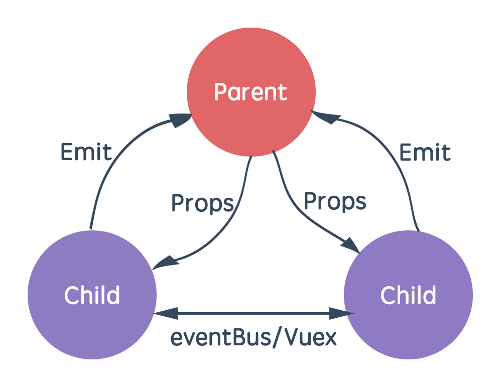
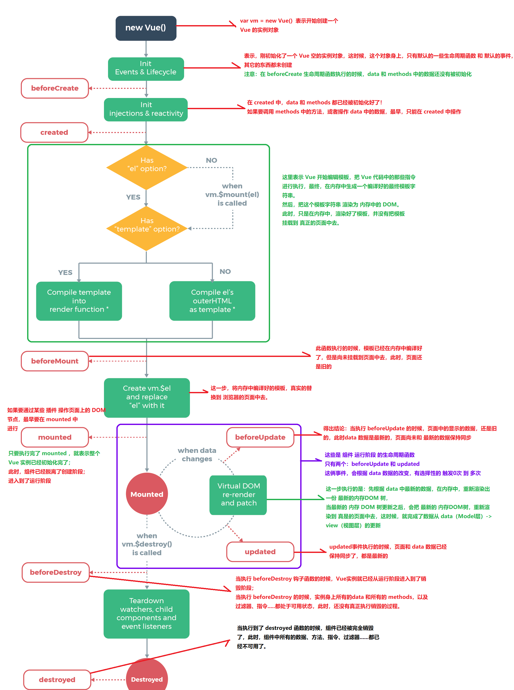
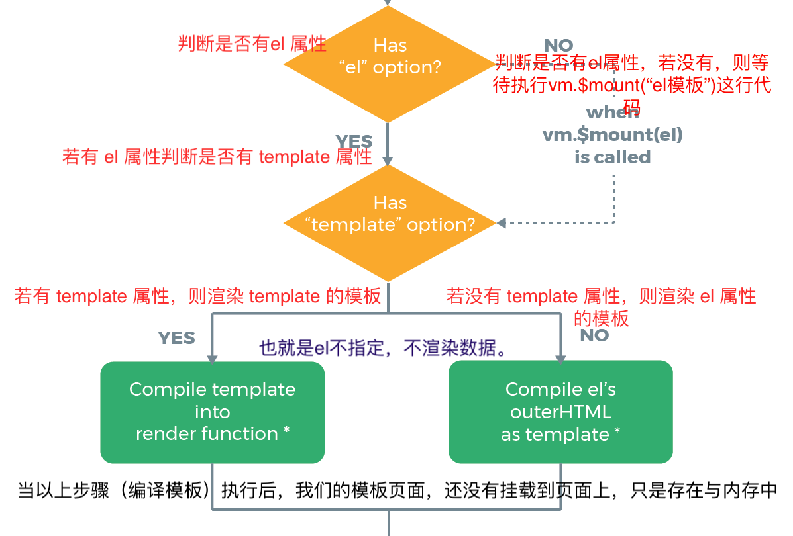
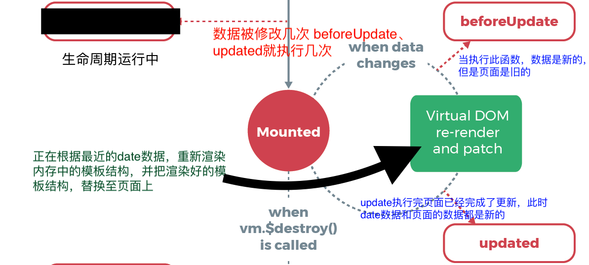

#  Vue

**Vue的核心特征：**

- M-V-VM 模式，数据绑定特性

- 解耦视图和逻辑代码

- 封装可复用 组件 

- 采用 虚拟DOM

  - 好处：自动最优化 DOM 操作，降低 DOM 操作成本
  - 首创：React
- 数据驱动：不用再关注如何操作 DOM，只需要关注如何变化数据

# 体验 Vue

Hello World！


步骤：
1. 在页面的 `body` 中放置一个需要通过 Vue 渲染的视图元素：`<div id="app"></app>`
2. 在页面中引入 `vue.js`
3. 创建 Vue 实例：`new Vue()`
4. 设置 Vue 实例的参数选项：`new Vue({ el: ..., data: ... })`
5. 在 `<div id="app"></app>` 内使用 `{{}}` 语法插入`data` 中的数据


代码：

```html
<!-- 要操作的视图元素 div#app -->
<div id="app">
    <!-- 使用Vue实例中的数据 -->
    {{ msg }}
</div>

<!-- 引入的 vue.js -->
<script src="./js/vue.js"></script>
<script>
  const vm =   new Vue({
        el: '#app',
        data: {
            msg: 'Hello,world'1
        }
    })
</script>
```

# Vue 介绍

## 插值表达式

> 作用：将绑定的数据实时渲染到当前位置
>
> 一旦通过任何方式修改了绑定的数据本身，都会让视图发生重新渲染，替换成改变后的新数据

双括号中支持使用：

- data中的数据属性
- 完整的表达式支持：各种JS表达式运算，如数学、逻辑、三元、连字符运算，方法调用等

不支持使用：

- 完整的JS语句，比如 `var a = 1; `, `if (...) ... else ...` 等

```html
<div id="app">
    <!-- 在插值表达式中可以访问vm实例中data里面的属性 -->
    {{ message }}
    <p>{{ message }}</p>
    <p>{{ message + '啦啦啦' }}</p>
    <p>{{ age > 18 ? '成年' : '未成年' }}</p>
    <p>{{ message.split("") }}</p>

  	<!-- 在插值表达式中不能写js语句 -->
    <p>{{ var a = 10 }}</p>
</div>

<!-- 引入vue.js -->
<script src="./js/vue.js"></script>

<script>
    const vm = new Vue({
        el: '#app',
        data: {
            message: '我是data中的message属性的值',
            age: 20
        }
    });
```

## 声明式渲染

> Vue.js 的核心是一个允许采用简洁的模板语法来声明式地将数据渲染进 DOM 的系统

```html
<div id="app">
  {{ message }}
</div>
```

```js
var app = new Vue({
  el: '#app',
  data: {
    message: 'Hello Vue!'
  }
})
```

除了文本插值，我们还可以像这样来绑定元素 attribute：

```html
<div id="app-2">
  <span v-bind:title="message">
    鼠标悬停几秒钟查看此处动态绑定的提示信息！
  </span>
</div>
```

```js
var app2 = new Vue({
  el: '#app-2',
  data: {
    message: '页面加载于 ' + new Date().toLocaleString()
  }
})
```

 `v-bind` attribute 被称为**指令**。指令带有前缀 `v-`，以表示它们是 Vue 提供的特殊 attribute。可能你已经猜到了，它们会在渲染的 DOM 上应用特殊的响应式行为。在这里，该指令的意思是：“将这个元素节点的 `title` attribute 和 Vue 实例的 `message` property 保持一致”。

如果你再次打开浏览器的 JavaScript 控制台，输入 `app2.message = '新消息'`，就会再一次看到这个绑定了 `title` attribute 的 HTML 已经进行了更新。

## 条件与循环

控制切换一个元素是否显示也相当简单：

```html
<div id="app-3">
  <p v-if="seen">现在你看到我了</p>
</div>
```

```js
var app3 = new Vue({
  el: '#app-3',
  data: {
    seen: true
  }
})
```

继续在控制台输入 `app3.seen = false`，你会发现之前显示的消息消失了。

这个例子演示了我们不仅可以把数据绑定到 DOM 文本或 attribute，还可以绑定到 DOM **结构**。此外，Vue 也提供一个强大的过渡效果系统，可以在 Vue 插入/更新/移除元素时自动应用过渡效果。

`v-for` 指令可以绑定数组的数据来渲染一个项目列表：

```html
<div id="app-4">
  <ol>
    <li v-for="todo in todos">
      {{ todo.text }}
    </li>
  </ol>
</div>
```

```js
var app4 = new Vue({
  el: '#app-4',
  data: {
    todos: [
      { text: '学习 JavaScript' },
      { text: '学习 Vue' },
      { text: '整个牛项目' }
    ]
  }
})
```

在控制台里，输入 `app4.todos.push({ text: '新项目' })`，你会发现列表最后添加了一个新项目。

## 处理用户输入

可以用 `v-on` 指令添加一个事件监听器，通过它调用在 Vue 实例中定义的方法：

```html
<div id="app-5">
  <p>{{ message }}</p>
  <button v-on:click="reverseMessage">反转消息</button>
</div>
```

```js
var app5 = new Vue({
  el: '#app-5',
  data: {
    message: 'Hello Vue.js!'
  },
  methods: {
    reverseMessage: function () {
      this.message = this.message.split('').reverse().join('')
    }
  }
})
```

注意在 `reverseMessage` 方法中，我们更新了应用的状态，但没有触碰 DOM——所有的 DOM 操作都由 Vue 来处理，你编写的代码只需要关注逻辑层面即可。

Vue 还提供了 `v-model` 指令，它能轻松实现表单输入和应用状态之间的双向绑定。

```html
<div id="app-6">
  <p>{{ message }}</p>
  <input v-model="message">
</div>
```

```js
var app6 = new Vue({
  el: '#app-6',
  data: {
    message: 'Hello Vue!'
  }
})
```

## 组件化应用构建

> 组件系统是 Vue 的另一个重要概念，因为它是一种抽象，允许我们使用小型、独立和通常可复用的组件构建大型应用。

在 Vue 里，一个组件本质上是一个拥有预定义选项的一个 Vue 实例。在 Vue 中注册组件很简单：

```js
// 定义名为 todo-item 的新组件
Vue.component('todo-item', {
  template: '<li>这是个待办项</li>' //渲染同样的文本
})

var app = new Vue(...)
```

现在你可以用它构建另一个组件模板：

```html
<ol>
  <!-- 创建一个 todo-item 组件的实例 -->
  <todo-item></todo-item>
</ol>
```

但是这样会为每个待办项渲染同样的文本，这看起来并不炫酷。我们应该能从父作用域将数据传到子组件才对。让我们来修改一下组件的定义，使之能够接受一个 [prop](https://cn.vuejs.org/v2/guide/components.html#通过-Prop-向子组件传递数据)：

```js
Vue.component('todo-item', {
  // todo-item 组件现在接受一个
  // "prop"，类似于一个自定义 attribute。
  // 这个 prop 名为 todo。
  props: ['todo'],
  template: '<li>{{ todo.text }}</li>'
})
```

现在，我们可以使用 `v-bind` 指令将待办项传到循环输出的每个组件中：

```html
<div id="app-7">
  <ol>
    <!--
      现在我们为每个 todo-item 提供 todo 对象
			todo 对象是变量，即其内容可以是动态的。
      我们也需要为每个组件提供一个“key”，稍后再
      作详细解释。
    -->
    <todo-item
      v-for="item in groceryList"
      v-bind:todo="item"
      v-bind:key="item.id"
    ></todo-item>
  </ol>
</div>
```

```js
Vue.component('todo-item', {
  props: ['todo'],
  template: '<li>{{ todo.text }}</li>'
})

var app7 = new Vue({
  el: '#app-7',
  data: {
    groceryList: [
      { id: 0, text: '蔬菜' },
      { id: 1, text: '奶酪' },
      { id: 2, text: '随便其它什么人吃的东西' }
    ]
  }
})
```

子单元通过 prop 接口与父单元进行了良好的解耦。我们现在可以进一步改进 `<todo-item>` 组件，提供更为复杂的模板和逻辑，而不会影响到父单元。

在一个大型应用中，有必要将整个应用程序划分为组件，以使开发更易管理。

### 与自定义元素的关系

你可能已经注意到 Vue 组件非常类似于**自定义元素**——它是 [Web 组件规范](https://www.w3.org/wiki/WebComponents/)的一部分，这是因为 Vue 的组件语法部分参考了该规范。例如 Vue 组件实现了 [Slot API](https://github.com/w3c/webcomponents/blob/gh-pages/proposals/Slots-Proposal.md) 与 `is` attribute。但是，还是有几个关键差别：

1. Web Components 规范已经完成并通过，但未被所有浏览器原生实现。目前 Safari 10.1+、Chrome 54+ 和 Firefox 63+ 原生支持 Web Components。相比之下，Vue 组件不需要任何 polyfill，并且在所有支持的浏览器 (IE9 及更高版本) 之下表现一致。必要时，Vue 组件也可以包装于原生自定义元素之内。
2. Vue 组件提供了纯自定义元素所不具备的一些重要功能，最突出的是跨组件数据流、自定义事件通信以及构建工具集成。

虽然 Vue 内部没有使用自定义元素，不过在应用使用自定义元素、或以自定义元素形式发布时，[依然有很好的互操作性](https://custom-elements-everywhere.com/#vue)。Vue CLI 也支持将 Vue 组件构建成为原生的自定义元素。

# Vue 实例

创建一个 Vue 实例：

> 每个 Vue 应用都是通过用 `Vue` 函数创建一个新的 **Vue 实例**开始的

```js
var vm = new Vue({
  // 选项
})
```

虽然没有完全遵循 [MVVM 模型](https://zh.wikipedia.org/wiki/MVVM)，但是 Vue 的设计也受到了它的启发。因此在文档中经常会使用 `vm` (ViewModel 的缩写) 这个变量名表示 Vue 实例。

当创建一个 Vue 实例时，你可以传入一个**选项对象**。

一个 Vue 应用由一个通过 `new Vue` 创建的**根 Vue 实例**，以及可选的嵌套的、可复用的组件树组成

# 选项 / DOM

## el:

> 作用：指定当前 Vue 实例要接管的视图元素，也叫做**挂载点**

赋值说明：

- 通常是 id 选择器
- 或是一个 DOM 元素
- 可以用其他选择器，选择器匹配到多个元素时只取第一个
- 不能是 html、body 元素

也可以使用Vue实例的方法`$mount('…')`进行挂载

```js
vm.$mount('#app')
```

- **类型**：`string | Element`

- **限制**：只在用 `new` 创建实例时生效。

- **详细**：

  提供一个在页面上已存在的 DOM 元素作为 Vue 实例的挂载目标。可以是 CSS 选择器，也可以是一个 HTMLElement 实例。

  在实例挂载之后，元素可以用 `vm.$el` 访问。

  如果在实例化时存在这个选项，实例将立即进入编译过程，否则，需要显式调用 `vm.$mount()` 手动开启编译。

## template:

**类型**：`string`

**详细**：

一个字符串模板作为 Vue 实例的标识使用。模板将会**替换**挂载的元素。挂载元素的内容都将被忽略，除非模板的内容有分发插槽。

如果值以 `#` 开始，则它将被用作选择符，并使用匹配元素的 innerHTML 作为模板。常用的技巧是用 `<script type="x-template">` 包含模板。

> 出于安全考虑，你应该只使用你信任的 Vue 模板。避免使用其他人生成的内容作为你的模板。

> 如果 Vue 选项中包含渲染函数，该模板将被忽略。

## render:

**类型**：`(createElement: () => VNode) => VNode`

**详细**：

字符串模板的代替方案，允许你发挥 JavaScript 最大的编程能力。该渲染函数接收一个 `createElement` 方法作为第一个参数用来创建 `VNode`。

如果组件是一个函数组件，渲染函数还会接收一个额外的 `context` 参数，为没有实例的函数组件提供上下文信息。

> Vue 选项中的 `render` 函数若存在，则 Vue 构造函数不会从 `template` 选项或通过 `el` 选项指定的挂载元素中提取出的 HTML 模板编译渲染函数。

> render: h => h(App) Vue提供用 h 代替createElement

## renderError:

- **类型**：`(createElement: () => VNode, error: Error) => VNode`

- **详细**：

  **只在开发者环境下工作。**

  当 `render` 函数遭遇错误时，提供另外一种渲染输出。其错误将会作为第二个参数传递到 `renderError`。这个功能配合 hot-reload 非常实用。

# 选项 / 数据 

## data

> 作用：存放 Vue 实例的 **响应式数据**
>
> （使用了响应式数据的视图，会在响应式数据发生变化时，立即自动更新）

访问 data 中的响应式数据：

- `vm.$data.xxx` - 完整形式
- `vm.xxx` - 简化形式，因为Vue实例代理了data上所有的属性

**注意点：**响应式数据必须显式的在 data 中初始化，否则没有响应式效果

- **类型**：`Object | Function`
- **限制**：组件的定义只接受 `function`。

Vue 实例的数据对象。Vue 将会递归将 data 的 property 转换为 getter/setter，从而让 data 的 property 能够响应数据变化。**对象必须是纯粹的对象 (含有零个或多个的 key/value 对)**：浏览器 API 创建的原生对象，原型上的 property 会被忽略。

实例创建之后，可以通过 `vm.$data` 访问原始数据对象。Vue 实例也代理了 data 对象上所有的 property，因此访问 `vm.a` 等价于访问 `vm.$data.a`。

当一个**组件**被定义，`data` 必须声明为返回一个初始数据对象的函数，因为组件可能被用来创建多个实例。如果 `data` 仍然是一个纯粹的对象，则所有的实例将**共享引用**同一个数据对象！通过提供 `data` 函数，每次创建一个新实例后，我们能够调用 `data` 函数，从而返回初始数据的一个全新副本数据对象。

如果需要，可以通过将 `vm.$data` 传入 `JSON.parse(JSON.stringify(...))` 得到深拷贝的原始数据对象。

**示例**：

```js
var data = { a: 1 }

// 直接创建一个实例
var vm = new Vue({
  data: data
})
vm.a // => 1
vm.$data === data // => true

// Vue.extend() 中 data 必须是函数
var Component = Vue.extend({
  data: function () {
    return { a: 1 }
  }
})
```

注意，如果你为 `data` property 使用了箭头函数，则 `this` 不会指向这个组件的实例，不过你仍然可以将其实例作为函数的第一个参数来访问。

```js
data: vm => ({ a: vm.myProp })
```

## methods

> 作用：存放 Vue 实例的方法函数

方法的定义：

- `xxx: function() {}` 和 `xxx() {}` 这两种形式是等价的；并且，方法中的 `this` 指向当前Vue实例
- 不推荐使用箭头函数来定义方法，因为这样的话方法中的`this`不会指向当前Vue实例（因为箭头函数绑定的是父级作用域）

方法的调用：

- 可以通过 **Vue实例** 调用： vm.fn(x)
- 可以在 **指令** 中调用：v-on:click="fn(x)"
- 可以在 **{{ }}** 中调用：{{ fn(x) }}
- 可以在 **其他方法** 中调用：this.fn(x)

```js
var vm = new Vue({
  data: { a: 1 },     
// methods作用:指定当前 Vue 实例中的方法
// 1. 可以直接通过 vm 实例访问这些方法，
// 2. 方法中的 this 自动绑定为 Vue 实例。
// 3. 不推荐使用箭头函数
  methods: {
    plus: function () {
      this.a++
    }
  }
})
vm.plus()
vm.a // 2
```

- **类型**：`{ [key: string]: Function }`

- **详细**：

  methods 将被混入到 Vue 实例中。可以直接通过 VM 实例访问这些方法，或者在指令表达式中使用。方法中的 `this` 自动绑定为 Vue 实例。

注意，**不应该使用箭头函数来定义 method 函数** (例如 `plus: () => this.a++`)。理由是箭头函数绑定了父级作用域的上下文，所以 `this` 将不会按照期望指向 Vue 实例，`this.a` 将是 undefined。

## props

**类型**：`Array<string> | Object`

**详细**：

props 可以是数组或对象，用于接收来自父组件的数据。props 可以是简单的数组，或者使用对象作为替代，对象允许配置高级选项，如类型检测、自定义验证和设置默认值。

**Prop 的大小写 (camelCase vs kebab-case)**

HTML 中的 attribute 名是大小写不敏感的，所以浏览器会把所有大写字符解释为小写字符。这意味着当你使用 DOM 中的模板时，camelCase (驼峰命名法) 的 prop 名需要使用其等价的 kebab-case (短横线分隔命名) 命名：

```html
Vue.component('blog-post', {
  // 在 JavaScript 中是 camelCase 的
  props: ['postTitle'],
  template: '<h3>{{ postTitle }}</h3>'
})
<!-- 在 HTML 中是 kebab-case 的 -->
<blog-post post-title="hello!"></blog-post>
```

重申一次，如果你使用字符串模板，那么这个限制就不存在了。

## propsData

- **类型**：`{ [key: string]: any }`

- **限制**：只用于 `new` 创建的实例中。

- **详细**：

  创建实例时传递 props。主要作用是方便测试。

  ```js
  var Comp = Vue.extend({
    props: ['msg'],
    template: '<div>{{ msg }}</div>'
  })
  
  var vm = new Comp({
    propsData: {
      msg: 'hello'
    }
  })
  ```


## computed

- 类型：`{ [key: string]: Function | { get: Function, set: Function } }`

- 详细:

计算属性将被混入到 Vue 实例中。所有 getter 和 setter 的 this 上下文自动地绑定为 Vue 实例。

注意如果你为一个计算属性使用了箭头函数，则 `this` 不会指向这个组件的实例，不过你仍然可以将其实例作为函数的第一个参数来访问。

```js
computed: {
  aDouble: vm => vm.a * 2
}
```

计算属性的结果会被缓存，除非依赖的响应式 property 变化才会重新计算。注意，如果某个依赖 (比如非响应式 property) 在该实例范畴之外，则计算属性是**不会**被更新的。

示例：

```js
var vm = new Vue({
  data: { a: 1 },
  computed: {
    // 仅读取
    aDouble: function () {
      return this.a * 2
    },
    // 读取和设置
    aPlus: {
      get: function () {
        return this.a + 1
      },
      set: function (v) {
        this.a = v - 1
      }
    }
  }
})
vm.aPlus   // => 2
vm.aPlus = 3
vm.a       // => 2
vm.aDouble // => 4
```

## watch:

- **类型**：`{ [key: string]: string | Function | Object | Array }`

- **详细**：

一个对象，键是需要观察的表达式，值是对应回调函数。值也可以是方法名，或者包含选项的对象。Vue 实例将会在实例化时调用 `$watch()`，遍历 watch 对象的每一个 property。

```js
var vm = new Vue({
  data: {
    a: 1,
    b: 2,
    c: 3,
    d: 4,
    e: {
      f: {
        g: 5
      }
    }
  },
  watch: {
    a: function (val, oldVal) {
      console.log('new: %s, old: %s', val, oldVal)
    },
    // 方法名
    b: 'someMethod',
    // 该回调会在任何被侦听的对象的 property 改变时被调用，不论其被嵌套多深
    c: {
      handler: function (val, oldVal) { /* ... */ },
      deep: true
    },
    // 该回调将会在侦听开始之后被立即调用
    d: {
      handler: 'someMethod',
      immediate: true
    },
    // 你可以传入回调数组，它们会被逐一调用
    e: [
      'handle1',
      function handle2 (val, oldVal) { /* ... */ },
      {
        handler: function handle3 (val, oldVal) { /* ... */ },
        /* ... */
      }
    ],
    // watch vm.e.f's value: {g: 5}
    'e.f': function (val, oldVal) { /* ... */ }
  }
})
vm.a = 2 // => new: 2, old: 1
```


> 注意，**不应该使用箭头函数来定义 watcher 函数** (例如 `searchQuery: newValue => this.updateAutocomplete(newValue)`)。理由是箭头函数绑定了父级作用域的上下文，所以 `this` 将不会按照期望指向 Vue 实例，`this.updateAutocomplete` 将是 undefined。

# 选项 / 组合

## parent

- 类型：`Vue instance`

- 详细：

指定已创建的实例之父实例，在两者之间建立父子关系。子实例可以用 `this.$parent` 访问父实例，子实例被推入父实例的 `$children` 数组中。

> 节制地使用 `$parent` 和 `$children` - 它们的主要目的是作为访问组件的应急方法。更推荐用 props 和 events 实现父子组件通信

## mixins

- **类型**：`Array<Object>`

`mixins` 选项接收一个混入对象的数组。这些混入对象可以像正常的实例对象一样包含实例选项，这些选项将会被合并到最终的选项中，使用的是和 `Vue.extend()` 一样的选项合并逻辑。也就是说，如果你的混入包含一个 created 钩子，而创建组件本身也有一个，那么两个函数都会被调用。

Mixin 钩子按照传入顺序依次调用，并在调用组件自身的钩子之前被调用。

```js
var mixin = {
  created: function () { console.log(1) }
}
var vm = new Vue({
  created: function () { console.log(2) },
  mixins: [mixin]
})
// => 1
// => 2
```

## extends

- **类型**：`Object | Function`

- **详细**：

允许声明扩展另一个组件 (可以是一个简单的选项对象或构造函数)，而无需使用 `Vue.extend`。这主要是为了便于扩展单文件组件。

这和 `mixins` 类似。

```js
var CompA = { ... }

// 在没有调用 `Vue.extend` 时候继承 CompA
var CompB = {
  extends: CompA,
  ...
}
```

## provide / inject

- **provide**：`Object | () => Object`
- **inject**：`Array<string> | { [key: string]: string | Symbol | Object }`

> `provide` 和 `inject` 主要在开发高阶插件/组件库时使用。并不推荐用于普通应用程序代码中。

这对选项需要一起使用，以允许一个祖先组件向其所有子孙后代注入一个依赖，不论组件层次有多深，并在其上下游关系成立的时间里始终生效。如果你熟悉 React，这与 React 的上下文特性很相似。

- `provide` 选项应该是一个对象或返回一个对象的函数。该对象包含可注入其子孙的 property。在该对象中你可以使用 ES2015 Symbols 作为 key，但是只在原生支持 `Symbol` 和 `Reflect.ownKeys` 的环境下可工作。

- `inject` 选项应该是：

  - 一个字符串数组，或
  - 一个对象，对象的 key 是本地的绑定名，value 是：
    - 在可用的注入内容中搜索用的 key (字符串或 Symbol)，或
    - 一个对象，该对象的：
      - `from` property 是在可用的注入内容中搜索用的 key (字符串或 Symbol)
      - `default` property 是降级情况下使用的 value

> 提示：`provide` 和 `inject` 绑定并不是可响应的。这是刻意为之的。然而，如果你传入了一个可监听的对象，那么其对象的 property 还是可响应的。


# 选项 / 其它

## name

- **类型**：`string`

- **限制**：只有作为组件选项时起作用。

- **详细**：

  允许组件模板递归地调用自身。注意，组件在全局用 `Vue.component()` 注册时，全局 ID 自动作为组件的 name。

  指定 `name` 选项的另一个好处是便于调试。有名字的组件有更友好的警告信息。另外，当在有 [vue-devtools](https://github.com/vuejs/vue-devtools)，未命名组件将显示成 `<AnonymousComponent>`，这很没有语义。通过提供 `name` 选项，可以获得更有语义信息的组件树。

## inheritAttrs

> 2.4.0 新增

- 类型：`boolean`

- 默认值：`true`

- 详细：

​	默认情况下父作用域的不被认作 props 的 attribute 绑定 (attribute bindings) 将会“回退”且作为普通的 HTML attribute 应用在子组件的根元素上。当撰写包裹一个目标元素或另一个组件的组件时，这可能不会总是符合预期行为。通过设置 `inheritAttrs` 到 `false`，这些默认行为将会被去掉。而通过 (同样是 2.4 新增的) 实例 property `$attrs` 可以让这些 attribute 生效，且可以通过 `v-bind` 显性的绑定到非根元素上。

注意：这个选项**不影响** `class` 和 `style` 绑定。

# 实例 property 

## vm.$refs

作用：让我们可以直接操作 DOM

要使用其他插件，必须需要要直接操作真实 DOM，需要调用一些真实DOM的专属方法，因为虚拟DOM上没有这些方法

使用步骤：

1. 给DOM元素设置 `ref` 属性值，比如`ref="myele"`
2. 在 Vue 的 mounted 选项下，通过` this.$refs.属性`，如`this.refs.myele` 获取到要操作的 DOM 元素

```html
<div id="app">
    <!-- 1. 给要操作的DOM元素设置ref属性 -->
    <input type="text" ref="txt" />
</div>

<script src="./vue.js"></script>

<script>
    new Vue({
        el: '#app',

        // mounted 代表当页面已加载完毕，此时可以访问实际的DOM树上的元素
        mounted() {
            // 2. 用this.$refs.属性 去操作DOM
            var el = this.$refs.txt;
            console.log(el);
            el.style.border = '2px solid red';
        },
    });
</script>
```

## vm.$attrs

> 2.4.0 新增

- 类型：`{ [key: string]: string }`

- **只读**

- 详细：

​	包含了父作用域中不作为 prop 被识别 (且获取) 的 attribute 绑定 (`class` 和 `style` 除外)。当一个组件没有声明任何 prop 时，这里会包含所有父作用域的绑定 (`class` 和 `style` 除外)，并且可以通过 `v-bind="$attrs"` 传入内部组件——在创建高级别的组件时非常有用。

## vm.$listeners

> 2.4.0 新增

- 类型：`{ [key: string]: Function | Array<Function> }`

- **只读**

- 详细：

​	包含了父作用域中的 (不含 `.native` 修饰器的) `v-on` 事件监听器。它可以通过 `v-on="$listeners"` 传入内部组件——在创建更高层次的组件时非常有用。

# 实例方法 / 事件

## vm.$emit

语法：

```js
//args 会传到父组件
vm.$emit( eventName, […args] )
```

参数：

- `{string} eventName`
- `[...args]`

触发当前实例上的事件。附加参数都会传给监听器回调。

示例：子组件向父组件传值

```html
<div id="emit-example-simple">
  <welcome-button v-on:welcome="sayHi"></welcome-button>
</div>

<script>
Vue.component('welcome-button', {
  template: `
    <button v-on:click="$emit('welcome')">
      Click me to be welcomed
    </button>
  `
})
new Vue({
  el: '#emit-example-simple',
  methods: {
    sayHi: function () {
      alert('Hi!')
    }
  }
})
</script>
```

# Vue 指令

> 作用：指令是一种带有 `v-` 前缀的特殊属性。通过添加指令，可以扩展 DOM 元素的功能

给DOM元素 **设置 “原生” 属性**，可以提供了一些特别的功能：

```html
<div title="Hello world"></div>
<input type="checkbox" value="0" />
```

给DOM元素 **设置 "指令" 属性**，也可以提供额外的功能：

```html
<div v-text="Hello world"></div>
```

指令可以看作是 **包装过的 DOM 操作**。

指令分为两类：

- [内置指令](https://cn.vuejs.org/v2/api/#%E6%8C%87%E4%BB%A4) - 框架提供的指令
- 自定义指令 - 我们自己开发的指令

> 有的指令需要设置属性值，有的不需要，这完全取决于指令的具体功能。
>
> 【道理如同函数：有的函数需要参数，有的不需要参数】

## 常用内置指令

### 指令：v-text 与 v-html

> 作用：类比 innerText 和 innerHTML

**v-text 指令：**

- 可以渲染纯文本内容到标签中

- v-text 和 插值表达式的区别

  - v-text 更新的是标签内的整个内容
  - 插值表达式可以更新局部内容


**v-html 指令:**

- 可以渲染带 HTML 的内容到标签中
- 不能滥用，尽量不用（容易造成跨站脚本攻击，即XSS）

```html
<div id="app">
    <!-- v-text指令的值会替换标签内容 -->
    <p>{{ str }}</p>
    <p v-text="str"></p>
    <p v-text="str">我是p标签的初始内容</p>
    <p v-text="strHtml">我是p标签的初始内容</p>
  
    <!-- v-html指令的值(包括标签字符串)会替换掉标签的内容 -->
    <p v-html="str"></p>
    <p v-html="strHtml">我是p标签中的初始内容</p>
</div>

<script src="./js/vue.js"></script>

<script>
    new Vue({
        el: '#app',
        data: {
            str: 'abc',
            strHtml: '<span>content</span>'
        }
    });
</script>
```

### 指令：v-bind

> 作用：可以为标签的任何属性做数据绑定

常规语法：`v-bind:属性名="响应式数据或表达式"`

简化语法：`:属性名="响应式数据或表达式"`

#### 绑定 id 和 src 属性

```html
<div id="app">
    <!-- data中的数据替换为标签的属性值 -->
    <p v-bind:id="idValue">内容</p>
    
</div>

<script src="./vue.js"></script>

<script>
    var vm = new Vue({
        el: '#app',
        data: {
            src: './logo.png',
            idValue: 'b'
        }
    });
</script>
```

#### 绑定 class 属性

>  分为：`对象语法` 和 `数组语法`两种用法。

##### 对象语法

示例：如果 isActive 为 true， 则返回的结果为 `<div class="active"></div>`

```css
.active {
	color: red;
}
```

```html
<div id="app">
    <div v-bind:class="{ 'active': isActive }">hei</div>
    <button @click="changeClassNameHandler">点击切换类名</button>
</div>

<script src="./vue.js"></script>

<script>
    var vm = new Vue({
        el: '#app',
        data: {
            isActive: true
        },
        methods: {
            changeClassNameHandler() {
                this.isActive = !this.isActive;
            }
        }
    });
</script>
```

##### 数组语法

示例：以下渲染结果为 `<div class="actived text-danger"></div>`

```html
<div v-bind:class="[ activeClass, dangerClass ]">hei</div>

<script src="./vue.js"></script>

<script>
    var vm = new Vue({
        el: '#app',
        data: {
            activeClass: 'actived',
          	dangerClass: 'text-danger'
        }
    });
</script>
```

#### 绑定 style 属性

> 和绑定class一样，也分为：`对象语法` 和 `数组语法`两种用法。和绑定class一样，也分为：`对象语法` 和 `数组语法`两种用法。

##### 对象语法

示例：渲染的结果`<div style="color: red; font-size: 18px;"></div>`

````html
<div id="app">
    <div v-bind:style="{ 'color': redColor, 'font-size': font18 }">文本内容</div>
</div>

<script src="./vue.js"></script>

<script>
    var vm = new Vue({
        el: '#app',
        data: {
            redColor: 'red',
            font18: '18px'
        }
    });
</script>
````

##### 数组语法

示例：渲染的结果`<div style="color: red; background-color: blue; border: 1px solid red; border-radius: 15px;">abc</div>`

```html
<div v-bind:style="[ colorStyles, borderStyles ]">abc</div>

<script src="./vue.js"></script>

<script>
    var vm = new Vue({
        el: '#app',
        data: {
            colorStyles: {
                color: 'red',
                backgroundColor: 'blue'
            },
            borderStyles: {
                border: '1px solid red',
                borderRadius: '15px'
            }
        }
    });
</script>
```

### 指令：v-if与 v-show

两个指令的区别：

- v-if 只有条件是 true 的时候，才创建并渲染元素；从 true 变为 false 时，会销毁元素
- v-show 总是会创建元素，然后条件为 true 时，显示元素；false 则隐藏元素

> 如果标签显示与隐藏切换频繁, 就使用 v-show 
>
> （v-show 本质是通过修改标签的样式 display 值）

```html
<div id="app">
    <!-- 如果isShow的值是true ,就显示p标签 -->
    <p v-if="isShow">我是p标签中的内容</p>
    <p v-show="isShow">我是p标签中的内容</p>
</div>

<script src="./vue.js"></script>

<script>
    new Vue({
        el: '#app',
        data: {
            isShow: false
        }
    });
</script>
```

### 指令：v-on

> 作用：为元素绑定DOM事件监听函数

常规语法：`v-on:事件名.修饰符="methods中的方法名"`

简写语法：`@事件名.修饰符="methods中的方法名"`

修饰符：

> 修饰符可以串联

- `.once` - 让事件只触发一次
- `.prevent` - 忽略元素的默认行为。功能同`event.preventDefault()`
- `.stop` - 阻止事件传播
- `.self` - 只当在 event.target 是当前元素自身时触发处理函数，即事件不是从内部元素触发的
-  `.capture` - 添加事件监听器时使用事件捕获模式，即内部元素触发的事件先在此处理，然后才交由内部元素进行处理

> 使用修饰符时，顺序很重要；相应的代码会以同样的顺序产生。因此，用 `v-on:click.prevent.self` 会阻止**所有的点击**，而 `v-on:click.self.prevent` 只会阻止对元素自身的点击。

- `.passive` -  滚动事件的默认行为将会立即触发，这个 `.passive` 修饰符尤其能够提升移动端的性能。

> 不要把 `.passive` 和 `.prevent` 一起使用，因为 `.prevent` 将会被忽略，同时浏览器可能会向你展示一个警告。请记住，`.passive` 会告诉浏览器你*不*想阻止事件的默认行为。

事件对象 $event：

- 携带事件信息

- 在监听方法不加任何实参时，默认传递 $event 为方法的第一个参数
- 在监听方法加实参时，可自行决定是否传递 $event 以及传递时的参数位置

```html
<div id="app">
    <!-- v-on:xx事件名='当触发xx事件时执行的语句' -->
    <!-- 执行一段js语句:可以使用 data 中的属性 -->
    <button v-on:click="count += 1">增加 1</button>
    <!-- v-on的简写方法 -->
    <button @click="count += 1">增加 1</button>
  	<!-- 执行一个方法 -->
    <button @click="add">增加 1</button>
    
  	<!-- 执行一个方法、这种写法可以传形参 -->
    <button @click="fn1(count)">执行fn1方法</button>
  	<!-- 执行一个方法、这种写法可以传形参,特殊的形参$event -->
    <button @click="fn2($event)">执行fn2方法</button>
    <hr>
  	<!-- 和v-for结合使用 -->
    <button @click="fn3(index)" v-for="(item, index) in items">执行fn3方法</button>
    
  	<!-- v-on修饰符 如 once: 只执行一次 -->
    <button @click.once="fn4">只执行一次</button>

    <p>上面的按钮被点击了 {{ count }} 次。</p>
</div>
<script src="./vue.js"></script>
<script>
    new Vue({
        el: '#app',
        data: {
            count: 0,
            items: ['a', 'b', 'c']
        },
        methods: {
            add: function () {
                this.count += 1;
            },
            fn1: function (count) {
                console.log(count);
                console.log('fn1方法被执行');
            },
            fn2: function (e) {
                console.log(e);
                console.log('fn2方法被执行');
            },
            fn3: function (index) {
                console.log(index);
                console.log('fn3方法被执行');
            },
            fn4: function () {
                console.log('fn4方法被执行了');
            }
        }
    });
</script>
```

### 指令：v-for

> 作用：根据一组数据，渲染出一个标签结构相似的列表界面

语法1：`v-for="item in items"` - 只取数组元素内容的

语法2：`v-for="(item, index) in items"` - 兼取数组元素索引

语法3：`v-for="(item, key, index) in obj"` - 如果作用于一个对象

```html
<div id="app">
    <!-- v-for作用:列表渲染,当遇到相似的标签结构时,就用v-for去渲染
         v-for="元素 in 容器(数组和对象)"
         v-for="数组中的元素 in data中的数组名"
         v-for="对象中的属性值 in data中的对象名"
     -->

    <!-- 数组 -->
    <p v-for="item in list">{{item}}</p>
    <hr />
    <p v-for="(item,index) in list">{{item}}----{{index}}</p>

    <!-- 
        (v,i) in 数组
        v:数组中的每个元素
        i:数组中元素的下标
     -->
    <hr />

    <!-- 对象 -->
    <!-- 
        (v,k,i)in 对象
        v:值 k:键 i:对象中每对 key-value 的索引 从 0 开始
        注意: v,k,i是参数名,见名知意即可!
    -->
    <p v-for="value in per">{{value}}</p>
    <hr />
    <p v-for="(value,key) in per">{{value}}----{{key}}</p>
    <hr />
    <p v-for="(value,key,i) in per">{{value}}----{{key}}--{{i}}</p>
</div>

<script src="./vue.js"></script>

<script>
    new Vue({
        el: '#app',
        data: {
            list: ['a', 'b', 'c'],
            per: {
                name: '老王',
                age: 38,
                gender: '男',
            },
        },
    });
</script>

```

**注意：使用`v-for`指令时，通常要加一个指令 `v-bind:key`（该指令的值通常是数组的下标或数组中对象的id，能代表数据唯一性的）**

> 作用：缓存上一次的渲染结果，在下一次因数据变化而重新渲染时，先去查找有无相同的已缓存过的标签，如有则只是对标签按需调整顺序，而不需要重新创建。
>
> 目的：提高渲染效率

```html
<div id="app">
   <!-- v-for 
    key属性: 值通常是一个唯一的标识
    key是一个可选属性
    养成好习惯:建议在写v-for时 设置:key="唯一值"
   -->
   <ul>
     <li v-for="(item,index) in list" :key="index">
       {{item}}---{{index}}
     </li>
   </ul>
</div>

<script src="./vue.js"></script>

<script>
  new Vue({
    el: '#app',
    data: {
      list: ['a', 'b', 'c']
    }
  });
</script>
```

### 指令：v-model

> 作用：对表单元素进行 **双向绑定**
>
> 你可以用 `v-model` 指令在表单 `<input>`、`<textarea>` 及 `<select>` 元素上创建双向数据绑定。它会根据控件类型自动选取正确的方法来更新元素。

双向绑定的特点：

- 当 data 内响应式数据发生变化时，可立即更新视图
- 当视图元素发生内容变化（通常是表单控件，如输入框，下拉框，单/多选框等等），可立即更新 data 中对应的响应式数据
- 注意：一旦使用了`v-model`，将会忽略所有表单元素的`value`、`checked`、`selected`初始值，而总使用绑定的响应式数据作为数据源

#### 绑定单行文本框

示例效果：当在文本框中输入不同的值后，div 中的内容也会相应变化

```html
<div id="app">
    <!-- 当在文本框中输入不同的值后，div中的内容也会相应变化 -->
    <p>{{ message }}</p>
    <input type="text" v-model="message" />
</div>

<script src="./vue.js"></script>

<script>
    var vm = new Vue({
        el: '#app',
        data: {
            message: 'message的默认值'
        }
    });
</script>
```

`v-model` 会忽略所有表单元素的 `value`、`checked`、`selected` attribute 的初始值而总是将 Vue 实例的数据作为数据来源。你应该通过 JavaScript 在组件的 `data` 选项中声明初始值。

#### v-model 双向数据绑定原理

`v-model` 在内部为不同的输入元素使用不同的 property 并抛出不同的事件：

- text 和 textarea 元素使用 `value` property 和 `input` 事件；
- checkbox 和 radio 使用 `checked` property 和 `change` 事件；
- select 字段将 `value` 作为 property 并将 `change` 作为事件。

```html
<div id="app">
    <p>{{ message }}</p>
  
    <!-- v-model 其实是一个语法糖，它是下面这种写法的简写 -->
    <input type="text" 
           v-bind:value="message" 
           v-on:input="message = $event.target.value" />
</div>

<script src="./js/vue.js"></script>

<script>
    var vm = new Vue({
        el: '#app',
        data: {
            message: 'message的默认值'
        }
    });
</script>
```

#### 绑定多行文本框

> 与单行文本框基本一致

```html
<div id="app">
  	<div>{{ message }}</div>
    <textarea v-model="message"></textarea>
</div>

<script src="./vue.js"></script>

<script>
    var vm = new Vue({
        el: '#app',
        data: {
            message: 'message默认值'
        }
    });
</script>
```

#### 绑定复选框

示例一：绑定一个复选框

> 绑定一个复选框 使用布尔类型的数据

```html
<div id="app">
    <input type="checkbox" v-model="checked">
    <div>{{ checked }}</div>
</div>

<script src="./vue.js"></script>

<script>
    const vm = new Vue({
        el: '#app',
        data: {
            checked: true
        }
    });
</script>
```

示例二：绑定一组复选框

注意点：

- 需要为每个复选框提供 value 属性值
- v-model 绑定的 data 数据是一个数组

```html
<div id="app">
    <input type="checkbox" v-model="checked" value="1">鸡蛋
    <input type="checkbox" v-model="checked" value="2">丫蛋
    <input type="checkbox" v-model="checked" value="3">手榴弹
    <div>{{ checked }}</div>
</div>

<script src="./vue.js"></script>

<script>
    const vm = new Vue({
        el: '#app',
        data: {
            checked: []
        }
    });
</script>
```

#### 绑定单选框

注意点：需要为每个单选框提供 value 属性值

```html
<div id="app">
    <input type="radio" value="1" v-model="gender">男
    <input type="radio" value="2" v-model="gender">女
    <input type="radio" value="3" v-model="gender">懂得多
    <div>{{ gender }}</div>
</div>

<script src="./vue.js"></script>

<script>
    var vm = new Vue({
        el: '#app',
        data: {
            gender: 2
        }
    });
</script>
```

#### 绑定下拉框

> `<select>` 绑定的动态数据为 `<option>` 的 `value`

```html
<div id="app">
    <select v-model="selectedCity">
        <option value="" disabled>--- 请选择 ---</option>
        <option v-for="city in cities" :value="city">
          {{ city.name }}
      	</option>
    </select>
    <div>您选择的是: {{ selectedCity.name }}</div>
</div>

<script src="./vue.js"></script>

<script>
    var vm = new Vue({
        el: '#app',
        data: {
            cities: [
                { name: '北京', value: '1' },
                { name: '上海', value: '2' },
                { name: '深圳', value: '3' },
            ],
            selectedCity: ''
        }
    });
</script>
```

### 指令：v-cloak

**问题现象：**使用`{{}}`绑定的页面内容位置，可能会因为数据还没初始化完成，在很短一段时间内直接显示 `{{xxx}}` 这样的代码内容。（在页面加载或刷新页面的时候，尤其明显）

**解决方案：**使用`v-cloak`指令，可以让`{{xxx}}`在未填充数据的时候不显示，等有数据了再显示

**注意：**要在 css 中先加入这样的样式，才能让 v-cloak 生效

```css
[v-cloak] {
    display: none;
}
```

```html
<div id="app" v-cloak>
    <p>{{ message }}</p>
</div>
```

不会显示，直到编译结束。

### 指令：v-once

作用：让元素和组件只渲染一次。在随后的页面更新中，使用了 v-once 的元素、组件、及其所有子节点，都会当作静态内容跳过重渲染过程

目的：用于优化更新性能

```html
<div id="app">
    <p v-once>{{ message }}</p>
    <input type="text" v-model="message" />
</div>

<script src="./vue.js"></script>

<script>
    var vm = new Vue({
        el: '#app',
        data: {
            message: '我是data中message的属性的值'
        }
    });
</script>
```

修饰符

`.lazy`

在默认情况下，`v-model` 在每次 `input` 事件触发后将输入框的值与数据进行同步 除了输入法组合文字时。你可以添加 `lazy` 修饰符，从而转为在 `change` 事件_之后_进行同步：

```html
<!-- 在“change”时而非“input”时更新 -->
<input v-model.lazy="msg">
```

`.number`

如果想自动将用户的输入值转为数值类型，可以给 `v-model` 添加 `number` 修饰符：

```html
<input v-model.number="age" type="number">
```

这通常很有用，因为即使在 `type="number"` 时，HTML 输入元素的值也总会返回字符串。如果这个值无法被 `parseFloat()` 解析，则会返回原始的值。

`.trim`

如果要自动过滤用户输入的首尾空白字符，可以给 `v-model` 添加 `trim` 修饰符：

```html
<input v-model.trim="msg">
```

## 自定义指令

除了核心功能默认内置的指令 (`v-model` 和 `v-show`)，Vue 也允许注册自定义指令。

> 注意，在 Vue2.0 中，代码复用和抽象的主要形式是组件。然而，有的情况下，你仍然需要对普通 DOM 元素进行底层操作，这时候就会用到自定义指令。

## DOM操作：自定义指令

分类：局部注册 和 全局注册

### 局部注册

- 注册方式：在当前 Vue 实例对象的选项中设置自定义指令 `directives: {}`

- 定义格式：

  ```js
  directives: { 
    '指令的核心名称': { 
      inserted: (使用指令时的DOM对象) => { 具体的DOM操作 } 
    }
  }
  ```

- 使用方式：在标签元素上使用

```html
<div id="app">
    <!-- 3. 在视图中通过标签去使用指令 -->
    <input type="text" v-border />
</div>

<script src="./js/vue.js"></script>

<script>
    var vm = new Vue({
        el: '#app',
        // 1. 在vm对象的选项中设置自定义指令 directives:{}
        directives: {
            // 2. directives:{ '指令的核心名称': { inserted: (使用指令时的DOM对象) => { 具体的DOM操作 } }}
            border: {
                // 指令的定义:
                inserted: function (el, binding) {
                    el.style.border = "2px solid red";
                }
            }
        }
    });
</script>
```

### 全局注册

- 注册方式：在创建Vue实例之前，使用 `Vue.directive()` 函数定义全局自定义指令

- 定义格式：

  ```js
  Vue.directive('指令的核心名称',{ 
    inserted: (使用指令的DOM对象) => { 具体的DOM操作 } 
  });
  ```

- 使用方式：在视图标签上通过 `v-自定义指令名 `的格式使用

```html
<div id="app">
    <!-- 3. 在视图中通过标签去使用指令 -->
    <input type="text" v-border />
</div>

<script src="./js/vue.js"></script>

<script>
    // 全局自定义指令
    // 1.在创建 Vue 实例之前定义全局自定义指令Vue.directive()
    // 2. Vue.directive('指令的核心名称',{ inserted: (使用指令时的DOM对象) => { 具体的DOM操作 } } );
    Vue.directive('border', {
            // 指令的定义:
            inserted: function (el, binding) {
                el.style.border = "2px solid red";
            }
    });

    var vm = new Vue({
        el: '#app'
    });
</script>
```

> [inserted]():    当被绑定的元素插入到 DOM 中时,会被调用

### 案例完善：自定义指令实现自动聚焦

> 说明：一进入页面，将添加品牌的内容输入框自动聚焦，等待用户输入

当页面加载时，该元素将获得焦点 (注意：`autofocus` 在移动版 Safari 上不工作)。事实上，只要你在打开这个页面后还没点击过任何内容，这个输入框就应当还是处于聚焦状态。现在让我们用指令来实现这个功能：

```js
//1. 定义一个全局自定义指令
//2. 在指令中，获取要操作的DOM（输入框元素），调用聚焦方法
//3. 在页面中为输入框添加该自定义指令

// 注册一个全局自定义指令 `v-focus`
Vue.directive('focus', {
  // 当被绑定的元素插入到 DOM 中时，inserted 会被调用
  inserted: function (el) {
    // 聚焦元素 el 就是指令所在的DOM对象
    el.focus()
  }
})
//<input v-focus>
```

## 钩子函数

一个指令定义对象可以提供如下几个钩子函数 (均为可选)：

- `bind`：只调用一次，指令第一次绑定到元素时调用。在这里可以进行一次性的初始化设置。
- `inserted`：被绑定元素插入父节点时调用 (仅保证父节点存在，但不一定已被插入文档中)。
- `update`：所在组件的 VNode 更新时调用，**但是可能发生在其子 VNode 更新之前**。指令的值可能发生了改变，也可能没有。但是你可以通过比较更新前后的值来忽略不必要的模板更新 (详细的钩子函数参数见下)。

- `componentUpdated`：指令所在组件的 VNode **及其子 VNode** 全部更新后调用。
- `unbind`：只调用一次，指令与元素解绑时调用。

### 钩子函数参数

指令钩子函数会被传入以下参数：

- `el`：指令所绑定的元素，可以用来直接操作 DOM。
- binding：一个对象，包含以下 property：
  - `name`：指令名，不包括 `v-` 前缀。
  - `value`：指令的绑定值，例如：`v-my-directive="1 + 1"` 中，绑定值为 `2`。
  - `oldValue`：指令绑定的前一个值，仅在 `update` 和 `componentUpdated` 钩子中可用。无论值是否改变都可用。
  - `expression`：字符串形式的指令表达式。例如 `v-my-directive="1 + 1"` 中，表达式为 `"1 + 1"`。
  - `arg`：传给指令的参数，可选。例如 `v-my-directive:foo` 中，参数为 `"foo"`。
  - `modifiers`：一个包含修饰符的对象。例如：`v-my-directive.foo.bar` 中，修饰符对象为 `{ foo: true, bar: true }`。
- `vnode`：Vue 编译生成的虚拟节点。
- `oldVnode`：上一个虚拟节点，仅在 `update` 和 `componentUpdated` 钩子中可用。


# 过滤器

> 作用：对视图中要显示的数据做文本格式化

- 使用： 在 `插值表达式` 或者 `v-bind指令` 中，通过竖线操作符`|`调用过滤器
- 可以为过滤器传参数
- 可以串联使用多个过滤器

## 局部注册

局部过滤器只在当前 Vue 实例中生效

- 注册方式：在 Vue 实例对象的选项中配置 `filters: { }`
- 定义格式：过滤器名字：`(要过滤的数据) => { return 过滤后的结果数据 }`
- 使用方式：`{{ 被过滤的数据 | 过滤器1 | 过滤器2(参数1, 参数2) }}`

```html
<div id="app">
    <p>{{ msg | upper | substr(1,2) }}</p>
</div>

<script src="./vue.js"></script>

<script>
    new Vue({
        el: '#app',
        data: {
            msg: 'kfc'
        },
        // 1. 设置vm的过滤器filters选项
        filters: {
            upper: function (v) {
                // 2. 在过滤器的方法中操作数据并返回结果
                return v.toUpperCase();
            },
            // 3. 带参数的过滤器
            substr: function (v, start, n) {
                return v.substring(start, n);
            }
        }
    });
</script>
```

## 全局注册

全局过滤器可在所有 Vue 实例中生效

- 注册方式：在创建 Vue 实例对象之前，使用`Vue.filter()`函数来定义全局过滤器
- 定义格式：`Vue.filter('过滤器名字', (要过滤的数据) => { return 对数据的处理结果 })`

- 使用方式：和局部过滤器一致

```html
<!-- Vue托管视图区域1 -->
<div id="app1">
    <p>{{ msg | upper }}</p>
</div>

<!-- Vue托管视图区域2 -->
<div id="app2">
    <p>{{ msg | upper }}</p>
</div>

<script src="./vue.js"></script>

<script>
    // 定义全局过滤器
    Vue.filter('upper', function (v) {
        return v.toUpperCase();
    });

    // Vue实例1
    var vm1 = new Vue({
        el: '#app1',
        data: {
            msg: 'kfc'
        }
    });

    // Vue实例2
    var vm2 = new Vue({
        el: '#app2',
        data: {
            msg: 'jingongmen'
        }
    });
</script>
```


# 计算属性

> 作用：可以根据一个或多个data中的数据的变化，实时计算出一个新数据

模板内的表达式非常便利，但是设计它们的初衷是用于简单运算的。在模板中放入太多的逻辑会让模板过重且难以维护。例如：

```html
<div id="example">
  {{ message.split('').reverse().join('') }}
</div>
```

在这个地方，模板不再是简单的声明式逻辑。必须看一段时间才能意识到，这里是想要显示变量 `message` 的翻转字符串。

当想要在模板中多包含此处的翻转字符串时，就会更加难以处理。

所以，对于任何复杂逻辑，你都应当使用**计算属性**。

- 使用场景：任何有响应式数据参与的复杂计算过程，都应使用**计算属性**
- 定义方式：在Vue实例选项中通过`computed: {}`定义
- 计算属性也是响应式的，用法和 data 中的响应式数据属性一致

其实是增强版的插值表达式：插值表达式内适合写一些简单的逻辑，计算属性可以写较复杂逻辑

```html
<div id="app">
    <p>{{ a }}</p>
    <p>{{ b }}</p>
    <p>{{ a + b }}</p>
    <!-- 
    现象: data中的属性c的值依赖于data中的另外两个属性a和b
    问题:如果逻辑代码很简单,可以把表达式直接写在{{}}中
    如果逻辑代码很复杂, 直接把表达式写在{{}}中不合适，此时, 就用到了计算属性
		-->
    <!-- 计算属性的用法和data中的属性用法一样 -->
    <p>{{ a }}</p>
    <p>{{ b }}</p>
    <p>{{ comC }}</p>
</div>
<script src="./vue.js"></script>
<script>
    const vm = new Vue({
        el: '#app',
        data: {
            a: 1,
            b: 2
        },
        /* 计算属性:
         * 计算属性是Vue实例的一个选项
         * 计算属性的值是一个对象
         * 计算属性也是属性,只不过值是带有返回值的函数
         * 当data中的属性一发生变化, 会自动调用计算属性的方法
         */
        computed: {
            comC: function () {
                return this.a + this.b
            }
        }
    });
</script>
```

## 计算属性缓存 vs 方法

可以通过在表达式中调用方法来达到同样的效果：

```html
<p>Reversed message: "{{ reversedMessage() }}"</p>
```

```js
// 在组件中
methods: {
  reversedMessage: function () {
    return this.message.split('').reverse().join('')
  }
}
```

我们可以将同一函数定义为一个方法而不是一个计算属性。两种方式的最终结果确实是完全相同的。

然而，不同的是**计算属性是基于它们的响应式依赖进行缓存的**。只在相关响应式依赖发生改变时它们才会重新求值。这就意味着只要 `message` 还没有发生改变，多次访问 `reversedMessage` 计算属性会立即返回之前的计算结果，而不必再次执行函数。

这也同样意味着下面的计算属性将不再更新，因为 `Date.now()` 不是响应式依赖：

```js
computed: {
  now: function () {
    return Date.now()
  }
}
```

相比之下，每当触发重新渲染时，调用方法将**总会**再次执行函数。

我们为什么需要缓存？假设我们有一个性能开销比较大的计算属性 **A**，它需要遍历一个巨大的数组并做大量的计算。然后我们可能有其他的计算属性依赖于 **A**。如果没有缓存，我们将不可避免的多次执行 **A** 的 getter！如果你不希望有缓存，请用方法来替代。

**计算属性** computed:

- 当 data 中的数据发生**变化**，会触发计算属性的方法
- 会缓存依赖的 data 响应式数据，如果响应式数据并没发生变化，则不会触发重新计算

**实例方法** methods：

- 一旦调用就会执行, 和数据的变化与否无关

## 计算属性 vs 侦听属性

Vue 提供了一种更通用的方式来观察和响应 Vue 实例上的数据变动：**侦听属性**。当你有一些数据需要随着其它数据变动而变动时，你很容易滥用 `watch`，然而，通常更好的做法是使用计算属性而不是命令式的 `watch` 回调。

侦听属性：

```html
<div id="demo">{{ fullName }}</div>
```

```js
var vm = new Vue({
  el: '#demo',
  data: {
    firstName: 'Foo',
    lastName: 'Bar',
    fullName: 'Foo Bar'
  },
  watch: {
    firstName: function (val) {
      this.fullName = val + ' ' + this.lastName
    },
    lastName: function (val) {
      this.fullName = this.firstName + ' ' + val
    }
  }
})
```

> 上面代码是命令式且重复的。

计算属性：

```js

var vm = new Vue({
  el: '#demo',
  data: {
    firstName: 'Foo',
    lastName: 'Bar'
  },
  computed: {
    fullName: function () {
      return this.firstName + ' ' + this.lastName
    }
  }
})
```

## 计算属性的 setter

计算属性默认只有 getter，不过在需要时你也可以提供一个 setter：

```js
// ...
computed: {
  fullName: {
    // getter
    get: function () {
      return this.firstName + ' ' + this.lastName
    },
    // setter
    set: function (newValue) {
      var names = newValue.split(' ')
      this.firstName = names[0]
      this.lastName = names[names.length - 1]
    }
  }
}
// ...
```

现在再运行 `vm.fullName = 'John Doe'` 时，setter 会被调用，`vm.firstName` 和 `vm.lastName` 也会相应地被更新。

# Vue 组件基础

> 什么是组件?

**需求**：如果页面中存在多个同样结构的控件，如下面的代码所示

```html
<div id="app">
    <!-- 
        本页面中有5个同样结构和功能的标签组: 
        span + button
    -->
    <span>{{ count1 }}</span>
    <button @click="changeCount1">按钮</button>
    <br>

    <span>{{ count2 }}</span>
    <button @click="changeCount2">按钮</button>
    <br>

    <span>{{ count3 }}</span>
    <button @click="changeCount3">按钮</button>
    <br>

    <span>{{ count4 }}</span>
    <button @click="changeCount4">按钮</button>
    <br>

    <span>{{ count5 }}</span>
    <button @click="changeCount5">按钮</button>
    <br>
</div>

<script src="./vue.js"></script>
<script>
    new Vue({
        el: '#app',
        data: {
            count1: 0,
            count2: 0,
            count3: 0,
            count4: 0,
            count5: 0
        },
        methods: {
            changeCount1() {
                this.count1++;
            },
            changeCount2() {
                this.count2++;
            },
            changeCount3() {
                this.count3++;
            },
            changeCount4() {
                this.count4++;
            },
            changeCount5() {
                this.count5++;
            }
        }
    });
</script>
```

**这段代码的问题：**

- 代码高度重复
- 不利用维护，修改功能的话要修改多处

**解决的方案：**

Vue 提供了组件化编程能力，可将重复代码封装成单个组件，再进行调用。

来体验一下组件的使用：

```html
<div id="app">
    <!-- 2. 使用组件 -->
    <counter></counter>
    <counter></counter>
    <counter></counter>
    <counter></counter>
</div>
<script src="./vue.js"></script>
<script>
    // 1. 注册全局组件
    Vue.component('counter', {
        template: `
            <div>
                <span>{{ count }}</span> 
                <button @click="changeCount">按钮</button>
            </div>
        `,
        data() {
            return {
                count: 0
            }
        },
        methods: {
            changeCount() {
                this.count++;
            }
        }
    });

    new Vue({
        el: '#app'
    });
</script>
```

所以，类似搭积木一样，组件允许我们使用小型、独立和通常具有**可复用性**的组件，构建出大型应用。

## 组件的组织

几乎任意类型的应用界面都可以抽象为一个组件树：


-  `new Vue()` 其实是在创建组件树的根实例
-  组件也是一种 Vue 实例，它带有名字，且是可复用的
-  组件的参数选项：
   - 注册组件时，传递的选项与用`new Vue()`创建根实例时相同
   - `el ` 选项只有根实例能用

因为组件是可复用的 Vue 实例，所以它们与 `new Vue` 接收相同的选项，例如 `data`、`computed`、`watch`、`methods` 以及生命周期钩子等。仅有的例外是像 `el` 这样根实例特有的选项。

## 组件的特点

1. 组件是一种封装
   - 可封装视图和逻辑代码（html、css、js）
   - 有自己的独立作用域
2. 组件能复用
   - 可被任意次数的调用
   - 每调用一次组件，就相当于创建一个新的组件实例对象
3. 组件是一个特殊的 Vue 实例
   - 组件中的 data 必须是一个函数，且返回值是一个数据对象
   - template 选项值内只能有一个根元素

> 建议：在实际项目开发中，我们要充分利用开源的大型第三方组件库，通常它们很成熟稳定，也能满足我们的大部分需求，可以节省大量的开发时间成本

## 组件的复用

你可以将组件进行任意次数的复用：

```html
<div id="components-demo">
  <button-counter></button-counter>
  <button-counter></button-counter>
  <button-counter></button-counter>
</div>
```

```js
// 定义一个名为 button-counter 的新组件
Vue.component('button-counter', {
  data: function () {
    return {
      count: 0
    }
  },
  template: '<button v-on:click="count++">You clicked me {{ count }} times.</button>'
})
```

注意当点击按钮时，每个组件都会各自独立维护它的 `count`。因为你每用一次组件，就会有一个它的新**实例**被创建。

**`data` 必须是一个函数:**

当我们定义这个 `<button-counter>` 组件时，你可能会发现它的 `data` 并不是像这样直接提供一个对象：

```js
data: {
  count: 0
}
```

取而代之的是，**一个组件的 `data` 选项必须是一个函数**，因此每个实例可以维护一份被返回对象的独立的拷贝：

```js
data: function () {
  return {
    count: 0
  }
}
```

如果 Vue 没有这条规则，点击一个按钮就可能会影响到其它所有实例

## 组件的使用与分类

使用步骤：

1. 先注册：全局注册、局部注册
2. 再通过`<组件名>`调用组件

为了能在模板中使用，这些组件必须先注册以便 Vue 能够识别。这里有两种组件的注册类型：**全局注册**和**局部注册**。

### 全局注册

```js
Vue.component('my-component-name', {
  // ... options ...
  // 组件选项: data methods template等(没有el)
  // data 的值是一个函数, 需要返回一个对象
  data:function(){}
})
```

全局注册的组件可以用在其被注册之后的任何 (通过 `new Vue`) 新创建的 Vue 根实例，也包括其组件树中的所有子组件的模板中。

```html
<div id="app">
    <!-- 2. 使用组件 -->
    <counter></counter>
    <counter></counter>
    <counter></counter>
    <counter></counter>
</div>
<hr>

<div id="app1">
    <counter></counter>
    <My-Component></My-Component>
</div>
<hr>

<script src="./vue.js"></script>

<script>
    // 1. 注册组件
    Vue.component('counter', {
        // template: 页面字符串,有且仅有一个根元素
        template: `
            <div>
                <span>{{count}}</span> 
                <button @click="changeCount">按钮</button>
            </div>
        `,
        data() {
            return {
                count: 0
            }
        },
        methods: {
            changeCount() {
                this.count++;
            }
        }
    });

    // 注册另一个组件
    Vue.component('myComponent', {
        template: `
            <div>
                <h1>{{num}}</h1> 
                <button @click="changeTitle">按钮</button>
            </div>
        `,
        data() {
            return {
                num: 0
            }
        },
        methods: {
            changeTitle() {
                this.num++;
            }
        }
    });

    new Vue({
        el: '#app'
    });

    new Vue({
        el: '#app1'
    }); 
</script>
```

### 局部注册

1. 通过 components 选项进行注册
2. components 对象中的每个属性：`“组件的名称”：{“组件的选项”}`

```html
<div id="app">
    <!-- 2 使用组件 -->
    <com-a></com-a>
    <com-B></com-b>
    <com-c></com-c>
</div>

<script src="./js/vue.js"></script>

<script>
    // 局部组件的选项
    const comA = {
        template: `<div>{{title}}</div>`,
        data() {
            return {
                title: 'comA中的data里的title'
            }
        }
    };

    const comB = {
        template: `<div>{{title}}</div>`,
        data() {
            return {
                title: 'comB中的data里的title'
            }
        }
    };

    const comC = {
        template: `<div>{{title}}</div>`,
        data() {
            return {
                title: 'comC中的data里的title'
            }
        }
    };

    new Vue({
        el: '#app',
        // 1. 在Vue实例中设置components选项{组件名:组件选项}
        components: {
            // 在页面中的组件名:组件选项
            'comA': comA,
            'comB': comB,
            'comC': comC
        }
    });
</script>
```

### 组件名大小写

定义组件名的方式有两种：

#### 使用 kebab-case

```js
Vue.component('my-component-name', { /* ... */ })
```

当使用 kebab-case (短横线分隔命名) 定义一个组件时，你也必须在引用这个自定义元素时使用 kebab-case，例如 `<my-component-name>`。

#### 使用 PascalCase

```js
Vue.component('MyComponentName', { /* ... */ })
```

当使用 PascalCase (首字母大写命名) 定义一个组件时，你在引用这个自定义元素时两种命名法都可以使用。也就是说 `<my-component-name>` 和 `<MyComponentName>` 都是可接受的。注意，尽管如此，直接在 DOM (即非字符串的模板) 中使用时只有 kebab-case 是有效的。

## 组件的父子关系

在组件中可以调用其他的组件，其中：

- 被调的一方叫做子组件
- 主调的一方叫做父组件

```html
<div id="app">
    <comp03></comp03>
</div>

<script src="./vue.js"></script>

<script>
    Vue.component('comp01', {
        template: `
            <div style="background: blue; padding: 20px">
                <p>我是组件comp01</p>
            </div>
        `
    })

    const comp02 = {
        template: `
            <div style="background: #ccc; padding: 20px">
                <h1>我是组件comp02，包含了comp01</h1>
                <comp01></comp01>
            </div>
        `
    }

    const comp03 = {
        template: `
            <div style="background: pink; padding: 20px">
                <h1>我组件comp03，包含了comp02</h1>
                <comp02></comp02>
            </div>
        `,
        components: {
            comp02
        }
    }

    const vm = new Vue({
        el: '#app',
        data: {},
        components: {
            comp03
        }
    })
</script>
```

## 组件与模块

**组件** 和 **模块** 都提供了封装复用的特性，但是他们的侧重点是不同的。

- 模块：侧重于对逻辑功能和数据的封装
- 组件：侧重于对视图功能的封装

组件：把重复的代码提取出来合并成为一个个组件，组件最重要的就是重用（复用），位于框架最底层，其他功能都依赖于组件，可供不同功能使用，独立性强。

模块：分属同一功能/业务的代码进行隔离（分装）成独立的模块，可以独立运行，以页面、功能或其他不同粒度划分程度不同的模块，位于业务框架层，模块间通过接口调用，目的是降低模块间的耦合，由之前的主应用与模块耦合，变为主应用与接口耦合，接口与模块耦合。

**组件和模块的区别：**

- 组件：就像一个个小的单位，多个组件可以组合成组件库，方便调用和复用，组件间也可以嵌套，小组件组合成大组件。
- 模块：就像是独立的功能和项目（如淘宝：注册、登录、购物、直播...），可以调用组件来组成模块，多个模块可以组合成业务框架。

**为什么要使用组件化和模块化？**

开发和调试效率高：随着功能越来越多，代码结构会越发复杂，要修改某一个小功能，可能要重新翻阅整个项目的代码，把所有相同的地方都修改一遍，重复劳动浪费时间和人力，效率低；使用组件化，每个相同的功能结构都调用同一个组件，只需要修改这个组件，即可全局修改。

可维护性强：便于后期代码查找和维护。

避免阻断：模块化是可以独立运行的，如果一个模块产生了bug，不会影响其他模块的调用。

版本管理更容易：如果由多人协作开发，可以避免代码覆盖和冲突。

# 内置的组件

## component

- **Props**：

  - `is` - string | ComponentDefinition | ComponentConstructor
  - `inline-template` - boolean

- **用法**：

  渲染一个“元组件”为动态组件。依 `is` 的值，来决定哪个组件被渲染。

  ```html
  <!-- 动态组件由 vm 实例的 `componentId` property 控制 -->
  <component :is="componentId"></component>
  
  <!-- 也能够渲染注册过的组件或 prop 传入的组件 -->
  <component :is="$options.components.child"></component>
  ```

## keep-alive

- **Props**：

  - `include` - 字符串或正则表达式。只有名称匹配的组件会被缓存。
  - `exclude` - 字符串或正则表达式。任何名称匹配的组件都不会被缓存。
  - `max` - 数字。最多可以缓存多少组件实例。

- **用法**：

  `<keep-alive>` 包裹动态组件时，会缓存不活动的组件实例，而不是销毁它们。和 `<transition>` 相似，`<keep-alive>` 是一个抽象组件：它自身不会渲染一个 DOM 元素，也不会出现在组件的父组件链中。

  当组件在 `<keep-alive>` 内被切换，它的 `activated` 和 `deactivated` 这两个生命周期钩子函数将会被对应执行。

> 在 2.2.0 及其更高版本中，`activated` 和 `deactivated` 将会在 `<keep-alive>` 树内的所有嵌套组件中触发。

主要用于保留组件状态或避免重新渲染。

```html
<!-- 基本 -->
<keep-alive>
  <component :is="view"></component>
</keep-alive>

<!-- 多个条件判断的子组件 -->
<keep-alive>
  <comp-a v-if="a > 1"></comp-a>
  <comp-b v-else></comp-b>
</keep-alive>

<!-- 和 `<transition>` 一起使用 -->
<transition>
  <keep-alive>
    <component :is="view"></component>
  </keep-alive>
</transition>
```

注意，`<keep-alive>` 是用在其一个直属的子组件被开关的情形。如果你在其中有 `v-for` 则不会工作。如果有上述的多个条件性的子元素，`<keep-alive>` 要求同时只有一个子元素被渲染。

- **`include` and `exclude`**

> 2.1.0 新增

`include` 和 `exclude` prop 允许组件有条件地缓存。二者都可以用逗号分隔字符串、正则表达式或一个数组来表示：

```html
<!-- 逗号分隔字符串 -->
<keep-alive include="a,b">
  <component :is="view"></component>
</keep-alive>

<!-- 正则表达式 (使用 `v-bind`) -->
<keep-alive :include="/a|b/">
  <component :is="view"></component>
</keep-alive>

<!-- 数组 (使用 `v-bind`) -->
<keep-alive :include="['a', 'b']">
  <component :is="view"></component>
</keep-alive>
```

匹配首先检查组件自身的 `name` 选项，如果 `name` 选项不可用，则匹配它的局部注册名称 (父组件 `components` 选项的键值)。匿名组件不能被匹配。

- **`max`**

> 2.5.0 新增

最多可以缓存多少组件实例。一旦这个数字达到了，在新实例被创建之前，已缓存组件中最久没有被访问的实例会被销毁掉。

```html
<keep-alive :max="10">
  <component :is="view"></component>
</keep-alive>
```

> `<keep-alive>` 不会在函数式组件中正常工作，因为它们没有缓存实例。

## slot

- **Props**：

  - `name` - string，用于命名插槽。

- **Usage**：

  `<slot>` 元素作为组件模板之中的内容分发插槽。`<slot>` 元素自身将被替换。

  详细用法，请参考下面教程的链接。

- **参考**：[通过插槽分发内容](https://cn.vuejs.org/v2/guide/components.html#通过插槽分发内容)

## transition

- **Props**：

  - `name` - string，用于自动生成 CSS 过渡类名。例如：`name: 'fade'` 将自动拓展为 `.fade-enter`，`.fade-enter-active` 等。默认类名为 `"v"`
  - `appear` - boolean，是否在初始渲染时使用过渡。默认为 `false`。
  - `css` - boolean，是否使用 CSS 过渡类。默认为 `true`。如果设置为 `false`，将只通过组件事件触发注册的 JavaScript 钩子。
  - `type` - string，指定过渡事件类型，侦听过渡何时结束。有效值为 `"transition"` 和 `"animation"`。默认 Vue.js 将自动检测出持续时间长的为过渡事件类型。
  - `mode` - string，控制离开/进入过渡的时间序列。有效的模式有 `"out-in"` 和 `"in-out"`；默认同时进行。
  - `duration` - number | { `enter`: number, `leave`: number } 指定过渡的持续时间。默认情况下，Vue 会等待过渡所在根元素的第一个 `transitionend` 或 `animationend` 事件。
  - `enter-class` - string
  - `leave-class` - string
  - `appear-class` - string
  - `enter-to-class` - string
  - `leave-to-class` - string
  - `appear-to-class` - string
  - `enter-active-class` - string
  - `leave-active-class` - string
  - `appear-active-class` - string

- **事件**：

  - `before-enter`
  - `before-leave`
  - `before-appear`
  - `enter`
  - `leave`
  - `appear`
  - `after-enter`
  - `after-leave`
  - `after-appear`
  - `enter-cancelled`
  - `leave-cancelled` (`v-show` only)
  - `appear-cancelled`

- **用法**：

  `<transition>` 元素作为**单个**元素/组件的过渡效果。`<transition>` 只会把过渡效果应用到其包裹的内容上，而不会额外渲染 DOM 元素，也不会出现在可被检查的组件层级中。

  ```html
  <!-- 简单元素 -->
  <transition>
    <div v-if="ok">toggled content</div>
  </transition>
  
  <!-- 动态组件 -->
  <transition name="fade" mode="out-in" appear>
    <component :is="view"></component>
  </transition>
  
  <!-- 事件钩子 -->
  <div id="transition-demo">
    <transition @after-enter="transitionComplete">
      <div v-show="ok">toggled content</div>
    </transition>
  </div>
  new Vue({
    ...
    methods: {
      transitionComplete: function (el) {
        // 传入 'el' 这个 DOM 元素作为参数。
      }
    }
    ...
  }).$mount('#transition-demo')
  ```

##  transition-group


- **Props**：

  - `tag` - string，默认为 `span`
  - `move-class` - 覆盖移动过渡期间应用的 CSS 类。
  - 除了 `mode`，其他 attribute 和 `<transition>` 相同。

- **事件**：

  - 事件和 `<transition>` 相同。

- **用法**：

  `<transition-group>` 元素作为多个元素/组件的过渡效果。`<transition-group>` 渲染一个真实的 DOM 元素。默认渲染 `<span>`，可以通过 `tag` attribute 配置哪个元素应该被渲染。

  注意，每个 `<transition-group>` 的子节点必须有**独立的 key**，动画才能正常工作

  `<transition-group>` 支持通过 CSS transform 过渡移动。当一个子节点被更新，从屏幕上的位置发生变化，它会被应用一个移动中的 CSS 类 (通过 `name` attribute 或配置 `move-class` attribute 自动生成)。如果 CSS `transform` property 是“可过渡”property，当应用移动类时，将会使用 [FLIP 技术](https://aerotwist.com/blog/flip-your-animations/)使元素流畅地到达动画终点。

  ```html
  <transition-group tag="ul" name="slide">
    <li v-for="item in items" :key="item.id">
      {{ item.text }}
    </li>
  </transition-group>
  ```

- **参考**：[过渡：进入，离开和列表](https://cn.vuejs.org/v2/guide/transitions.html)

# 组件间通信

组件提供了对代码的封装复用能力，但对于构建一个完整的应用程序，肯定会遇上多个组件间需要互相协作的情况。所以，组件需要有互相通信的机制。

常规的三种通信场景：

- 父 => 子：在子组件中使用父组件的数据，可通过 props 来实现
- 子 => 父：在父组件中使用子组件的数据，可通过自定义事件实现
- 兄弟组件之间

<code></code>

## 一、`props` / `$emit`

> 父组件通过props的方式向子组件传递数据，而通过$emit 子组件可以向父组件通信。

### 父组件到子组件的通信 props

> 目的：将父组件中的 data 属性值传递给子组件使用
>
> 关键：通过 props 机制给子组件传值

步骤：

1. 编写子组件选项：在子组件选项中声明 props 选项，定义一个自定义属性 title
2. 将子组件注册成局部组件
3. 调用子组件时设置标签的自定义属性 title，即可将数据传递到子组件

```html
<div id="app">
    <!-- 3. 使用子组件时,通过动态绑定自定义属性获取父组件的值 -->
    <component-a :title="msg" :lists="items"></component-a>
</div>

<script src="./js/vue.js"></script>

<script>
    // 自定义组件的选项
    var ComponentA = {
        // 1. 在子组件中通过props声明自定义属性title
        template: `
            <div>
                <h1>{{ title }}</h1>
                <ul>
                    <li v-for="item in lists">{{item.name}}</li>
                </ul> 
            </div>
        `,
        // 用来接收外部传过来的数据
        // 值的传递是单向的，内部不要修改props里变量的值
        props: ['title', 'lists']
    };

    new Vue({
        el: '#app',
        // 目的: 要在子组件中使用父组件的 msg 的值
        data: {
            msg: 'hello heima',
            items: [{
                'id': 1,
                'name': '小狗'
            }, {
                'id': 2,
                'name': '小猫'
            }, {
                'id': 3,
                'name': '小羊'
            }]
        },
        // 2. 注册局部组件
        components: {
            'ComponentA': ComponentA
        }
    });
</script>
```

总结: props 只可以从上一级组件传递到下一级组件（父子组件），即所谓的单向数据流。而且 props 只读，不可被修改，所有修改都会失效并警告。

**子组件中，==data== 中的数据和 ==props== 中的数据的==区别==：**

- 子组件中的 data 数据，并不是通过 父组件传递过来的，而是子组件自身私有的，比如： 子组件通过 Ajax ，请求回来的数据，都可以放到 data 身上。props 中的数据，都是通过 父组件传递给子组件的。


- data中的数据是可读可写的；props中的属性只是可读的，无法重新赋值，重新赋值会报错（也就是说，子组件不要直接去修改父组件中的数据）。

### 子组件到父组件的通信 $emit

> $emit 绑定一个自定义事件, 当这个语句被执行时, 就会将参数 arg 传递给父组件,父组件通过 v-on 监听并接收参数。 

子组件 (article.vue)：

```html
<!--子组件模版：--->
<template>
  <div>
    <div v-for="(item, index) in articles" :key="index" @click="emitIndex(index)">{{item}}</div>
  </div>
</template>

<script>
export default {
  props: ['articles'],
  methods: {
    emitIndex(index) {
      this.$emit('onEmitIndex', index)
    }
  }
}
</script>
```

父组件：

```html
// 父组件中
<template>
  <div class="section">
    <com-article :articles="articleList" @onEmitIndex="onEmitIndex"></com-article>
    <p>{{currentIndex}}</p>
  </div>
</template>

<script>
//导入子组件模块
import comArticle from './article.vue'
export default {
  name: 'HelloWorld',
  //局部组成子组件
  components: { comArticle },
  data() {
    return {
      currentIndex: -1,
      articleList: ['红楼梦', '西游记', '三国演义']
    }
  },
  methods: {
    onEmitIndex(idx) {
      this.currentIndex = idx
    }
  }
}
</script>
```

## 二、 `$children` / `$parent`

类型：`Vue instance`

详细：

指定已创建的实例之父实例，在两者之间建立父子关系。子实例可以用 `this.$parent` 访问父实例，子实例被推入父实例的 `$children` 数组中。

> 节制地使用 `$parent` 和 `$children` - 它们的主要目的是作为访问组件的应急方法。更推荐用 props 和 events 实现父子组件通信

通过 `$parent` 和 `$children` 就可以访问组件的实例，拿到实例就可以访问此组件的所有方法和 data。

父组件：

```html
// 父组件中
<template>
  <div class="hello_world">
    <div>{{msg}}</div>
    <com-a></com-a>
    <button @click="changeA">点击改变子组件值</button>
  </div>
</template>

<script>
import ComA from './test/comA.vue'
export default {
  name: 'HelloWorld',
  components: { ComA },
  data() {
    return {
      msg: 'Welcome'
    }
  },

  methods: {
    changeA() {
      // 获取到子组件A
      this.$children[0].messageA = 'this is new value'
    }
  }
}
</script>
```

子组件：

```html
// 子组件中
<template>
  <div class="com_a">
    <span>{{messageA}}</span>
    <p>获取父组件的值为:  {{parentVal}}</p>
  </div>
</template>

<script>
export default {
  data() {
    return {
      messageA: 'this is old'
    }
  },
  computed:{
    parentVal(){
      return this.$parent.msg;
    }
  }
}
</script>
```

> 要注意边界情况，如在 `#app` 上拿 `$parent` 得到的是 `new Vue()` 的实例，在这实例上再拿 `$parent` 得到的是 `undefined`，而在最底层的子组件拿 `$children` 是个空数组。也要注意得到 `$parent` 和 `$children` 的值不一样，`$children` 的值是数组，而 `$parent` 是个对象

## 三、`provide` / `inject`

`provide` / `inject` 是 Vue2.2.0 新增的 API, 简单来说就是父组件中通过 `provide` 来提供变量, 然后再子组件中通过 `inject` 来注入变量。

> 注意: 这里不论子组件嵌套有多深, 只要调用了 `inject` 那么就可以注入 `provide` 中的数据，而不局限于只能从当前父组件的 `props` 属性中回去数据

举例验证

> 假设有三个组件:  A.vue、B.vue、C.vue 其中 C 是 B 的子组件，B 是 A 的子组件

A.vue

```html
<template>
  <div>
	<comB></comB>
  </div>
</template>

<script>
  import comB from '../components/test/comB.vue'
  export default {
    name: "A",
    provide: {
      for: "demo"
    },
    components:{
      comB
    }
  }
</script>
```

B.vue

```html
<template>
  <div>
    {{demo}}
    <comC></comC>
  </div>
</template>

<script>
  import comC from '../components/test/comC.vue'
  export default {
    name: "B",
    inject: ['for'],
    data() {
      return {
        demo: this.for
      }
    },
    components: {
      comC
    }
  }
</script>
```

C.vue

```html
<template>
  <div>
    {{demo}}
  </div>
</template>

<script>
  export default {
    name: "C",
    inject: ['for'],
    data() {
      return {
        demo: this.for
      }
    }
  }
</script>
```

## 四、`ref` / `refs`

> `ref`：如果在普通的 DOM 元素上使用，引用指向的就是 DOM 元素；
>
> `ref`：如果用在子组件上，引用就指向组件实例。
>
> 可以通过实例直接调用组件的方法或访问数据。

尽管存在 prop 和事件，有的时候你仍可能需要在 JavaScript 里直接访问一个子组件。为了达到这个目的，你可以通过 `ref` 这个 attribute 为子组件赋予一个 ID 引用。例如：

```html
<base-input ref="usernameInput"></base-input>
```

现在在你已经定义了这个 `ref` 的组件里，你可以使用：

```js
this.$refs.usernameInput
```

来访问这个 `<base-input>` 实例，以便不时之需。

比如程序化地从一个父级组件聚焦这个输入框。在刚才那个例子中，该 `<base-input>` 组件也可以使用一个类似的 `ref` 提供对内部这个指定元素的访问，例如：

```html
<input ref="input">
```

甚至可以通过其父级组件定义方法：

```js
methods: {
  // 用来从父级组件聚焦输入框
  focus: function () {
    this.$refs.input.focus()
  }
}
```

这样就允许父级组件通过下面的代码聚焦 `<base-input>` 里的输入框：

```js
this.$refs.usernameInput.focus()
```

当 `ref` 和 `v-for` 一起使用的时候，你得到的 ref 将会是一个包含了对应数据源的这些子组件的数组。

> `$refs` 只会在组件渲染完成之后生效，并且它们不是响应式的。这仅作为一个用于直接操作子组件的“逃生舱”——你应该避免在模板或计算属性中访问 `$refs`。

## 五、eventBus：`$emit`/`$on`

这种方法通过一个空的 Vue 实例作为中央事件总线（事件中心），用它来触发事件和监听事件,巧妙而轻量地实现了任何组件间的通信，包括父子、兄弟、跨级。

当我们的项目比较大时，可以选择更好的状态管理解决方案 vuex。

实现方式：

```js
var Event=new Vue();
Event.$emit('事件名',data);
Event.$on('事件名',data => {});
```

> 假设兄弟组件有三个，分别是 A、B、C 组件，C 组件如何获取 A 或者 B 组件的数据

```html

<div id="playlife">
	<my-a></my-a>
	<my-b></my-b>
	<my-c></my-c>
</div>

<template id="a">
  <div>
    <h3>A组件：{{name}}</h3>
    <button @click="send">将数据发送给C组件</button>
  </div>
</template>

<template id="b">
  <div>
    <h3>B组件：{{age}}</h3>
    <button @click="send">将数组发送给C组件</button>
  </div>
</template>

<template id="c">
   <div>
    <h3>C组件：{{name}}，{{age}}</h3>
  </div>
</template>

<script>
var Event = new Vue();//定义一个空的Vue实例
var A = {
	template: '#a',
	data() {
	  return {
	    name: 'tom'
	  }
	},
	methods: {
	  send() {
	    Event.$emit('data-a', this.name);
	  }
	}
}
var B = {
	template: '#b',
	data() {
	  return {
	    age: 20
	  }
	},
	methods: {
	  send() {
	    Event.$emit('data-b', this.age);
	  }
	}
}
var C = {
	template: '#c',
	data() {
	  return {
	    name: '',
	    age: ""
	  }
	},
	mounted() {//在模板编译完成后执行
	 Event.$on('data-a',name => {
	     this.name = name;//箭头函数内部不会产生新的this，这边如果不用=>,this指代Event
	 })
	 Event.$on('data-b',age => {
	     this.age = age;
	 })
	}
}
var vm = new Vue({
	el: '#playlife',
	components: {
	  'my-a': A,
	  'my-b': B,
	  'my-c': C
	}
});
  //移除事件监听者
  //Event.$off('data-b', {});
</script>
```

## 六、Vuex

Vuex 是一个专为 Vue.js 应用程序开发的状态管理模式。

它采用集中式存储管理应用的所有组件的状态，并以相应的规则保证状态以一种可预测的方式发生变化.

Vuex 解决了多个视图依赖于同一状态和来自不同视图的行为需要变更同一状态的问题，将开发者的精力聚焦于数据的更新而不是数据在组件之间的传递上

Vuex各个模块

- state：用于数据的存储，是store中的唯一数据源
- getters：如vue中的计算属性一样，基于state数据的二次包装，常用于数据的筛选和多个数据的相关性计算
- mutations：类似函数，改变state数据的唯一途径，且不能用于处理异步事件
- actions：类似于mutation，用于提交mutation来改变状态，而不直接变更状态，可以包含任意异步操作
- modules：类似于命名空间，用于项目中将各个模块的状态分开定义和操作，便于维护

## 七、`localStorage` / `sessionStorage`

通过 `window.localStorage.getItem(key)` 获取数据 通过 `window.localStorage.setItem(key,value)` 存储数据

> 注意用 `JSON.parse()` / `JSON.stringify()` 做数据格式转换`localStorage` / `sessionStorage`可以结合vuex, 实现数据的持久保存,同时使用vuex解决数据和状态混乱问题.

## 八、 `$attrs` / `$listeners`

> 假如：A 组件与 D 组件是隔代关系，那它们之前进行通信有哪些方式呢？

1. 使用`props`绑定来进行一级一级的信息传递, 如果 D 组件中状态改变需要传递数据给 A, 使用事件系统一级级往上传递
2. 使用 eventBus ,这种情况下还是比较适合使用, 但是碰到多人合作开发时, 代码维护性较低, 可读性也低
3. 使用 Vuex 来进行数据管理, 但是如果仅仅是传递数据, 而不做中间处理,使用 Vuex 处理感觉有点大材小用了

在 vue2 .4中，为了解决该需求，引入了 `$attrs` 和 `$listeners` ， 新增了`inheritAttrs` 选项。 在版本 2.4 以前，默认情况下,父作用域中不作为 prop 被识别 (且获取) 的特性绑定 (class 和 style 除外)，将会“回退”且作为普通的HTML特性应用在子组件的根元素上。

 app.vue /  index.vue

```html
<template>
  <div>
    <child-com1
      :name="name"
      :age="age"
      :gender="gender"
      :height="height"
      title="playlife 学习Vue"
    ></child-com1>
  </div>
</template>

<script>
  //import()动态加载模块
  //子组件1
const childCom1 = () => import("./childCom1.vue");
export default {
  components: { childCom1 },
  data() {
    return {
      name: "playlife",
      age: "23",
      gender: "男",
      height: "175"
    };
  }
};
</script>
```

childCom1.vue

```html
<template class="border">
  <div>
    <p>name: {{ name }}</p>
    <p>childCom1的$attrs: {{ $attrs }}</p>
    <child-com2 v-bind="$attrs"></child-com2>
  </div>
</template>
<script>
const childCom2 = () => import("./childCom2.vue");
export default {
  components: {
    childCom2
  },
  inheritAttrs: false, // 可以关闭自动挂载到组件根元素上的没有在 props 声明的属性
  props: {
    name: String // name 作为 props属性绑定
  },
  created() {
    
    console.log(this.$attrs);
     // { "age": "18", "gender": "女", "height": "158", "title": "playlife 学习Vue" }
     // 包含了父作用域中不作为 prop 被识别 (且获取) 的 attribute 绑定 (class 和 style 除外)。
  }
};
</script>
```

childCom2.vue

```html
<template>
  <div class="border">
    <p>age: {{ age }}</p>
    <p>childCom2: {{ $attrs }}</p>
  </div>
</template>
<script>

export default {
  inheritAttrs: false, //可以关闭自动挂载到组件根元素上的没有在 props 声明的属性
  props: {
    age: String
  },
  created() {
    console.log(this.$attrs); 
    // { "gender": "男", "height": "175", "title": "playlife 学习Vue" }
    // 包含了父作用域中不作为 prop 被识别 (且获取) 的 attribute 绑定 (class 和 style 除外)。
  }
  }
};
</script>
```

## 总结

常见使用场景可以分为三类:

- 父子组件通信: `props` ; `$parent` / `$children`; `provide` / `inject` ; `ref `; `$attrs` / `$listeners`
- 兄弟组件通信: eventBus ; Vuex
- 跨级通信: eventBus; Vuex; `provide` / `inject` 、`$attrs` / `$listeners`


# Vue 生命周期

> 每个 Vue 实例在被创建时都要经过一系列的初始化过程——例如，需要设置数据监听、编译模板、将实例挂载到 DOM 并在数据变化时更新 DOM 等。同时在这个过程中也会运行一些叫做**生命周期钩子**的函数，这给了用户在不同阶段添加自己的代码的机会。




生命周期函数（钩子函数）：

beforeCreate & created

beforeMount & mounted

beforeUpdate & updated

beforeDestroy & destroyed

## 生命周期

### new Vue()

> new 了一个Vue的实例对象，此时就会进入组件的创建过程。

### Init Events & Lifecycle

> 初始化组件的事件和生命周期函数，当执行这一步之后，组件的生命周期函数就已经全部初始化好了，等待着依次被调用；

### beforeCreate 钩子函数

> 组件创建之后遇到的第一个生命周期函数，这个阶段data 和methods以及dom结构都未被初始化，也就是获取不到data的值，不能调用methods中的函数

### Init injections & reactivity

> 这个阶段中，正在初始化data和methods中的方法

### created 钩子函数

> 这个阶段组件的 data 和 methods 中的方法已初始化结束，可以访问，但是 Dom结构未初始化，页面未渲染在这个阶段，经常会发起 ajax 请求

### 编译模板结构

> 判断是否有 el 属性，若有 el 属性判断是否有 template 属性，若有template属性，则渲染template的模板，若没有template属性，则渲染el属性的模板；也就是el不指定，不渲染数据。
>
> 判断是否有el属性，若没有，则等待执行vm.$mount(‘el模板’) 这行代码
> 当以上步骤（编译模板）执行后，我们的模板页面，还没有挂载到页面上，只是存在与内存中



```js
new Vue({
  el: '#app',
  router,
  template: '<App/>',
  components: { App }
})
```

### beforeMount 钩子函数

> 当模板在内存中编译完成，此时内存中的模板结构还未渲染至页面上，看不到真实的数据。此时用看到的只是模板页面

### Create vm.$el and replace ‘el’ with it

> 这一步，正在把内存中渲染好的模板结构替换至真实的 dom 结构也就是页面上

### mounted 钩子函数

> 此时，页面渲染好，用户看到的是真实的页面数据， 生命周期创建阶段完毕，进入到了运行中的阶段，若此时用到了第三方的 ui 插件，需要初始化插件时放在此生命周期函数中。

### 生命周期运行中 {

> 当数据被修改后，beforeUpdate、updated就会执行，数据被修改几次，beforeUpdate、updated就就执行几次



### beforeUpdate 钩子函数

> 当执行此函数，数据时新的，但是页面是旧的

### Virtual DOM re-render and patch

> 正在根据最近的data数据，重新渲染内存中的模板结构，并把渲染好的模板结构，替换至页面上

### updated 钩子函数 

页面已经完成了更新，此时，data数据和页面的数据都是新的

### }

### beforeDestroy 钩子函数

> 当执行此函数时，组件即将被销毁，但是还没有真正开始销毁，此时组件的data、methods数据或方法 还可被调用

### Teardown watchers,childcomponents and listeners

> 注销组件及侦听器，子组件以及时间监听器

### destroyed 钩子函数

> 组件已经完成了销毁


## 生命周期函数（钩子函数）

> 以下内容来自于 [Vue.js 技术揭秘](https://ustbhuangyi.github.io/vue-analysis/) 视频课程的辅助教材，**请务必支持正版，请尊重作者的劳动成果**。

> [Vue.js源码全方位深入解析](https://coding.imooc.com/class/228.html) 作者：ustbhuangyi

源码中最终执行生命周期的函数都是调用 `callHook` 方法，它的定义在 `src/core/instance/lifecycle` 中：

```js
export function callHook (vm: Component, hook: string) {
  // #7573 disable dep collection when invoking lifecycle hooks
  pushTarget()
  const handlers = vm.$options[hook]
  if (handlers) {
    for (let i = 0, j = handlers.length; i < j; i++) {
      try {
        handlers[i].call(vm)
      } catch (e) {
        handleError(e, vm, `${hook} hook`)
      }
    }
  }
  if (vm._hasHookEvent) {
    vm.$emit('hook:' + hook)
  }
  popTarget()
}
```

`callHook` 函数的逻辑很简单，根据传入的字符串 `hook`，去拿到 `vm.$options[hook]` 对应的回调函数数组，然后遍历执行，执行的时候把 `vm` 作为函数执行的上下文。

在上一节中，我们详细地介绍了 Vue.js 合并 `options` 的过程，各个阶段的生命周期的函数也被合并到 `vm.$options` 里，并且是一个数组。因此 `callhook` 函数的功能就是调用某个生命周期钩子注册的所有回调函数。

了解了生命周期的执行方式后，接下来我们会具体介绍每一个生命周期函数它的调用时机。

### beforeCreate & created

`beforeCreate` 和 `created` 函数都是在实例化 `Vue` 的阶段，在 `_init` 方法中执行的，它的定义在 `src/core/instance/init.js` 中：

```js
Vue.prototype._init = function (options?: Object) {
  // ...
  initLifecycle(vm)
  initEvents(vm)
  initRender(vm)
  callHook(vm, 'beforeCreate') //钩子函数
  initInjections(vm) // resolve injections before data/props
  initState(vm)
  initProvide(vm) // resolve provide after data/props
  callHook(vm, 'created')
  // ...
}
```

可以看到 `beforeCreate` 和 `created` 的钩子调用是在 `initState` 的前后，`initState` 的作用是初始化 `props`、`data`、`methods`、`watch`、`computed` 等属性，之后我们会详细分析。那么显然 `beforeCreate` 的钩子函数中就不能获取到 `props`、`data` 中定义的值，也不能调用 `methods` 中定义的函数。

在这俩个钩子函数执行的时候，并没有渲染 DOM，所以我们也不能够访问 DOM，一般来说，如果组件在加载的时候需要和后端有交互，放在这俩个钩子函数执行都可以，如果是需要访问 `props`、`data` 等数据的话，就需要使用 `created` 钩子函数。之后我们会介绍 vue-router 和 vuex 的时候会发现它们都混合了 `beforeCreate` 钩子函数。

### beforeMount & mounted

顾名思义，`beforeMount` 钩子函数发生在 `mount`，也就是 DOM 挂载之前，它的调用时机是在 `mountComponent` 函数中，定义在 `src/core/instance/lifecycle.js` 中：

```js
export function mountComponent (
  vm: Component,
  el: ?Element,
  hydrating?: boolean
): Component {
  vm.$el = el
  // ...
  callHook(vm, 'beforeMount')

  let updateComponent
  /* istanbul ignore if */
  if (process.env.NODE_ENV !== 'production' && config.performance && mark) {
    updateComponent = () => {
      const name = vm._name
      const id = vm._uid
      const startTag = `vue-perf-start:${id}`
      const endTag = `vue-perf-end:${id}`

      mark(startTag)
      const vnode = vm._render()
      mark(endTag)
      measure(`vue ${name} render`, startTag, endTag)

      mark(startTag)
      vm._update(vnode, hydrating)
      mark(endTag)
      measure(`vue ${name} patch`, startTag, endTag)
    }
  } else {
    updateComponent = () => {
      vm._update(vm._render(), hydrating)
    }
  }

  // we set this to vm._watcher inside the watcher's constructor
  // since the watcher's initial patch may call $forceUpdate (e.g. inside child
  // component's mounted hook), which relies on vm._watcher being already defined
  new Watcher(vm, updateComponent, noop, {
    before () {
      if (vm._isMounted) {
        callHook(vm, 'beforeUpdate')
      }
    }
  }, true /* isRenderWatcher */)
  hydrating = false

  // manually mounted instance, call mounted on self
  // mounted is called for render-created child components in its inserted hook
  if (vm.$vnode == null) {
    vm._isMounted = true
    callHook(vm, 'mounted')
  }
  return vm
}
```

在执行 `vm._render()` 函数渲染 VNode 之前，执行了 `beforeMount` 钩子函数，在执行完 `vm._update()` 把 VNode patch 到真实 DOM 后，执行 `mounted` 钩子。注意，这里对 `mounted` 钩子函数执行有一个判断逻辑，`vm.$vnode` 如果为 `null`，则表明这不是一次组件的初始化过程，而是我们通过外部 `new Vue` 初始化过程。那么对于组件，它的 `mounted` 时机在哪儿呢？

之前我们提到过，组件的 VNode patch 到 DOM 后，会执行 `invokeInsertHook` 函数，把 `insertedVnodeQueue` 里保存的钩子函数依次执行一遍，它的定义在 `src/core/vdom/patch.js` 中：

```js
function invokeInsertHook (vnode, queue, initial) {
  // delay insert hooks for component root nodes, invoke them after the
  // element is really inserted
  if (isTrue(initial) && isDef(vnode.parent)) {
    vnode.parent.data.pendingInsert = queue
  } else {
    for (let i = 0; i < queue.length; ++i) {
      queue[i].data.hook.insert(queue[i])
    }
  }
}
```

该函数会执行 `insert` 这个钩子函数，对于组件而言，`insert` 钩子函数的定义在 `src/core/vdom/create-component.js` 中的 `componentVNodeHooks` 中：

```js
const componentVNodeHooks = {
  // ...
  insert (vnode: MountedComponentVNode) {
    const { context, componentInstance } = vnode
    if (!componentInstance._isMounted) {
      componentInstance._isMounted = true
      callHook(componentInstance, 'mounted')
    }
    // ...
  },
}
```

我们可以看到，每个子组件都是在这个钩子函数中执行 `mounted` 钩子函数，并且我们之前分析过，`insertedVnodeQueue` 的添加顺序是先子后父，所以对于同步渲染的子组件而言，`mounted` 钩子函数的执行顺序也是先子后父。

### beforeUpdate & updated

顾名思义，`beforeUpdate` 和 `updated` 的钩子函数执行时机都应该是在数据更新的时候，到目前为止，我们还没有分析 Vue 的数据双向绑定、更新相关，下一章我会详细介绍这个过程。

`beforeUpdate` 的执行时机是在渲染 Watcher 的 `before` 函数中，我们刚才提到过：

```js
export function mountComponent (
  vm: Component,
  el: ?Element,
  hydrating?: boolean
): Component {
  // ...

  // we set this to vm._watcher inside the watcher's constructor
  // since the watcher's initial patch may call $forceUpdate (e.g. inside child
  // component's mounted hook), which relies on vm._watcher being already defined
  new Watcher(vm, updateComponent, noop, {
    before () {
      if (vm._isMounted) {
        callHook(vm, 'beforeUpdate')
      }
    }
  }, true /* isRenderWatcher */)
  // ...
}
```

注意这里有个判断，也就是在组件已经 `mounted` 之后，才会去调用这个钩子函数。

`update` 的执行时机是在`flushSchedulerQueue` 函数调用的时候，它的定义在 `src/core/observer/scheduler.js` 中：

```js
function flushSchedulerQueue () {
  // ...
  // 获取到 updatedQueue
  callUpdatedHooks(updatedQueue)
}

function callUpdatedHooks (queue) {
  let i = queue.length
  while (i--) {
    const watcher = queue[i]
    const vm = watcher.vm
    if (vm._watcher === watcher && vm._isMounted) {
      callHook(vm, 'updated')
    }
  }
}
```

`flushSchedulerQueue` 函数我们之后会详细介绍，可以先大概了解一下，`updatedQueue` 是更新了的 `wathcer` 数组，那么在 `callUpdatedHooks` 函数中，它对这些数组做遍历，只有满足当前 `watcher` 为 `vm._watcher` 以及组件已经 `mounted` 这两个条件，才会执行 `updated` 钩子函数。

我们之前提过，在组件 mount 的过程中，会实例化一个渲染的 `Watcher` 去监听 `vm` 上的数据变化重新渲染，这段逻辑发生在 `mountComponent` 函数执行的时候：

```js
export function mountComponent (
  vm: Component,
  el: ?Element,
  hydrating?: boolean
): Component {
  // ...
  // 这里是简写
  let updateComponent = () => {
      vm._update(vm._render(), hydrating)
  }
  new Watcher(vm, updateComponent, noop, {
    before () {
      if (vm._isMounted) {
        callHook(vm, 'beforeUpdate')
      }
    }
  }, true /* isRenderWatcher */)
  // ...
}
```

那么在实例化 `Watcher` 的过程中，在它的构造函数里会判断 `isRenderWatcher`，接着把当前 `watcher` 的实例赋值给 `vm._watcher`，定义在 `src/core/observer/watcher.js` 中：

```js
export default class Watcher {
  // ...
  constructor (
    vm: Component,
    expOrFn: string | Function,
    cb: Function,
    options?: ?Object,
    isRenderWatcher?: boolean
  ) {
    this.vm = vm
    if (isRenderWatcher) {
      vm._watcher = this
    }
    vm._watchers.push(this)
    // ...
  }
}
```

同时，还把当前 `wathcer` 实例 push 到 `vm._watchers` 中，`vm._watcher` 是专门用来监听 `vm` 上数据变化然后重新渲染的，所以它是一个渲染相关的 `watcher`，因此在 `callUpdatedHooks` 函数中，只有 `vm._watcher` 的回调执行完毕后，才会执行 `updated` 钩子函数。

### beforeDestroy & destroyed

顾名思义，`beforeDestroy` 和 `destroyed` 钩子函数的执行时机在组件销毁的阶段，组件的销毁过程之后会详细介绍，最终会调用 `$destroy` 方法，它的定义在 `src/core/instance/lifecycle.js` 中：

```js
Vue.prototype.$destroy = function () {
    const vm: Component = this
    if (vm._isBeingDestroyed) {
      return
    }
    callHook(vm, 'beforeDestroy')
    vm._isBeingDestroyed = true
    // remove self from parent
    const parent = vm.$parent
    if (parent && !parent._isBeingDestroyed && !vm.$options.abstract) {
      remove(parent.$children, vm)
    }
    // teardown watchers
    if (vm._watcher) {
      vm._watcher.teardown()
    }
    let i = vm._watchers.length
    while (i--) {
      vm._watchers[i].teardown()
    }
    // remove reference from data ob
    // frozen object may not have observer.
    if (vm._data.__ob__) {
      vm._data.__ob__.vmCount--
    }
    // call the last hook...
    vm._isDestroyed = true
    // invoke destroy hooks on current rendered tree
    vm.__patch__(vm._vnode, null)
    // fire destroyed hook
    callHook(vm, 'destroyed')
    // turn off all instance listeners.
    vm.$off()
    // remove __vue__ reference
    if (vm.$el) {
      vm.$el.__vue__ = null
    }
    // release circular reference (#6759)
    if (vm.$vnode) {
      vm.$vnode.parent = null
    }
  }
```

`beforeDestroy` 钩子函数的执行时机是在 `$destroy` 函数执行最开始的地方，接着执行了一系列的销毁动作，包括从 `parent` 的 `$children` 中删掉自身，删除 `watcher`，当前渲染的 VNode 执行销毁钩子函数等，执行完毕后再调用 `destroy` 钩子函数。

在 `$destroy` 的执行过程中，它又会执行 `vm.__patch__(vm._vnode, null)` 触发它子组件的销毁钩子函数，这样一层层的递归调用，所以 `destroy` 钩子函数执行顺序是先子后父，和 `mounted` 过程一样。

### activated & deactivated

keep-alive 缓存的组件激活和缓存时调用。

# Vuex

Vuex 是一个专为 Vue.js 应用程序开发的**状态管理模式**。它采用集中式存储管理应用的所有组件的状态，并以相应的规则保证状态以一种可预测的方式发生变化

每一个 Vuex 应用的核心就是 store（仓库）。“store”基本上就是一个容器，它包含着你的应用中大部分的**状态 (state)**。Vuex 和单纯的全局对象有以下两点不同：

1. Vuex 的状态存储是响应式的。当 Vue 组件从 store 中读取状态的时候，若 store 中的状态发生变化，那么相应的组件也会相应地得到高效更新。
2. 你不能直接改变 store 中的状态。改变 store 中的状态的唯一途径就是显式地**提交 (commit) mutation**。这样使得我们可以方便地跟踪每一个状态的变化，从而让我们能够实现一些工具帮助我们更好地了解我们的应用。

```js
import Vue from 'vue'
import Vuex from 'vuex'

Vue.use(Vuex)

const store = new Vuex.Store({
  state: {
    count: 0
  },
  mutations: {
    increment (state) {
      state.count++
    }
  }
})
```

现在，你可以通过 `store.state` 来获取状态对象，以及通过 `store.commit` 方法触发状态变更：

```js
store.commit('increment')

console.log(store.state.count) // -> 1
```

为了在 Vue 组件中访问 `this.$store` property，你需要为 Vue 实例提供创建好的 store。Vuex 提供了一个从根组件向所有子组件，以 `store` 选项的方式“注入”该 store 的机制：

```js
new Vue({
  el: '#app',
  store
})
```

现在我们可以从组件的方法提交一个变更：

```js
methods: {
  increment() {
    this.$store.commit('increment')
    console.log(this.$store.state.count)
  }
}
```

我们通过提交 mutation 的方式，而非直接改变 `store.state.count`，是因为我们想要更明确地追踪到状态的变化。这个简单的约定能够让你的意图更加明显，这样你在阅读代码的时候能更容易地解读应用内部的状态改变。此外，这样也让我们有机会去实现一些能记录每次状态改变，保存状态快照的调试工具。

由于 store 中的状态是响应式的，在组件中调用 store 中的状态简单到仅需要在计算属性中返回即可。触发变化也仅仅是在组件的 methods 中提交 mutation。

## State

### 单一状态树

Vuex 使用**单一状态树**——是的，用一个对象就包含了全部的应用层级状态。

每个应用将仅仅包含一个 store 实例。单一状态树让我们能够直接地定位任一特定的状态片段，在调试的过程中也能轻易地取得整个当前应用状态的快照。

存储在 Vuex 中的数据和 Vue 实例中的 `data` 遵循相同的规则，例如状态对象必须是纯粹 (plain) 的。

### 在 Vue 组件中获得 Vuex 状态

 Vuex 的状态存储是响应式的，从 store 实例中读取状态最简单的方法就是在[计算属性](https://cn.vuejs.org/guide/computed.html)中返回某个状态

```js
// 创建一个 Counter 组件
const Counter = {
  template: `<div>{{ count }}</div>`,
  computed: {
    count () {
      return store.state.count
    }
  }
}
```

每当 `store.state.count` 变化的时候, 都会重新求取计算属性，并且触发更新相关联的 DOM。

然而，这种模式导致组件依赖全局状态单例。在模块化的构建系统中，在每个需要使用 state 的组件中需要频繁地导入，并且在测试组件时需要模拟状态。

Vuex 通过 `store` 选项，提供了一种机制将状态从根组件“注入”到每一个子组件中（需调用 `Vue.use(Vuex)`）：

```js
const app = new Vue({
  el: '#app',
  // 把 store 对象提供给 “store” 选项，这可以把 store 的实例注入所有的子组件
  store,
  components: { Counter },
  template: `
    <div class="app">
      <counter></counter>
    </div>
  `
})
```

通过在根实例中注册 `store` 选项，该 store 实例会注入到根组件下的所有子组件中，且子组件能通过 `this.$store` 访问到。让我们更新下 `Counter` 的实现：

```js
const Counter = {
  template: `<div>{{ count }}</div>`,
  computed: {
    count () {
      return this.$store.state.count
    }
  }
}
```

### `mapState` 辅助函数

当一个组件需要获取多个状态的时候，将这些状态都声明为计算属性会有些重复和冗余。

我们可以使用 `mapState` 辅助函数帮助我们生成计算属性 

```js
// 在单独构建的版本中辅助函数为 Vuex.mapState
import { mapState } from 'vuex'

export default {
  // ...
  computed: mapState({
    // 箭头函数可使代码更简练
    count: state => state.count,

    // 传字符串参数 'count' 等同于 `state => state.count`
    countAlias: 'count',

    // 为了能够使用 `this` 获取局部状态，必须使用常规函数
    countPlusLocalState (state) {
      return state.count + this.localCount
    }
  })
}
```

当映射的计算属性的名称与 state 的子节点名称相同时，我们也可以给 `mapState` 传一个字符串数组。

``` js
computed: mapState([
  // 映射 this.count 为 store.state.count
  'count'
])
```

### 对象展开运算符

`mapState` 函数返回的是一个对象。通常，我们需要使用一个工具函数将多个对象合并为一个，以使我们可以将最终对象传给 `computed` 属性。

有了[对象展开运算符](https://github.com/tc39/proposal-object-rest-spread)，我们可以极大地简化写法：

```js
computed: {
  localComputed () { /* ... */ },
  // 使用对象展开运算符将此对象混入到外部对象中
  ...mapState({
    // ...
  })
}
```

### 组件仍然保有局部状态

使用 Vuex 并不意味着你需要将**所有的**状态放入 Vuex。

虽然将所有的状态放到 Vuex 会使状态变化更显式和易调试，但也会使代码变得冗长和不直观。

如果有些状态严格属于单个组件，最好还是作为组件的局部状态。你应该根据你的应用开发需要进行权衡和确定。

## Getter

有时候我们需要从 store 中的 state 中派生出一些状态，例如对列表进行过滤并计数：

```js
computed: {
  doneTodosCount () {
    return this.$store.state.todos.filter(todo => todo.done).length
  }
}
```

如果有多个组件需要用到此属性，我们要么复制这个函数，或者抽取到一个共享函数然后在多处导入它——无论哪种方式都不是很理想。

Vuex 允许我们在 store 中定义“getter”（可以认为是 store 的计算属性）。就像计算属性一样，getter 的返回值会根据它的依赖被缓存起来，且只有当它的依赖值发生了改变才会被重新计算。

Getter 接受 state 作为其第一个参数：

```js
const store = new Vuex.Store({
  state: {
    todos: [
      { id: 1, text: '...', done: true },
      { id: 2, text: '...', done: false }
    ]
  },
  getters: {
    doneTodos: state => {
      return state.todos.filter(todo => todo.done)
    }
  }
})
```

### 通过属性访问

Getter 会暴露为 `store.getters` 对象，你可以以属性的形式访问这些值：

```js
store.getters.doneTodos // -> [{ id: 1, text: '...', done: true }]
```

Getter 也可以接受其他 getter 作为第二个参数：

```js
getters: {
  // ...
  doneTodosCount: (state, getters) => {
    return getters.doneTodos.length
  }
}
store.getters.doneTodosCount // -> 1
```

我们可以很容易地在任何组件中使用它：

```js
computed: {
  doneTodosCount () {
    return this.$store.getters.doneTodosCount
  }
}
```

注意，getter 在通过属性访问时是作为 Vue 的响应式系统的一部分缓存其中的。

### 通过方法访问

你也可以通过让 getter 返回一个函数，来实现给 getter 传参。在你对 store 里的数组进行查询时非常有用。

```js
getters: {
  // ...
  getTodoById: (state) => (id) => {
    return state.todos.find(todo => todo.id === id)
  }
}
store.getters.getTodoById(2) // -> { id: 2, text: '...', done: false }
```

注意，getter 在通过方法访问时，每次都会去进行调用，而不会缓存结果。

### `mapGetters` 辅助函数

`mapGetters` 辅助函数仅仅是将 store 中的 getter 映射到局部计算属性：

```js
import { mapGetters } from 'vuex'

export default {
  // ...
  computed: {
  // 使用对象展开运算符将 getter 混入 computed 对象中
    ...mapGetters([
      'doneTodosCount',
      'anotherGetter',
      // ...
    ])
  }
}
```

如果你想将一个 getter 属性另取一个名字，使用对象形式：

```js
...mapGetters({
  // 把 `this.doneCount` 映射为 `this.$store.getters.doneTodosCount`
  doneCount: 'doneTodosCount'
})
```

## Mutation

更改 Vuex 的 store 中的状态的唯一方法是提交 mutation。

Vuex 中的 mutation 非常类似于事件：每个 mutation 都有一个字符串的 **事件类型 (type)** 和 一个 **回调函数 (handler)**。

这个回调函数就是我们实际进行状态更改的地方，并且它会接受 state 作为第一个参数：

```js
const store = new Vuex.Store({
  state: {
    count: 1
  },
  mutations: {
    increment (state) {
      // 变更状态
      state.count++
    }
  }
})
```

你不能直接调用一个 mutation handler。这个选项更像是事件注册：“当触发一个类型为 `increment` 的 mutation 时，调用此函数。”要唤醒一个 mutation handler，你需要以相应的 type 调用 **store.commit** 方法：

```js
store.commit('increment')
```

### 提交载荷（Payload）

你可以向 `store.commit` 传入额外的参数，即 mutation 的 **载荷（payload）**：

```js
// ...
mutations: {
  increment (state, n) {
    state.count += n
  }
}
store.commit('increment', 10)
```

在大多数情况下，载荷应该是一个对象，这样可以包含多个字段并且记录的 mutation 会更易读：

```js
// ...
mutations: {
  increment (state, payload) {
    state.count += payload.amount
  }
}
store.commit('increment', {
  amount: 10
})
```

### 对象风格的提交方式

提交 mutation 的另一种方式是直接使用包含 `type` 属性的对象：

```js
store.commit({
  type: 'increment',
  amount: 10
})
```

当使用对象风格的提交方式，整个对象都作为载荷传给 mutation 函数，因此 handler 保持不变：

```js
mutations: {
  increment (state, payload) {
    state.count += payload.amount
  }
}
```

### Mutation 需遵守 Vue 的响应规则

Vuex 的 store 中的状态是响应式的，那么当我们变更状态时，监视状态的 Vue 组件也会自动更新。

这也意味着 Vuex 中的 mutation 也需要与使用 Vue 一样遵守一些注意事项：

1. 最好提前在你的 store 中初始化好所有所需属性。
2. 当需要在对象上添加新属性时，你应该

- 使用 `Vue.set(obj, 'newProp', 123)`, 或者

- 以新对象替换老对象。例如，利用[对象展开运算符](https://github.com/tc39/proposal-object-rest-spread)我们可以这样写：

  ```js
  state.obj = { ...state.obj, newProp: 123 }
  ```

### 使用常量替代 Mutation 事件类型

使用常量替代 mutation 事件类型在各种 Flux 实现中是很常见的模式。这样可以使 linter 之类的工具发挥作用，同时把这些常量放在单独的文件中可以让你的代码合作者对整个 app 包含的 mutation 一目了然：

```js
// mutation-types.js
export const SOME_MUTATION = 'SOME_MUTATION'
```

```js
// store.js
import Vuex from 'vuex'
import { SOME_MUTATION } from './mutation-types'

const store = new Vuex.Store({
  state: { ... },
  mutations: {
    // 我们可以使用 ES2015 风格的计算属性命名功能来使用一个常量作为函数名
    [SOME_MUTATION] (state) {
      // mutate state
    }
  }
})
```

用不用常量取决于你——在需要多人协作的大型项目中，这会很有帮助。但如果你不喜欢，你完全可以不这样做。

### Mutation 必须是同步函数

一条重要的原则就是 **mutation 必须是同步函数**。

```js
mutations: {
  someMutation (state) {
    api.callAsyncMethod(() => {
      state.count++
    })
  }
}
```

现在想象，我们正在 debug 一个 app 并且观察 devtool 中的 mutation 日志。每一条 mutation 被记录，devtools 都需要捕捉到前一状态和后一状态的快照。然而，在上面的例子中 mutation 中的异步函数中的回调让这不可能完成：因为当 mutation 触发的时候，回调函数还没有被调用，devtools 不知道什么时候回调函数实际上被调用——实质上任何在回调函数中进行的状态的改变都是不可追踪的。

### 在组件中提交 Mutation

可以在组件中使用 `this.$store.commit('xxx')` 提交 mutation，或者使用 `mapMutations` 辅助函数将组件中的 methods 映射为 `store.commit` 调用（需要在根节点注入 `store`）。

```js
import { mapMutations } from 'vuex'

export default {
  // ...
  methods: {
    ...mapMutations([
      'increment', // 将 `this.increment()` 映射为 `this.$store.commit('increment')`

      // `mapMutations` 也支持载荷：
      'incrementBy' // 将 `this.incrementBy(amount)` 映射为 `this.$store.commit('incrementBy', amount)`
    ]),
    ...mapMutations({
      add: 'increment' // 将 `this.add()` 映射为 `this.$store.commit('increment')`
    })
  }
}
```

### 下一步：Action

在 mutation 中混合异步调用会导致你的程序很难调试。

例如，当你调用了两个包含异步回调的 mutation 来改变状态，你怎么知道什么时候回调和哪个先回调呢？这就是为什么我们要区分这两个概念。在 Vuex 中，**mutation 都是同步事务**：

```js
store.commit('increment')
// 任何由 "increment" 导致的状态变更都应该在此刻完成。
```

## Action

Action 类似于 mutation，不同在于：

- Action 提交的是 mutation，而不是直接变更状态。
- Action 可以包含任意异步操作。

让我们来注册一个简单的 action：

```js
const store = new Vuex.Store({
  state: {
    count: 0
  },
  mutations: {
    increment (state) {
      state.count++
    }
  },
  actions: {
    increment (context) {
      context.commit('increment')
    }
  }
})
```

Action 函数接受一个与 store 实例具有相同方法和属性的 context 对象，因此你可以调用 `context.commit` 提交一个 mutation，或者通过 `context.state` 和 `context.getters` 来获取 state 和 getters。

```js
actions: {
  //简写
  increment ({ commit }) {
    commit('increment')
  }
}
```

###  分发 Action

Action 通过 `store.dispatch` 方法触发：

乍一眼看上去感觉多此一举，我们直接分发 mutation 岂不更方便？实际上并非如此，还记得 **mutation 必须同步执行**这个限制么？Action 就不受约束！我们可以在 action 内部执行**异步**操作：

```js
actions: {
  incrementAsync ({ commit }) {
    setTimeout(() => {
      commit('increment')
    }, 1000)
  }
}
```

Actions 支持同样的载荷方式和对象方式进行分发：

```js
// 以载荷形式分发
store.dispatch('incrementAsync', {
  amount: 10
})

// 以对象形式分发
store.dispatch({
  type: 'incrementAsync',
  amount: 10
})
```

来看一个更加实际的购物车示例，涉及到**调用异步 API** 和**分发多重 mutation**：

```js
actions: {
  checkout ({ commit, state }, products) {
    // 把当前购物车的物品备份起来
    const savedCartItems = [...state.cart.added]
    // 发出结账请求，然后乐观地清空购物车
    commit(types.CHECKOUT_REQUEST)
    // 购物 API 接受一个成功回调和一个失败回调
    shop.buyProducts(
      products,
      // 成功操作
      () => commit(types.CHECKOUT_SUCCESS),
      // 失败操作
      () => commit(types.CHECKOUT_FAILURE, savedCartItems)
    )
  }
}
```

注意我们正在进行一系列的异步操作，并且通过提交 mutation 来记录 action 产生的副作用（即状态变更）。

### 在组件中分发 Action

你在组件中使用 `this.$store.dispatch('xxx')` 分发 action，或者使用 `mapActions` 辅助函数将组件的 methods 映射为 `store.dispatch` 调用（需要先在根节点注入 `store`）：

```js
import { mapActions } from 'vuex'

export default {
  // ...
  methods: {
    ...mapActions([
      'increment', // 将 `this.increment()` 映射为 `this.$store.dispatch('increment')`

      // `mapActions` 也支持载荷：
      'incrementBy' // 将 `this.incrementBy(amount)` 映射为 `this.$store.dispatch('incrementBy', amount)`
    ]),
    ...mapActions({
      add: 'increment' // 将 `this.add()` 映射为 `this.$store.dispatch('increment')`
    })
  }
}
```

### 组合 Action

Action 通常是异步的，那么如何知道 action 什么时候结束呢？更重要的是，我们如何才能组合多个 action，以处理更加复杂的异步流程？

首先，你需要明白 `store.dispatch` 可以处理被触发的 action 的处理函数返回的 Promise，并且 `store.dispatch` 仍旧返回 Promise：

```js
actions: {
  actionA ({ commit }) {
    return new Promise((resolve, reject) => {
      setTimeout(() => {
        commit('someMutation')
        resolve()
      }, 1000)
    })
  }
}
```

现在你可以：

```js
store.dispatch('actionA').then(() => {
  // ...
})
```

在另外一个 action 中也可以：

```js
actions: {
  // ...
  actionB ({ dispatch, commit }) {
    return dispatch('actionA').then(() => {
      commit('someOtherMutation')
    })
  }
}
```

最后，如果我们利用 [async / await](https://tc39.github.io/ecmascript-asyncawait/)，我们可以如下组合 action：

```js
// 假设 getData() 和 getOtherData() 返回的是 Promise

actions: {
  async actionA ({ commit }) {
    commit('gotData', await getData())
  },
  async actionB ({ dispatch, commit }) {
    await dispatch('actionA') // 等待 actionA 完成
    commit('gotOtherData', await getOtherData())
  }
}
```

> 一个 `store.dispatch` 在不同模块中可以触发多个 action 函数。在这种情况下，只有当所有触发函数完成后，返回的 Promise 才会执行。

## Module

由于使用单一状态树，应用的所有状态会集中到一个比较大的对象。当应用变得非常复杂时，store 对象就有可能变得相当臃肿。

为了解决以上问题，Vuex 允许我们将 store 分割成**模块（module）**。每个模块拥有自己的 state、mutation、action、getter、甚至是嵌套子模块——从上至下进行同样方式的分割：

```js
const moduleA = {
  state: () => ({ ... }),
  mutations: { ... },
  actions: { ... },
  getters: { ... }
}

const moduleB = {
  state: () => ({ ... }),
  mutations: { ... },
  actions: { ... }
}

const store = new Vuex.Store({
  modules: {
    a: moduleA,
    b: moduleB
  }
})

store.state.a // -> moduleA 的状态
store.state.b // -> moduleB 的状态
```

### 模块的局部状态

对于模块内部的 mutation 和 getter，接收的第一个参数是**模块的局部状态对象**。

```js
const moduleA = {
  state: () => ({
    count: 0
  }),
  mutations: {
    increment (state) {
      // 这里的 `state` 对象是模块的局部状态
      state.count++
    }
  },

  getters: {
    doubleCount (state) {
      return state.count * 2
    }
  }
}
```

同样，对于模块内部的 action，局部状态通过 `context.state` 暴露出来，根节点状态则为 `context.rootState`：

```js
const moduleA = {
  // ...
  actions: {
    incrementIfOddOnRootSum ({ state, commit, rootState }) {
      if ((state.count + rootState.count) % 2 === 1) {
        commit('increment')
      }
    }
  }
}
```

对于模块内部的 getter，根节点状态会作为第三个参数暴露出来：

```js
const moduleA = {
  // ...
  getters: {
    sumWithRootCount (state, getters, rootState) {
      return state.count + rootState.count
    }
  }
}
```

### 命名空间

默认情况下，模块内部的 action、mutation 和 getter 是注册在**全局命名空间**的——这样使得多个模块能够对同一 mutation 或 action 作出响应。

如果希望你的模块具有更高的封装度和复用性，你可以通过添加 `namespaced: true` 的方式使其成为带命名空间的模块。

当模块被注册后，它的所有 getter、action 及 mutation 都会自动根据模块注册的路径调整命名。例如：

```js
const store = new Vuex.Store({
  modules: {
    account: {
      namespaced: true,
      
      // 模块内容（module assets）
      state: () => ({ ... }), // 模块内的状态已经是嵌套的了，使用 `namespaced` 属性不会对其产生影响
      getters: {
        isAdmin () { ... } // -> getters['account/isAdmin']
      },
      actions: {
        login () { ... } // -> dispatch('account/login')
      },
      mutations: {
        login () { ... } // -> commit('account/login')
      },

      // 嵌套模块
      modules: {
        // 继承父模块的命名空间
        myPage: {
          state: () => ({ ... }),
          getters: {
            profile () { ... } // -> getters['account/profile']
          }
        },

        // 进一步嵌套命名空间
        posts: {
          namespaced: true,

          state: () => ({ ... }),
          getters: {
            popular () { ... } // -> getters['account/posts/popular']
          }
        }
      }
    }
  }
})
```

启用了命名空间的 getter 和 action 会收到局部化的 `getter`，`dispatch` 和 `commit`。换言之，你在使用模块内容（module assets）时不需要在同一模块内额外添加空间名前缀。更改 `namespaced` 属性后不需要修改模块内的代码。

#### 在带命名空间的模块内访问全局内容（Global Assets）

如果你希望使用全局 state 和 getter，`rootState` 和 `rootGetters` 会作为第三和第四参数传入 getter，也会通过 `context` 对象的属性传入 action。

若需要在全局命名空间内分发 action 或提交 mutation，将 `{ root: true }` 作为第三参数传给 `dispatch` 或 `commit` 即可。

```js
modules: {
  foo: {
    namespaced: true,

    getters: {
      // 在这个模块的 getter 中，`getters` 被局部化了
      // 你可以使用 getter 的第四个参数来调用 `rootGetters`
      someGetter (state, getters, rootState, rootGetters) {
        getters.someOtherGetter // -> 'foo/someOtherGetter'
        rootGetters.someOtherGetter // -> 'someOtherGetter'
      },
      someOtherGetter: state => { ... }
    },

    actions: {
      // 在这个模块中， dispatch 和 commit 也被局部化了
      // 他们可以接受 `root` 属性以访问根 dispatch 或 commit
      someAction ({ dispatch, commit, getters, rootGetters }) {
        getters.someGetter // -> 'foo/someGetter'
        rootGetters.someGetter // -> 'someGetter'

        dispatch('someOtherAction') // -> 'foo/someOtherAction'
        dispatch('someOtherAction', null, { root: true }) // -> 'someOtherAction'

        commit('someMutation') // -> 'foo/someMutation'
        commit('someMutation', null, { root: true }) // -> 'someMutation'
      },
      someOtherAction (ctx, payload) { ... }
    }
  }
}
```

#### 在带命名空间的模块注册全局 action

若需要在带命名空间的模块注册全局 action，你可添加 `root: true`，并将这个 action 的定义放在函数 `handler` 中。例如：

```js
{
  actions: {
    someOtherAction ({dispatch}) {
      dispatch('someAction')
    }
  },
  modules: {
    foo: {
      namespaced: true,

      actions: {
        someAction: {
          root: true,
          handler (namespacedContext, payload) { ... } // -> 'someAction'
        }
      }
    }
  }
}
```

#### 带命名空间的绑定函数

当使用 `mapState`, `mapGetters`, `mapActions` 和 `mapMutations` 这些函数来绑定带命名空间的模块时，写起来可能比较繁琐：

```js
computed: {
  ...mapState({
    a: state => state.some.nested.module.a,
    b: state => state.some.nested.module.b
  })
},
methods: {
  ...mapActions([
    'some/nested/module/foo', // -> this['some/nested/module/foo']()
    'some/nested/module/bar' // -> this['some/nested/module/bar']()
  ])
}
```

对于这种情况，你可以将模块的空间名称字符串作为第一个参数传递给上述函数，这样所有绑定都会自动将该模块作为上下文。于是上面的例子可以简化为：

```js
computed: {
  ...mapState('some/nested/module', {
    a: state => state.a,
    b: state => state.b
  })
},
methods: {
  ...mapActions('some/nested/module', [
    'foo', // -> this.foo()
    'bar' // -> this.bar()
  ])
}
```

而且，你可以通过使用 `createNamespacedHelpers` 创建基于某个命名空间辅助函数。它返回一个对象，对象里有新的绑定在给定命名空间值上的组件绑定辅助函数：

```js
import { createNamespacedHelpers } from 'vuex'

const { mapState, mapActions } = createNamespacedHelpers('some/nested/module')

export default {
  computed: {
    // 在 `some/nested/module` 中查找
    ...mapState({
      a: state => state.a,
      b: state => state.b
    })
  },
  methods: {
    // 在 `some/nested/module` 中查找
    ...mapActions([
      'foo',
      'bar'
    ])
  }
}
```


# Vue Router

**前端路由基础：**

> **传统多页应用** - 每个页面对应的URL，都会去服务端请求获取
>
> **单页应用（SPA**）- 只在第一次请求一个页面时去服务端请求获取必要的资源，后续的所有操作和页面切换，都由这张页面来完成。这一切都是有JS来进行控制的。

**单页应用优缺点**

优点：

- 用户操作：体验流畅
- 代码编写：完全的前端组件化开发

缺点：

- 首次加载大量资源（当然，也可以通过很多优化方式来降低这一缺点，以后了解）
- 对搜索引擎优化（SEO）不友好，搜索引擎无法很好的抓取单页应用的页面数据
  - 开发难度相对较高

单页应用的实现原理：

1. 前后端分离的开发模式：
   - 后端 - 专注于数据处理
   - 前端 - 专注于展现和交互
2. 采用前端路由机制：

   - 由前端来生成页面路径、及切换对应视图

   - 有两种前端路由实现方式，各有利弊

**Hash路由**

利用 URL 上的 hash（#井号开头的字符串）来做单页应用的页面路径标识

- 首先，因为 hash 的改变不会引起页面的刷新

- 其次，当 hash 变化时可触发 hashchange 事件，可通过该事件的回调去控制视图内容变化

```html
<a href="#/">首页</a> |
<a href="#/users">用户管理</a> |
<a href="#/rights">权限管理</a>

<hr>

<div id="content"></div>

<script>
    var content = document.getElementById('content');
    function changePageContent(path) {
        // 判断路径，设置相应的页面内容
        switch (path) {
            case '/':
                content.innerHTML = '这是首页';
                break;
            case '/users':
                content.innerHTML = '这是用户管理';
                break;
            case '/rights':
                content.innerHTML = '这是权限管理';
                break;
        }
    }

    window.onhashchange = function () {
        // 获取到带#的字符串
        var hash = location.hash;
        // 去掉#号，得到路径
        var path = hash.replace('#', '');
        // 切换页面内容
        changePageContent(path);
    };
    changePageContent('/');
</script>
```

**History路由：**

> History路由基于HTML5规范，在HTML5规范中提供了一些如：`history.pushState()`，`history.replaceState()` 来进行前端路由控制

**`history.pushState()`** 方法向当前浏览器会话的历史堆栈中添加一个状态（state）。

```js
history.pushState(state, title[, url])
```

参数：

- state

  > 状态对象是一个JavaScript对象，它与`pushState()`创建的新历史记录条目相关联。 每当用户导航到新状态时，都会触发`popstate`事件，并且该事件的状态属性包含历史记录条目的状态对象的副本。

- title

  > [当前大多数浏览器都忽略此参数](https://github.com/whatwg/html/issues/2174)，尽管将来可能会使用它。 在此处传递空字符串应该可以防止将来对方法的更改。 或者，您可以为要移动的州传递简短的标题。

- `url` 可选

  > 新历史记录条目的URL由此参数指定。 请注意，浏览器不会在调用`pushState() `之后尝试加载此URL，但可能会稍后尝试加载URL，例如在用户重新启动浏览器之后。 新的URL不必是绝对的。 如果是相对的，则相对于当前URL进行解析。 新网址必须与当前网址相同 [origin](https://developer.mozilla.org/zh-CN/docs/Glossary/源)； 否则，`pushState()`将引发异常。 如果未指定此参数，则将其设置为文档的当前URL。

**`history.replaceState()`** 方法使用`state objects`, `title`,和 `URL` 作为参数， 修改当前历史记录实体，如果你想更新当前的state对象或者当前历史实体的URL来响应用户的的动作的话这个方法将会非常有用。

```js
history.replaceState(stateObj, title[, url]);
```

参数：

- stateObj

状态对象是一个JavaScript对象，它与传递给 `replaceState` 方法的历史记录实体相关联.

- title

> [大部分浏览器忽略这个参数](https://github.com/whatwg/html/issues/2174), 将来可能有用. 在此处传递空字符串应该可以防止将来对方法的更改。或者，您可以为该状态传递简短标题

- `url` 可选

> 历史记录实体的URL. 新的URL跟当前的URL必须是同源; 否则 replaceState 抛出一个异常.


例子：

```html
<a href="javascript:void(0)" onclick="changePageContent({}, 'home', '/')">首页</a> |
<a href="javascript:void(0)" onclick="changePageContent({}, 'users', '/users')">用户管理</a> |
<a href="javascript:void(0)" onclick="changePageContent({}, 'rights', '/rights')">权限管理</a>
<hr>
<div id="content"></div>
<script>
    var content = document.getElementById('content');
    function changePageContent(data, name, path) {
        switch (path) {
            case '/':
                history.pushState(data, name, path)
                content.innerHTML = '这是首页';
                break;
            case '/users':
                history.pushState(data, name, path)
                content.innerHTML = '这是用户管理';
                break;
            case '/rights':
                history.pushState(data, name, path)
                content.innerHTML = '这是权限管理';
                break;
        }
    }

    changePageContent({}, 'home', '/');
</script>
```


## 前端路由管理 Vue Router

[Vue Router](https://router.vuejs.org/zh/) 是 Vue 官方提供的前端路由管理器。它和 Vue 框架核心深度集成，使得构建单页应用变得易如反掌。

>  主要功能：根据不同的请求地址，渲染显示不同的Vue组件

> 版本说明
>
> 对于 TypeScript 用户来说，`vue-router@3.0+` 依赖 `vue@2.5+`，反之亦然。

**介绍**

Vue Router 是 [Vue.js](http://cn.vuejs.org/) 官方的路由管理器。它和 Vue.js 的核心深度集成，让构建单页面应用变得易如反掌。包含的功能有：

- 嵌套的路由/视图表
- 模块化的、基于组件的路由配置
- 路由参数、查询、通配符
- 基于 Vue.js 过渡系统的视图过渡效果
- 细粒度的导航控制
- 带有自动激活的 CSS class 的链接
- HTML5 历史模式或 hash 模式，在 IE9 中自动降级
- 自定义的滚动条行为

## Vue Router 快速体验

1. 在页面引入 vue 和 vue-router
2. 设置视图内容

```html
<!-- router-link 最终会被渲染成a标签，to 指定路由的跳转地址 -->
<router-link to="/users">用户管理</router-link>

<!-- 路由匹配到的组件将渲染到 router-view 的位置 -->
<router-view></router-view>
```

3. 创建组件

```javascript
// 创建组件
// 组件也可以放到单独的js文件中
var Home = {
    template: '<div>这是Home内容</div>'
};

var Users = {
    template: '<div>这是用户管理内容</div>'
};
```

4. 配置路由规则

```javascript
var router = new VueRouter({
    routes: [
    		{ name: 'home', path: '/', component: Home },
    		{ name: 'users', path: '/users', component: Users },
    ]
})
```

5. 为Vue实例设置路由管理器

```javascript
  var vm = new Vue({
		el: '#app',
		router
})
```

用 Vue.js + Vue Router 创建单页应用，是非常简单的。使用 Vue.js ，我们已经可以通过组合组件来组成应用程序，当你要把 Vue Router 添加进来，我们需要做的是，将组件 (components) 映射到路由 (routes)，然后告诉 Vue Router 在哪里渲染它们。下面是个基本例子：

```html
<script src="./vue.js"></script>
<script src="./vue-router.js"></script>

<div id="app">
  <h1>Hello App!</h1>
  <p>
    <!-- 使用 router-link 组件来导航. -->
    <!-- 通过传入 `to` 属性指定链接. -->
    <!-- <router-link> 默认会被渲染成一个 `<a>` 标签 -->
    <router-link to="/foo">Go to Foo</router-link>
    <router-link to="/bar">Go to Bar</router-link>
  </p>
  <!-- 路由出口 -->
  <!-- 路由匹配到的组件将渲染在这里 -->
  <router-view></router-view>
</div>
<script>
// 0. 如果使用模块化机制编程，导入Vue和VueRouter，要调用 Vue.use(VueRouter)

// 1. 定义 (路由) 组件。
// 可以从其他文件 import 进来
const Foo = { template: '<div>foo</div>' }
const Bar = { template: '<div>bar</div>' }

// 2. 定义路由
// 每个路由应该映射一个组件。 其中"component" 可以是
// 通过 Vue.extend() 创建的组件构造器，
// 或者，只是一个组件配置对象。
const routes = [
  { path: '/foo', component: Foo },
  { path: '/bar', component: Bar }
]

// 3. 创建 router 实例，然后传 `routes` 配置
// 你还可以传别的配置参数, 不过先这么简单着吧。
const router = new VueRouter({
  routes // (缩写) 相当于 routes: routes
})
// 4. 创建和挂载根实例。
// 记得要通过 router 配置参数注入路由，
// 从而让整个应用都有路由功能
const app = new Vue({
  router
}).$mount('#app')

// 现在，应用已经启动了！
//通过注入路由器，我们可以在任何组件内通过 this.$router 访问路由器，也可以通过 this.$route 访问当前路由：

</script>
```

Home.vue

```js
// Home.vue
export default {
  computed: {
    username() {
      // 我们很快就会看到 `params` 是什么
      return this.$route.params.username
    }
  },
  methods: {
    goBack() {
      window.history.length > 1 ? this.$router.go(-1) : this.$router.push('/')
    }
  }
}
```

要注意，当 `<router-link>` 对应的路由匹配成功，将自动设置 class 属性值 `.router-link-active`

## 动态路由匹配

> 场景：页面路径中，有些部分是固定的，有些部分是变化的，但是请求这些路径都是对应到同一个页面组件来处理

```txt
/users/1/articles/1
/users/1/articles/2
/users/2/articles/1
/users/2/articles/2
```

注意：路径中变化的部分，在定义路由路径的时候，要改成`:参数名`的形式

实现：

1. 在路由规则中的path部分，增加参数

```javascript
{ name: 'users', path: '/users/:id', component: Users },
```

2. 使用 `<router-link>`的时候，传递实际的参数

```html
<router-link to="/users/123">用户管理</router-link>
```

3. 在组件内部，可使用`this.$route`来获取当前路由对象

```javascript
var Users = {
    template: '<div>这是用户管理内容 {{ $route.params.id }}</div>',
    mounted() {
        console.log(this.$route.params.id);
    }
};
```

------

> 工作中经常需要把某种模式匹配到的所有路由，全都映射到同个组件

例如，我们有一个 `User` 组件，对于所有 ID 各不相同的用户，都要使用这个组件来渲染。那么，我们可以在 `vue-router` 的路由路径中使用“动态路径参数”(dynamic segment) 来达到这个效果：

```js
const User = {
  template: '<div>User</div>'
}

const router = new VueRouter({
  routes: [
    // 动态路径参数 以冒号开头
    { path: '/user/:id', component: User }
  ]
})
```

现在呢，像 `/user/foo` 和 `/user/bar` 都将映射到相同的路由。

一个“路径参数”使用冒号 `:` 标记。当匹配到一个路由时，参数值会被设置到 `this.$route.params`，可以在每个组件内使用。于是，我们可以更新 `User` 的模板，输出当前用户的 ID：

```js
const User = {
  template: '<div>User {{ $route.params.id }}</div>'
}
```

你可以在一个路由中设置多段“路径参数”，对应的值都会设置到 `$route.params` 中。例如：

| 模式                          | 匹配路径            | $route.params                          |
| ----------------------------- | ------------------- | -------------------------------------- |
| /user/:username               | /user/evan          | `{ username: 'evan' }`                 |
| /user/:username/post/:post_id | /user/evan/post/123 | `{ username: 'evan', post_id: '123' }` |

除了 `$route.params` 外，`$route` 对象还提供了其它有用的信息，例如，`$route.query` (如果 URL 中有查询参数)、`$route.hash` 等等。

### 响应路由参数的变化

当使用路由参数时，例如从 `/user/foo` 导航到 `/user/bar`，**原来的组件实例会被复用**。因为两个路由都渲染同个组件，比起销毁再创建，复用则显得更加高效。**不过，这也意味着组件的生命周期钩子不会再被调用**。

复用组件时，想对路由参数的变化作出响应的话，你可以简单地 watch (监测变化) `$route` 对象：

```js
const User = {
  template: '...',
  watch: {
    $route(to, from) {
      // 对路由变化作出响应...
    }
  }
}
```

或者使用 2.2 中引入的 `beforeRouteUpdate` [导航守卫](https://router.vuejs.org/zh/guide/advanced/navigation-guards.html)：后面详细讲解导航守卫

```js
const User = {
  template: '...',
  beforeRouteUpdate (to, from, next) {
    // react to route changes...
    // don't forget to call next()
  }
}
```

### 捕获所有路由或 404 Not found 路由

常规参数只会匹配被 `/` 分隔的 URL 片段中的字符。如果想匹配**任意路径**，我们可以使用通配符 (`*`)：

```js
{
  // 会匹配所有路径
  path: '*'
}
{
  // 会匹配以 `/user-` 开头的任意路径
  path: '/user-*'
}
```

当使用*通配符*路由时，请确保路由的顺序是正确的，也就是说含有*通配符*的路由应该放在最后。路由 `{ path: '*' }` 通常用于客户端 404 错误。如果你使用了*History 模式*，请确保[正确配置你的服务器](https://router.vuejs.org/zh/guide/essentials/history-mode.html)。

当使用一个*通配符*时，`$route.params` 内会自动添加一个名为 `pathMatch` 参数。它包含了 URL 通过*通配符*被匹配的部分：

```js
// 给出一个路由 { path: '/user-*' }
this.$router.push('/user-admin')
this.$route.params.pathMatch // 'admin'
// 给出一个路由 { path: '*' }
this.$router.push('/non-existing')
this.$route.params.pathMatch // '/non-existing'
```

###  高级匹配模式

`vue-router` 使用 [path-to-regexp](https://github.com/pillarjs/path-to-regexp/tree/v1.7.0) 作为路径匹配引擎，所以支持很多高级的匹配模式，例如：可选的动态路径参数、匹配零个或多个、一个或多个，甚至是自定义正则匹配。查看它的[文档](https://github.com/pillarjs/path-to-regexp/tree/v1.7.0#parameters)学习高阶的路径匹配，还有[这个例子 ](https://github.com/vuejs/vue-router/blob/dev/examples/route-matching/app.js)展示 `vue-router` 怎么使用这类匹配。

### 匹配优先级

有时候，同一个路径可以匹配多个路由，此时，匹配的优先级就按照路由的定义顺序：谁先定义的，谁的优先级就最高。

## 嵌套路由

实际生活中的应用界面，通常由多层嵌套的组件组合而成。同样地，URL 中各段动态路径也按某种结构对应嵌套的各层组件，例如：

```text
/user/foo/profile                     /user/foo/posts
+------------------+                  +-----------------+
| User             |                  | User            |
| +--------------+ |                  | +-------------+ |
| | Profile      | |  +------------>  | | Posts       | |
| |              | |                  | |             | |
| +--------------+ |                  | +-------------+ |
+------------------+                  +-----------------+
```

借助 `vue-router`，使用嵌套路由配置，就可以很简单地表达这种关系。

```html
<div id="app">
  <router-view></router-view>
</div>
```

```js
const User = {
  template: '<div>User {{ $route.params.id }}</div>'
}

const router = new VueRouter({
  routes: [
    { path: '/user/:id', component: User }
  ]
})
```

这里的 `<router-view>` 是最顶层的出口，渲染最高级路由匹配到的组件。同样地，一个被渲染组件同样可以包含自己的嵌套 `<router-view>`。例如，在 `User` 组件的模板添加一个 `<router-view>`：

```js
const User = {
  template: `
    <div class="user">
      <h2>User {{ $route.params.id }}</h2>
      <router-view></router-view>
    </div>
	`
}
```

要在嵌套的出口中渲染组件，需要在 `VueRouter` 的参数中使用 `children` 配置：

```js
const router = new VueRouter({
  routes: [
    { path: '/user/:id', component: User,
      children: [
        {
          // 当 /user/:id/profile 匹配成功，
          // UserProfile 会被渲染在 User 的 <router-view> 中
          path: 'profile',
          component: UserProfile
        },
        {
          // 当 /user/:id/posts 匹配成功
          // UserPosts 会被渲染在 User 的 <router-view> 中
          path: 'posts',
          component: UserPosts
        }
      ]
    }
  ]
})
```

**要注意，以 `/` 开头的嵌套路径会被当作根路径。 这让你充分的使用嵌套组件而无须设置嵌套的路径。**

`children` 配置就是像 `routes` 配置一样的路由配置数组，所以，可以嵌套多层路由。

基于上面的配置，当访问 `/user/foo` 时，`User` 的出口是不会渲染任何东西，这是因为没有匹配到合适的子路由。如果想要渲染点什么，可以提供一个 空的 子路由：

```js
const router = new VueRouter({
  routes: [
    {
      path: '/user/:id', component: User,
      children: [
        // 当 /user/:id 匹配成功，
        // UserHome 会被渲染在 User 的 <router-view> 中
        { path: '', component: UserHome },

        // ...其他子路由
      ]
    }
  ]
})
```

## 编程式的导航

除了使用 `<router-link>` 创建 a 标签来定义导航链接，我们还可以借助 router 的实例方法，通过编写代码来实现。

### `router.push(location, onComplete?, onAbort?)`

**注意：在 Vue 实例内部，你可以通过 `$router` 访问路由实例。因此你可以调用 `this.$router.push`。**

想要导航到不同的 URL，则使用 `router.push` 方法。这个方法会向 history 栈添加一个新的记录，所以，当用户点击浏览器后退按钮时，则回到之前的 URL。

当你点击 `<router-link>` 时，这个方法会在内部调用，所以说，点击 `<router-link :to="...">` 等同于调用 `router.push(...)`。

| 声明式                    | 编程式             |
| ------------------------- | ------------------ |
| `<router-link :to="...">` | `router.push(...)` |

该方法的参数可以是一个字符串路径，或者一个描述地址的对象。例如：

```js
// 字符串
router.push('home')

// 对象
router.push({ path: 'home' })

// 命名的路由
router.push({ name: 'user', params: { userId: '123' }})

// 带查询参数，变成 /register?plan=private
router.push({ path: 'register', query: { plan: 'private' }})
```

**注意：如果提供了 `path`，`params` 会被忽略，上述例子中的 `query` 并不属于这种情况。取而代之的是下面例子的做法，你需要提供路由的 `name` 或手写完整的带有参数的 `path`：**

```js
const userId = '123'
router.push({ name: 'user', params: { userId }}) // -> /user/123
router.push({ path: `/user/${userId}` }) // -> /user/123
// 这里的 params 不生效
router.push({ path: '/user', params: { userId }}) // -> /user
```

同样的规则也适用于 `router-link` 组件的 `to` 属性。

在 2.2.0+，可选的在 `router.push` 或 `router.replace` 中提供 `onComplete` 和 `onAbort` 回调作为第二个和第三个参数。

这些回调将会在导航成功完成 (在所有的异步钩子被解析之后) 或终止 (导航到相同的路由、或在当前导航完成之前导航到另一个不同的路由) 的时候进行相应的调用。

在 3.1.0+，可以省略第二个和第三个参数，此时如果支持 Promise，`router.push` 或 `router.replace` 将返回一个 Promise。

**注意**： 如果目的地和当前路由相同，只有参数发生了改变 (比如从一个用户资料到另一个 `/users/1` -> `/users/2`)，你需要使用 [`beforeRouteUpdate`](https://router.vuejs.org/zh/guide/essentials/dynamic-matching.html#响应路由参数的变化) 来响应这个变化 (比如抓取用户信息)。

### `router.replace(location, onComplete?, onAbort?)`

跟 `router.push` 很像，唯一的不同就是，它不会向 history 添加新记录，而是跟它的方法名一样 —— 替换掉当前的 history 记录。

| 声明式                            | 编程式                |
| --------------------------------- | --------------------- |
| `<router-link :to="..." replace>` | `router.replace(...)` |

### `router.go(n)`

这个方法的参数是一个整数，意思是在 history 记录中向前或者后退多少步，类似 `window.history.go(n)`。

```js
// 在浏览器记录中前进一步，等同于 history.forward()
router.go(1)

// 后退一步记录，等同于 history.back()
router.go(-1)

// 前进 3 步记录
router.go(3)

// 如果 history 记录不够用，那就默默地失败呗
router.go(-100)
router.go(100)
```

### 操作 History

你也许注意到 `router.push`、 `router.replace` 和 `router.go` 跟 [`window.history.pushState`、 `window.history.replaceState` 和 `window.history.go`](https://developer.mozilla.org/en-US/docs/Web/API/History)好像， 实际上它们确实是效仿 `window.history` API 的。

因此，如果你已经熟悉 [Browser History APIs](https://developer.mozilla.org/en-US/docs/Web/API/History_API)，那么在 Vue Router 中操作 history 就是超级简单的。

还有值得提及的，Vue Router 的导航方法 (`push`、 `replace`、 `go`) 在各类路由模式 (`history`、 `hash` 和 `abstract`) 下表现一致。

## 命名路由

通过一个名称来标识一个路由显得更方便一些，特别是在链接一个路由，或者是执行一些跳转的时候。你可以在创建 Router 实例的时候，在 `routes` 配置中给某个路由设置名称。

```js
const router = new VueRouter({
  routes: [
    {
      path: '/user/:userId',
      name: 'user',
      component: User
    }
  ]
})
```

要链接到一个命名路由，可以给 `router-link` 的 `to` 属性传一个对象：

```html
<router-link :to="{ name: 'user', params: { userId: 123 }}">User</router-link>
```

这跟代码调用 `router.push()` 是一回事：

```js
router.push({ name: 'user', params: { userId: 123 }})
```

这两种方式都会把路由导航到 `/user/123` 路径。

## 命名视图

有时候想同时 (同级) 展示多个视图，而不是嵌套展示，例如创建一个布局，有 `sidebar` (侧导航) 和 `main` (主内容) 两个视图，这个时候命名视图就派上用场了。你可以在界面中拥有多个单独命名的视图，而不是只有一个单独的出口。如果 `router-view` 没有设置名字，那么默认为 `default`。

```html
<router-view class="view one"></router-view>
<router-view class="view two" name="a"></router-view>
<router-view class="view three" name="b"></router-view>
```

一个视图使用一个组件渲染，因此对于同个路由，多个视图就需要多个组件。确保正确使用 `components` 配置 (带上 s)：

```js
const router = new VueRouter({
  routes: [
    {
      path: '/',
      components: {
        default: Foo,
        a: Bar,
        b: Baz
      }
    }
  ]
})
```

### 嵌套命名视图

我们也有可能使用命名视图创建嵌套视图的复杂布局。这时你也需要命名用到的嵌套 `router-view` 组件。我们以一个设置面板为例：

```text
/settings/emails                                       /settings/profile
+-----------------------------------+                  +------------------------------+
| UserSettings                      |                  | UserSettings                 |
| +-----+-------------------------+ |                  | +-----+--------------------+ |
| | Nav | UserEmailsSubscriptions | |  +------------>  | | Nav | UserProfile        | |
| |     +-------------------------+ |                  | |     +--------------------+ |
| |     |                         | |                  | |     | UserProfilePreview | |
| +-----+-------------------------+ |                  | +-----+--------------------+ |
+-----------------------------------+                  +------------------------------+
```

- `Nav` 只是一个常规组件。
- `UserSettings` 是一个视图组件。
- `UserEmailsSubscriptions`、`UserProfile`、`UserProfilePreview` 是嵌套的视图组件。

**注意**：*我们先忘记 HTML/CSS 具体的布局的样子，只专注在用到的组件上。*

`UserSettings` 组件的 `<template>` 部分应该是类似下面的这段代码

```html
<!-- UserSettings.vue -->
<div>
  <h1>User Settings</h1>
  <NavBar/>
  <router-view/>
  <router-view name="helper"/>
</div>
```

可以用这个路由配置完成该布局：

```js
{
  path: '/settings',
  // 你也可以在顶级路由就配置命名视图
  component: UserSettings,
  children: [{
    path: 'emails',
    component: UserEmailsSubscriptions
  }, {
    path: 'profile',
    components: {
      default: UserProfile,
      helper: UserProfilePreview
    }
  }]
}
```

## 重定向和别名

### 重定向

重定向也是通过 `routes` 配置来完成，下面例子是从 `/a` 重定向到 `/b`：

```js
const router = new VueRouter({
  routes: [
    { path: '/a', redirect: '/b' }
  ]
})
```

重定向的目标也可以是一个命名的路由：

```js
const router = new VueRouter({
  routes: [
    { path: '/a', redirect: { name: 'foo' }}
  ]
})
```

甚至是一个方法，动态返回重定向目标：

```js
const router = new VueRouter({
  routes: [
    { path: '/a', redirect: to => {
      // 方法接收 目标路由 作为参数
      // return 重定向的 字符串路径/路径对象
    }}
  ]
})
```

注意[导航守卫](https://router.vuejs.org/zh/guide/advanced/navigation-guards.html)并没有应用在跳转路由上，而仅仅应用在其目标上。在下面这个例子中，为 `/a` 路由添加一个 `beforeEnter` 守卫并不会有任何效果。

### 别名

“重定向”的意思是，当用户访问 `/a`时，URL 将会被替换成 `/b`，然后匹配路由为 `/b`，那么“别名”又是什么呢？

**`/a` 的别名是 `/b`，意味着，当用户访问 `/b` 时，URL 会保持为 `/b`，但是路由匹配则为 `/a`，就像用户访问 `/a` 一样。**

上面对应的路由配置为：

```js
const router = new VueRouter({
  routes: [
    { path: '/a', component: A, alias: '/b' }
  ]
})
```

“别名”的功能让你可以自由地将 UI 结构映射到任意的 URL，而不是受限于配置的嵌套路由结构。

## 路由组件传参

在组件中使用 `$route` 会使之与其对应路由形成高度耦合，从而使组件只能在某些特定的 URL 上使用，限制了其灵活性。

使用 `props` 将组件和路由解耦：

**取代与 `$route` 的耦合**

```js
const User = {
  template: '<div>User {{ $route.params.id }}</div>'
}
const router = new VueRouter({
  routes: [
    { path: '/user/:id', component: User }
  ]
})
```

**通过 `props` 解耦**

```js
const User = {
  props: ['id'],
  template: '<div>User {{ id }}</div>'
}
const router = new VueRouter({
  routes: [
    { path: '/user/:id', component: User, props: true },

    // 对于包含命名视图的路由，你必须分别为每个命名视图添加 `props` 选项：
    {
      path: '/user/:id',
      components: { default: User, sidebar: Sidebar },
      props: { default: true, sidebar: false }
    }
  ]
})
```

这样你便可以在任何地方使用该组件，使得该组件更易于重用和测试。

### 布尔模式

如果 `props` 被设置为 `true`，`route.params` 将会被设置为组件属性。

### 对象模式

如果 `props` 是一个对象，它会被按原样设置为==组件属性==。当 `props` 是静态的时候有用。

```js
const router = new VueRouter({
  routes: [
    { path: '/promotion/from-newsletter', component: Promotion, props: { newsletterPopup: false } }
  ]
})
```

### 函数模式

你可以创建一个函数返回 `props`。这样你便可以将参数转换成另一种类型，将静态值与基于路由的值结合等等。

```js
const router = new VueRouter({
  routes: [
    { path: '/search', component: SearchUser, props: (route) => ({ query: route.query.q }) }
  ]
})
```

URL `/search?q=vue` 会将 `{query: 'vue'}` 作为属性传递给 `SearchUser` 组件。

请尽可能保持 `props` 函数为无状态的，因为它只会在路由发生变化时起作用。如果你需要状态来定义 `props`，请使用包装组件，这样 Vue 才可以对状态变化做出反应。

## HTML5 History 模式

`vue-router` 默认 hash 模式 —— 使用 URL 的 hash 来模拟一个完整的 URL，于是当 URL 改变时，页面不会重新加载。

如果不想要很丑的 hash，我们可以用路由的 **history 模式**，这种模式充分利用 `history.pushState` API 来完成 URL 跳转而无须重新加载页面。

```js
const router = new VueRouter({
  mode: 'history',
  routes: [...]
})
```

当你使用 history 模式时，URL 就像正常的 url，例如 `http://yoursite.com/user/id`，也好看！

不过这种模式要玩好，还需要后台配置支持。因为我们的应用是个单页客户端应用，如果后台没有正确的配置，当用户在浏览器直接访问 `http://oursite.com/user/id` 就会返回 404，这就不好看了。

所以呢，你要在服务端增加一个覆盖所有情况的候选资源：如果 URL 匹配不到任何静态资源，则应该返回同一个 `index.html` 页面，这个页面就是你 app 依赖的页面。

### [后端配置例子]((https://router.vuejs.org/zh/guide/essentials/history-mode.html#%E5%90%8E%E7%AB%AF%E9%85%8D%E7%BD%AE%E4%BE%8B%E5%AD%90))

## 导航守卫

> “导航”表示路由正在发生改变。

正如其名，`vue-router` 提供的导航守卫主要用来通过跳转或取消的方式守卫导航。有多种机会植入路由导航过程中：全局的, 单个路由独享的, 或者组件级的。

记住**参数或查询的改变并不会触发进入/离开的导航守卫**。你可以通过[观察 `$route` 对象](https://router.vuejs.org/zh/guide/essentials/dynamic-matching.html#响应路由参数的变化)来应对这些变化，或使用 `beforeRouteUpdate` 的组件内守卫。

### 全局前置守卫

你可以使用 `router.beforeEach` 注册一个全局前置守卫：

```js
const router = new VueRouter({ ... })

router.beforeEach((to, from, next) => {
  // ...
})
```

当一个导航触发时，全局前置守卫按照创建顺序调用。守卫是异步解析执行，此时导航在所有守卫 resolve 完之前一直处于 **等待中**。

每个守卫方法接收三个参数：

- **`to: Route`**: 即将要进入的目标 [路由对象](https://router.vuejs.org/zh/api/#路由对象)
- **`from: Route`**: 当前导航正要离开的路由
- **`next: Function`**: 一定要调用该方法来 **resolve** 这个钩子。执行效果依赖 `next` 方法的调用参数。
  - **`next()`**: 进行管道中的下一个钩子。如果全部钩子执行完了，则导航的状态就是 **confirmed** (确认的)。
  - **`next(false)`**: 中断当前的导航。如果浏览器的 URL 改变了 (可能是用户手动或者浏览器后退按钮)，那么 URL 地址会重置到 `from` 路由对应的地址。
  - **`next('/')` 或者 `next({ path: '/' })`**: 跳转到一个不同的地址。当前的导航被中断，然后进行一个新的导航。你可以向 `next` 传递任意位置对象，且允许设置诸如 `replace: true`、`name: 'home'` 之类的选项以及任何用在 [`router-link` 的 `to` prop](https://router.vuejs.org/zh/api/#to) 或 [`router.push`](https://router.vuejs.org/zh/api/#router-push) 中的选项。
  - **`next(error)`**: (2.4.0+) 如果传入 `next` 的参数是一个 `Error` 实例，则导航会被终止且该错误会被传递给 [`router.onError()`](https://router.vuejs.org/zh/api/#router-onerror) 注册过的回调。

**确保 `next` 函数在任何给定的导航守卫中都被严格调用一次。它可以出现多于一次，但是只能在所有的逻辑路径都不重叠的情况下，否则钩子永远都不会被解析或报错。**这里有一个在用户未能验证身份时重定向到 `/login` 的示例：

```js
// BAD
router.beforeEach((to, from, next) => {
  if (to.name !== 'Login' && !isAuthenticated) next({ name: 'Login' })
  // 如果用户未能验证身份，则 `next` 会被调用两次, 逻辑路径重叠
  next()
})
```

```js
// GOOD
router.beforeEach((to, from, next) => {
  if (to.name !== 'Login' && !isAuthenticated) next({ name: 'Login' })
  else next()
})
```

### 全局解析守卫

> 2.5.0 新增

在 2.5.0+ 你可以用 `router.beforeResolve` 注册一个全局守卫。这和 `router.beforeEach` 类似，区别是在导航被确认之前，**同时在所有组件内守卫和异步路由组件被解析之后**，解析守卫就被调用。

### 全局后置钩子

你也可以注册全局后置钩子，然而和守卫不同的是，这些钩子不会接受 `next` 函数也不会改变导航本身：

```js
router.afterEach((to, from) => {
  // ...
})
```

### 路由独享的守卫

你可以在路由配置上直接定义 `beforeEnter` 守卫：

```js
const router = new VueRouter({
  routes: [
    {
      path: '/foo',
      component: Foo,
      beforeEnter: (to, from, next) => {
        // ...
      }
    }
  ]
})
```

这些守卫与全局前置守卫的方法参数是一样的。

### 组件内的守卫

最后，你可以在路由组件内直接定义以下路由导航守卫：

- `beforeRouteEnter`
- `beforeRouteUpdate` (2.2 新增)
- `beforeRouteLeave`

```js
const Foo = {
  template: `...`,
  beforeRouteEnter (to, from, next) {
    // 在渲染该组件的对应路由被 confirm 前调用
    // 不！能！获取组件实例 `this`
    // 因为当守卫执行前，组件实例还没被创建
  },
  beforeRouteUpdate (to, from, next) {
    // 在当前路由改变，但是该组件被复用时调用
    // 举例来说，对于一个带有动态参数的路径 /foo/:id，在 /foo/1 和 /foo/2 之间跳转的时候，
    // 由于会渲染同样的 Foo 组件，因此组件实例会被复用。而这个钩子就会在这个情况下被调用。
    // 可以访问组件实例 `this`
  },
  beforeRouteLeave (to, from, next) {
    // 导航离开该组件的对应路由时调用
    // 可以访问组件实例 `this`
  }
}
```

`beforeRouteEnter` 守卫 **不能** 访问 `this`，因为守卫在导航确认前被调用，因此即将登场的新组件还没被创建。

不过，你可以通过传一个回调给 `next`来访问组件实例。在导航被确认的时候执行回调，并且把组件实例作为回调方法的参数。

```js
beforeRouteEnter (to, from, next) {
  next(vm => {
    // 通过 `vm` 访问组件实例
  })
}
```

注意 `beforeRouteEnter` 是支持给 `next` 传递回调的唯一守卫。对于 `beforeRouteUpdate` 和 `beforeRouteLeave` 来说，`this` 已经可用了，所以**不支持**传递回调，因为没有必要了。

```js
beforeRouteUpdate (to, from, next) {
  // just use `this`
  this.name = to.params.name
  next()
}
```

这个离开守卫通常用来禁止用户在还未保存修改前突然离开。该导航可以通过 `next(false)` 来取消。

```js
beforeRouteLeave (to, from, next) {
  const answer = window.confirm('Do you really want to leave? you have unsaved changes!')
  if (answer) {
    next()
  } else {
    next(false)
  }
}
```

### 完整的导航解析流程

1. 导航被触发。
2. 在失活的组件里调用 `beforeRouteLeave` 守卫。
3. 调用全局的 `beforeEach` 守卫。
4. 在重用的组件里调用 `beforeRouteUpdate` 守卫 (2.2+)。
5. 在路由配置里调用 `beforeEnter`。
6. 解析异步路由组件。
7. 在被激活的组件里调用 `beforeRouteEnter`。
8. 调用全局的 `beforeResolve` 守卫 (2.5+)。
9. 导航被确认。
10. 调用全局的 `afterEach` 钩子。
11. 触发 DOM 更新。
12. 调用 `beforeRouteEnter` 守卫中传给 `next` 的回调函数，创建好的组件实例会作为回调函数的参数传入。

## 路由元信息

定义路由的时候可以配置 `meta` 字段：

```js
const router = new VueRouter({
  routes: [
    {
      path: '/foo',
      component: Foo,
      children: [
        {
          path: 'bar',
          component: Bar,
          // a meta field
          meta: { requiresAuth: true }
        }
      ]
    }
  ]
})
```

那么如何访问这个 `meta` 字段呢？

首先，我们称呼 `routes` 配置中的每个路由对象为 **路由记录**。路由记录可以是嵌套的，因此，当一个路由匹配成功后，他可能匹配多个路由记录

例如，根据上面的路由配置，`/foo/bar` 这个 URL 将会匹配父路由记录以及子路由记录。

一个路由匹配到的所有路由记录会暴露为 `$route` 对象 (还有在导航守卫中的路由对象) 的 `$route.matched` 数组。因此，我们需要遍历 `$route.matched` 来检查路由记录中的 `meta` 字段

下面例子展示在全局导航守卫中检查元字段：

```js
router.beforeEach((to, from, next) => {
  if (to.matched.some(record => record.meta.requiresAuth)) {
    // this route requires auth, check if logged in
    // if not, redirect to login page.
    if (!auth.loggedIn()) {
      next({
        path: '/login',
        query: { redirect: to.fullPath }
      })
    } else {
      next()
    }
  } else {
    next() // 确保一定要调用 next()
  }
})
```

## 过渡动效

`<router-view>` 是基本的动态组件，所以我们可以用 `<transition>` 组件给它添加一些过渡效果：

```html
<transition>
  <router-view></router-view>
</transition>
```

[Transition 的所有功能](https://cn.vuejs.org/guide/transitions.html) 在这里同样适用。

### 单个路由的过渡

上面的用法会给所有路由设置一样的过渡效果，如果你想让每个路由组件有各自的过渡效果，可以在各路由组件内使用 `<transition>` 并设置不同的 name。

```js
const Foo = {
  template: `
    <transition name="slide">
      <div class="foo">...</div>
    </transition>
  `
}

const Bar = {
  template: `
    <transition name="fade">
      <div class="bar">...</div>
    </transition>
  `
}
```

### 基于路由的动态过渡

还可以基于当前路由与目标路由的变化关系，动态设置过渡效果：

```html
<!-- 使用动态的 transition name -->
<transition :name="transitionName">
  <router-view></router-view>
</transition>
// 接着在父组件内
// watch $route 决定使用哪种过渡
watch: {
  '$route' (to, from) {
    const toDepth = to.path.split('/').length
    const fromDepth = from.path.split('/').length
    this.transitionName = toDepth < fromDepth ? 'slide-right' : 'slide-left'
  }
}
```

## 数据获取

有时候，进入某个路由后，需要从服务器获取数据。例如，在渲染用户信息时，你需要从服务器获取用户的数据。我们可以通过两种方式来实现：

- **导航完成之后获取**：先完成导航，然后在接下来的组件生命周期钩子中获取数据。在数据获取期间显示“加载中”之类的指示。
- **导航完成之前获取**：导航完成前，在路由进入的守卫中获取数据，在数据获取成功后执行导航。

从技术角度讲，两种方式都不错 —— 就看你想要的用户体验是哪种。

### 导航完成后获取数据

当你使用这种方式时，我们会马上导航和渲染组件，然后在组件的 `created` 钩子中获取数据。这让我们有机会在数据获取期间展示一个 loading 状态，还可以在不同视图间展示不同的 loading 状态。

假设我们有一个 `Post` 组件，需要基于 `$route.params.id` 获取文章数据：

```html
<template>
  <div class="post">
    <div v-if="loading" class="loading">
      Loading...
    </div>

    <div v-if="error" class="error">
      {{ error }}
    </div>

    <div v-if="post" class="content">
      <h2>{{ post.title }}</h2>
      <p>{{ post.body }}</p>
    </div>
  </div>
</template>
```


```js
export default {
  data () {
    return {
      loading: false,
      post: null,
      error: null
    }
  },
  created () {
    // 组件创建完后获取数据，
    // 此时 data 已经被 observed 了
    this.fetchData()
  },
  watch: {
    // 如果路由有变化，会再次执行该方法
    '$route': 'fetchData'
  },
  methods: {
    fetchData () {
      this.error = this.post = null
      this.loading = true
      // replace getPost with your data fetching util / API wrapper
      getPost(this.$route.params.id, (err, post) => {
        this.loading = false
        if (err) {
          this.error = err.toString()
        } else {
          this.post = post
        }
      })
    }
  }
}
```

###  在导航完成前获取数据

通过这种方式，我们在导航转入新的路由前获取数据。我们可以在接下来的组件的 `beforeRouteEnter` 守卫中获取数据，当数据获取成功后只调用 `next` 方法。

```js
export default {
  data () {
    return {
      post: null,
      error: null
    }
  },
  beforeRouteEnter (to, from, next) {
    getPost(to.params.id, (err, post) => {
      next(vm => vm.setData(err, post))
    })
  },
  // 路由改变前，组件就已经渲染完了
  // 逻辑稍稍不同
  beforeRouteUpdate (to, from, next) {
    this.post = null
    getPost(to.params.id, (err, post) => {
      this.setData(err, post)
      next()
    })
  },
  methods: {
    setData (err, post) {
      if (err) {
        this.error = err.toString()
      } else {
        this.post = post
      }
    }
  }
}
```

在为后面的视图获取数据时，用户会停留在当前的界面，因此建议在数据获取期间，显示一些进度条或者别的指示。如果数据获取失败，同样有必要展示一些全局的错误提醒。

##  滚动行为

使用前端路由，当切换到新路由时，想要页面滚到顶部，或者是保持原先的滚动位置，就像重新加载页面那样。 `vue-router` 能做到，而且更好，它让你可以自定义路由切换时页面如何滚动。

**注意: 这个功能只在支持 `history.pushState` 的浏览器中可用。**

当创建一个 Router 实例，你可以提供一个 `scrollBehavior` 方法：

```js
const router = new VueRouter({
  routes: [...],
  scrollBehavior (to, from, savedPosition) {
    // return 期望滚动到哪个的位置
  }
})
```

`scrollBehavior` 方法接收 `to` 和 `from` 路由对象。第三个参数 `savedPosition` 当且仅当 `popstate` 导航 (通过浏览器的 前进/后退 按钮触发) 时才可用。

这个方法返回滚动位置的对象信息，长这样：

- `{ x: number, y: number }`
- `{ selector: string, offset? : { x: number, y: number }}` (offset 只在 2.6.0+ 支持)

如果返回一个 falsy (falsy 不是 `false`，[参考这里](https://developer.mozilla.org/zh-CN/docs/Glossary/Falsy))的值，或者是一个空对象，那么不会发生滚动。

> **falsy** 值 (虚值) 是在 [Boolean](https://developer.mozilla.org/zh-CN/docs/Glossary/Boolean) 上下文中认定为 false 的值。
>
> [JavaScript](https://developer.mozilla.org/zh-CN/docs/Glossary/JavaScript) 在需要用到布尔类型值的上下文中使用强制类型转换([Type Conversion](https://developer.mozilla.org/zh-CN/docs/Glossary/类型转换) )将值转换为布尔值，例如[条件语句](https://developer.mozilla.org/zh-CN/docs/learn/JavaScript/Building_blocks/conditionals)和循环语句。
>
> 在 JavaScript 中只有 8 **个** **falsy** 值。

举例：

```js
scrollBehavior (to, from, savedPosition) {
  return { x: 0, y: 0 }
}
```

对于所有路由导航，简单地让页面滚动到顶部。

返回 `savedPosition`，在按下 后退/前进 按钮时，就会像浏览器的原生表现那样：

```js
scrollBehavior (to, from, savedPosition) {
  if (savedPosition) {
    return savedPosition
  } else {
    return { x: 0, y: 0 }
  }
}
```

如果你要模拟“滚动到锚点”的行为：

```js
scrollBehavior (to, from, savedPosition) {
  if (to.hash) {
    return {
      selector: to.hash
    }
  }
}
```

我们还可以利用[路由元信息](https://router.vuejs.org/zh/guide/advanced/meta.html)更细颗粒度地控制滚动。

###  异步滚动

> 2.8.0 新增

你也可以返回一个 Promise 来得出预期的位置描述：

```js
scrollBehavior (to, from, savedPosition) {
  return new Promise((resolve, reject) => {
    setTimeout(() => {
      resolve({ x: 0, y: 0 })
    }, 500)
  })
}
```

将其挂载到从页面级别的过渡组件的事件上，令其滚动行为和页面过渡一起良好运行是可能的。但是考虑到用例的多样性和复杂性，我们仅提供这个原始的接口，以支持不同用户场景的具体实现。

## 路由懒加载

当打包构建应用时，JavaScript 包会变得非常大，影响页面加载。如果我们能把不同路由对应的组件分割成不同的代码块，然后当路由被访问的时候才加载对应组件，这样就更加高效了。

结合 Vue 的[异步组件](https://cn.vuejs.org/v2/guide/components-dynamic-async.html#异步组件)和 Webpack 的[代码分割功能](https://doc.webpack-china.org/guides/code-splitting-async/#require-ensure-/)，轻松实现路由组件的懒加载。

首先，可以将异步组件定义为返回一个 Promise 的工厂函数 (该函数返回的 Promise 应该 resolve 组件本身)：

```js
const Foo = () => Promise.resolve({ /* 组件定义对象 */ })
```

第二，在 Webpack 2 中，我们可以使用[动态 import](https://github.com/tc39/proposal-dynamic-import)语法来定义代码分块点 (split point)：

```js
import('./Foo.vue') // 返回 Promise
```

注意

如果您使用的是 Babel，你将需要添加 [`syntax-dynamic-import`](https://babeljs.io/docs/plugins/syntax-dynamic-import/) 插件，才能使 Babel 可以正确地解析语法。

结合这两者，这就是如何定义一个能够被 Webpack 自动代码分割的异步组件。

```js
const Foo = () => import('./Foo.vue')
```

在路由配置中什么都不需要改变，只需要像往常一样使用 `Foo`：

```js
const router = new VueRouter({
  routes: [
    { path: '/foo', component: Foo }
  ]
})
```

### 把组件按组分块

有时候我们想把某个路由下的所有组件都打包在同个异步块 (chunk) 中。只需要使用 [命名 chunk](https://webpack.js.org/guides/code-splitting-require/#chunkname)，一个特殊的注释语法来提供 chunk name (需要 Webpack > 2.4)。

```js
const Foo = () => import(/* webpackChunkName: "group-foo" */ './Foo.vue')
const Bar = () => import(/* webpackChunkName: "group-foo" */ './Bar.vue')
const Baz = () => import(/* webpackChunkName: "group-foo" */ './Baz.vue')
```

Webpack 会将任何一个异步模块与相同的块名称组合到相同的异步块中。

[Vue Router API](https://router.vuejs.org/zh/api/#router-link)

# Vue CLI

脚手架