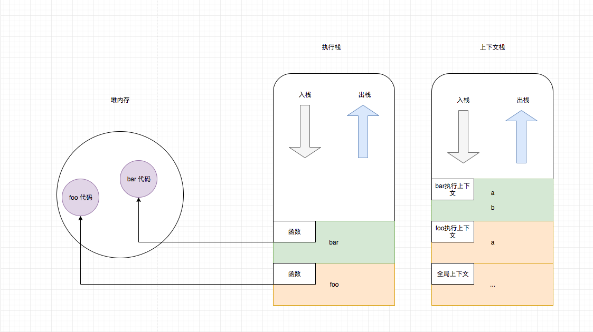
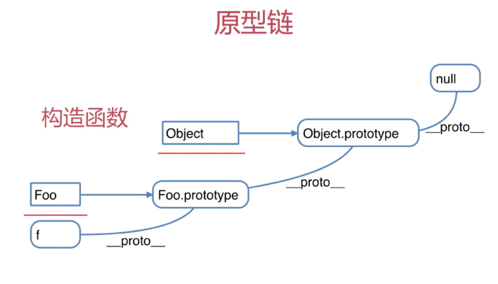
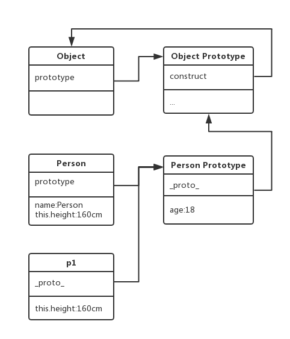
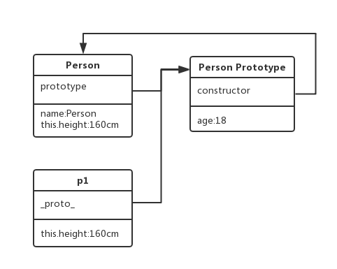
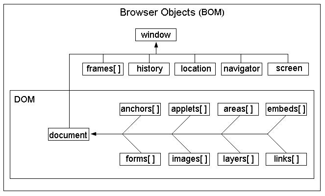
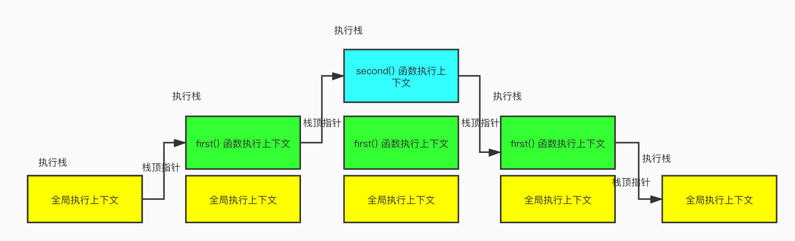
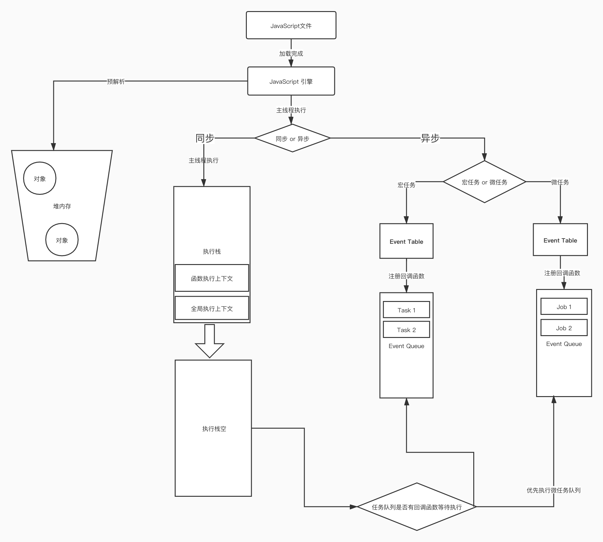

# JavaScript 📕

> Talk is cheap, Show your code. Stay hungry Stay foolish.
>
> Atwood 定律：**任何能够用 JavaScript 实现的应用系统，最终都必将用 JavaScript 实现**。

> ‼️:多注意 ➕:补充扩展的内容

## 命名规范

> 工欲善其事 必先利其器 
>
> “ 要像写诗一样去写代码 ”——雷军

**camel Case**(小驼峰): `numberOfPeople` 变量名, 函数名

> special : `function Person(){}` `Class Person(){}` 构造函数、类名, 单词首字母大写  

**Camel Case**: `NumberOfPeople` 组件名

**kabab case**: `number-of-people` css样式名

**snake case**: `number_of_people `  项目命名 图片命名 文件命名 ❌ *代码中禁用小写加下划线*

> 文件名不得含有空格

**upper snake case**: `NUMBER_OF_PEOPLE` 常量名 、graphql query 与 mutation变量名

**lower case plural**: `scripts` `images` 目录命名小写加复数

*注释 : 具体情况、要求, 请参照公司开发文档.*

# 变量

**定义**: 是用于存放数据的容器。我们通过「变量名」获取数据，甚至可以修改数据。

> **本质**：变量是程序在内存中申请的一块用来存放数据的空间。

### 变量命名的规则

> - 只能由字母(A-Z、a-z)、数字(0-9)、下划线(_)、美元符( $ )组成
>
> - 不能以数字开头。也就是说，必须以字母(A-Z、a-z)、下划线(_)或者美元符( $ )开头。变量名中不允许出现空格。
>
>
> - 不用使用 JS 语言中保留的「关键字」和「保留字」作为变量名。
>
>
> - 建议用驼峰命名规则。比如getElementById
>
> - 变量名会区分大小写(javascript 是区分大小写的语言)。
>
> - 变量名长度不能超过255个字符。
>
> - 汉语可以作为变量名。但是不建议使用，因为 low。

# 数据类型

> - **基本数据类型（值类型）**：String 字符串、Number 数值、Boolean 布尔值、Null 空值、Undefined 未定义。
>
> - **引用数据类型（引用类型）**：Object 对象。
>
> 注意：内置对象 Function、Array、Date、RegExp、Error等都是属于 Object 类型。也就是说，除了那五种基本数据类型之外，其他的，都称之为 Object类型。

注意：字符串的不可变性

==字符串里面的值不可被改变。虽然看上去可以改变内容，但其实是地址变了，内存中新开辟了一个内存空间‼️==

### 数据类型之间最大的区别‼️

- 基本数据类型：参数赋值的时候，传数值。
  
  - 注意「 *null* 和 *undefined* 的区别 」
  
   ```js
    null 专门用来定义一个空对象（例如：let a = null）
    Null 类型的值只有一个，就是 null。比如 let a = null。
    用 typeof 检查一个 null 值时，会返回 object。
    
    Undefined 类型的值只有一个，就是 undefind。比如 let a = undefined。
    使用 typeof 检查一个 undefined 值时，会返回 undefined。
    声明了一个变量，但没有赋值，此时它的值就是 undefined
    变量未声明（未定义）时,此时它的值就是 undefined
    函数无返回值时,此时它的值就是 undefined
    调用函数时，未传参,此时它的值就是 undefined
    
    null 和 undefined 有很大的相似性。看看 null == undefined 的结果为 true也更加能说明这点。
    但是 null === undefined 的结果是 false。它们虽然相似，但还是有区别的，其中一个区别是，和数字运算时：
    10 + null //结果为 10。
    10 + undefined //结果为 NaN。
    
    规律总结：
    任何数据类型和 undefined 运算都是 NaN;
    任何值和 null 运算，null 可看做 0 运算。
   ```
- 引用数据类型：参数赋值的时候，传地址（修改的同一片内存空间）。

# 运算符

JS 中的运算符，分类如下：

- 算数运算符 `+` `-` `*` `/` `%`
- 自增/自减运算符 `++` `--`
- 一元运算符   `++`  `-- ` ` !` `~`
- 逻辑运算符 `&&` `||`
- 赋值运算符 `=`
- 比较运算符 `>` `<` `>=` `<=` `==` `!==` `===` `!===`
  - js在比较时，牵扯到一个数值类型转换的问题，要注意
  - 对于非数值进行比较时，会将其转换为数字然后再比较。
  - 如果符号两侧的值都是字符串时，**不会**将其转换为数字进行比较。比较两个字符串时，比较的是字符串的**Unicode编码**
  - 任何值和NaN做任何比较都是false。
- 三元运算符（条件运算符）`表达式 ? true : false`

### 隐式转换

`-`、`*`、`/`、`%`这几个符号会自动进行隐式转换。

# 流程控制语句

## 代码块

用`{}`包围起来的代码，就是代码块。

在 ES5 语法中，代码块，只具有**分组**的作用，没有其他的用途。代码块中的内容，在外部是完全可见的

## 顺序结构

> JS中程序自上而下安顺序执行

## 选择结构

> 选择结构：if 语句、switch 语句

- if 语句
- switch 语句
  - switch 语句的结束条件
    - 情况 a：遇到 break 就结束，而不是遇到 default 就结束。
    - 情况 b：执行到程序的末尾就结束。
  - case 穿透 :没有break,会按顺序执行下去,直至遇到break或者执行到default完毕

## 循环结构

> for 循环 while 循环 do...while 循环

- for 循环
- while 循环

> 如果有必要的话，我们可以使用 `break` 来终止循环。

- do...while 循环

**while 循环和 do...while 循环的区别**

> while 是先判断后执行，而 do...while 是先执行后判断。
>
> 也就是说，do...while 可以保证循环体至少执行一次，而 while 不能。

## break 和 continue

### break

- break 可以用来退出 switch 语句或退出**整个**循环语句（循环语句包括 for 循环、while 循环。不包括 if。if 里不能用 break 和 continue，否则会报错）。

- break 会立即终止离它**最近**的那个循环语句。

- 可以为循环语句创建一个 label，来标识当前的循环（格式：label:循环语句）。使用 break 语句时，可以在 break 后跟着一个 label，这样 break 将会结束指定的循环，而不是最近的。

  ```js
  outer: for (var i = 0; i < 5; i++) {
      console.log('外层循环 i 的值：' + i);
      for (var j = 0; j < 5; j++) {
          break outer; // 直接跳出outer所在的外层循环（这个outer是我自定义的label）
          console.log('内层循环 j 的值:' + j);
      }
  }
  ```

### continue

- continue 可以用来跳过**当次**循环，继续下一次循环。
- 同样，continue 默认只会离他**最近**的循环起作用。
- 同样，如果需要跳过指定的当次循环，可以使用 label 标签。

------

# 对象

### 面向对象简介

面向对象：可以创建自定义的类型，很好的支持继承和多态。

面向对象的特征：==封装==、==继承==、==多态==。

> 封装:把客观事物封装成抽象的类，并且类可以把自己的数据和方法只让可信的类或者对象操作，对不可信的进行信息隐藏

> 继承:是指这样一种能力：它可以使用现有类的所有功能，并在无需重新编写原来的类的情况下对这些功能进行扩展。

> 多态的实际定义：同一个操作作用于不同的对象上，可以产生不同的解释和不同的执行结果。

### 对象的概念

在 JavaScript 中，对象是一组**无序**的相关属性和方法的集合。

**对象的作用是：封装信息**。比如Student类里可以封装学生的姓名、年龄、成绩等。

对象具有**特征**（属性）和**行为**（方法）。

### 为什么需要对象

保存一个值时，可以使用**变量**，保存多个值（一组值）时，可以使用**数组**。

> 对象里面的属性均是**键值对**：
>
> - 键：相当于属性名。
>
> - 值：相当于属性值，可以是任意类型的值（数字类型、字符串类型、布尔类型，函数类型等）。

**补充1**：对象的属性值可以是任何的数据类型，也可以是个**函数**

> 对象内的函数称之为对象方法, 函数 = 方法 ,两者只有名字上的区别,没有本质上的区别

**补充2**：对象中的属性值，也可以是一个**对象**。

> 其实JS对象严格来说只有属性一种特征,属性的值可以为方法

## 对象的分类

1. 内置对象：

- 由ES标准中定义的对象，在任何的ES的实现中都可以使用

- 比如：Object、Math、Date、String、Array、Number、Boolean、Function等。

2. 宿主对象：

- 由JS的运行环境提供的对象，目前来讲主要指由浏览器提供的对象。

- 比如 BOM DOM。比如`console`、`document`。

3. 自定义对象：

- 由开发人员自己创建的对象

通过 new 关键字创建出来的对象实例，都是属于对象类型，比如Object、Array、Date等。

## 对象和数据类型之间的关系

### 数据类型分类

- 基本数据类型（值类型）：String 字符串、Number 数值、Boolean 布尔值、Null 空值、Undefined 未定义。

- 引用数据类型（引用类型）：Object 对象。

#### 基本数据类型

基本数据类型的值直接保存在**栈内存**中，值与值之间是独立存在，修改一个变量不会影响其他的变量。

#### 引用数据类型

只要不是那五种基本数据类型，就全都是对象。

如果使用基本数据类型的数据，我们所创建的变量都是独立的，不能成为一个整体。

对象属于一种==复合的数据类型==，在对象中可以保存多个不同数据类型的属性。

对象是保存到**堆内存**中的，每创建一个新的对象，就会在堆内存中开辟出一个新的空间。变量保存的是对象的内存地址（对象的引用）。

换而言之，对象的值是保存在**堆内存**中的，而对象的引用（即变量）是保存在**栈内存**中的。

**如果两个变量保存的是同一个对象引用，当一个通过一个变量修改属性时，另一个也会受到影响**。



### 传值和传址的区别

------

## 基本包装类型

> 属性和方法只能添加给对象，不能添加给基本数据类型。

### 基本数据类型不能绑定属性和方法

1. 基本数据类型：

> 注意，基本数据类型`string`是**无法绑定属性和方法**的。

 str.length、str.indexOf("m")等等。因为这两个方法的底层做了数据类型转换（**临时**将 `string` 字符串转换为 `String` 对象，然后再调用内置方法），也就是我们在上一段中讲到的**包装类**。

2. 引用数据类型（Object 对象）：

> 引用数据类型`String`是可以绑定属性和方法的。

内置对象 Number 也有一些自带的方法，比如：

-   Number.MAX_VALUE;

-   Number.MIN_VALUE;

内置对象 Boolean 也有一些自带的方法，但是用的不多。

### JS 为我们提供了三个基本包装类型

-   String()：将基本数据类型字符串，转换为 String 对象。

-   Number()：将基本数据类型的数字，转换为 Number 对象。

-   Boolean()：将基本数据类型的布尔值，转换为 Boolean 对象。

通过上面这这三个包装类，我们可以**将基本数据类型的数据转换为对象**。

**基本包装类型的作用(浏览器处理)**:

> 当我们对一些基本数据类型的值去调用属性和方法时，浏览器会**临时使用包装类将基本数据类型转换为引用数据类型**，这样的话，基本数据类型就有了属性和方法，然后再调用对象的属性和方法；调用完以后，再将其转换为基本数据类型。

在底层，字符串以字符数组的形式保存

------

# 内置对象‼️

> JavaScript 中的对象分为3种：自定义对象 、内置对象、 浏览器对象(DOM、BOM)。

> 前面两种对象：是JS的基础内容，属于 ECMAScript； 第三个浏览器对象：属于JS独有，即 JS 内置的API。

内置对象：就是指这个语言自带的一些对象，供开发者使用，这些对象提供了一些常用或者最基本而必要的功能（属性和方法）。

内置对象最大的优点就是帮助我们快速开发。

## JavaScript的内置对象

| 内置对象  | 对象说明       |
| :-------- | :------------- |
| Arguments | 函数参数集合   |
| Array     | 数组           |
| Boolean   | 布尔对象       |
| Math      | 数学对象       |
| Date      | 日期时间       |
| Error     | 异常对象       |
| Function  | 函数构造器     |
| Number    | 数值对象       |
| Object    | 基础对象       |
| RegExp    | 正则表达式对象 |
| String    | 字符串对象     |

## String 的常见方法

**字符串的所有方法，都不会改变原字符串**（字符串的不可变性），操作完成后会返回一个新的值。

|          方法           | 作用                                                         | 形参                                                         | 返回值与说明                                                 |
| :---------------------: | ------------------------------------------------------------ | ------------------------------------------------------------ | ------------------------------------------------------------ |
| indexOf()/lastIndexOf() | 获取字符串中指定内容的索引                                   | `indexOf(想要查询的字符串, [起始位置]);`第二个参数，用来指定查找的**起始位置** | 找到会返回其**第一次出现**的索引；没有找到指定的内容，则返回 -1。`indexOf()` 是从前向后查找字符串的位置。同理，`lastIndexOf()`是从后向前寻找。 |
|        search()         | 获取字符串中指定内容的索引                                   | 参数里一般是正则                                             | 检索一个字符串中是否含有指定内容。有该内容，则会返回其**第一次出现**的索引；没有找到指定的内容，则返回 -1。备注：`search()` 方法里的参数，既可以传字符串，也可以传正则表达式。 |
|       includes()        | 字符串中是否包含指定的内容                                   | 参数中的 `position`：如果不指定，则默认为0；如果指定，则规定了检索的起始位置。 | 字符串中含有该内容，则会返回 true；否则返回 false。          |
|      startsWith()       | 字符串是否以指定的内容开头                                   | 默认为0。 指定了**检索的起始位置**。                         | 判断一个字符串是否以指定的子字符串开头。如果是，则返回 true；否则返回 false。检索的范围包括：这个指定位置开始，直到字符串的末尾。即：[position, str.length) |
|       endsWith()        | 字符串是否以指定的内容结尾                                   | 默认为 str.length。 如果指定，则规定了**检索的结束位置**。或者你可以这样简单理解：endsWith() 方法里的position，表示**检索的长度**。 | 判断一个字符串是否以指定的子字符串结尾。如果是，则返回 true；否则返回 false。检索的范围包括：从第一个字符串开始，直到这个指定的位置。即：[0, position) |
|      charAt(index)      | 获取指定位置的字符                                           |                                                              | 返回字符串指定位置的字符                                     |
|       str[index]        | 获取指定位置的字符                                           |                                                              | `str.charAt(index)`和`str[index]`的效果是一样的，不再赘述。区别在于：`str[index]`是 H5 标准里新增的特性。 |
|    charCodeAt(index)    |                                                              |                                                              | 返回字符串指定位置的字符的 Unicode 编码。不会修改原字符串。  |
|        slice()‼️         | 从字符串中截取指定的内容。不会修改原字符串，而是将及截取到的内容返回 | 新字符串 = str.slice(开始索引, 结束索引); //两个参数都是索引值。包左不包右。[左,右) |                                                              |
|       substring()       | 解释：从字符串中截取指定的内容。和`slice()`类似。            |                                                              | `substring()`不能接受负值作为参数。如果传递了一个**负值**，则默认使用 0。 `substring()`还会自动调整参数的位置，如果第二个参数小于第一个，则自动交换。比如说， `substring(1, 0)`相当于截取的是第一个字符。 |
|        substr()‼️        | 从字符串中截取指定的内容。不会修改原字符串，而是将及截取到的内容返回。 | str.substr(开始索引, 截取的长度);这个方法的第二个参数**截取的长度**，不是结束索引。 |                                                              |
|  String.fromCharCode()  | `String.fromCharCode()`：根据字符的 Unicode 编码获取字符。   |                                                              |                                                              |
|        concat()‼️        | 字符串的连接。                                               |                                                              | 这种方法基本不用，直接把两个字符串相加就好。                 |
|        split()‼️         | 字符串转换为数组 【重要】                                    | 新的数组 = str.split(分隔符);                                |                                                              |
|       replace()‼️        | 将字符串中的指定内容，替换为新的内容并返回。不会修改原字符串。 | 新的字符串 = str.replace(被替换的字符，新的字符);            |                                                              |
|        repeat()         | 重复字符串                                                   | newStr = str.repeat(重复的次数);                             |                                                              |
|         trim()‼️         | 去除字符串前后的空白。                                       |                                                              |                                                              |

大小写转换:

```js
var str = 'playLIfe AlWaYS';
//转换成小写
console.log(str.toLowerCase());
//转换成大写
console.log(str.toUpperCase());
```

❌html 方法:(基本不用)

`anchor()` 创建 a 链接 `big()` `sub()` `sup()` `link()` str.link() 返回值是字符串`bold()`

## Number 的常见方法

#### Number.isInteger() 判断是否为整数

```js
Number.isInteger();//返回布尔值
```


#### toFixed() 小数点后面保留多少位

```js
myNum.toFixed(num);//返回字符串 参数 num：指定了小数点后面的位数。
//解释：将数字 myNum 的小数点后面保留 num 位小数（四舍五入），并返回。不会改变原数字。注意，返回结果是字符串。
```

## Math 的常见方法

Math属于一个工具类，里面封装了数学运算相关的属性和方法。如下：

| 方法              | 描述                                       | 备注              |
| :---------------- | :----------------------------------------- | :---------------- |
| Math.PI           | 圆周率                                     | Math对象的属性    |
| Math.abs()        | **返回绝对值**                             |                   |
| ==Math.random()== | 生成0-1之间的**随机浮点数**                | 取值范围是 [0，1) |
| Math.floor()      | **向下取整**（往小取值）                   | 4.99999 取4       |
| Math.ceil()       | **向上取整**（往大取值）                   | 4.11111 取5       |
| Math.round()      | 四舍五入取整（正数四舍五入，负数五舍六入） |                   |
| Math.max(x, y, z) | 返回多个数中的最大值                       |                   |
| Math.min(x, y, z) | 返回多个数中的最小值                       |                   |
| Math.pow(x,y)     | 乘方：返回 x 的 y 次幂                     |                   |
| Math.sqrt()       | 开方：对一个数进行开方运算                 |                   |

#### 生成指定区间的随机数

```js
Math.round(Math.random()*x)//生成 [0, x) 之间的随机数
Math.round(Math.random()*(y-x)+x)//生成 [x, y) 之间的随机数
/*
* 生成n~m整数之间的随机整数，并且要包含这两个整数
* Math.random()*(m-n+1)+n
* Math.random()生产0~1的随机数,1取不到(0,1]
*/
Math.floor(Math.random() * (max - min + 1)) + min//生成 [x, y]之间的随机整数
```

##  Date 的使用方法‼️

> Date 对象在实际开发中，使用得很频繁，且容易在细节地方出错，需要引起重视。

内置对象 Date 用来处理日期和时间。

**需要注意的是**：与 Math 对象不同，Date 对象是一个**构造函数** ，需要**先实例化**后才能使用。

### 创建Date对象

创建Date对象有两种写法：

- 写法一：如果Date()不写参数，就返回当前时间对象

- 写法二：如果Date()里面写参数，就返回括号里输入的时间对象

针对这两种写法，我们来具体讲一讲。

#### 写法一：不传递参数时，则获取系统的当前时间对象

#### 写法二：传递参数，获取参数指定时间的时间对象

> 传递参数时，表示获取指定时间的时间对象。参数中既可以传递字符串，也可以传递数字，也可以传递时间戳。
>
> 通过传参的这种写法，我们可以把时间字符串/时间数字/时间戳，按照指定的格式，转换为时间对象。
>

### 日期的格式化

Date对象 有如下方法，可以获取日期和时间的**指定部分**：

| 方法名            | 含义              | 备注                 |
| ----------------- | ----------------- | -------------------- |
| getFullYear()     | 获取年份          |                      |
| getMonth()        | **获取月： 0-11** | 0代表一月            |
| getDate()         | **获取日：1-31**  | 获取的是几号         |
| getDay()          | **获取星期：0-6** | 0代表周日，1代表周一 |
| getHours()        | 获取小时：0-23    |                      |
| getMinutes()      | 获取分钟：0-59    |                      |
| getSeconds()      | 获取秒：0-59      |                      |
| getMilliseconds() | 获取毫秒          | 1s = 1000ms          |

**代码举例**：

```js
	// 我在执行这行代码时，当前时间为 2019年2月4日，周一，13:23:52
	var myDate = new Date();
	console.log(myDate); // 打印结果：Mon Feb 04 2019 13:23:52 GMT+0800 (中国标准时间)
	console.log(myDate.getFullYear()); // 打印结果：2019
	console.log(myDate.getMonth() + 1); // 打印结果：2
	console.log(myDate.getDate()); // 打印结果：4
	var dayArr  = ['星期日', '星期一', '星期二', '星期三', '星期四','星期五', '星期六'];
	console.log(myDate.getDay()); // 打印结果：1
	console.log(dayArr[myDate.getDay()]); // 打印结果：星期一
	console.log(myDate.getHours()); // 打印结果：13
	console.log(myDate.getMinutes()); // 打印结果：23
	console.log(myDate.getSeconds()); // 打印结果：52
	console.log(myDate.getMilliseconds()); // 打印结果：393
	console.log(myDate.getTime()); // 获取时间戳。打印结果：1549257832393
```

获取了日期和时间的指定部分之后，我们把它们用字符串拼接起来，就可以按照自己想要的格式，来展示日期。

#### 举例：年月日的格式化

代码举例：

```js
/*
    方法：日期格式化。
    格式要求：今年是：xxxx年xx月xx日 xx:xx:xx 星期x
*/
function formatDate() {
    let date = new Date();
    let year = date.getFullYear(); // 年
    let month = date.getMonth() + 1; // 月 月份下标从0开始
    let day = date.getDate(); // 日
    let week = date.getDay(); // 星期几
    let weekArr = ['星期日', '星期一', '星期二', '星期三', '星期四', '星期五', '星期六'];
    let hour = date.getHours(); // 时
    hour = hour < 10 ? '0' + hour : hour; // 如果只有一位，则前面补零
    let minute = date.getMinutes(); // 分
    minute = minute < 10 ? '0' + minute : minute; // 如果只有一位，则前面补零
    let second = date.getSeconds(); // 秒
    second = second < 10 ? '0' + second : second; // 如果只有一位，则前面补零
    let result=`今天是：${year}年 ${month}月 ${day}日 ${hour}:${minute}:${second} ${weekArr[week]}`
    return result;
}
```

### 时间戳的定义和作用‼️

**时间戳**：指的是从格林威治标准时间的`1970年1月1日，0时0分0秒`到当前日期所花费的**毫秒数**（1秒 = 1000毫秒）。

> 计算机底层在保存时间时，使用的都是时间戳。时间戳的存在，就是为了**统一**时间的单位。
>
> 我们经常会利用时间戳来计算时间，因为它更精确。而且，在实战开发中，接口返回给前端的日期数据，都是以时间戳的形式。
>

代码：

```javascript
	var myDate = new Date("1970/01/01 0:0:0");
	console.log(myDate.getTime()); // 获取时间戳
//打印结果:
	-28800000
//在中文环境下运行的，与英文时间会存在**8个小时的时差**（中文时间比英文时间早了八个小时）。如果代码是在英文环境下运行，打印结果就是0。
```


#### getTime()：获取时间戳

`getTime()`  获取日期对象的**时间戳**（单位：毫秒）。这个方法在实战开发中，用得比较多。但还有比它更常用的写法，我们往下看。

#### 获取 Date 对象的时间戳

> 使用+直接使Date对象转换为字符串,或者 使用getTime()方法获取时间戳

代码演示：

```js
// 方式一：获取 Date 对象的时间戳（最常用的写法）
const timestamp1 = +new Date();
console.log(timestamp1); // 打印结果举例：1589448165370
// 方式二：获取 Date 对象的时间戳（较常用的写法）
const timestamp2 = new Date().getTime();
console.log(timestamp2); // 打印结果举例：1589448165370
// 方式三：获取 Date 对象的时间戳
const timestamp3 = new Date().valueOf();
console.log(timestamp3); // 打印结果举例：1589448165370
// 方式4：获取 Date 对象的时间戳
const timestamp4 = new Date() * 1;
console.log(timestamp4); // 打印结果举例：1589448165370
// 方式5：获取 Date 对象的时间戳
const timestamp5 = Number(new Date());
console.log(timestamp5); // 打印结果举例：1589448165370。
//上方代码获取到的时间戳指的是：从 1970年1月1日，0时0分0秒 到现在所花费的总毫秒数。
```

#### 获取当前时间的时间戳 Date.now()

如果我们要获取**当前时间**的时间戳，除了上面的五种方式之外，还有另一种方式。代码如下：

```js
// 方式六：获取当前时间的时间戳（很常用的写法）
console.log(Date.now()); // 打印结果举例：1589448165370
```

*注意* :上面这种方式六，用得也很多。只不过，`Date.now()`是H5标准中新增的特性，如果你的项目需要兼容低版本的IE浏览器，就不要用了。

#### 利用时间戳检测代码的执行时间

> 不同性能的电脑,执行相同代码的效率不同,所得出来代码执行时间不同

我们可以在业务代码的前面定义 `时间戳1`，在业务代码的后面定义 `时间戳2`。把这两个时间戳相减，就能得出业务代码的执行时间。

## Array 的使用方法‼️

数组（Array）是属于**内置对象**

数组和普通对象的功能类似，也是用来存储一些值的。不同的是：

-   普通对象是使用字符串作为属性名的，而数组是使用数字作为**索引**来操作元素。索引：从 0 开始的整数就是索引。

数组的存储性能比普通对象要好。在实际开发中我们经常使用数组来存储一些数据（尤其是**列表数据**），使用频率非常高。

数组中的元素可以是任意的数据类型，也可以是对象，也可以是函数，也可以是数组。数组的元素中，如果存放的是数组，我们就称这种数组为二维数组。

## 创建 Array 对象 (2)

### (1) 使用字面量创建数组

```javascript
//方式一最简单，也用得最多
var arr1 = []; // 创建一个空的数组
var arr2 = [1, 2, 3]; // 创建带初始值的数组
```

### (2) 使用构造函数创建数组

```js
let arr = new Array();//参数为空，则表示创建一个空数组
let arr = new Array(参数);//参数是一个数值时，表示数组的长度
let arr = Array(参数1,参数2);//有多个参数时，表示数组中的元素
```

### 数组中的元素的类型

> 数组中可以存放**任意类型**的数据，例如字符串、数字、布尔值、对象等。
>

```javascript
//数组中可以存放任意类型的数据，例如字符串、数字、布尔值、对象等。
const arr = ['playlife', 23, true, false, { name: 'Johnny' }];
```

甚至还可以存放**多维数组**（数组里面放数组）:

```js
const arr2 = [
    [11, 12, 13],
    [21, 22, 23],
];
```

## Array 的基本操作

### 数组的索引

**索引** (下标) ：用来访问数组元素的序号，代表的是数组中的元素在数组中的位置（下标从 0 开始算起）。

数组可以通过索引来访问、设置、修改对应的数组元素。我们继续看看。

### 向数组中添加元素

```javascript
数组[索引] = 值;
```

### 获取数组中的元素

```js
数组[索引];
```

### 获取数组的长度

```javascript
数组的长度 = 数组名.length；
```

*补充*：对于连续的数组，使用 length 可以获取到数组的长度（元素的个数）；对于非连续的数组，使用 length 会获取到数组的最大的索引+1。因此，尽量不要创建非连续的数组。

### 修改数组的长度（修改 length）

-   如果修改的 length 大于原长度，则多出部分会空出来，置为 null。

-   如果修改的 length 小于原长度，则多出的元素会被删除，数组将从后面删除元素。

-   *特例*：伪数组 arguments 的长度可以修改，但是不能修改里面的元素，后面单独讲。

### 遍历数组(for循环,常用)

```js
for (let index = 0; index < array.length; index++) {}//for循环
```

## Array 的方法清单

### 数组的类型相关

| 方法                             | 描述                               |
| :------------------------------- | :--------------------------------- |
| Array.isArray()                  | 判断是否为数组                     |
| toString()                       | 将数组转换为字符串                 |
| Array.from(arrayLike)            | 将**伪数组**转化为**真数组**       |
| Array.of(value1, value2, value3) | 创建数组：将**一系列值**转换成数组 |

注意，获取数组的长度是用`length`属性，不是方法。关于 `length`属性，详见上一篇文章。

### 数组元素的添加和删除

| 方法      | 描述                                                         | 备注           | 语法                                      |
| :-------- | :----------------------------------------------------------- | :------------- | ----------------------------------------- |
| push()‼️   | 向数组的**最后面**插入一个或多个元素，返回结果为**新数组的长度** | 会改变原数组   |                                           |
| pop()‼️    | 删除数组中的**最后一个**元素，返回结果为**被删除的元素**     | 会改变原数组   |                                           |
| unshift() | 在数组**最前面**插入一个或多个元素，返回结果为**新数组的长度** | 会改变原数组   |                                           |
| shift()   | 删除数组中的**第一个**元素，返回结果为**被删除的元素**       | 会改变原数     |                                           |
|           |                                                              |                |                                           |
| slice()   | 从数组中**提取**指定的一个或多个元素，返回结果为**新的数组** | 不会改变原数组 |                                           |
| splice()‼️ | 从数组中**删除**指定的一个或多个元素，返回结果为**被删除元素组成的新数组** | 会改变原数组   | `splice(start, deleteCount, item1,item2)` |
|           |                                                              |                |                                           |
| fill()    | 填充数组：用固定的值填充数组，返回结果为**新的数组**         | 不会改变原数组 |                                           |

### 数组的合并和拆分

| 方法     | 描述                                                 | 备注             |                                |
| :------- | :--------------------------------------------------- | :--------------- | ------------------------------ |
| concat() | 合并数组：连接两个或多个数组，返回结果为**新的数组** | 不会改变原数组   |                                |
| join()   | 将数组转换为字符串，返回结果为**转换后的字符串**     | 不会改变原数组   | 不添加参数,字符串拼接由’,’隔开 |
| split()  | 将字符串按照指定的分隔符，组装为数组                 | 不会改变原字符串 |                                |

**注意**，`split()`是字符串的方法，不是数组的方法。`数组.toString().split` 转换数组为字符串在使用方法

### 数组排序

| 方法      | 描述                                                    | 备注         |
| :-------- | :------------------------------------------------------ | :----------- |
| reverse() | 反转数组，返回结果为**反转后的数组**                    | 会改变原数组 |
| sort()    | 对数组的元素,默认按照**Unicode 编码**，从小到大进行排序 | 会改变原数组 |

### 查找数组的元素

| 方法                  | 描述                                                         | 备注                                                     |
| :-------------------- | :----------------------------------------------------------- | :------------------------------------------------------- |
| indexOf(value)‼️       | 从前往后索引，检索一个数组中是否含有指定的元素               | 返回元素第一次出现时的下标(number类型),找不到返回-1      |
| lastIndexOf(value)    | 从后往前索引，检索一个数组中是否含有指定的元素               | 返回元素第一次出现时的下标(number类型),找不到返回-1      |
| find(function())      | 找出**第一个**满足「指定条件返回 true」的元素                |                                                          |
| findIndex(function()) | 找出**第一个**满足「指定条件返回 true」的元素的 index        |                                                          |
| every()               | 确保数组中的每个元素都满足「指定条件返回 true」，则停止遍历，此方法才返回 true | 全真才为真。要求每一项都返回 true，最终的结果才返回 true |
| some()                | 数组中只要有一个元素满足「指定条件返回 true」，则停止遍历，此方法就返回 true | 一真即真。只要有一项返回 true，最终的结果就返回 true     |

### 遍历数组

| 方法      | 描述                                                         | 备注                                                   |
| :-------- | :----------------------------------------------------------- | :----------------------------------------------------- |
| for 循环  |                                                              |                                                        |
| forEach() | 和 for 循环类似，但需要 *兼容* IE8 以上                      | forEach() 没有返回值。也就是说，它的返回值是 undefined |
| map()‼️    | 对原数组中的每一项进行加工，将组成新的数组                   | **不会改变原数组**                                     |
| filter()  | 过滤数组：返回结果是 true 的项，将组成新的数组，返回结果为**新的数组** | 不会改变原数组                                         |
| reduce    | 接收一个函数作为累加器，返回值是回调函数累计处理的结果       |                                                        |

### isArray()：判断是否为数组 ‼️

语法：

```js
Array.isArray(arry);//返回布尔类型值
```

以前，我们会通过 `A instanceof B`来判断 A 是否属于 B 类型。但是在数组里，这种 instanceof 方法已经用的不多了，因为有 isArray()方法。

### toString()：数组转换为字符串

```javascript
字符串 = 数组.toString();
```

解释：把数组转换成字符串，每一项用`,`分割。

备注：大多数的数据类型都可以使用`.toString()`方法，将其转换为字符串。

### 补充：将数组转换为字符串的方式

```js
//方式 1：
字符串 = 数组.toString();
//方式 2：
字符串 = String(数组);
//方式 3：
字符串 = 数组.join(','); // 将数组转为字符串，每一项用 英文逗号 分隔
```

### Array.from()：将伪数组转换为真数组 ‼️

```javascript
//语法：array = Array.from(arrayLike);
const name = 'qianguyihao';
console.log(Array.from(name)); // 打印结果是数组：["q","i","a","n","g","u","y","i","h","a","o"]
```

**作用**：将**伪数组**或可遍历对象转换为**真数组**。

### 伪数组与真数组的区别 ‼️

**伪数组**：包含 `length` 属性的对象或可迭代的对象。

另外，伪数组的原型链中没有 `Array.prototype`，而真数组的原型链中有 `Array.prototype`。因此伪数组没有数组的一般方法，比如 `pop()`、`join()` 等方法。

### sort()方法：带参时，自定义排序规则 ❗️

如果在 `sort()`方法中带参，我们就可以**自定义**排序规则。具体做法如下：

> 我们可以在 sort()添加一个回调函数，来指定排序规则。回调函数中需要定义两个形参，浏览器将会分别使用数组中的元素作为实参去调用回调函数。
>

浏览器根据回调函数的返回值来决定元素的排序：（重要）

-   如果返回一个大于 0 的值，则元素会交换位置

-   如果返回一个小于 0 的值，则元素位置不变

-   如果返回一个等于 0 的值，则认为两个元素相等，则不交换位置

如果只是看上面的文字，可能不太好理解，我们来看看下面的例子，你肯定就能明白。

### 举例：将数组中的数字按照从小到大排序

ES6箭头函数（推荐）工作中使用最多的

```js
let arr = [5, 2, 11, 3, 4, 1];
// 自定义排序规则：升序排列
let result = arr.sort((a, b) => a - b);
console.log('arr =' + JSON.stringify(arr));
console.log('result =' + JSON.stringify(result));
```

### forEach() 遍历 ‼️

> `forEach()` 这种遍历方法只支持 IE8 以上的浏览器。IE8 及以下的浏览器均不支持该方法。所以如果需要兼容 IE8，则不要使用 forEach，改为使用 for 循环来遍历即可。

`forEach()`方法需要一个函数作为参数。这种函数，是由我们创建但是不由我们调用的，我们称为回调函数。

数组中有几个元素，该回调函数就会执行几次。

回调函数中传递三个参数：

-   第一个参数 `item`，就是当前正在遍历的元素
-   第二个参数 `index`，就是当前正在遍历的元素的索引
-   第三个参数 `arr`，就是正在遍历的数组 

```javascript
let myArr = ['play', 'life', 'Johnny','Wang'];
myArr.forEach((item, index, arr) => {
    console.log('item:' + item);
    console.log('index:' + index);
    console.log('arr:' + JSON.stringify(arr));//JSON.stringify(arr)->["play","life","Johnny","Wang"]
    console.log('----------');
});
```

*注意*，`forEach()` 没有返回值。也可以理解成：`forEach()` 的返回值是 `undefined`。如果你尝试 `tempArry = myArr.forEach()`这种方式来接收，是达不到效果的。

#### forEach() 能不能改变原数组 ⁉️

`forEach()` 能不能改变原数组？关于这个问题，大部分人会搞错。我们来看看下面的代码。

**1、数组的元素是基本数据类型**：（无法改变原数组）

```js
let numArr = [1, 2, 3];
numArr.forEach((item) => {
    item = item * 2;
});
console.log(JSON.stringify(numArr)); // 打印结果：[1, 2, 3]
```

上面这段代码，你可要看仔细了，打印结果是 `[1, 2, 3]`，不是 `[2, 4, 6]`。

**2、数组的元素是引用数据类型**：（直接修改整个元素对象时，无法改变原数组）

```js
let objArr = [
    { name: 'playlife', age: 18 },
    { name: 'Johnny', age: 20 },
];
objArr.forEach((item) => {
    item = {
        name: 'vicat',
        age: '19',
    };//开辟了一个新对象存入了新的内存空间
});
console.log(JSON.stringify(objArr)); // 打印结果：[{"name":"playlife","age":18},{"name":"Johnny","age":20}]
```

**3、数组的元素是引用数据类型**：（修改元素对象里的某个属性时，可以改变原数组）

```js
let objArr = [
    { name: 'playlife', age: 18 },
    { name: 'Johnny', age: 20 },
];
objArr.forEach((item) => {
    item.name = 'vicat';
});
console.log(JSON.stringify(objArr)); // 打印结果：[{"name":"vicat","age":18},{"name":"vicat","age":20}]
```

如果你需要通过 forEach 修改原数组，建议用 forEach 里面的参数 2 和参数 3 来做，具体请看下面的标准做法。

**4、forEach() 通过参数 2、参数 3 修改原数组**：（标准做法）

```js
// 1、数组的元素是基本数据类型
let numArr = [1, 2, 3];
numArr.forEach((item, index, arr) => {
    arr[index] = arr[index] * 2;
});
console.log(JSON.stringify(numArr)); // 打印结果：[2,4,6]
// 2、数组的元素是引用数据类型时，直接修改对象
let objArr = [
    { name: 'playlife', age: 18 },
    { name: 'Johnny', age: 20 },
];

objArr.forEach((item, index, arr) => {
    arr[index] = {
        name: 'vicat',
        age: '10',
    };
});
console.log(JSON.stringify(objArr)); // 打印结果：[{"name":"vicat","age":"10"},{"name":"vicat","age":"10"}]
// 3、数组的元素是引用数据类型时，修改对象的某个属性
let objArr2 = [
    { name: 'playlife', age: 18 },
    { name: 'Johnny', age: 20 },
];
objArr2.forEach((item, index, arr) => {
    arr[index].name = 'vicat';
});
console.log(JSON.stringify(objArr2)); // 打印结果：[{"name":"vicat","age":28},{"name":"vicat","age":34}]
//实质还是浅拷贝,拷贝最外层的数据,共享地址
```

**总结**：

如果纯粹只是遍历数组，那么，可以用 forEach() 方法。但是，如果你想在遍历数组的同时，去改变数组里的元素内容，那么，最好是用 map() 方法来做，不要用 forEach()方法，避免出现一些低级错误。

### map()方法 (不会改变原数组)‼️

语法：

```js
arr.map(function (item, index, arr) {
    return newItem;
});
arr.map((item,index,arr)=>newItem);
```

解释：对数组中每一项运行回调函数，返回该函数的结果，组成的新数组（返回的是**加工之后**的新数组）。不会改变原数组。

作用：对数组中的每一项进行加工。

**举例 1**：（拷贝的过程中改变数组元素的值）

有一个已知的数组 arr1，我要求让 arr1 中的每个元素的值都加 10，这里就可以用到 map 方法。代码举例：

```javascript
var arr1 = [1, 3, 6, 2, 5, 6];

var arr2 = arr1.map(function (item, index) {
    return item + 10; //让arr1中的每个元素加10
});
console.log(arr2);
```

##### 【重要案例，实际开发中经常用到】‼️

将 A 数组中某个属性的值，存储到 B 数组中。代码举例：

```javascript
const arr1 = [
    { name: 'playlife', age: '23' },
    { name: 'Johnny', age: '24' },
];

// 将数组 arr1 中的 name 属性，存储到 数组 arr2 中
const arr2 = arr1.map((item) => item.name);

// 将数组 arr1 中的 name、age这两个属性，改一下“键”的名字，存储到 arr3中
const arr3 = arr1.map((item) => ({
    myName: item.name,
    myAge: item.age,
})); // 将数组 arr1 中的 name 属性，存储到 数组 arr2 中

console.log('arr1:' + JSON.stringify(arr1));
console.log('arr2:' + JSON.stringify(arr2));
console.log('arr3:' + JSON.stringify(arr3));
```

map 的应用场景，主要就是以上两种。

### filter()

```js
arr.filter(function (item, index, arr) {
    return true;
});
```

解释：对数组中的**每一项**运行回调函数，该函数返回结果是 true 的项，将组成新的数组（返回值就是这个新的数组）。不会改变原数组。

作用：对数组进行过滤。

### ⭐️reduce()‼️

> reduce 的发音：[rɪ'djuːs]。中文含义是减少，但这个方法跟“减少”没有任何关系。

reduce() 方法接收一个函数作为累加器，数组中的每个值（从左到右）开始缩减，最终计算为一个值。返回值是回调函数累计处理的结果。

```javascript
arr.reduce(function (previousValue, currentValue, currentIndex, arr) {}, initialValue);
```

参数解释：

-   previousValue：必填，上一次调用回调函数时的返回值

-   currentValue：必填，当前正在处理的数组元素

-   currentIndex：选填，当前正在处理的数组元素下标

-   arr：选填，调用 reduce()方法的数组

-   initialValue：选填，可选的初始值（作为第一次调用回调函数时传给 previousValue 的值）

在以往的数组方法中，匿名的回调函数里是传三个参数：item、index、arr。但是在 reduce() 方法中，前面多传了一个参数`previousValue`，这个参数的意思是上一次调用回调函数时的返回值。第一次执行回调函数时，previousValue 没有值怎么办？可以用 initialValue 参数传给它。

备注：绝大多数人在一开始接触 reduce() 的时候会很懵逼，但是没关系，有事没事多看几遍，自然就掌握了。如果能熟练使用 reduce() 的用法，将能替代很多其他的数组方法，并逐渐走上进阶之路，领先于他人。

为了方便理解 reduce()，我们先来看看下面的简单代码，过渡一下：

```js
let arr1 = [1, 2, 3, 4, 5, 6];

arr1.reduce((prev, item) => {
    console.log(prev);
    console.log(item);
    console.log('------');
    return 88;
}, 0);
```

打印结果：

```
0
1
------
88
2
------
88
3
------
88
4
------
88
5
------
88
6
------
```

上面的代码中，由于`return`的是固定值，所以 prev 打印的也是固定值（只有初始值是 0，剩下的遍历中，都是打印 88）。

现在来升级一下，实际开发中，prev 的值往往是动态变化的，这便是 reduce()的精妙之处。我们来看几个例子就明白了。

#### reduce() 的常见应用

**数组求和：**

```javascript
const arr = [2, 0, 1, 9, 6];
// 数组求和
const total = arr.reduce((prev, item) => {
    return prev + item;
});
console.log('total:' + total); // 打印结果：18
```

**统计某个元素出现的次数：**

```js
// 定义方法：统一 value 这个元素在数组 arr 中出现的次数
function repeatCount(arr, value) {
    if (!arr || arr.length == 0) return 0;

    return arr.reduce((totalCount, item) => {
        totalCount += item == value ? 1 : 0;
        return totalCount;
    }, 0);
}

let arr1 = [1, 2, 6, 5, 6, 1, 6];

console.log(repeatCount(arr1, 6)); // 打印结果：3
```

**求元素的最大值：**

```js
const arr = [2, 0, 1, 9, 6];
// 数组求最大值
const maxValue = arr.reduce((prev, item) => {
    return prev > item ? prev : item;
});

console.log(maxValue); // 打印结果：9
```

## Array 练习

### splice()练习：数组去重

```javascript
//创建一个数组
var arr = [1, 2, 3, 2, 2, 1, 3, 4, 2, 5];
//去除数组中重复的数字
//获取数组中的每一个元素
for (var i = 0; i < arr.length; i++) {
    //console.log(arr[i]);
    /*获取当前元素后的所有元素*/
    for (var j = i + 1; j < arr.length; j++) {
        //console.log("---->"+arr[j]);
        //判断两个元素的值是否相等
        if (arr[i] == arr[j]) {
            //如果相等则证明出现了重复的元素，则删除j对应的元素
            arr.splice(j, 1);
            //当删除了当前j所在的元素以后，后边的元素会自动补位
            //此时将不会在比较这个元素，我需要再比较一次j所在位置的元素
            //使j自减
            j--;
        }
    }
}

console.log(arr);
```

### 清空数组

清空数组，有以下几种方式：

```javascript
var array = [1, 2, 3, 4, 5, 6];

array.splice(0); //方式1：删除数组中所有项目
array.length = 0; //方式2：length属性可以赋值，在其它语言中length是只读
array = []; //方式3：推荐
```

### join() 练习

> 将一个字符串数组输出为`|`分割的形式，比如“playlife|life|Johnny”。使用两种方式实现。
>

方式 1：（不推荐）

```javascript
var arr = ['play', 'life', 'Johnny'];
var str = arr[0];
var separator = '|';
for (var i = 1; i < arr.length; i++) {
    str += separator + arr[i]; //从第1个数组元素开始，每个元素前面加上符号"|"
}
console.log(str);
```

方式 2：（推荐。通过 array 数组自带的 api 来实现）

```javascript
var arr = ['play', 'life', 'Johnny'];
console.log(arr.join('|'));
```

### reverse() 练习

> 将一个字符串数组的元素的顺序进行反转，使用两种种方式实现。提示：第 i 个和第 length-i-1 个进行交换。
>

方式 1：

```javascript
function reverse(array) {
    var newArr = [];
    for (var i = array.length - 1; i >= 0; i--) {
        newArr[newArr.length] = array[i];
    }
    return newArr;
}
```

方式 2：（算法里比较常见的方式）

```javascript
function reverse(array) {
    for (var i = 0; i < array.length / 2; i++) {
        var temp = array[i];
        array[i] = array[array.length - 1 - i];
        array[array.length - 1 - i] = temp;
    }
    return array;
}
```

方式 3：（数组自带的 reverse 方法）

```js
arr.reverse();
```

### 数组去重

> 编写一个方法去掉一个数组中的重复元素。
>
> 思路:创建一个新数组，循环遍历，只要新数组中有老数组的值，就不用再添加了。

```javascript
//编写一个方法 去掉一个数组的重复元素
var arr = [1, 2, 3, 4, 5, 2, 3, 4];
console.log(arr);
var logArr = fn(arr);
console.log(logArr);
//思路：创建一个新数组，循环遍历，只要新数组中有老数组的值，就不用再添加了。
function fn(array) {
    var newArr = [];
    for (var i = 0; i < array.length; i++) {
        //开闭原则
        var bool = true;
        //每次都要判断新数组中是否有旧数组中的值。
        for (var j = 0; j < newArr.length; j++) {
            if (array[i] === newArr[j]) {
                bool = false;
            }
        }
        if (bool) {
            newArr[newArr.length] = array[i];
        }
    }
    return newArr;
}
```

# 函数

关于函数的核心内容：

- 函数有哪几种定义和调用方式

- this：函数内部的 this 指向、如何改变 this 的指向。

- 函数的严格模式

- 高阶函数：函数作为参数传递、函数作为返回值传递

- 闭包：闭包的作用

- 递归：递归的两个条件

- 深拷贝和浅拷贝的区别

### 函数的介绍

函数：就是将一些功能或语句进行**封装**，在需要的时候，通过**调用**的形式，执行这些语句。

- **函数也是一个对象**

- 使用`typeof`检查一个函数对象时，会返回function

**函数的作用**：

- 将大量重复的语句抽取出来，写在函数里，以后需要这些语句的时候，可以直接调用函数，避免重复劳动。

- 简化编程，让编程模块化。高内聚、低耦合。

# 函数的声明 (3)

## (1) 利用函数关键字自定义函数 ‼️

```js
function fn(){} //方法默认返回 undefined
```

## (2) 函数表达式 ‼️

所谓的“函数表达式”，其实就是将匿名函数赋值给一个变量。

```js
var fn = fuction(){};
```

## (3) 使用构造函数

使用构造函数`new Function()`来创建一个对象。这种方式，用的少。

语法：

```javascript
var 变量名/函数名  = new Function('形参1', '形参2', '函数体');
```

注意，Function 里面的参数都必须是**字符串**格式。也就是说，形参也必须放在**字符串**里；函数体也是放在**字符串**里包裹起来，放在 Function 的最后一个参数的位置。

**分析**：

方式3的写法很少用，原因如下：

- 不方便书写：写法过于啰嗦和麻烦。

- 执行效率较低：首先需要把字符串转换为 js 代码，然后再执行。

## 总结

1、**所有的函数，都是 `Fuction` 的“实例”**（或者说是“实例对象”）。函数本质上都是通过 new Function 得到的。

2、函数既然是实例对象，那么，**函数也属于“对象”**。还可以通过如下特征，来佐证函数属于对象：

（1）我们直接打印某一个函数，比如 `console.log(fun2)`，发现它的里面有`__proto__`。（这个是属于原型的知识，后续再讲）

（2）我们还可以打印 `console.log(fun2 instanceof Object)`，发现打印结果为 `true`。这说明 fun2 函数就是属于 Object。

# 函数的调用 (6)

## (1) 普通函数的调用

函数调用的语法：

```js
函数名();
函数名.call();
```

## (2) 通过对象的方法来调用

```javascript
var obj = {
	a: 'qianguyihao',
	fn2: function() {
		console.log('函数调用');
	},
};

obj.fn2(); // 调用函数
```

如果一个函数是作为一个对象的属性保存，那么，我们称这个函数是这个对象的**方法**。

## (3) 立即执行函数

代码举例：

```javascript
(function() {
	console.log('我是立即执行函数');
})();
```

立即执行函数在定义后，会自动调用。

PS：关于立即执行函数，本文的后续内容里有讲到，可以往下面翻。


上面讲到的这三种方式，是用得最多的。接下来讲到的三种方式，暂时看不懂也没关系，可以等学完其他的知识点，再回过头来看。

## (4) 通过构造函数来调用

> 这种方式用得不多。
>

```javascript
function Fun3() {
	console.log('千古壹号，永不止步~');
}

new Fun3();
```

## (5) 绑定事件函数

> 涉及到DOM操作和事件的知识点
>


```html
<!DOCTYPE html>
<html lang="en">
    <head>
        <meta charset="UTF-8" />
        <meta name="viewport" content="width=device-width, initial-scale=1.0" />
        <title>Document</title>
    </head>
    <body>
        <div id="btn">我是按钮，请点击我</div>

        <script>
            var btn = document.getElementById('btn');
            //2.绑定事件
            btn.onclick = function() {
                console.log('点击按钮后，要做的事情');
            };
        </script>
    </body>
</html>
```

## (6) 定时器函数

> 每间隔一秒，将 数字 加1
>

```js
let num = 1;
setInterval(function () {
    num++;
    console.log(num);
}, 1000);
```

## 函数的参数

形参：

- 概念：形式上的参数。定义函数时传递的参数，当时并不知道是什么值。

- 定义函数时，可以在函数的`()`中来指定一个或多个形参。

- 多个形参之间使用`,`隔开，声明形参就相当于在函数内部声明了对应的变量，但是并不赋值。

实参：

- 概念：实际上的参数。调用函数时传递的参数，实参将会传递给函数中对应的形参。

- 在调用函数时，可以在函数的 `()`中指定实参。

注意：实际参数和形式参数的个数，一般要相同。

### 实参的类型

函数的实参可以是任意的数据类型。

调用函数时，解析器不会检查实参的类型，所以要注意，是否有可能会接收到非法的参数，如果有可能则需要对参数进行类型的检查。

### 实参的数量（实参和形参的个数不匹配时）

调用函数时，解析器也不会检查实参的数量。

- 如果实参的数量多余形参的数量，多余实参不会被赋值。

- 如果实参的数量少于形参的数量，多余的形参会被定义为 undefined。表达式的运行结果为 NaN。

## 函数的返回值

return 的作用是结束方法（终止函数）。

注意：

- return 的值将会作为函数的执行结果返回，可以定义一个变量，来接收该结果。
- 在函数中，return后的语句都不会执行（函数在执行完 return 语句之后停止并立即退出函数）
- 如果return语句后不跟任何值，就相当于返回一个undefined
- 如果函数中不写return，则也会返回undefined
- 返回值可以是任意的数据类型，可以是对象，也可以是函数。
- return 只能返回一个值。如果用逗号隔开多个值，则以最后一个为准。


# 函数名、函数体和函数加载问题‼️

我们要记住：**函数名 == 整个函数**。举例：

```javascript
console.log(fn) == console.log(function fn(){alert(1)});

//定义fn方法
function fn(){
	alert(1)
};
```

我们知道，当我们在调用一个函数时，通常使用`函数()`这种格式；可如果，我们是直接使用`函数`这种格式，它的作用相当于整个函数。

**函数的加载问题**：JS加载的时候，只加载函数名，不加载函数体。所以如果想使用内部的成员变量，需要调用函数。

## fn()  和 fn 的区别‼️

- `fn()`：调用函数。调用之后，还获取了函数的返回值。

- `fn`：函数对象。相当于直接获取了整个函数对象。

## break、continue、return 的区别

- break ：结束当前的循环体（如 for、while）

- continue ：跳出本次循环，继续执行下次循环（如 for、while）

- return ：1、退出循环。2、返回 return 语句中的值，同时结束当前的函数体内的代码，退出当前函数。

## 立即执行函数

现有匿名函数如下：

```javascript
	function(a, b) {
		console.log("a = " + a);
		console.log("b = " + b);
	};
```

立即执行函数如下：

```javascript
	(function(a, b) {
		console.log("a = " + a);
		console.log("b = " + b);
	})(123, 456);
```

立即执行函数：函数定义完，立即被调用，这种函数叫做立即执行函数。

立即执行函数往往只会执行一次。为什么呢？因为没有变量保存它，执行完了之后，就找不到它了。

## 方法

函数也可以成为对象的属性。**如果一个函数是作为一个对象的属性保存，那么，我们称这个函数是这个对象的方法**。

调用这个函数就说调用对象的方法（method）==函数和方法，只是名称上的区别，并没有其他的区别==

```javascript
// 调用函数
fn();
// 调用方法
obj.fn();
```

我们可以这样说，如果直接是`fn()`，那就说明是函数调用。如果是`obj.fn()`的这种形式，那就说明是**方法**调用。

# 类数组 arguments❗️

在调用函数时，浏览器每次都会传递进两个隐含的参数：

- 1.函数的上下文对象 this
- 2.**封装实参的对象** arguments

arguments 是一个类数组对象，它可以通过索引来操作数据，也可以获取长度。

**arguments 代表的是实参**。在调用函数时，我们所传递的实参都会在 arguments 中保存。有个讲究的地方是：arguments**只在函数中使用**。

## 1. 返回函数**实参**的个数：arguments.length

我们即使不定义形参，也可以通过 arguments 来使用实参（只不过比较麻烦）：arguments[0] 表示第一个实参、arguments[1] 表示第二个实参...

## 2. 返回正在执行的函数：arguments.callee

arguments 里边有一个属性叫做 callee，这个属性对应一个函数对象，就是当前正在指向的函数对象。

在使用函数**递归**调用时，推荐使用 arguments.callee 代替函数名本身。

## 3. arguments 可以修改元素

之所以说 arguments 是伪数组，是因为：**arguments 可以修改元素，但不能改变数组的长短**。

## arguments 的使用

当我们不确定有多少个参数传递的时候，可以用 **arguments** 来获取。在 JavaScript 中，arguments 实际上是当前函数的一个**内置对象**。所有函数都内置了一个 arguments 对象（只有函数才有 arguments 对象），arguments 对象中存储了**传递的所有实参**.

arguments的展示形式是一个**伪数组**。伪数组具有以下特点：

- 可以进行遍历；具有数组的 length 属性。

- 按索引方式存储数据。

- 不具有数组的 push()、pop() 等方法。

# 作用域 (Scope)‼️

## 作用域 (Scope) 的概念

- **概念**：通俗来讲，作用域是一个变量或函数的作用范围。作用域在**函数定义**时，就已经确定了。

- **目的**：为了提高程序的可靠性，同时减少命名冲突。

## 作用域的分类

在 JS 中，一共有两种作用域：（ES6 之前）

- 全局作用域：作用于整个 script 标签内部，或者作用域一个独立的 JS 文件。

- 函数作用域（局部作用域）：作用于函数内的代码环境。

## 作用域的访问关系

在内部作用域中可以访问到外部作用域的变量，在外部作用域中无法访问到内部作用域的变量。

## 变量的作用域 (2)‼️

根据作用域的不同，变量可以分为两类：全局变量、布局变量。

### **全局变量**

- 在全局作用域下声明的变量，叫「全局变量」。在全局作用域的任何一地方，都可以访问这个变量。

- 在全局作用域下，使用 var 声明的变量是全局变量。

- 特殊情况：在函数内不使用 var 声明的变量也是全局变量（不建议这么用）。

### **局部变量**

- 定义在函数作用域的变量，叫「局部变量」。

- 在函数内部，使用 var 声明的变量是局部变量。

- 函数的**形参**也是属于局部变量。

#### 从执行效率来看全局变量和局部变量：

- 全局变量：只有浏览器关闭时才会被销毁，比较占内存。

- 局部变量：当其所在的代码块运行结束后，就会被销毁，比较节约内存空间。

## 作用域的上下级关系‼️

当在函数作用域操作一个变量时，它会先在自身作用域中寻找，如果有就直接使用（**就近原则**）。如果没有则向上一级作用域中寻找，直到找到全局作用域；如果全局作用域中依然没有找到，则会报错 ReferenceError。

在函数中要访问全局变量可以使用window对象。（比如说，全局作用域和函数作用域都定义了变量a，如果想访问全局变量，可以使用`window.a`）

### 全局作用域‼️

直接编写在script标签中的JS代码，都在全局作用域。

- 全局作用域在页面打开时创建，在页面关闭时销毁。

- 在全局作用域中有一个全局对象window，它代表的是一个浏览器的窗口，由浏览器创建，我们可以直接使用。

在全局作用域中：

- 创建的**变量**都会作为window对象的属性保存。比如在全局作用域内写 `var a = 100`，这里的 `a` 等价于 `window.a`。

- 创建的**函数**都会作为window对象的方法保存。

### 函数作用域‼️

**提醒1**：在函数作用域中，也有声明提前的特性：

- 函数中，使用var关键字声明的变量，会在函数中所有的代码执行之前被声明。

- 函数中，没有var声明的变量都是**全局变量**，而且并不会提前声明。

**提醒2**：定义形参就相当于在函数作用域中声明了变量。

## 变量的声明提前（变量提升）‼️

使用var关键字声明的变量（ 比如 `var a = 1`），**会在所有的代码执行之前被声明**（但是不会赋值），但是如果声明变量时不是用var关键字（比如直接写`a = 1`），则变量不会被声明提前。

## 函数的声明提前‼️

**函数声明**：

使用`函数声明`的形式创建的函数`function foo(){}`，**会被声明提前**。

也就是说，整个函数会在所有的代码执行之前就被**创建完成**。所以，在代码顺序里，我们可以先调用函数，再定义函数。

**函数表达式**：

使用`函数表达式`创建的函数`var foo = function(){}`，**不会被声明提前**，所以不能在声明前调用。

很好理解，因为此时foo被声明了（这里只是变量声明），且为undefined，并没有把 `function(){}` 赋值给 foo。

## 作用域链‼️

引入：

- 只要是代码，就至少有一个作用域

- 写在函数内部的局部作用域

- 如果函数中还有函数，那么在这个作用域中就又可以诞生一个作用域

基于上面几条内容，我们可以得出作用域链的概念。

**作用域链**：内部函数访问外部函数的变量，采用的是链式查找的方式来决定取哪个值，这种结构称之为作用域链。查找时，采用的是**就近原则**。

==函数在声明定义时，作用域就定下来了== ‼️,在调用的时候需要回到声明的位置去执行代码

# JavaScript 运行三部曲

- 语法分析
- 预编译
- 解释执行

## 预编译前奏

### 两个规律‼️

**规律1：任何变量，如果未经声明就赋值，此变量是属于 window 的属性**，而且不会做变量提升。（注意，无论在哪个作用域内赋值）

比如说，如果我们直接在代码里写 `console.log(a)`，这肯定会报错的，提示找不到 `a`。但如果我直接写 `a = 100`，这就不会报错，此时，这个 `a` 就是 `window.a`。

**规律2：一切声明的全局变量，全是window的属性**。（注意，我说的是在全局作用域内声明的全局变量，不是说局部变量）

比如说，当我定义 `var a = 200` 时，这此时这个 `a` 就是 `window.a`。

由此，我们可以看出：**window 代表了全局作用域**（是说「代表」，没说「等于」）。

# 预编译‼️

## 函数预编译的步骤‼️

> 函数预编译，发生在函数执行的前一刻。

（1）创建AO对象。AO即 Activation Object 活跃对象，其实就是「执行期上下文」。

（2）找形参和变量声明，将形参名和变量作为 AO 的属性名，值为undefined。

（3）将实参值和形参统一，实参的值赋给形参。

（4）查找函数声明，函数名作为 AO 对象的属性名，值为整个函数体。

这个地方比较难理解。但只有了解了函数的预编译，才能理解明白函数的执行顺序。

## 执行期上下文 ‼️

当**函数执行**时（准确来说，是在函数发生预编译的前一刻），会创建一个执行期上下文的内部对象。一个执行期上下文定义了一个函数执行时的环境。

每调用一次函数，就会创建一个新的上下文对象，他们之间是相互独立且独一无二的。当函数执行完毕，它所产生的执行期上下文会被销毁。

## this 指向函数执行期上下文 ‼️

解析器在调用函数每次都会向函数内部传递进一个隐含的参数，这个隐含的参数就是 this，this 指向的是一个对象，这个对象我们称为函数执行的 上下文对象。

## 函数内 this 的指向 (6) ‼️

我们在《JavaScript 基础/函数.md》这篇文章讲过，函数的调用有**六种**形式。

根据函数的调用方式的不同，this 会指向不同的对象：

1. 以函数的形式调用时，this 的指向永远都是 window。

   1. 普通函数：`函数名()`  比如`fun();`相当于`window.fun();`

   2. 定时器函数:`setInterval(function () {}, 参数);`
   3. 立即执行函数：`(function() {})();`

2.  以方法的形式调用时，this 指向调用方法的那个对象`obj.fn();`this指向obj

3. `new`以构造函数的形式调用时，this 指向实例对象

4. 以事件绑定函数的形式调用时，this 指向**绑定事件的对象**

5. 使用 call 和 apply 调用时，this 指向指定的那个对象

   1. 函数.call(想要将this指向哪里, 函数实参1, 函数实参2);
   2. 2. 函数.apply(想要将this指向哪里, [函数实参1, 函数实参2]);
   
6. ES6 箭头函数`()=>{}`中 this 的指向,是会继承外层函数调用的 this 绑定(无论 this 绑定到什么）
   

## 改变函数内部的 this 指向 (3)‼️

  JS 专门为我们提供了一些方法来改变函数内部的 this 指向。详见下一篇文章中的 call()、apply()、bind() 方法。

  ###  call 方法

> `call` 的第一个参数为 `null` 时，`this` 是执行环境的全局变量，浏览器中是 `window`,其他环境(如`node`)是 `global`。

  call() 方法的作用：可以**调用**一个函数，与此同时，它还可以改变这个函数内部的 this 指向。

  call() 方法的另一个应用：**可以实现继承**。之所以能实现继承，其实是利用了上面的作用。

  ```js
函数.call(想要将this指向哪里, 函数实参1, 函数实参2);
  ```

  备注：第一个参数中，如果不需要改变 this 指向，则传 null。

example 1: 通过 call() 调用函数：

```js
const obj = {
    nickName: 'playlife',
    age: 23,
};
function fn() {
    console.log(this);
    console.log(this.nickName);
}
fn.call(this); // this的指向并没有被改变，此时相当于 fn();
//上方代码的打印结果：
//window
//undefined
//上面的代码，跟普通的函数调用 fn1()` 没有区别。
```

example 2: 通过 call() 改变 this 指向：

```js
var obj = {
    nickName: 'playlife',
    age: 23,
};

function fn(a, b) {
    console.log(this);
    console.log(this.nickName);
    console.log(a + b);
}

fn.call(obj, 2, 4); // 先将 this 指向 obj1，然后执行 fn1() 函数
//上方代码的打印结果：
//obj
//playlife
//6
```

example 3: 通过 call() 实现继承：

> 在「继承」章节有详细讲解

### apply 方法

> 非严格模式下，传给apply方法的第一个参数是undefined或null,那么this就指向全局对象window。
> 严格模式下，this就是传给apply方法的第一个参数。
>
> 第一个参数为 `null` 时，`this` 是执行环境的全局变量，浏览器中是 `window`,其他环境(如`node`)是 `global`。

apply 方法的作用：可以**调用**一个函数，与此同时，它还可以改变这个函数内部的 this 指向。这一点，和 call()类似。

apply 方法的应用： 由于 apply()需要传递数组，所以它有一些巧妙应用，稍后看接下来的应用举例就知道了。

语法：

```js
fn.apply(想要将this指向哪里, [函数实参1, 函数实参2]);//与call相同,不同点是apply只有两个参数,且第二个参数为要传参数的数组
```

备注：第一个参数中，如果不需要改变 this 指向，则传 null。

到这里可以看出， call() 和 apply() 方法的作用是相同的。唯一的区别在于，apply() 里面传入的**实参，必须是数组（或者维数组）**。

### apply() 方法举例

**举例**、通过 apply 方法实现 控制台日志打印

```js
function log() {
    console.log.apply(arguments, arguments);
  	//console.log.apply(null, arguments);//第一个参数可以为null
}

```

### apply() 方法的巧妙应用：求数组的最大值

我们知道，如果想要求数组中元素的最大值的时候，数组本身是没有自带方法的。那怎么办呢？

虽然数组里没有获取最大值的方法，但是数值里面有 `Math.max(数字1，数字2，数字3)` 方法，可以获取**多个数值中的最大值**。 另外，由于 apply() 方法在传递实参时，必须要以数组的形式，所以我们可以 通过 Math.max() 和 apply() 曲线救国。

**举例**：求数组中多个元素的最大值：

```js
const arr1 = [3, 7, 10, 8];
// 下面这一行代码的目的，无需改变 this 指向，所以：第一个参数填 null，或者填 Math，或者填 this 都可以。严格模式中，不让填null。
const maxValue = Math.max.apply(Math, arr1); // 求数组 arr1 中元素的最大值
console.log(maxValue);//10
const minValue = Math.min.apply(Math, arr1); // 求数组 arr1 中元素的最小值
console.log(minValue);//3
```

### bind() 方法（不调用函数，但改变this指向）‼️

bind() 方法**不会调用函数**，但是可以改变函数内部的 this 指向。

把call()、apply()、bind()这三个方法做一下对比，你会发现：实际开发中， bind() 方法使用得最为频繁。如果有些函数，我们不需要立即调用，但是又想改变这个函数内部的this指向，此时用 bind() 是最为合适的。

语法：

```js
新函数 = fn1.bind(想要将this指向哪里, 函数实参1, 函数实参2);
```

参数：

- 第一个参数：在 fn1 函数运行时，指定 fn1 函数的this 指向。如果不需要改变 this 指向，则传 null。

- 其他参数：fn1 函数的实参。

解释：它不会调用 fn1 函数，但会返回 由指定this 和指定实参的**原函数拷贝**。可以看出， bind() 方法是有返回值的。

## 高阶函数

### 高阶函数的概念

当 函数 A 接收函数 B 作为**参数**，或者把函数 C 作为**返回值**输出时，我们称 函数 A 为高阶函数。

通俗来说，高阶函数是 对其他函数进行操作 的函数。

### 高阶函数举例1：把其他函数作为参数

```js
function fn1(a, b, callback) {
    console.log(a + b);
    // 执行完上面的 console.log() 语句之后，再执行下面这个 callback 函数。也就是说，这个 callback 函数是最后执行的。
    callback && callback();
}
fn1(10, 20, function () {
    console.log('我是最后执行的函数');
});
//打印结果:
//30
//我是最后执行的函数
```

### 高阶函数举例2：把其他区函数作为返回值

> 产生了闭包现象

```js
function fn1() {
    let a = 20;
    return function () {
        console.log(a);
    };
}
const foo = fn1(); // 执行 fn1() 之后，会得到一个返回值。这个返回值是函数
foo();
```

# 闭包 (Closure)‼️

## 闭包的引入

变量根据作用域的不同分为两种：全局变量和局部变量。

- 函数内部可以访问全局变量和局部变量。

- 函数外部只能访问全局变量，不能访问局部变量。

- 当函数执行完毕，本作用域内的局部变量会销毁。

比如下面这样的代码：

```js
function foo() {
    let a = 1;
}
foo();
console.log(a); // 打印报错：Uncaught ReferenceError: a is not defined
```

上方代码中，由于变量 `a` 是函数内的局部变量，所以外部无法访问。

但是，在有些场景下，我们就是想要在函数外部访问函数内的局部变量，那要怎么办呢？这就需要引入闭包的概念。

## 闭包的概念和代码举例

### 闭包的概念‼️

> 闭包（closure）：指有权**访问**另一个函数作用域中**变量**的**函数**。
>

上面这个概念，出自《JavaScript 高级程序设计（第 3 版）》这本书。上面的概念中指出，闭包是一种函数；当然，你可以**把闭包理解成是一种现象**。

简单理解就是：如果**这个作用域可以访问另外一个函数内部的局部变量**，那就产生了闭包;而另外那个作用域所在的函数称之为**闭包函数**。注意，这里强调的是访问**局部变量**哦。

闭包的形成条件: 至少两个函数, 是嵌套关系, 内部函数需要访问外部函数的局部变量.

闭包的作用：

1. 保护数据（私有变量）的安全
2. 持久化维持数据
3. 实现模块化

### 如何产生闭包？

**当一个嵌套的内部(子)函数引用了嵌套的外部(父)函数的变量或函数时, 就产生了闭包。**

### 闭包到底是什么?


> 使用chrome调试查看


- 理解一: 闭包是嵌套的内部函数(绝大部分人)

- 理解二: 包含被引用变量 or 函数的对象(极少数人)

注意: 闭包存在于嵌套的内部函数中。

### 产生闭包的条件

- 1.函数嵌套

- 2.内部函数引用了外部函数的数据(变量/函数)。

- 还有一个条件是**外部函数被调用，内部函数被声明**。

### 闭包代码举例

```js
function fn1() {
    var a = 2;
    var b = 'abc';
    function fn2() {
        //fn2内部函数被提前声明，就会产生闭包(不用调用内部函数)
        console.log(a);
    }
}
fn1();
function fn3() {
    var a = 3;
    var fun4 = function () {
        //fun4采用的是“函数表达式”创建的函数，此时内部函数的声明并没有提前
        console.log(a);
    };
}
fn3();
```

上方代码中，函数 fn2 的作用域 访问了 fn1 中的局部变量，那么，此时在 fn1 中就产生了闭包，fn1 称之为闭包函数。

## 闭包的作用‼️

```js
function fn1() {
    let a = 20;
    function fn2() {
        console.log(a);
    }
    return fn2;
}
const foo = fn1(); // 执行 fn1() 之后，会得到一个返回值。foo 代表的就是 fn2 函数
foo();。
```

上方代码中，foo 代表的就是整个 fn2 函数。当执行了 `foo()` 语句之后（相当于执行了 ），fn1 函数内就产生了闭包。

一般来说，在 fn1 函数执行完毕后，它里面的变量 a 会立即销毁。但此时由于产生了闭包，所以 **fn1 函数中的变量 a 不会立即销毁，因为 fn2 函数还要继续调用变量 a**。只有等所有函数把变量 a 调用完了，变量 a 才会销毁。

而且，可以看出， 在执行 `foo()`语句之后，竟然能够打印出 `20`，这就完美通过闭包实现了：全局作用局成功访问到了局部作用域中的变量 a。

因此，我们可以看出，闭包的主要作用就是：延伸了变量的作用范围

- 作用1. 使用函数内部的变量在函数执行完后, 仍然存活在内存中(延长了局部变量的生命周期)

  > 外部函数fn1执行完毕后，变量a并没有立即消失，而是保存在内存当中。

- 作用2. 让函数外部可以操作(读写)到函数内部的数据(变量/函数)

  > **函数fn1中的变量a，是在fn1这个函数作用域内，因此外部无法访问。但是通过闭包，外部就可以操作到变量a。达到的效果是：**外界看不到变量a，但可以操作a。比如下面达到的效果是：我看不到变量a，但是每次执行函数后，让a加1。当然，如果我真想看到a，我可以在fn2中将a返回即可。

```js
//作用1. 使用函数内部的变量在函数执行完后, 仍然存活在内存中(延长了局部变量的生命周期)
function fn1() {
    let a = 20;
    return function () {
        console.log(a);
    };
}
const foo = fn1(); // 执行 fn1() 之后，会得到一个返回值。这个返回值是函数
foo();//20

//作用2. 让函数外部可以操作(读写)到函数内部的数据(变量/函数)
function fn2() {
    var a = 2;
    function fn3() {
        a++;
        console.log(a);
    }
    return fn2;
}
var f = fn1(); //执行外部函数fn2，返回的是内部函数fn3
f(); // 3       //执行fn3
f(); // 4       //再次执行fn3
```

#### 回答几个问题：

- 问题1. 函数执行完后, 函数内部声明的局部变量是否还存在?

> 一般是不存在, 存在于闭包中的变量才可能存在。
>
> 闭包能够一直存在的根本原因是`f`，因为`f`接收了`fn1()`，这个是闭包，闭包里有a。注意，此时，fn2并不存在了，但是里面的对象（即闭包）依然存在，因为用`f`接收了。
>


- 问题2. 在函数外部能直接访问函数内部的局部变量吗?

> 不能，但我们可以通过闭包让外部操作它。

### 闭包的生命周期

1. 产生: 嵌套内部函数fn2被声明时就产生了(不是在调用)
2. 死亡: 嵌套的内部函数成为垃圾对象时。（比如f = null，就可以让f成为垃圾对象。意思是，此时f不再引用闭包这个对象了）

### 闭包的缺点及解决

缺点：函数执行完后, 函数内的局部变量没有释放，占用内存时间会变长，容易造成内存泄露。


解决：能不用闭包就不用，及时释放。

# 面向对象❗️

**面向对象**（OOP，Object Oriented Programming）：以对象功能来划分问题，而不是步骤。

优点：易维护、易复用、易扩展，由于面向对象有封装、继承、多态性的特性，可以设计出低耦合的系统，使系统 更加灵活、更加易于维护。

缺点：性能比面向过程低。

面向对象的特性如下：

- 封装性

- 继承性

- 多态性

## JS 中的面向对象❗️

**JS 中的面向对象，是基于原型的面向对象**。

另外，在ES6中，新引入了 类（Class）和继承（Extends）来实现面向对象。


#### 基于原型的面向对象


JS 中的对象（Object）是依靠构造器（constructor）和原型（prototype）构造出来的。

# 创建自定义对象方法 (3)‼️

## 对象字面量 ‼️

**对象的字面量**就是一个{}。里面的属性和方法均是**键值对**：

- 键：相当于属性名。

- 值：相当于属性值，可以是任意类型的值（数字类型、字符串类型、布尔类型，函数类型等）。

使用对象字面量来创建一个对象，非常简洁，举例如下：：

```javascript
var obj = {};
```

使用对象字面量，可以在创建对象时，直接指定对象中的属性。语法：{属性名:属性值,属性名:属性值....}

例:

```javascript
const obj = {
            name: "playlife",
            age: 23,
            isBoy: true,
            // 还可以存放一个嵌套的对象
            test: {
                id: 547,
                tel: 15100000,
            }
		    //我们还可以在对象中增加一个方法。以后可以通过obj.sayName()的方式调用这个方法
            sayName: function() {
                console.log(this.name);
            }
        };

console.log(JSON.stringify(obj));
```

对象字面量的属性名可以加引号也可以不加，建议不加。如果要使用一些特殊的名字，则必须加引号。

属性名和属性值是一组一组的键值对结构，键和值之间使用`:`连接，多个值对之间使用`,`隔开。

## 工厂模式 new Object()

> 通过该方法可以大批量的创建对象。

```javascript
//通过该方法可以大批量的创建对象
function createPerson(name, age, gender) {
  //创建一个新的对象
  var obj = new Object();
  //向对象中添加属性
  obj.name = name;
  obj.age = age;
  obj.gender = gender;
  obj.sayName = function () {
    alert(this.name);
  };
  //将新的对象返回
  return obj;
}
var obj2 = createPerson('platlife', 23, '男');
var obj3 = createPerson('Johnny', 22, '女');
var obj4 = createPerson('vicat', 25, '女');
```

第一次看到这种工厂模式时，你可能会觉得陌生。如果简化一下，可以写成下面这种形式，更容易理解：（也就是，利用 new Object 创建对象）

```javascript
var obj = new Obect();
obj.name = 'platlife';
obj.age = 23;
obj.gender = '男';
obj.sayHi = function () {
  alert('Johnny is playlife');
};
```

**弊端：**

使用工厂方法创建的对象，使用的构造函数都是 Object。**所以创建的对象都是 Object 这个类型，就导致我们无法区分出多种不同类型的对象**。

## 利用构造函数 ‼️

```javascript
//利用构造函数自定义对象
var stu1 = new Student('playlife');
console.log(stu1);
stu1.sayHi();

var stu2 = new Student('Johnny');
console.log(stu2);
stu2.sayHi();

// 创建一个构造函数
function Student(name) {
  this.name = name; //this指的是当前对象实例【重要】
  this.sayHi = function () {
    console.log(this.name + '厉害了');
  };
}
```

# 构造函数‼️

**构造函数**：是一种特殊的函数，主要用来创建和初始化对象，也就是为对象的成员变量赋初始值。它与 `new` 一起使用才有意义。

我们可以把对象中一些公共的属性和方法抽取出来，然后封装到这个构造函数里面。

## 构造函数和普通函数的区别‼️

构造函数的创建方式和普通函数没有区别，不同的是构造函数习惯上首字母大写。

构造函数和普通函数的区别就是**调用方式**的不同：普通函数是直接调用，而构造函数需要使用 new 关键字来调用。

与普通函数相比，构造函数有以下明显特点：

- 用new关键字调用。

- 不需要用return显式返回值的，默认会返回this，也就是新的实例对象。

- 建议函数名的首字母大写，与普通函数区分开。

**this 的指向也有所不同**：

- 1.以函数的形式调用时，this 永远都是 window。比如`fun();`相当于`window.fun();`
- 2.以方法的形式调用时，this 是调用方法的那个对象 `obj.fun()` this指向obj对象
- 3.以构造函数的形式调用时，this 是新创建的实例对象 `var fun = new Fun()` this指向新创建的fun对象

## 构造函数的扩展（语法糖）

```js
var a ={};/*其实是*/var a = new Object();/*的语法糖*/
var a =[];/*其实是*/var a = new Array();/*的语法糖*/
function Foo(){};/*其实是*/var Foo = new Fuction();/*的语法糖*/
//使用 instanceof 判断一个函数是否是一个变量的构造函数
console.log(a instanceof A)//变量a 构造函数A
//数组、对象、函数也有构造函数，它们的构造函数是Array、Object、Funtion。实际开发中，都推荐前面的书写方式。
```

## new 一个构造函数的执行流程 (4)‼️

`new` 在执行时，会做下面这四件事：

1. 开辟内存空间，在内存中创建一个新的空对象。

2. 让 this 指向这个新的对象。

3. 执行构造函数里面的代码，给这个新对象添加属性和方法。

4. 返回这个新对象（所以构造函数里面不需要 return）

## 静态成员和实例成员

JavaScript 的构造函数中可以添加一些成员，可以在构造函数本身上添加，也可以在构造函数内部的 this 上添加。通过这两种方式添加的成员，就分别称为静态成员和实例成员。

- 静态成员：在构造函数本上添加的成员称为静态成员，只能由构造函数本身来访问。

- 实例成员：在构造函数内部创建的对象成员称为实例成员，只能由实例化的对象来访问。

## 类、实例 （后有详细介绍）

使用同一个构造函数创建的对象，我们称为一类对象，也将一个构造函数称为一个**类**。

通过一个构造函数创建的对象，称为该类的**实例**。

### instanceof

使用 instanceof 可以检查**一个对象是否为一个类的实例**。

**语法如下**：

```javascript
对象 instanceof 构造函数;
```

如果是，则返回 true；否则返回 false。

**所有的对象都是 Object 的后代，因此 `任何对象 instanceof Object` 的返回结果都是 true**。

# URL 编码和解码‼️

> 常用于Ajax,编码请求体:查询字符串

URI ( Uniform Resource Identifiers ,通用资源标识符)进行编码，以便发送给浏览器。有效的URI中不能包含某些字符，例如空格。而这URI编码方法就可以对URI进行编码，它们用特殊的UTF-8编码替换所有无效的字符，从而让浏览器能够接受和理解。

```js
encodeURI()//不能编码特殊字符,可以编码中文
```

```javascript
encodeURIComponent();//把字符串作为 URI 组件进行编码 可以编码特殊字符“&=”等
decodeURIComponent();//把字符串作为 URI 组件进行解码
```

## URL

> Web API > URL

**`URL`**接口用于解析，构造，规范化和编码 URLs。 

如果浏览器尚不支持`URL()`构造函数，则可以使用`Window`中的`Window.URL`属性。 确保检查您的任何目标浏览器是否要求对此添加前缀。

### 静态方法

#### URL.createObjectURL()

> 静态方法会创建一个 `DOMString`，其中包含一个表示参数中给出的对象的URL。这个 URL 的生命周期和创建它的窗口中的 `document`绑定。这个新的URL 对象表示指定的 `File`对象或 `Blob` 对象。

**语法:**

```js
objectURL = URL.createObjectURL(object);
```

**参数**:

*object*

用于创建 URL 的 `File` 对象、`Blob` 对象或者 `MediaSource` 对象。

*返回值*

一个`DOMString`包含了一个对象URL，该URL可用于指定源 `object`的内容。

**示例:**

查看[使用对象URL显示图片](https://developer.mozilla.org/zh-CN/docs/Using_files_from_web_applications#Example.3A_Using_object_URLs_to_display_images)


# JSON 的介绍（for…in…）‼️

> 对象字面量和 json 比较像，这里我们对 json 做一个简单介绍。

JSON：JavaScript Object Notation（JavaScript 对象表示形式）。

JSON 和对象字面量的区别：JSON 的属性必须用双引号引号引起来，对象字面量可以省略。

json 举例：

```json
{
    "name" : "playlife",
    "age" : 18,
    "sex" : true,
    "sayHi" : function() {
        console.log(this.name);
    }
};
```

注：json 里一般放常量、数组、对象等，但很少放 function。

另外，对象和 json 没有长度，json.length 的打印结果是 undefined。于是乎，自然也就不能用 for 循环遍历（因为遍历时需要获取长度 length）。

**json 遍历的方法：**

json 采用 `for...in...`进行遍历，和数组的遍历方式不同。如下：

```html
<script>
  var myJson = {
    name: 'playlife',
    aaa: 111,
    bbb: 222,
  };

  //json遍历的方法：for...in...
  for (var key in myJson) {
    console.log(key); //获取 键
    console.log(myJson[key]); //获取 值（第二种属性绑定和获取值的方法）
    console.log('------');
  }
</script>
```

## 将JSON解析成JS对象

`JSON.parse(json)`

``` js
const json = '{"result":true, "count":42}';
const obj = JSON.parse(json);

console.log(obj.count);
// expected output: 42

console.log(obj.result);
// expected output: true
```

## 将JS对象序列化为JSON字符串

`JSON.stringify(0bj)`

```js
console.log(JSON.stringify({ x: 5, y: 6 }));
// expected output: "{"x":5,"y":6}"

console.log(JSON.stringify([new Number(3), new String('false'), new Boolean(false)]));
// expected output: "[3,"false",false]"

console.log(JSON.stringify({ x: [10, undefined, function(){}, Symbol('')] }));
// expected output: "{"x":[10,null,null,null]}"

console.log(JSON.stringify(new Date(2006, 0, 2, 15, 4, 5)));
// expected output: ""2006-01-02T15:04:05.000Z""
```

# 对象的基本操作

### 创建对象 (关键词new)

使用 new 关键字调用的函数，是构造函数 constructor。**构造函数是专门用来创建对象的函数**。

例如：

```javascript
var obj = new Object();
```

使用`typeof`检查一个对象时，会返回`object`。

### 向对象中添加属性

在对象中保存的值称为属性。

向对象添加属性的语法：

```javascript
对象.属性名 = 属性值;
```

### 获取对象中的属性

**方式 1**：

语法：

```javascript
对象.属性名;
```

如果获取对象中没有的属性，不会报错而是返回`undefined`。

**方式 2**：可以使用`[]`这种形式去操作属性

对象的属性名不强制要求遵守标识符的规范，不过我们尽量要按照标识符的规范去做。

但如果确实要使用特殊的属性名，就不能采用`.`的方式来操作对象的属性。比如说，`123`这种属性名，如果我们直接写成`obj.123 = 789`来操作属性，是会报错的。那怎么办呢？办法如下：

语法格式如下：（读取时，也是采用这种方式）

```javascript
// 注意，括号里的属性名，必须要加引号
对象['属性名'] = 属性值;
```

**重要**：使用`[]`这种形式去操作属性，更加的灵活，因为，我们可以在`[]`中直接传递一个**变量**。

### 修改对象的属

```javascript
//对象.属性名 = 新值;
obj.name = 'Jonhnny';
```

### 删除对象的属性

```javascript
delete obj.name;
```

## in 运算符

> 通过该运算符可以检查一个对象中是否含有指定的属性。如果有则返回 true，没有则返回 false。
>

```javascript
//'属性名' in 对象;
//检查对象 obj 中是否含有name属性
console.log('name' in obj);
```

我们平时使用的对象不一定是自己创建的，可能是从接口获取的，这个时候，in 运算符可以派上用场。

当然，还有一种写法可以达到上述目的：

```js
if (obj.name) {
    // 如果对象 obj 中有name属性，我就继续做某某事情。
}
```

# for of：遍历Array（ES6做法）‼️

ES6 中，如果我们要遍历一个数组，可以这样做：

```js
let arr = [2, 6, 8, 5];
for (let value of arr) {
    console.log(value);
}
```

for ... of 的循环可以避免我们开拓内存空间，增加代码运行效率，所以建议大家在以后的工作中使用 for…of 遍历数组。

注意，上面的数组中，`for ... of`获取的是数组里的值；如果采用`for ... in`遍历数组，则获取的是 index 索引值。

**Map 对象的遍历**

`for ... of`既可以遍历数组，也可以遍历 Map 对象。

# for in：遍历Object的属性（推荐）‼️

> `for ... in`主要用于遍历对象，不建议用来遍历数组。

```javascript
for (const 变量 in 对象) {
}
```

解释：对象中有几个属性，循环体就会执行几次。每次执行时，会将对象中的**每个属性的 属性名 赋值给变量**。

```js
for (var key in obj) {
    console.log(key); // 这里的 key 是：对象属性的键（也就是属性名）
    console.log(obj[key]); // 这里的 obj[key] 是：对象属性的值（也就是属性值）
}
```

**遍历循环对象自身的属性:**

```js
//创建方法
function Foo(name) {
    this.name = name;
}
Foo.prototype.alertName = function () {
    // 既然 Foo.prototype 是普通的对象，那也允许给它添加额外的属性 alertName
    console.log(this.name);
};
var fn = new Foo('playlife');
fn.printName = function () {
    console.log(this.name);
};
//测试
fn.printName(); //输出结果：playlife
fn.alertName(); //输出结果：playlife

//手动屏蔽prototype方法
for (var item in fn) {
    if (fn.hasOwnProperty(item)) {
        console.log(item);
    }
}
```

`for in`循环可以遍历对象。针对fn对象，它自身有两个属性：`name`、`printName`，另外从原型中找到了第三个属性`alertName`。对fn进行遍历，只能遍历到两个属性，**高级浏览器中已经在 `for in`循环中屏蔽了来自原型的属性。**为了保证代码的健壮性，我们最好自己加上判断，手动将第三个属性屏蔽掉。

❌for in 当然也可以用来遍历数组（只是不建议），此时的 key 是数组的索引。

# 浅拷贝和深拷贝‼️

## 概念

-   浅拷贝：只拷贝最外面一层的数据；更深层次的对象，只拷贝引用。

-   深拷贝：拷贝多层数据；每一层级别的数据都会拷贝。

**总结**：

拷贝引用的时候，是属于**传址**，而非**传值**。。

深拷贝会把对象里**所有的数据**重新复制到新的内存空间，是最彻底的拷贝。

## 浅拷贝的实现方式

### 用 for in 实现浅拷贝（比较繁琐）

> 用 for in 做拷贝时，只能做到浅拷贝。也就是说，在 obj2 中， name 和 age 这两个属性会单独存放在新的内存地址中，和 obj1 没有关系。但是，`obj2.info` 属性，跟 `obj1.info`属性，**它俩指向的是同一个堆内存地址**。所以，当我修改 `obj1.info` 里的值之后，`obj2.info`的值也会被修改。

```js
const obj1 = {
    name: 'playlife',
    age: 23,
    info: {
        desc: 'alwaysonline coding',
    },
};
const obj2 = {};
//  用 for in 将 obj1 的值拷贝给 obj2
for (let key in obj1) {
    obj2[key] = obj1[key];
}
console.log('obj2:' + JSON.stringify(obj2));
obj1.info.desc = 'talk is cheap show your code'; // 当修改 obj1 的第二层数据时，obj2的值也会被改变。所以  for in 是浅拷贝
console.log('obj2:' + JSON.stringify(obj2));
//打印结果：
//obj2:{"name":"playlife","age":23,"info":{"desc":"alwaysonline coding"}}
//obj2:{"name":"playlife","age":23,"info":{"desc":"talk is cheap show your code"}}
```

## 用 Object.assgin() 实现浅拷贝（常用、推荐）‼️

上面的 for in 方法做浅拷贝过于繁琐。ES6 给我们提供了新的语法糖，通过 `Object.assgin()` 可以实现**浅拷贝**。

`Object.assgin()` 在日常开发中，使用得相当频繁，非掌握不可。

```js
obj2 = Object.assgin(obj2, obj1);
```

**解释**：将`obj1` 拷贝给 `obj2`。执行完毕后，obj2 的值会被更新。

**作用**：将 obj1 的值追加到 obj2 中。如果对象里的属性名相同，会被覆盖。

**例1**：

```js
const obj1 = {
    name: 'playlife',
    age: 28,
    info: {
        desc: 'love coding',
    },
};

// 浅拷贝：把 obj1 拷贝给 obj2。如果 obj1 只有一层数据，那么，obj1 和 obj2 则互不影响
const obj2 = Object.assign({}, obj1);
console.log('obj2:' + JSON.stringify(obj2));

obj1.info.desc = 'always coding'; // 由于 Object.assign() 只是浅拷贝，所以当修改 obj1 的第二层数据时，obj2 对应的值也会被改变。
console.log('obj2:' + JSON.stringify(obj2));
```

代码解释：由于 Object.assign() 只是浅拷贝，所以在当前这个案例中， obj2 中的 name 属性和 age 属性是单独存放在新的堆内存地址中的，和 obj1 没有关系；但是，`obj2.info` 属性，跟 `obj1.info`属性，**它俩指向的是同一个堆内存地址**。所以，当我修改 `obj1.info` 里的值之后，`obj2.info`的值也会被修改。

**例2**：【重要】

```js
const obj1 = {
    name: 'playlife',
    age: 28,
    desc: 'handsome',
};

const obj2 = {
    name: 'Johnny',
    sex: '男',
};

// 浅拷贝：把 obj1 赋值给 obj2。这一行，是关键代码。这行代码的返回值也是 obj2
Object.assign(obj2, obj1);
console.log(JSON.stringify(obj2));
//打印结果:
//{"name":"playlife","sex":"男","age":28,"desc":"handsome"}
```

注意，**例 2 在实际开发中，会经常遇到，一定要掌握**。它的作用是：将 obj1 的值追加到 obj2 中。如果两个对象里的属性名相同，则 obj1 中的值会被 obj2 中的值覆盖。

## 深拷贝的实现方式

> 深拷贝其实就是将浅拷贝进行递归。
>

### 用 for in 递归实现深拷贝

代码实现：

```js
let obj1 = {
    name: 'plaulife',
    age: 23,
    info: {
        desc: 'hello',
    },
    color: ['red', 'blue', 'green'],
};
let obj2 = {};

deepCopy(obj2, obj1);
console.log(obj2);
obj1.info.desc = 'github';
console.log(obj2);

// 方法：深拷贝
function deepCopy(newObj, oldObj) {
    for (let key in oldObj) {
        // 获取属性值 oldObj[key]
        let item = oldObj[key];
        // 判断这个值是否是数组
        if (item instanceof Array) {
            newObj[key] = [];
            deepCopy(newObj[key], item);
        } else if (item instanceof Object) {
            // 判断这个值是否是对象
            newObj[key] = {};
            deepCopy(newObj[key], item);
        } else {
            // 简单数据类型，直接赋值
            newObj[key] = item;
        }
    }
}
```

## Object.freeze() 冻结对象

> Object.freeze() 方法可以冻结一个对象。
>
> 一个被冻结的对象再也不能被修改; 冻结了一个对象则不能向这个对象添加新的属性, 不能删除已有属性, 不能修改该对象已有属性的可枚举性、可配置性、可写性, 以及不能修改已有属性的值。此外, 冻结一个对象后该对象的原型也不能被修改。
>
> freeze() 返回和传入的参数相同的对象。

```js
const params = {
    name: 'playlife';
    port: '8080';
}
Object.freeze(params); // 冻结对象 params
params.port = '8283';// 修改无效
```

把 params 对象冻结后，如果想再改变 params 里面的属性值，是无效的。

# 原型‼️

## 原型的引入

```js
//构造函数
function Person(name, age, gender) {
    this.name = name;
    this.age = age;
    this.gender = gender;
    //向对象中添加一个方法
    this.sayName = function () {
        console.log("我是" + this.name);
    }
}
//创建一个Person的实例
var per = new Person("孙悟空", 18, "男");
var per2 = new Person("猪八戒", 28, "男");
per.sayName();
per2.sayName();

console.log(per.sayName == per2.sayName);  //打印结果为false
//代码分析：
//上方代码中，我们的sayName方法是写在构造函数 Person 内部的，然后在两个实例中进行了调用。
//造成的结果是，构造函数每执行一次，就会给每个实例创建一个新的 sayName() 方法。
//每个实例的sayName方法都是唯一的。因此，最后一行代码的打印结果为false。
```

按照上面这种写法，假设创建10000个对象实例，就会创建10000个 sayName 方法。这种写法肯定是不合适的。让所有的对象共享同一个方法

```js
/**有一种方式是，将sayName方法在全局作用域中定义。不建议，原因如下：
*将函数定义在全局作用域，污染了全局作用域的命名空间
*而且定义在全局作用域中也很不安全
*/
function Person(name, age, gender) {
    this.name = name;
    this.age = age;
    this.gender = gender;
    //向对象中添加一个方法
    this.sayName = fun;
}
//不建议
function fun() {
    alert('Hello大家好，我是:' + this.name);
}
//比较好的方式是，在原型中添加sayName方法
Person.prototype.sayName = function(){
    alert("Hello大家好，我是:"+this.name);
};
```

## 原型prototype的概念 (3)‼️

> 原型模式是js对继承的一种实现

### 认识一：

> 我们所创建的每一个函数，解析器都会向函数中添加一个属性 `prototype`。这个属性对应着一个对象，这个对象就是我们所谓的原型对象。
>
> 如果函数作为普通函数调用prototype没有任何作用，当函数以构造函数的形式调用时，它所创建的实例对象中都会有一个隐含的属性，指向该构造函数的原型，我们可以通过`__proto__`来访问该属性。

```js
function Person() {}
var per1 = new Person();
var per2 = new Person();
console.log(Person.prototype); // 打印结果：[object object]
console.log(per1.__proto__ == Person.prototype); // 打印结果：
//打印结果表明，实例.__proto__ 和 构造函数.prototype 都指的是原型对象。
```

### 认识二：

> 原型对象就相当于一个公共的区域，所有同一个类的实例都可以访问到这个原型对象，我们可以将对象中共有的内容，统一设置到原型对象中。
>
> 以后我们创建构造函数时，可以将这些对象共有的属性和方法，统一添加到构造函数的原型对象中，这样就不用分别为每一个对象添加，也不会影响到全局作用域，就可以使每个对象都具有这些属性和方法了。

### 认识三：

> 使用 `in` 检查对象中是否含有某个属性时，如果对象中没有但是**原型中**有，也会返回true。
>
> 可以使用对象的`hasOwnProperty()`来检查**对象自身中**是否含有该属性。

## 原型规则 (5)

> 原型规则是学习原型链的基础

规则1:所有的引用类型（数组、对象、函数），都具有对象特性，都可以**自由扩展属性**。null除外。

规则2:所有的**引用类型**（数组、对象、函数），都有一个`_proto_`属性，属性值是一个**普通的对象**。`_proto_`的含义是隐式原型。

规则3:所有的**函数**（不包括数组、对象），都有一个`prototype`属性，属性值是一个**普通的对象**。`prototype`的含义是**显式原型**。（实例没有这个属性）

规则4:所有的**引用类型**（数组、对象、函数），`_proto_`属性指向它的**构造函数**的`prototype`值。

规则5:当试图获取一个对象的某个属性时，如果这个对象本身没有这个属性，那么会去它的`_proto_`中寻找（即它的构造函数的`prototype`）。

## `instanceof`

```js
对象 instanceof 构造函数
//instanceof 的作用：用于判断引用类型属于哪个构造函数。
```

**对象 的`_proto_`一层一层往上找，看能否对应到 构造函数.prototype**。

# 原型链 ‼️

原型对象也是对象，所以它也有原型，当我们使用或访问一个对象的属性或方法时：

1. 它会先在对象自身中寻找，如果有则直接使用；
2. 如果没有则会去原型对象中寻找，如果找到则直接使用；
3. 如果没有则去原型的原型中寻找，直到找到Object对象的原型。
4. Object对象的原型没有原型，如果在Object原型中依然没有找到，则返回 



**注意：**`Object`这个构造方法的显式原型是`nul`，这是一个特例。

```js
fn.toString(); //去 fn._proto_._proto_ 中查找 toString()方法
```

上面的代码中，fn直接调用了 toString()方法，这是因为它通过**原型链**，去`_proto_`的`_proto_`里找到了`Object`，而`Object`是有`toString()`方法的。

## 原型链‼️

在定义构造函数的prototype属性的时候，直接吧一个对象赋值给prototype。

```js
//Person构造函数
function Person(){
    name = 'Person';
    this.height = '160cm';
}
//原型为一个Object实例，并有age属性
Person.prototype = {
    age: '18'
}
//Person的实例p1
var p1 = new Person();
p1.age;//18
p1.name;//undefined
p1.height;//160cm
```

- Person Prototype直接变成了Object的一个实例，并且其中不再有constructor参数
- Person Prototype直接变成了Object的一个实例，也就是说Person Prototype中有一个`_proto_`参数，指向Object Prototype

上图中原型与构造函数与实例的关系如下：



在实例p1中想要调用一个方法或者属性的时候会沿原型链向上查找。

## 原型模式‼️

原型模式是js对继承的一种实现

`prototype`：构造函数中的属性，指向该构造函数的原型对象。

`constructor`：原型对象中的属性，指向该原型对象的构造函数

`_proto_`：实例中的属性，指向new这个实例的构造函数的原型对象

```js
//Person构造函数
function Person() {
    name = 'Person';
    this.height = '175cm';
}
//在其原型对象中添加age属性
Person.prototype.age = '18';
//Person的实例p1
var p1 = new Person();
p1.age;//18
p1.name;//undefined
p1.height;//175cm
```



- Person为构造函数

- Person prototype为原型

- p1虽然是通过newPerson获得的，但是p1的原型却直接指向Person Prototype，并且只得到了Person中的this的属性。

  ```js
  //var p1 = new Person()都发生了什么？
  /*1*/var p1 = new Object(); //此时p1._proto_ = Object Prototype
  /*2*/p1._proto_ = Person.prototype;
  /*3*/Person.call(p1);//使用新对象p1调用函数Person，将this作用域给p1
  ```

## 原型链常见题目

- 如何准确判断一个变量是数组类型
- 写一个原型链继承的例子
- 描述 new 一个对象的过程
- zepto(或其他框架)源码中如何使用原型链

### 如何准确判断一个变量是数组类型

```js
let arr = [];
console.log(arr instanceof Array); //打印结果：true。
console.log(typeof arr); //打印结果：object。提示：typeof 方法无法判断是否为数组
//上方代码表明，只能通过 instanceof 来判断是否为数组。而 typeof 的打印结果是 object。
```

### 写一个原型链继承的例子(很重要)‼️

```js
//面试可以写的继承实例
//写一个封装DOM查询的例子
function Elem(id) {
    this.elem = document.getElementById(id);
}
Elem.prototype.html = function (val) {
    var elem = this.elem;
    if (val) {
        elem.innerHTML = val;
        return this; //链式操作
    } 
    return this;
    
};
Elem.prototype.on = function (type, fn) {
    var elem = this.elem;
    elem.addEventListener(type, fn);
    return this;
};
let div1 = new Elem();
console.log(div1.html());
div1.html('<p>hello world</p>').on('click', function () {
    alert('hello');
});
```

### 描述 new 一个对象的过程‼️

1. 创建一个新对象
2. this指向这个新对象
3. 执行代码（对this赋值）
4. 返回这个对象（this）


# 继承 (3)‼️

## 原型链继承

### 1.直接给原型对象添加成员

> 写多次容易重复，繁琐，xx.prototype.属性 方法

### 2.原型替换（常用）

> 直接让原型对象={},替换原型对象，缺点：丢失了cnstructor属性，再补充constructor属性指向构造方法

原型替换不会对已经创建的实例对象造成影响，实例对象在创建的那一刻，原型链就已经确定（类似：函数在声明那一刻，作用域就已经确定）

jQuery 内就是使用了这种方式实现继承

## 借用构造函数

==原型链存在的问题==，如下：

```js
//父类构造函数
function Super(){
    this.color = ['red','black','blue'];
}
//子类构造函数
function Sub(){}
//子类继承父类
//原型替换
Sub.prototype = new Super();
//子类都指向同一个原型对象的地址
//新建一个子类的实例
var ins1 = new Sub();
ins1.color.push('green');
var ins2 = new Sub();
//因为color为一个引用对象，ins1和ins2的color都指向同一个地址，修改一个就会修改所有实例的color
ins2.color;//'red,belck,blue,green'
```

防止在原型链模式中，所有子类的实例公用一个父类构造函数的引用对象。

使用 **借用构造函数** 的方式实现继承。在子类构造函数的内部，调用超类的构造函数构造。如下：

```js
//父类构造函数
function Super(){
    this.color = ['red','black','blue'];
}
//子类构造函数
function Sub(){
    //调用父类构造函数实现继承
    Super.call(this);
}
//新建一个子类的实例
var ins1 = new Sub();
ins1.color.push('green');
ins1.color;//'red,belck,blue,green'

//在实例ins2上重新执行Super构造函数，重新初始化对象，ins2拥有自己的color属性
var ins2 = new Sub();
ins2.color;//'red,belck,blue'
```

## 组合继承

结合 原型链+借用构造函数 方式，实现组合继承。

借用构造函数使每个实例拥有自己的属性；原型链使每个实例可以共用方法，实现方法的复用。

```js
//Super中定义属性name
function Super(name){
    this.name = name;
    this.color = ['red','green'];
}
//Super的原型中定义方法
Super.prototype.sayname = function(){
    console.log(this.name);
}
function Sub(name, age){
    //通过构造函数的方式继承Super的属性
    Super.call(this, name);
    //定义自己的属性
    this.age = age;
}
//通过原型链的方式继承方法
Sub.prototype = new Super();
Sub.prototype.constructor = Sub;
//Sub.prototype=Super.prototype;//有问题没有 Sub了

var ins1 = new Sub('ins1',18);
```

缺点：会调用两次超类的构造函数，一次在Super.call(this, name); 一次在Sub.prototype = new Super();

导致Sub原型上有属性name、age，Sub实例上也有属性name、age。

## 补充:

#### 原型式继承

借助原型，基于已有的对象创建新对象。

object.Create(参数1，参数2); 参数1用作新对象的原型对象，参数2为新对象定义额外属性的对象。

传入一个参数的情况：

```js
var person = {
    name: 'person'
}
//基于已有的person对象，创建一个新的anthorp对象
var anthorp = Object.create(person);
//相当于如下语句
function object(o){
    function F(){};
    F.prototype = o;//原型替换
    return new F();
}
//得到一个以person为原型的构造函数的实例
var anthorp = object(person);
```

传入两个参数的情况：

```js
var person = {
    name: 'person'
}
//基于已有的person对象，创建一个新的anthorp对象,覆盖之前的name，并新增age
var anthorp = Object.create(person,{
    name: {
        value: 'anthorp'
    },
    age: {
        value: 18
    }
});
anthorp.name; //anthorp
```

#### 寄生继承

创建一个用于封装继承过程的函数，在函数内部增强对象。并返回对象。

talk is cheap， show me code。

```js
//创建一个用于封装继承过程的函数，传入obj
function create(obj){
    //通过调用object方法以obj为基础创建一个新对象。此处object表示任何能够返回新对象的函数
    var clone = object(obj);
    //以为对象新增方法的方式增强对象
    clone.sayHi = function(){
        console.log('hi');
    };
    //返回对象
    return clone;
}

//使用create函数
//一个基础对象person
var person = {
        name: 'person'
};
//基于基础对象使用寄生模式生成的新对象
var anthorp = create(person);
anthorp.sayHi();
```

#### 寄生组合式继承

上面讲到组合继承的缺点：会调用两次超类的构造函数。

寄生组合式继承：借用构造函数来继承属性，通过原型链混成来继承方法。不必在子类原型中调用超类的构造函数。使用寄生继承来继承超类的原型，再将结果制定给子类的原型。

```js
//寄生组合式继承
function inheritProto(Sub, Super){
    //根据Super的原型创建一个新的对象proto
    var proto = object(Super.prototype);
    //增强新对象，为其赋construtor值
    proto.constructor = Sub;
    //将新对象赋值给子类的原型。
    Sub.prototype = proto;
}
//使用
//Super中定义属性name
function Super(name){
    this.name = name;
    this.color = ['red','green'];
}
//Super的原型中定义方法
Super.prototype.sayname = function(){
    console.log(this.name);
}
function Sub(name, age){
    //通过构造函数的方式继承Super的属性,只在此处调用一次Super构造函数
    Super.call(this, name);
    //定义自己的属性
    this.age = age;
}
//调用函数，实现继承。代替之前的Sub.prototype = new Super();语句，防止Super构造函数调用两次
inheritProto(Sub,Super);
```

# 类（构造继承）‼️

> ECMAScript 2015 中引入的 JavaScript 类实质上是 JavaScript 现有的基于原型的继承的语法糖。类语法**不会**为JavaScript引入新的面向对象的继承模型。

## 定义类

> 由于在ES6之前，JavaScript中没有定义类（class）语法。导致大家用各种五花八门的办法来定义类，代码风格不统一。而且对于模拟面向对象的三大支柱“封装”、“继承”、“多态”，更是有许多专门的深度研究，实现办法更加复杂，不利于JavaScript新手使用。
> 于是我将这些优秀方法提炼总结，化繁为简。目标是——就算是JavaScript新手，只要有一点的面向对象编程经验（即有Java、C#等面向对象编程经验），也能按照本文的办法，轻松的在JavaScript中定义类，完整的使用封装、继承、多态等特性来组织代码。

> 其次，该方案还有这些优点——
>
> - 兼容所有的浏览器。目前ES6尚未普及，很多浏览器尚不支持。而本方法因其采用了简单的语法（应该是在ES3的范围内），故兼容目前所有的浏览器。实测在 IE5~11、Edge、Chrome、Firefox等浏览器中均测试通过。
> - 兼容命名空间方案（JavaScript 实现命名空间（namespace）的最佳方案 ），便于管理大型代码。
> - 使用起来与其他面向对象编程语言非常相似。仅是在定义时的写法稍有区别。
> - 支持用JSDuck生成文档。且JSDuck能完美的识别本文所介绍的面向对象特性，生成有用的文档。便于理解，提高可维护性。
> - 兼容ES6。因ES6的class关键字实际上只是一个语法糖，它内部仍是靠prototype（原型）机制。
> - 有利于代码风格统一。
>

类实际上是个“特殊的函数”，就像你能够定义的函数表达式和函数声明一样，类语法有两个组成部分：类表达式和类声明。

```js
//类表达式
const MyClass = class [className] [extends] {
  // class body
};
//类声明
class Polygon {
  constructor(height, width) {
    this.area = height * width;
  }
}
```

## 类声明

定义一个类的一种方法是使用一个**类声明**。要声明一个类，你可以使用带有`class`关键字的类名（这里是“Rectangle”）。

```js
class Rectangle {
  constructor(height, width) {
    this.height = height;
    this.width = width;
  }
}
```

### 类声明不会提升‼️

**函数声明**和**类声明**之间的一个重要区别是==函数声明会提升，类声明不会==。你首先需要声明你的类，然后访问它，否则像下面的代码会抛出一个`ReferenceError`：

```js
let p = new Rectangle(); // ReferenceError
class Rectangle {}
```

## 类表达式

一个**类表达式**是定义一个类的另一种方式。类表达式可以是具名的或匿名的。

一个具名类表达式的名称是类内的一个局部属性，它可以通过类本身（而不是类实例）的`name`属性来获取。

```js
// 匿名类
let Rectangle = class {
  constructor(height, width) {
    this.height = height;
    this.width = width;
  }
};
console.log(Rectangle.name);
// output: "Rectangle"
// 具名类
let Rectangle = class Rectangle2 {
  constructor(height, width) {
    this.height = height;
    this.width = width;
  }
};
console.log(Rectangle.name);
// 输出: "Rectangle2"
```

## 类体和方法定义

一个类的类体是一对花括号/大括号 `{}` 中的部分。这是你定义类成员的位置，如方法或构造函数。

### 严格模式

类声明和类表达式的主体都执行在严格模式下。比如，构造函数，静态方法，原型方法，getter和setter都在严格模式下执行。

### 构造函数

`constructor`方法是一个特殊的方法，这种方法用于创建和初始化一个由`class`创建的对象。一个类只能拥有一个名为` “constructor”`的特殊方法。如果类包含多个`constructor`的方法，则将抛出 一个`SyntaxError` 。

一个构造函数可以使用 *super* 关键字来调用一个父类的构造函数。

### 原型方法

```js
class Rectangle {
    // constructor
    constructor(height, width) {
        this.height = height;
        this.width = width;
    }
    // Getter
    get area() {
        return this.calcArea()
    }
    // Method
    calcArea() {
        return this.height * this.width;
    }
}
const square = new Rectangle(10, 10);
console.log(square.area); // 100
```

### 静态方法

static 关键字用来定义一个类的一个静态方法。调用静态方法不需要实例化该类，但不能通过一个类实例调用静态方法。静态方法通常用于为一个应用程序创建工具函数。

```js
class Point {
    constructor(x, y) {
        this.x = x;
        this.y = y;
    }

    static distance(a, b) {
        const dx = a.x - b.x;
        const dy = a.y - b.y;

        return Math.hypot(dx, dy);
    }
}
const p1 = new Point(5, 5);
const p2 = new Point(10, 10);
console.log(Point.distance(p1, p2));
```

#### 用原型和静态方法包装

当调用静态或原型方法时没有指定 *this* 的值，那么方法内的 *this* 值将被置为 **`undefined`**。即使你未设置 "use strict" ，因为 `class` 体内部的代码总是在严格模式下执行。

```js
class Animal { 
  speak() {
    return this;
  }
  static eat() {
    return this;
  }
}
let obj = new Animal();
obj.speak(); // Animal {}
let speak = obj.speak;
speak(); // undefined

Animal.eat() // class Animal
let eat = Animal.eat;
eat(); // undefined
```

如果上述代码通过传统的基于函数的语法来实现，那么依据初始的 *this* 值，在非严格模式下方法调用会发生自动装箱。若初始值是 `undefined`，*this* 值会被设为全局对象。

严格模式下不会发生自动装箱，*this* 值将保留传入状态。

```js
function Animal() { }

Animal.prototype.speak = function() {
  return this;
}

Animal.eat = function() {
  return this;
}

let obj = new Animal();
let speak = obj.speak;
speak(); // global object

let eat = Animal.eat;
eat(); // global object
```

### 实例属性

实例的属性必须定义在类的方法里：

```js
class Rectangle {
  constructor(height, width) {    
    this.height = height;
    this.width = width;
  }
}
```

静态的或原型的数据属性必须定义在类定义的外面。

```js
Rectangle.staticWidth = 20;
Rectangle.prototype.prototypeWidth = 25;
```

["类 - JavaScript | MDN"](https://developer.mozilla.org/zh-CN/docs/Web/JavaScript/Reference/Classes )

## 使用 `extends` 创建子类

> `extends` 关键字在 *类声明* 或 *类表达式* 中用于创建一个类作为另一个类的一个子类。

```js
class Animal { 
  constructor(name) {
    this.name = name;
  }
  
  speak() {
    console.log(`${this.name} makes a noise.`);
  }
}

class Dog extends Animal {
  constructor(name) {
    super(name); // 调用超类构造函数并传入name参数
  }

  speak() {
    console.log(`${this.name} barks.`);
  }
}

var d = new Dog('Mitzie');
d.speak();// 'Mitzie barks.'
```

如果子类中定义了构造函数，那么它必须先调用 `super()` 才能使用 `this` 。

也可以继承传统的基于函数的“类”：

```js
function Animal (name) {
  this.name = name;  
}
Animal.prototype.speak = function () {
  console.log(this.name + ' makes a noise.');
}

class Dog extends Animal {
  speak() {
    super.speak();
    console.log(this.name + ' barks.');
  }
}

var d = new Dog('Mitzie');
d.speak();//Mitzie makes a noise.  Mitzie barks.
```

请注意，类不能继承常规对象（不可构造的）。如果要继承常规对象，可以改用[`Object.setPrototypeOf()`](https://developer.mozilla.org/zh-CN/docs/Web/JavaScript/Reference/Global_Objects/Object/setPrototypeOf)：

```js
var Animal = {
  speak() {
    console.log(this.name + ' makes a noise.');
  }
};

class Dog {
  constructor(name) {
    this.name = name;
  }
}

Object.setPrototypeOf(Dog.prototype, Animal);// 如果不这样做，在调用speak时会返回TypeError

var d = new Dog('Mitzie');
d.speak(); // Mitzie makes a noise.
```

## Species

你可能希望在派生数组类 *`MyArray`* 中返回 [`Array`](https://developer.mozilla.org/zh-CN/docs/Web/JavaScript/Reference/Array)对象。这种 species 方式允许你覆盖默认的构造函数。

例如，当使用像[`map()`](https://developer.mozilla.org/zh-CN/docs/Web/JavaScript/Reference/Global_Objects/Array/map)返回默认构造函数的方法时，您希望这些方法返回一个父`Array`对象，而不是`MyArray`对象。[`Symbol.species`](https://developer.mozilla.org/zh-CN/docs/Web/JavaScript/Reference/Global_Objects/Symbol/species) 符号可以让你这样做：

```js
class MyArray extends Array {
  // Overwrite species to the parent Array constructor
  static get [Symbol.species]() { return Array; }
}
var a = new MyArray(1,2,3);
var mapped = a.map(x => x * x);

console.log(mapped instanceof MyArray); 
// false
console.log(mapped instanceof Array);   
// true
```

## 使用 `super` 调用超类

`super` 关键字用于调用对象的父对象上的函数。

```js
class Cat { 
  constructor(name) {
    this.name = name;
  }
  
  speak() {
    console.log(this.name + ' makes a noise.');
  }
}

class Lion extends Cat {
  speak() {
    super.speak();
    console.log(this.name + ' roars.');
  }
}
```

## Mix-ins

抽象子类或者 mix-ins 是类的模板。 一个 ECMAScript 类只能有一个单超类，所以想要从工具类来多重继承的行为是不可能的。子类继承的只能是父类提供的功能性。因此，例如，从工具类的多重继承是不可能的。该功能必须由超类提供。

一个以超类作为输入的函数和一个继承该超类的子类作为输出可以用于在ECMAScript中实现混合：

```js
var calculatorMixin = Base => class extends Base {
  calc() { }
};

var randomizerMixin = Base => class extends Base {
  randomize() { }
};
```

使用 mix-ins 的类可以像下面这样写：

```js
class Foo { }
class Bar extends calculatorMixin(randomizerMixin(Foo)) { }
```

# 严格模式‼️

## 概念

**理解**：除了正常运行模式(混杂模式)，ES5添加了第二种运行模式："严格模式"（strict mode）。

顾名思义，这种模式使得Javascript在更严格的语法条件下运行。

**目的**：

- 消除Javascript语法的一些不合理、不严谨之处，减少一些怪异行为
- 消除代码运行的一些不安全之处，为代码的安全运行保驾护航
- 为未来新版本的Javascript做好铺垫

**严格模式对正常的 JavaScript语义做了一些更改:**

1. 严格模式通过**抛出错误**来消除了一些原有**静默错误**。
2. 严格模式修复了一些导致 JavaScript引擎难以执行优化的缺陷：有时候，相同的代码，严格模式可以比非严格模式下**运行得更快**。
3. 严格模式**禁用了**在ECMAScript的未来版本中可能会定义的一些语法。

## 使用

- 针对整个脚本文件：将`use strict`放在脚本文件的第一行，则整个脚本文件将以严格模式运行。
- 针对单个函数：将`use strict`放在函数体的第一行，则整个函数以严格模式运行。

PS：如果浏览器不支持，则这句话只解析为一条简单的语句, 没有任何副作用。

脚本文件的变通写法：因为第一种调用方法不利于文件合并，所以更好的做法是，借用第二种方法，将整个脚本文件放在一个立即执行的匿名函数之中。

### 调用严格模式

严格模式可以应用到整个脚本或个别函数中。不要在封闭大括弧 `{}` 内这样做，在这样的上下文中这么做是没有效果的。在 `eval` 、`Function` 、内联事件处理属性、 `WindowTimers.setTimeout()`方法中传入的脚本字符串，其行为类似于开启了严格模式的一个单独脚本，它们会如预期一样工作。

### 为脚本开启严格模式

为整个脚本文件开启严格模式，需要在所有语句之前放一个特定语句 "use strict"; （或 'use strict';）

```js
// 整个脚本都开启严格模式的语法
"use strict";
var v = "Hi!  I'm a strict mode script!";
```

这种语法存在陷阱，有一个大型网站已经被它坑倒了：不能盲目的合并冲突代码。试想合并一个严格模式的脚本和一个非严格模式的脚本：合并后的脚本代码看起来是严格模式。反之亦然：非严格合并严格看起来是非严格的。合并均为严格模式的脚本或均为非严格模式的都没问题，只有在合并严格模式与非严格模式有可能有问题。建议按一个个函数去开启严格模式（至少在学习的过渡期要这样做）.

您也可以将整个脚本的内容用一个函数包括起来，然后在这个外部函数中使用严格模式。这样做就可以消除合并的问题，但是这就意味着您必须要在函数作用域外声明一个全局变量。

### 为函数开启严格模式

同样的，要给某个函数开启严格模式，得把 `"use strict";` (或 `'use strict'; `)声明*一字不漏地*放在函数体所有语句之前。

```js
同样的，要给某个函数开启严格模式，得把 "use strict";  (或 'use strict'; )声明一字不漏地放在函数体所有语句之前。

function strict() {
  // 函数级别严格模式语法
  'use strict';
  function nested() { 
    return "And so am I!"; 
  }
  return "Hi!  I'm a strict mode function!  " + nested();
}

function notStrict() { 
  return "I'm not strict."; 
}
```

## 语法和行为改变‼️

- 必须用var声明变量

  > 两个针对Mozilla开发的警告：第一，如果你的JavaScript版本在1.7及以上（你的chrome代码或者你正确使用了`<script type="">`）并且开启了严格模式的话，因为`let`和`yield`是最先引入的关键字，所以它们会起作用。但是网络上用`<script src="">`或者`<script>...</script>`加载的代码，`let`或者`yield`都不会作为关键字起作用；第二，尽管ES5无条件的保留了`class`, `enum`, `export`, `extends`, `import`和`super`关键字，在Firefox 5之前，Mozilla仅仅在严格模式中保留了它们。

- 禁止自定义的函数中的this指向window

- 创建eval作用域

- 对象不能有重名的属性

## 严格模式和普通模式的区别‼️

### 全局变量显式声明

在正常模式中，如果一个变量没有声明就赋值，默认是全局变量。严格模式禁止这种用法，全局变量必须显式声明。

### 禁止this关键字指向全局对象：

```javascript
var foo = function () {
    console.log(this);
}
foo();//上方代码中，普通模式打印的是window。严格模式下打印的是undefined。
```

### 创设eval作用域

严格模式让arguments和eval少了一些奇怪的行为。两者在通常的代码中都包含了很多奇怪的行为： eval会添加删除绑定，改变绑定好的值，还会通过用它索引过的属性给形参取别名的方式修改形参. 虽然在未来的ECMAScript版本解决这个问题之前，是不会有补丁来完全修复这个问题，但严格模式下将eval和arguments作为关键字对于此问题的解决是很有帮助的。

第一, 名称 eval 和 arguments 不能通过程序语法被绑定(be bound)或赋值. 以下的所有尝试将引起语法错误:

```js
"use strict";
eval = 17;
arguments++;
++eval;
var obj = { set p(arguments) { } };
var eval;
try { } catch (arguments) { }
function x(eval) { }
function arguments() { }
var y = function eval() { };
var f = new Function("arguments", "'use strict'; return 17;");
```

第二，严格模式下，参数的值不会随 arguments 对象的值的改变而变化。在正常模式下，对于第一个参数是 arg 的函数，对 arg 赋值时会同时赋值给 arguments[0]，反之亦然（除非没有参数，或者 arguments[0] 被删除）。严格模式下，函数的 arguments 对象会保存函数被调用时的原始参数。arguments[i] 的值不会随与之相应的参数的值的改变而变化，同名参数的值也不会随与之相应的 arguments[i] 的值的改变而变化。

```js
function f(a) {
  "use strict";
  a = 42;
  return [a, arguments[0]];
}
var pair = f(17);
console.assert(pair[0] === 42);
console.assert(pair[1] === 17);
```

第三，不再支持 arguments.callee。正常模式下，arguments.callee 指向当前正在执行的函数。这个作用很小：直接给执行函数命名就可以了！此外，arguments.callee 十分不利于优化，例如内联函数，因为 arguments.callee 会依赖对非内联函数的引用。在严格模式下，arguments.callee 是一个不可删除属性，而且赋值和读取时都会抛出异常：

```js
"use strict";
var f = function() { return arguments.callee; };
f(); // 抛出类型错误
```

### 禁止使用with语句

因为with语句无法在编译时就确定，属性到底归属哪个对象。

### 构造函数必须通过new实例化对象

构造函数必须通过new实例化对象，否则报错。因为this为undefined，此时无法设置属性。

比如说：

```js
var Cat = function (name) {
    this.name = name;
}

Cat('haha');
```

上方代码中，如果在严格模式下，则会报错。

## 为了让代码更安全，禁止函数内部遍历调用栈(对象不能有重名的属性)

### 严格模式下无法删除变量


#### 属性相关

普通模式下，对一个对象的只读属性进行赋值，不会报错，只会默默地失败。严格模式下，将报错。

严格模式下，对禁止扩展的对象添加新属性，会报错。

普通模式下，如果对象有多个重名属性，最后赋值的那个属性会覆盖前面的值。严格模式下，这属于语法错误。


普通模式下，如果函数有多个重名的参数，可以用arguments[i]读取。严格模式下，多个重名的参数属于语法错误。

比如下面这样的代码：

```js
var obj = {
    username: 'playlife',
    username: 'Johnny',
};
```

上面的代码，在严格模式下属于语法错误，因为有重名的属性。

### 函数必须声明在顶层


将来Javascript的新版本会引入"块级作用域"。为了与新版本接轨，严格模式只允许在全局作用域或函数作用域的顶层声明函数。也就是说，不允许在非函数的代码块内声明函数。

### 新增关键字

为了向将来Javascript的新版本过渡，严格模式新增了一些保留字：implements, interface, let, package, private, protected, public, static, yield。

# JS的垃圾回收（GC）机制

程序运行过程中会产生垃圾，这些垃圾积攒过多以后，会导致程序运行的速度过慢。所以我们需要一个垃圾回收的机制，来处理程序运行过程中产生垃圾。

当一个对象没有任何的变量或属性对它进行引用时，此时我们将永远无法操作该对象，此时这种对象就是一个垃圾，这种对象过多会占用大量的内存空间，导致程序运行变慢，所以这种垃圾必须进行清理。

上面这句话，也可以这样理解：如果堆内存中的对象，没有任何变量指向它时，这个堆内存里的对象就会成为垃圾。

JS拥有自动的垃圾回收机制，会自动将这些垃圾对象从内存中销毁。我们不需要也不能进行垃圾回收的操作。我们仅仅需要做的是：==如果你不再使用该对象，那么，将改对象的引用设置为 null 即可。==

# 正则表达式

**定义**：正则表达式用于定义一些字符串的规则。

**作用**：计算机可以根据正则表达式，来检查一个字符串是否符合指定的规则；或者将字符串中符合规则的内容提取出来。

如果你想查看正则更多的内容，可以查阅官方文档关于 RegExp 这个内置对象的用法。

## 创建正则表达式的对象 (2)

### 使用构造函数创建正则表达式的对象

```js
var 变量 = new RegExp("正则表达式"); // 注意，参数是字符串
var 变量 = new RegExp("正则表达式", "匹配模式"); // 注意，两个参数都是字符串
//上面的语法中，既可以传一个参数，也可以传两个参数。
```

`RegExp`的意思是 **Regular expression**。使用typeof检查正则对象，会返回object。

1. 创建正则表达式的对象 reg。

2. 使用 reg 的test() 方法，判断指定字符串是否符合规则。

正则表达式的`test()`方法‼️

```javascript
myReg.test(str); // 判断字符串 str 是否符合 指定的 myReg 这个正则表达式的规则
```

解释：使用`test()`这个方法可以用来检查一个字符串是否符合正则表达式的规则，**如果符合则返回true，否则返回false**。

1. 传一个参数时：

构造函数 RegExp 中，可以只传一个参数。

先定义了一个正则表达式的规则，然后通过正则表达式的`test()`方法来判断字符串是否符合之前定义的规则。

2. 传两个参数时：匹配模式 ‼️

构造函数 RegExp 中，也可以传两个参数。我们可以传递一个**匹配模式**作为第二个参数。这个参数可以是：

- `i` 忽略大小写。这里的 i 指的是 ignore。

- `g` 全局匹配模式。这里的 g 指的是 global。

代码举例：

```javascript
    var reg = new RegExp('A', 'i');
    var str = '';

    console.log(reg.test(str)); // 打印结果：true
```

### 使用字面量创建正则表达式‼️

```javascript
var 变量 = /正则表达式/;  // 注意，这个语法里没有引号
var 变量 = /正则表达式/匹配模式;  // 注意，这个语法里没有引号
```

举例：

```javascript
var reg = /A/i; // 定义正则表达式的规则：检查一个字符串中是否含有 a。忽略大小写。
var str = "playlife";
console.log(typeof reg);  // 打印结果：object
console.log(reg.test(str)); // 打印结果：true
```

### 以上两种方式的对比

- 方式一：使用构造函数创建时，更加灵活，因为参数中还可以传递变量。

- 方式二：使用字面量的方式创建，更加简单。

代码举例：

```javascript
var reg = new RegExp("a", "i"); // 方式一
var reg = /a/i; // 方式二
```

上面这两行代码的作用是等价的。

### 避坑指南：全局匹配 g 慎用test()方法

对于非全局匹配的正则表达式，`test()`只会检测**是否存在某个目标字符串**（只要存在就为 true），多次检测的结果都相同。例如：

```javascript
const reg = /test/;
const str = '_test_test';
reg.test(str) // true
reg.test(str) // true
reg.test(str) // true
```

重点来了。

当设置全局标志 `/g` 时，一旦字符串中还存在匹配，test() 方法都将返回 true，同时匹配成功后将把 `lastIndex` 属性的值**设置为上次匹配成功结果之后的第一个字符所在的位置**，下次匹配将从 `lastIndex` 指示的位置开始；匹配不成功时返回 false，同时将 lastIndex 属性的值重置为 0。

举例：（很重要的例子，看仔细）

```javascript
const reg = /test/g;
const str = '_test_test';

console.log(reg.test(str)); // true
console.log(reg.lastIndex); // 5

console.log(reg.test(str)); // true
console.log(reg.lastIndex); // 10

console.log(reg.test(str)); // false
console.log(reg.lastIndex); // 0
```

**总结**：

全局匹配模式`g`一般用于 `exec()`、`match()`、`replace()`等方法。

全局匹配模式`g`如果用于test()方法会有问题。因为g模式会生成一个`lastindex`参数来存储匹配==最后一次的位置==。

## 正则表达式基本语法

> 正则表达式组成:  普通字符 + 元字符

普通字符: 没有实际含义, 写啥就是匹配啥

元字符: 有实际的含义 

汉字范围: `[\u4e00-\u9fa5]`

### 元字符:

`|` 表示或,优先级最低

`()` 表示分组,优先级最高

`\d` 数字0-9

`\D` 非数字

`\w` 单词字符:数字、大小写字母、下划线 

`\W` 非单词字符

`\s` 不可见字符:空格 换行`\n` 制表符`\t`

`\S` 非不可见字符

`.` 表示除换行之外任意字符  表示点字符转义`\.` 

`[]` 表示：或

一些规则：

- `/[ab]/` 等价于 `/a|b/`：检查一个字符串中是否包含 **a或b**

- `/[a-z]/`：检查一个字符串那种是否包含**任意小写字母**

- `/[A-Z]/`：任意大写字母

- `/[A-z]/`：任意字母

- `/[0-9]/`：任意数字

- `/a[bde]c/`：检查一个字符串中是否包含 abc 或 adc 或 aec

`[-]` 表示范围 `[a-z]` `[0-9]`

`[^ ]` 表示：除了

```javascript
var reg = /[^ab]/; // 规则：字符串中，除了a、b之外，还有没有其他的字符内容？
var str = "acb";
console.log(reg.test(str)); // 打印结果：true
```

可以用来验证某字符串是否为纯数字

```javascript
var reg = /[^0-9]/;  // 规则：字符串中，除了数字之外，还有没有其他的内容？
var str1 = "1991";
var str2 = "199a1";
console.log(reg.test(str1)); // 打印结果：false （如果字符串是 纯数字，则返回 false）
console.log(reg.test(str2)); // 打印结果：true
```

**边界类元字符**:

`^` 表示开头

`$` 表示结尾

`^$` 表示精确查找

> 表示精确查找,常用于表单元素

**量词类元字符**:

> 量词用来控制出现的次数，一般来说量词和边界会一起使用

==量词:就近修饰==

`*` 次数 >= 0次

`+` 次数 >= 1次

`?` 次数 0或1次

`{m}` m次 

`{m,}` >=m次

`{m,n}` m-n次包含m,n

### 支持正则表达式的 String 对象的方法

 String对象的如下方法，是支持正则表达式的：

| 方法      | 描述                                                   | 备注 |
| :-------- | :----------------------------------------------------- | :--- |
| split()   | 将字符串拆分成数组                                     |      |
| search()  | 搜索字符串中是否含有指定内容，返回索引 index           |      |
| match()   | 根据正则表达式，从一个字符串中将符合条件的内容提取出来 |      |
| replace() | 将字符串中的指定内容，替换为新的内容并返回             |      |

#### split()

`split()`：将一个字符串拆分成一个数组。可以接受一个正则表达式作为参数。

备注：关于`split()`更详细的用法，可以看之前的关于《内置对象：String》这篇文章。

**正则相关的举例**：根据任意字母，将字符串拆分成数组。

代码实现：（通过正则）

```javascript
	var str = "1a2b3c4d5e6f7g";

	var result = str.split(/[A-z]/); // 参数是一个正则表达式：表示所有字母
	console.log(result);
```

打印结果：

```json
	["1", "2", "3", "4", "5", "6", "7", ""]
```

#### search()

`search()`：搜索字符串中是否含有指定内容。如果搜索到指定内容，则会返回第一次出现的索引；否则返回-1。

`search()`方法可以接受一个正则表达式作为参数，然后会根据正则表达式去检索字符串。`serach()`只会查找第一个，即使设置全局匹配也没用。

**举例**：

```javascript
	var str = "hello abc hello aec afc";
	/*
	* 搜索字符串中是否含有abc 或 aec 或 afc
	*/
	result = str.search(/a[bef]c/);
	console.log(result); // 打印结果：6
```


#### match()

`match()`：根据正则表达式，从一个字符串中将符合条件的内容提取出来，封装到一个数组中返回（即使只查询到一个结果）。

**注意**：默认情况下，`match()`方法只会找到**第一个**符合要求的内容，找到以后就停止检索。我们可以设置正则表达式为**全局匹配**模式，这样就会匹配到所有的内容，并以**数组**的形式返回。

另外，我们可以为一个正则表达式设置多个匹配模式，且匹配模式的顺序无所谓。

**代码举例**：

```javascript
	var str = "1a2a3a4a5e6f7A8B9C";

	var result1 = str.match(/[a-z]/);   // 找到符合要求的第一个内容，然后返回
	var result2 = str.match(/[a-z]/g);  // 设置为“全局匹配”模式，匹配字符串中 所有的小写字母
	var result3 = str.match(/[a-z]/gi); // 设置多个匹配模式，匹配字符串中 所有的字母（忽略大小写）

	console.log(result1); // 打印结果：["a"]
	console.log(result2); // 打印结果：["a", "a", "a", "a", "e", "f"]
	console.log(result3); // 打印结果：["a", "a", "a", "a", "e", "f", "A", "B", "C"]
```

**总结**：

match()这个方法还是很实用的，可以在一个很长的字符串中，提取出**有规则**的内容。这不就是爬虫的时候经常会遇到的场景么？

#### replace()

`replace()`：将字符串中的指定内容，替换为新的内容并返回。不会修改原字符串。

语法：

```javascript
	新的字符串 = str.replace(被替换的内容，新的内容);
```

参数解释：

- 被替换的内容：可以接受一个正则表达式作为参数。

- 新的内容：默认只会替换第一个。如果需要替换全部符合条件的内容，可以设置正则表达式为**全局匹配**模式。

代码举例：

```javascript
    //replace()方法：替换
    var str2 = "Today is fine day,today is fine day !!!"

    console.log(str2);
    console.log(str2.replace("today","tomorrow"));  //只能替换第一个today
    console.log(str2.replace(/today/gi,"tomorrow")); //这里用到了正则，且为“全局匹配”模式，才能替换所有的today
```

## 常见正则表达式举例

##### 检查一个字符串是否是一个合法手机号

正则实现：

```javascript
var phoneReg = /^1[3-9][0-9]{9}$/;
```

**备注**：如果在正则表达式中同时使用`^`和`$`符号，则要求字符串必须完全符合正则表达式。

##### 去掉字符串开头和结尾的空格

正则实现：

```javascript
	str = str.replace(/^\s*|\s*$/g,"");
```

解释如下：

```javascript
	str = str.replace(/^\s*/, ""); //去除开头的空格
  str = str.replace(/\s*$/, ""); //去除结尾的空格
```

##### 判断字符串是否为电子邮件

正则实现：

```javascript
	var emailReg = /^\w{3,}(\.\w+)*@[A-z0-9]+(\.[A-z]{2,5}){1,2}$/;
```

# 事件

## 事件简介

事件：就是文档或浏览器窗口中发生的一些特定的交互瞬间。对于 Web 应用来说，有下面这些代表性的事件：点击某个元素、将鼠标移动至某个元素上方、关闭弹窗等等。

JavaScript 是以**事件驱动为核心**的一门语言。JavaScript 与 HTML 之间的交互是通过事件实现的。

## 事件的三要素(3)

**事件的三要素：事件源、事件、事件驱动程序**。

比如，我用手去按开关，灯亮了。这件事情里，事件源是：手。事件是：按开关。事件驱动程序是：灯开了或者关了。

再比如，网页上弹出一个广告，我点击右上角的`X`，广告就关闭了。这件事情里，事件源是：`X`。事件是：onclick。事件驱动程序是：广告关闭了。

于是我们可以总结出：谁引发的后续事件，谁就是事件源。

**总结如下：**

- 事件源：引发后续事件的html标签。

- 事件：js已经定义好了（见下图）。

- 事件驱动程序：对样式和html的操作。也就是DOM。

也就是说，我们可以在时间对应的属性中写一些js代码，当事件被触发时，这些代码将会执行。

**代码书写步骤如下：**（重要）

- （1）获取事件源：document.getElementById(“box”);   // 类似于Android里面的findViewById

- （2）绑定事件： 事件源box.事件onclick = function(){ 事件驱动程序 };

- （3）书写事件驱动程序：关于DOM的操作。

代码举例：（点击box1，然后弹框）

```html
<body>
<div id="box1"></div>
<script type="text/javascript">
    // 1、获取事件源
    var div = document.getElementById("box1");
    // 2、绑定事件
    div.onclick = function () {
        // 3、书写事件驱动程序
        alert("我是弹出的内容");
    }
</script>
</body>
```

##  获取事件源的方式

获取事件源的常见方式如下：

```javascript
var div1 = document.getElementById("box1");//方式一：通过id获取单个标签
var arr1 = document.getElementsByTagName("div");//方式二：通过标签名获得标签数组
var arr2 = document.getElementsByClassName("hehe");//方式三：通过类名获得标签数组
```

##  绑定事件的方式 (3)

### 方式一：直接绑定匿名函数
```html
<div id="box1" ></div>

<script type="text/javascript">
    var div1 = document.getElementById("box1");
    //绑定事件的第一种方式
    div1.onclick = function () {
        alert("我是弹出的内容");
    }
</script>
```

### 方式二：先单独定义函数，再绑定

```html
 <div id="box1" ></div>
<script type="text/javascript">
    var div1 = document.getElementById("box1");
    //绑定事件的第二种方式
    div1.onclick = fn;   //注意，这里是fn，不是fn()。fn()指的是返回值。
    //单独定义函数
    function fn() {
        alert("我是弹出的内容");
    }
</script>
```

注意上方代码的注释。**绑定的时候，是写fn，不是写fn()**。fn代表的是整个函数，而fn()代表的是返回值。

### 方式三：行内绑定

```html
<!--行内绑定-->
<div id="box1" onclick="fn()"></div>

<script type="text/javascript">

    function fn() {
        alert("我是弹出的内容");
    }

</script>
```

注意第一行代码，绑定时，是写的`"fn()"`，不是写的`"fn"`。因为绑定的这段代码不是写在js代码里的，而是被识别成了**字符串**。

## onload事件（特殊事件）

**当页面加载（文本和图片）完毕的时候，触发onload事件。**

**js的加载是和html同步加载的**。因此，如果使用元素在定义元素之前，容易报错。这个时候，onload事件就能派上用场了，我们可以把使用元素的代码放在onload里，就能保证这段代码是最后执行。

建议是：整个页面上所有元素加载完毕再执行js内容。所以，window.onload可以预防使用标签在定义标签之前。

```js
closeBanner.onclick = function () {
//3.书写事件驱动程序
//类控制
//topBanner.className += " hide"; //保留原类名，添加新类名
  topBanner.className = "hide";//替换旧类名（方式一）
//topBanner.style.display = "none"; //方式二：与上一行代码的效果相同
    }
```

## 事件驱动程序


```html
<script type="text/javascript">
    var div1 = document.getElementById("box1");
    //点击鼠标时，原本粉色的div变大了，背景变红了
    div1.onclick = function () {
        div1.style.width = "200px";   //属性值要写引号
        div1.style.height = "200px";
        div1.style.backgroundColor = "red";   //属性名是backgroundColor，不是background-color
    }
</script>
```
- 在js里写属性值时，要用引号

- 在js里写属性名时，是`backgroundColor`，不是CSS里面的`background-color`。


# DOM ‼️

### JavaScript的组成

JavaScript基础分为三个部分：

- ECMAScript：JavaScript的语法标准。包括变量、表达式、运算符、函数、if语句、for语句等。

- **DOM**：文档对象模型（Document object Model），操作**网页上的元素**的API。比如让盒子移动、变色、轮播图等。

- **BOM**：浏览器对象模型（Browser Object Model），操作**浏览器部分功能**的API。比如让浏览器自动滚动。

### 节点

**节点**（Node）：构成 HTML 网页的最基本单元。网页中的每一个部分都可以称为是一个节点，比如：html标签、属性、文本、注释、整个文档等都是一个节点。

虽然都是节点，但是实际上他们的具体类型是不同的。常见节点分为四类：

- 文档节点（文档）：整个 HTML 文档。整个 HTML 文档就是一个文档节点。

- 元素节点（标签）：HTML标签。

- 属性节点（属性）：元素的属性。

- 文本节点（文本）：HTML标签中的文本内容（包括标签之间的空格、换行）。

节点的类型不同，属性和方法也都不尽相同。所有的节点都是Object。

### 什么是DOM

**DOM**：Document Object Model，文档对象模型。DOM 为文档提供了结构化表示，并定义了如何通过脚本来访问文档结构。目的其实就是为了能让js操作html元素而制定的一个规范。

DOM就是由节点组成的。

**解析过程**：
HTML加载完毕，渲染引擎会在内存中把HTML文档，生成一个DOM树，getElementById是获取内中DOM上的元素节点。然后操作的时候修改的是该元素的**属性**。

**DOM树**：（一切都是节点）

**在HTML当中，一切都是节点**

**整个html文档就是一个文档节点。所有的节点都是Object。**

### DOM可以做什么

- 找对象（元素节点）

- 设置元素的属性值

- 设置元素的样式

- 动态创建和删除元素

- 事件的触发响应：事件源、事件、事件的驱动程序

## 元素节点的获取

DOM节点的获取方式其实就是**获取事件源的方式**

有三种方式可以获取DOM节点：

```javascript
var div1 = document.getElementById("box1"); //方式一：通过 id 获取 一个 元素节点（为什么是一个呢？因为 id 是唯一的）

var arr1 = document.getElementsByTagName("div"); //方式二：通过 标签名 获取 元素节点数组，所以有s

var arr2 = document.getElementsByClassName("hehe"); //方式三：通过 类名 获取 元素节点数组，所以有s
```

既然方式二、方式三获取的是标签数组，那么习惯性是**先遍历之后再使用**。

特殊情况：数组中的值只有1个。即便如此，这一个值也是包在数组里的。这个值的获取方式如下：

```javascript
document.getElementsByTagName("div1")[0];    //取数组中的第一个元素

document.getElementsByClassName("hehe")[0];  //取数组中的第一个元素
```

## DOM 访问关系的获取

> DOM的节点并不是孤立的，因此可以通过DOM节点之间的相对关系对它们进行访问。

> 节点的访问关系，是以**属性**的方式存在的。

### 获取父节点 

调用者就是节点。一个节点只有一个父节点，调用方式就是

```javascript
	节点.parentNode
```

### 获取兄弟节点

**1、下一个节点 | 下一个元素节点**：

> Sibling的中文是**兄弟**。

（1）nextSibling：

- 火狐、谷歌、IE9+版本：都指的是下一个节点（包括标签、空文档和换行节点）。

- IE678版本：指下一个元素节点（标签）。

（2）nextElementSibling：

- 火狐、谷歌、IE9+版本：都指的是下一个元素节点（标签）。

**总结**：为了获取下一个**元素节点**，我们可以这样做：在IE678中用nextSibling，在火狐谷歌IE9+以后用nextElementSibling，于是，综合这两个属性，可以这样写：

```javascript
下一个兄弟节点 = 节点.nextElementSibling || 节点.nextSibling
```

**2、前一个节点 | 前一个元素节点**：

> previous的中文是：前一个。

（1）previousSibling：

- 火狐、谷歌、IE9+版本：都指的是前一个节点（包括标签、空文档和换行节点）。

- IE678版本：指前一个元素节点（标签）。

（2）previousElementSibling：

- 火狐、谷歌、IE9+版本：都指的是前一个元素节点（标签）。

**总结**：为了获取前一个**元素节点**，我们可以这样做：在IE678中用previousSibling，在火狐谷歌IE9+以后用previousElementSibling，于是，综合这两个属性，可以这样写：

```javascript
前一个兄弟节点 = 节点.previousElementSibling || 节点.previousSibling
```

**3、补充**：获得任意一个兄弟节点：

```javascript
节点自己.parentNode.children[index];//随意得到兄弟节点
```

### 获取单个的子节点

**1、第一个子节点 | 第一个子元素节点**：

（1）firstChild：

- 火狐、谷歌、IE9+版本：都指的是第一个子节点（包括标签、空文档和换行节点）。

- IE678版本：指第一个子元素节点（标签）。

（2）firstElementChild：

- 火狐、谷歌、IE9+版本：都指的是第一个子元素节点（标签）。

**总结**：为了获取第一个**子元素节点**，我们可以这样做：在IE678中用firstChild，在火狐谷歌IE9+以后用firstElementChild，于是，综合这两个属性，可以这样写：

```javascript
第一个子元素节点 = 节点.firstElementChild || 节点.firstChild
```

**2、最后一个子节点 | 最后一个子元素节点**：

（1）lastChild：

- 火狐、谷歌、IE9+版本：都指的是最后一个子节点（包括标签、空文档和换行节点）。

- IE678版本：指最后一个子元素节点（标签）。

（2）lastElementChild：

- 火狐、谷歌、IE9+版本：都指的是最后一个子元素节点（标签）。

**总结**：为了获取最后一个**子元素节点**，我们可以这样做：在IE678中用lastChild，在火狐谷歌IE9+以后用lastElementChild，于是，综合这两个属性，可以这样写：

```javascript
最后一个子元素节点 = 节点.lastElementChild || 节点.lastChild
```

### 获取所有的子节点

1）**childNodes**：标准属性。返回的是指定元素的**子节点**的集合（包括元素节点、所有属性、文本节点）。是W3C的亲儿子。

- 火狐 谷歌等高本版会把换行也看做是子节点。

用法：

```javascript
	子节点数组 = 父节点.childNodes;   //获取所有节点。
```

（2）**children**：非标准属性。返回的是指定元素的**子元素节点**的集合。【重要】

- 它只返回HTML节点，甚至不返回文本节点。
- 在IE6/7/8中包含注释节点（在IE678中，注释节点不要写在里面）。

虽然不是标准的DOM属性，但它和innerHTML方法一样，得到了几乎所有浏览器的支持。

用法：（**用的最多**）

```javascript
子节点数组 = 父节点.children;//获取所有节点。用的最多。
```

## DOM节点的操作（节点的**操作**都是函数重要）‼️

### 创建节点

```javascript
新的标签(元素节点) = document.createElement("标签名");
```

### 插入节点

插入节点有两种方式，它们的含义是不同的。

#### 父节点的最后插入一个新的子节点

```javascript
父节点.appendChild(新的子节点);
```

解释：父节点的最后插入一个新的子节点。

#### 在参考节点前插入一个新的节点

> 在参考节点前插入一个新的节点。
>
> 如果参考节点为null，那么他将在父节点里面的最后插入一个子节点。

```javascript
父节点.insertBefore(新的子节点,作为参考的子节点)
```

### 删除节点

> **用父节点删除子节点**。必须要指定是删除哪个子节点。

```javascript
父节点.removeChild(子节点);
```

> 自己删自己，可以这么做
>

```javascript
node.parentNode.removeChild(node);
```

### 克隆节点

> 不带参数/带参数false：只复制节点本身，不复制子节点。
>
> 带参数true：既复制节点本身，也复制其所有的子节点。

```javascript
要复制的节点.cloneNode();//括号里不带参数和带参数false，效果是一样的。
要复制的节点.cloneNode(true);
```

## 设置节点的属性

> 我们可以获取节点的属性值、设置节点的属性值、删除节点的属性。
>

### 获取节点的属性值

#### 元素节点.属性名/元素节点[属性名];

```javascript
元素节点.属性名;
元素节点[属性名];
```

#### getAttribute("属性名称”) ‼️

```javascript
元素节点.getAttribute("属性名称");
```

**方式1和方式2的区别在于：前者是直接操作标签，后者是把标签作为DOM节点。推荐方式2。**

### 设置节点的属性值

设置节点的属性值

```javascript
myNode.src = "images/2.jpg"   //修改src的属性值
myNode.className = "image2-box";  //修改class的name
```

```javascript
元素节点.setAttribute("属性名", "新的属性值");
```


### 删除节点的属性

```javascript
元素节点.removeAttribute("属性名");
```

### 总结‼️

获取节点的属性值和设置节点的属性值，都有两种方式。

**如果是节点的“原始属性”**, 方式1和方式2是等价的**，可以混用。**

> 比如 普通标签的`class/className`属性、普通标签的`style`属性、普通标签的 title属性、img 标签的`src`属性、超链接的`href`属性等

**如果是节点的“非原始属性“**,

在使用这两种方式时，是有区别的。区别如下：

- 方式1 的`元素节点.属性`和`元素节点[属性]`：绑定的属性值不会出现在标签上。

- 方式2 的`get/set/removeAttribut`：绑定的属性值会出现在标签上。

- **这两种方式不能交换使用**，get值和set值必须使用同一种方法。

# DOM对象的属性‼️

## innerHTML(包含标签）和innerText（不包含标签）的区别

- value：标签的value属性。

- **innerHTML**：双闭合标签里面的内容（包含标签）。

- **innerText**：双闭合标签里面的内容（不包含标签）。（老版本的火狐用textContent）

1. 如果我们想获取innerHTML和innerText里的内容：
   1. `innerHTML`会获取到标签本身
   2. `innerText`则不会获取到标签本身
2. 修改内容举例
   1. `innerHTML`会修改标签本身
   2. `innerText`则不会修改标签本身

## nodeType属性（在这里元素就是标签）

- **nodeType == 1  表示的是元素节点**（标签） 。**==记住：在这里，元素就是标签。==**

- nodeType == 2  表示是属性节点。

- nodeType == 3  是文本节点。

### nodeType、nodeName、nodeValue

- 元素节点（标签）

  - `getElementById("")`等

- 属性节点

  - `getAttributeNode("")`等

- 文本节点

  - `firstChild`等


我们那下面这个标签来举例：

  ```html
<div id="box" value="111">
playlife
</div>
  ```

  上面这个标签就包含了三种节点：

- 元素节点（标签）

- 属性节点

- 文本节点

获取这三个节点的方式如下：

```javascript
var element = document.getElementById("box");//获取元素节点（标签）
var attribute = element.getAttributeNode("id");//获取box1的属性节点
var txt = element.firstChild;//获取box1的文本节点
var value = element.getAttribute("id");//获取id的属性值
console.log(element);//打印出来整个html标签
console.log("--------------");
console.log(attribute);//id="box"
console.log("--------------");
console.log(txt);//playlife 标签内的内容
console.log("--------------");
console.log(value);
```

获取它们的nodeType、nodeName、nodeValue，代码如下：

```js
var element = document.getElementById('box'); //获取元素节点（标签）
var attribute = element.getAttributeNode('id'); //获取box1的属性节点
var txt = element.firstChild; //获取box1的文本节点

//获取nodeType
console.log(element.nodeType); //1 表示的是元素节点（标签）
console.log(attribute.nodeType); //2 表示是属性节点
console.log(txt.nodeType); //3 表示是文本节点

console.log('--------------');

//获取nodeName
console.log(element.nodeName); //DIV
console.log(attribute.nodeName); //id
console.log(txt.nodeName); //#text

console.log('--------------');

//获取nodeValue
console.log(element.nodeValue); //null
console.log(attribute.nodeValue); //box
console.log(txt.nodeValue); //playlife
```

## 文档的加载

> 浏览器在加载一个页面时，是按照自上向下的顺序加载的，读取到一行就运行一行。如果将script标签写到页面的上边，在代码执行时，页面还没有加载，页面没有加载DOM对象也没有加载，会导致无法获取到DOM对象。

### `window.onload()` 事件

`onload` 事件会在整个页面加载完成之后才触发。为 `window` 绑定一个`onload`事件，该事件对应的响应函数将会在页面加载完成之后执行，这样可以确保我们的代码执行时所有的DOM对象已经加载完毕了。

##### 【方式一：先加载，后执行】

js 代码是写在 `<head>` 标签里的，所以建议放在 `window.onload` 里面，确保：在页面加载完毕后，再执行 js 代码。 

##### 【方式二：后加载，后执行】

js 代码是写在 `<body>` 标签里的，代码的位置是处在页面的下方。这么做，也可以确保：在页面加载完毕后，再执行 js 代码。

**方式一和方式二均可以确保：在页面加载完毕后，再执行 js 代码。**

# 通过style对象获取属性和修改‼️

在DOM当中，如果想设置样式，有两种形式：

- **className（针对内嵌样式）**

- **style（针对行内样式）**

style是一个对象，只能获取**行内样式**，不能获取内嵌的样式和外链的样式。

## 通过 JS 读取元素的样式 (2)

### style.样式名

```javascript
元素.style.样式名
```

备注：我们通过style属性读取的样式都是**行内样式**。

### style["属性"]

```javascript
元素.style["属性"];  //格式
box.style["width"];  //举例
```

方式二最大的优点是：可以给属性传递参数。

## 通过 JS 设置元素的样式

```js
元素.style.样式名 = 样式值;
```

```js
box.style.width = "300px";
box.style.backgroundColor = "red"; // 驼峰命名法
```

备注：我们通过style属性设置的样式都是**行内样式**，而行内样式有较高的优先级。但是如果在样式中的其他地方写了`!important`，则此时`!important`会有更高的优先级。

## style属性的注意事项 (6)‼️

style属性需要注意以下几点：

1. 样式少的时候使用。

2. style是对象。我们在上方已经打印出来，typeof的结果是Object。

3. 值是字符串，没有设置值是“”。

4. 命名规则，驼峰命名。`backgroundColor`

5. 只能获取行内样式，和内嵌和外链无关。

6. box.style.cssText = “字符串形式的样式”。

`cssText`这个属性，其实就是把行内样式里面的值当做字符串来对待。在上方代码的基础之上，举例：

```
Element.style.cssText = "width: 300px;height: 300px;background-color: green;";
```

## style的常用属性

> style的常用属性包括：
>

`backgroundColor` `backgroundImage` `color` `width` `height` `border`
`opacity` 设置透明度 (IE8以前是filter: alpha(opacity=xx))

==注意==：DOM对象style的属性和标签中style内的值不一样，因为在JS中，`-`不能作为标识符。比如：

- DOM中：backgroundColor

- CSS中：background-color

## 通过 JS 获取元素当前显示的样式‼️

我们在上面的内容中，通过`元素.style.className`的方式只能获取**行内样式**。但是，有些元素，也写了**内嵌样式或外链样式**。

既然样式有这么种，那么，如何获取元素当前显示的样式（包括行内样式、内嵌样式、外链样式）呢？我们接下来看一看。

### 获取元素当前正在显示的样式

### （1）w3c的做法: getComputedStyle()

```javascript
window.getComputedStyle("要获取样式的元素", "伪元素");
```

两个参数都是必须要有的。参数二中，如果没有伪元素就用 null 代替（一般都传null）。

### （2）IE和opera的做法:currentStyle

```javascript
obj.currentStyle;
```

注意：

- 如果当前元素没有设置该样式，则获取它的默认值。

- 该方法会返回一个**对象**，对象中封装了当前元素对应的样式，可以通过`对象.样式名`来读取具体的某一个样式。

- 通过currentStyle和getComputedStyle()读取到的样式都是只读的，不能修改，如果要修改必须通过style属性。

```js
/**
* 兼容方法，获取元素当前正在显示的样式。
* 参数：
* ele  要获取样式的元素
* attr 要获取的样式名 ("字符串")
*/
function getStyle(ele, attr) {
    if (window.getComputedStyle) {
        return window.getComputedStyle(ele, null)[attr];
    }
    return ele.currentStyle[attr];
}
```

# 定时器‼️

## 定时器的常见方法

- setInterval()：循环调用。将一段代码，**每隔一段时间**执行一次。（循环执行）

- setTimeout()：延时调用。将一段代码，等待一段时间之后**再执行**。（只执行一次）

备注：在实际开发中，二者是可以根据需要，互相替代的。

## `setInterval()` 

`setInterval()`：循环调用。将一段代码，**每隔一段时间**执行一次。（循环执行）

**参数**：

- 参数1：回调函数，该函数会每隔一段时间被调用一次。

- 参数2：每次调用的间隔时间，单位是毫秒。

**返回值**：返回一个Number类型的数据。这个数字用来作为定时器的**唯一标识**，方便用来清除定时器。

### 定义定时器

**方式一**：匿名函数

每间隔一秒，将 数字 加1：

```javascript
    let num = 1;
    setInterval(function () {
       num ++;
       console.log(num);
   }, 1000);
```

**方式二：**

每间隔一秒，将 数字 加1：

```javascript
    setInterval(fn,1000);
    function fn() {
       num ++;
       console.log(num);
    }

```

### 清除定时器

定时器的返回值是作为这个定时器的**唯一标识**，可以用来清除定时器。具体方法是：假设定时器setInterval()的返回值是`参数1`，那么`clearInterval(参数1)`就可以清除定时器。

setTimeout()的道理是一样的。

## `setTimeout()` 

`setTimeout()`：延时调用。将一段代码，等待一段时间之后**再执行**。（只执行一次）

**参数**：

- 参数1：回调函数，该函数会每隔一段时间被调用一次。

- 参数2：每次调用的间隔时间，单位是毫秒。

**返回值**：返回一个Number类型的数据。这个数字用来作为定时器的**唯一标识**，方便用来清除定时器。

### 定义和清除定时器

代码举例：

```javascript
const timer = setTimeout(function() {
    console.log(1); // 3秒之后，再执行这段代码。
}, 3000);

clearTimeout(timer);
```

代码举例：（箭头函数写法）

```javascript
setTimeout(() => {
    console.log(1); // 3秒之后，再执行这段代码。
}, 3000);
```

### setTimeout() 举例：5秒后关闭网页两侧的广告栏

5秒后关闭广告栏的js代码为：

```js
window.onload = function () {
    //获取相关元素
    var imgArr = document.getElementsByTagName('img');
    //设置定时器：5秒后关闭两侧的广告栏
    setTimeout(fn, 5000);
    function fn() {
        imgArr[0].style.display = 'none';
        imgArr[1].style.display = 'none';
    }
};
```

# JS 实现动画内容‼️

> JS动画的主要内容如下：
>

## 1、三大家族和一个事件对象：

- 三大家族（也叫三大系列）：
  - offset（获取元素尺寸）

  - scroll
  - client

 #### 	事件对象/event（事件被触动时，鼠标和键盘的状态）（通过属性控制）。

## 2、动画(闪现/匀速/缓动)

## 3、冒泡/兼容/封装

# offset 相关属性 ‼️

## offset 家族的组成

JS动画的三大家族包括：offset/scroll/client。今天来讲一下offset，以及与其相关的匀速动画。

> offset的中文是：偏移，补偿，位移。

JS中有一套方便的**获取元素尺寸**的办法就是offset家族。offset家族包括：

- **offsetWidth** = width + padding + border

- **offsetHight** = height + padding + border

- **offsetLeft**： 相对于其**定位父元素**的水平偏移量

- **offsetTop**：相对于其**定位父元素**的垂直偏移量

- **offsetParent**：获取当前元素的**定位父元素**

## (1) offsetWidth 和 offsetHight

`offsetWidth` 和 `offsetHight`：获取元素的**宽高 + padding + border**，==不包括==margin。如下：

- **offsetWidth = width + padding + border**

- **offsetHeight = height + padding + border**

> 这两个属性，他们绑定在了所有的节点元素上。获取元素之后，只要调用这两个属性，我们就能够获取元素节点的宽和高。

代码格式：

```js
var div1 = document.getElementsByTagName("div")[0];
console.log(div1.offsetHeight);          //打印结果：140（100+20+20）
console.log(typeof div1.offsetHeight);   //打印结果：number
```

## (2) offsetParent (获取当前元素的定位父元素)

`offsetParent`：获取当前元素的**定位父元素**。

- 如果当前元素的父元素，**有CSS定位**（position为absolute、relative、fixed），那么 `offsetParent` 获取的是**最近的**那个父元素。

- 如果当前元素的父元素，**没有CSS定位**（position为absolute、relative、fixed），那么`offsetParent` 获取的是**body**。

```html
<body>
<div class="box1" style="position: absolute;">
    <div class="box2" style="position: fixed;">
        <div class="box3"></div>
    </div>
</div>
<script>

    var box3 = document.getElementsByClassName("box3")[0];
    console.log(box3.offsetParent);
  //打印结果为整个html结构
 /**
 * <div class="box2" style="position: fixed;">
                <div class="box3"></div>
            </div>
 */
</script>
</body>
```

## (3) offsetLeft 和 offsetTop（水平、垂直偏移量）

`offsetLeft`：当前元素相对于其**定位父元素**的水平偏移量。

`offsetTop`：当前元素相对于其**定位父元素**的垂直偏移量。

备注：从父亲的 padding 开始算起，父亲的 border 不算在内（父亲元素内边到自己的外边）

demo:

```html
<style>
  .box1 {
    width: 300px;
    height: 300px;
    padding: 100px;
    margin: 100px;
    position: relative;
    border: 100px solid #000;
    background-color: pink;
  }
  .box2 {
    width: 100px;
    height: 100px;
    background-color: red;
    /*position: absolute;*/
    /*left: 10px;*//*top: 10px;*/
  }
    </style>
</head>
<body>
<div class="box1">
    <div class="box2" style="left: 10px"></div>
</div>
<script>
    var box2 = document.getElementsByClassName("box2")[0];
    //offsetTop和offsetLeft
    console.log(box2.offsetLeft);  //100
    console.log(box2.style.left);  //10px
</script>
```

在父盒子有定位的情况下，offsetLeft == style.left(去掉px之后)。注意，后者只识别行内样式

### offsetLeft 和 style.left 区别

1. 最大区别在于：

   offsetLeft 可以返回无定位父元素的偏移量。如果父元素中都没有定位，则body为准。

   style.left 只能获取行内样式，如果父元素中都没有设置定位，则返回""（意思是，返回空字符串）;

2. offsetTop 返回的是数字，而 style.top 返回的是字符串，而且还带有单位：px。

   比如：

   ```javascript
   div.offsetLeft = 100;
   div.style.left = "100px";
   ```

3. offsetLeft 和 offsetTop **只读**，而 style.left 和 style.top 可读写（只读是获取值，可写是修改值）

总结：我们一般的做法是：**用offsetLeft 和 offsetTop 获取值，用style.left 和 style.top 赋值**（比较方便）。理由如下：

- style.left：只能获取行内式，获取的值可能为空，容易出现NaN。

- offsetLeft：获取值特别方便，而且是现成的number，方便计算。它是只读的，不能赋值。

# 获取 html 文档的方法‼️

获取title、body、head、html标签的方法如下：

- `document.title` 文档标题；
- `document.head`  文档的头标签
- `document.body`  文档的body标签；
- `document.documentElement`  （这个很重要）文档的html标签

`document.documentElement`表示文档的html标签。也就是说，基本结构当中的 `html 标签`而是通过`document.documentElement`访问的，并不是通过 document.html 去访问的。

# scroll 相关属性❗️

## Element.scrollIntoView()‼️

> 使元素滚动到可视区域,常用于聊天框,发送信息、接受信息,自动滚动到最新的一条信息上

## window.onscroll() 方法

当我们用鼠标滚轮，滚动网页的时候，会触发 window.onscroll() 方法，需要做滚动监听，可以使用这个方法。

## (1) ScrollWidth 和 scrollHeight

`ScrollWidth` 和 `scrollHeight`：获取元素**整个滚动区域**的宽、高。包括 width 和 padding，不包括 border和margin。

**注意**：

`scrollHeight` 的特点是：如果内容超出了盒子，`scrollHeight`为内容的高（包括超出的内容）；如果不超出，`scrollHeight`为盒子本身的高度。`ScrollWidth`同理。

## (2) scrollTop 和 scrollLeft‼️

- `scrollLeft`：获取水平滚动条滚动的距离。

- `scrollTop`：获取垂直滚动条滚动的距离。

### **实战经验**：

当某个元素满足`scrollHeight - scrollTop == clientHeight`时，说明垂直滚动条滚动到底了。

当某个元素满足`scrollWidth - scrollLeft == clientWidth`时，说明水平滚动条滚动到底了。

这个实战经验非常有用，可以用来判断用户是否已经将内容滑动到底了。比如说，有些场景下，希望用户能够看完“长长的活动规则”，才允许触发接下来的表单操作。

### scrollTop 的兼容性

如果要获取页面滚动的距离，scrollTop 这个属性的写法要注意兼容性，如下。

（1）如果文档没有 DTD 声明，写法为：

```javascript
document.body.scrollTop
```

在没有 DTD 声明的情况下，要求是这种写法，chrome浏览器才能认出来。

（2）如果文档有 DTD 声明，写法为：

```javascript
document.documentElement.scrollTop
```

在有 DTD 声明的情况下，要求是这种写法，IE6、7、8才能认出来。

综合上面这两个，就诞生了一种兼容性的写法：

```javascript
document.body.scrollTop || document.documentElement.scrollTop //方式一
document.body.scrollTop + document.documentElement.scrollTop  //方式二
```

另外还有一种兼容性的写法：`window.pageYOffset` 和 `window.pageXOffset`。这种写法无视DTD的声明。这种写法支持的浏览器版本是：火狐/谷歌/ie9+。

综合上面的几种写法，为了兼容，不管有没有DTD，**最终版的兼容性写法：**

```javascript
window.pageYOffset || document.body.scrollTop || document.documentElement.scrollTop;
```

### 判断是否已经 DTD 声明

方法如下：

```javascript
document.compatMode === "CSS1Compat"   // 已声明
document.compatMode === "BackCompat"   // 未声明
```

### 将 scrollTop 和 scrollLeft 进行封装‼️

这里，我们将 scrollTop 和 scrollLeft 封装为一个方法，名叫scroll()，返回值为 一个对象。以后就直接调用`scroll().top` 和 `scroll().left`就好。

```js
///函数封装（简单封装，实际工作使用）
function scroll() {
    return {
        //此函数的返回值是对象
        top:
            window.pageYOffset ||
            document.body.scrollTop ||
            document.documentElement.scrollTop,
        left:
            window.pageXOffset ||
            document.body.scrollLeft ||
            document.documentElement.scrollLeft,
    };
}
```

```js
//结合了判断DTD是否声明
function scroll() {
    // 开始封装自己的scrollTop
    if (window.pageYOffset !== undefined) {
        // ie9+ 高版本浏览器
        // 因为 window.pageYOffset 默认的是  0  所以这里需要判断
        return {
            left: window.pageXOffset,
            top: window.pageYOffset,
        };
    } else if (document.compatMode === 'CSS1Compat') {
        // 标准浏览器   来判断有没有声明DTD
        return {
            left: document.documentElement.scrollLeft,
            top: document.documentElement.scrollTop,
        };
    }
    return {
        // 未声明 DTD
        left: document.body.scrollLeft,
        top: document.body.scrollTop,
    };
}
```

## scrollTop 举例：固定导航栏

```js
//需求1：当我们滚动界面的时候，被卷曲的头部如果超过第二个盒子距离顶部的位置，那么直接给第二个盒子加类名.fixed
//需求2：当我们滚动界面的时候，被卷曲的头部如果小于第二个盒子距离顶部的位置，那么直接给第二个盒子取消类名.fixed

//1.老三步。
var topDiv = document.getElementById('top');
var height = topDiv.offsetHeight;
var middle = document.getElementById('Q-nav1');
var main = document.getElementById('main');

window.onscroll = function () {
    //2.判断 ，被卷曲的头部的大小
    if (scroll().top > height) {
        //3.满足条件添加类，否则删除类
        middle.className += ' fixed';
        //第二个盒子也要占位置，为了避免重叠，我们给第三个盒子一个上padding的空间，把这个空间留给第二个盒子
        main.style.paddingTop = middle.offsetHeight + 'px';
    } else {
        middle.className = '';
        //清零
        main.style.paddingTop = 0;
    }
};
```

## window.scrollTo()方法举例：返回到顶部小火箭

```js
//需求：被卷去的头部超过100显示小火箭，然后点击小火箭屏幕缓慢移动到最顶端。
//难点：我们以前是移动盒子，现在是移动屏幕，我们没有学过如何移动屏幕。
//技术点：window.scrollTo(x,y);浏览器显示区域跳转到指定的坐标
//步骤：
//1.老三步
var img = document.getElementsByTagName('img')[0];
window.onscroll = function () {
    //被卷去的距离大于200显示小火箭，否则隐藏
    //2.显示隐藏小火箭
    if (scroll().top > 1000) {
        img.style.display = 'block';
    } else {
        img.style.display = 'none';
    }
    //每次移动滚动条的时候都给leader赋值，模拟leader获取距离顶部的距离
    leader = scroll().top;
};
//3.缓动跳转到页面最顶端（利用我们的缓动动画）
var timer = null;
var target = 0; //目标位置
var leader = 0; //显示区域自身的位置
img.onclick = function () {
    //技术点：window.scrollTo(0,0);
    //要用定时器，先清定时器
    clearInterval(timer);
    timer = setInterval(function () {
        //获取步长
        var step = (target - leader) / 10;
        //二次处理步长
        step = step > 0 ? Math.ceil(step) : Math.floor(step);
        leader = leader + step; //往上移动的过程中，step是负数。当前位置减去步长，就等于下一步的位置。
        //显示区域移动
        window.scrollTo(0, leader);
        //清除定时器
        if (leader === 0) {
            clearInterval(timer);
        }
    }, 25);
};
```

# client 相关属性

## clientWidth 和 clientHeight

元素调用时：

- clientWidth：获取元素的可见宽度（width + padding）。

- clientHeight：获取元素的可见高度（height + padding）。


body/html 调用时：

- clientWidth：获取网页可视区域宽度。

- clientHeight：获取网页可视区域高度。

**声明**：

- `clientWidth` 和 `clientHeight` 属性是只读的，不可修改。

- `clientWidth` 和 `clientHeight` 的值都是不带 px 的，返回的都是一个数字，可以直接进行计算。


## clientX 和 clientY

event调用：

- clientX：鼠标距离可视区域左侧距离。

- clientY：鼠标距离可视区域上侧距离。

## clientTop 和 clientLeft

- clientTop：盒子的上border。

- clientLeft：盒子的左border。

# 三大家族 offset/scroll/client 的区别‼️

## 区别1：宽高

- offsetWidth  = width  + padding + border
- offsetHeight = height + padding + border

- scrollWidth   = width + padding 内容宽度（不包含border和magrin）
- scrollHeight  = height + padding 内容高度（不包含border和magrin）

- clientWidth  = width  + padding
- clientHeight = height + padding

## 区别2：上左


offsetTop/offsetLeft：

- 调用者：任意元素。(盒子为主)
- 作用：距离父系盒子中带有定位的距离。


scrollTop/scrollLeft：

- 调用者：document.body.scrollTop（window调用）(盒子也可以调用，但必须有滚动条)
- 作用：浏览器无法显示的部分（被卷去的部分）。


clientY/clientX：

- 调用者：event
- 作用：鼠标距离浏览器可视区域的距离（左、上）。

## 函数封装：获取浏览器的宽高（可视区域）

```js
//函数封装：获取屏幕可视区域的宽高
function client() {
    if (window.innerHeight !== undefined) {
        //ie9及其以上的版本的写法
        return {
            width: window.innerWidth,
            height: window.innerHeight,
        };
    } else if (document.compatMode === 'CSS1Compat') {
        //标准模式的写法（有DTD时）
        return {
          //document.documentElement表示文档的html标签
            width: document.documentElement.clientWidth,
            height: document.documentElement.clientHeight,
        };
    } else {
        //没有DTD时的写法
        return {
          //document.body  文档的body标签
            width: document.body.clientWidth,
            height: document.body.clientHeight,
        };
    }
}

//console.log(client().height,client().width);//打印浏览器宽高
```

PS:BOM相关

`window.onresize`事件指的是：在窗口或框架被调整大小时发生。各个事件的解释如下：

- `window.onscroll`   屏幕滑动
- `window.onresize`  浏览器大小变化
- `window.onload`	  页面加载完毕
- `div.onmousemove`   鼠标在盒子上移动（注意：不是盒子移动）

# 动画(闪现/匀速/缓动)

- 闪现（基本不用）
- 匀速（本文重点）
- 缓动（后续重点）

## 闪动 ❌

```js
// 1、闪动
 btn.onclick = function () {
   div.style.left = "500px";
 }
```

## 匀速 ‼️（轮播图实现）

demo1:

用style.left赋值，用offsetLeft获取值

> offsetLeft只能获取值不能设置值，style.left都可以，但是在没有行内样式时会返回一个空字符串

```js
//2、匀速运动
btn.onclick = function () {
  //定时器，每隔一定的时间向右走一些
  setInterval(function () {
    console.log(parseInt(div.style.left));
    //动画原理： 盒子未来的位置 = 盒子现在的位置 + 步长；
    //用style.left赋值，用offsetLeft获取值。
     div.style.left = div.offsetLeft + 100 + "px";
    //div.style.left = parseInt(div.style.left)+10+"px";  //NaN不能用
  }, 500);
}
```

### 匀速动画的封装（每间隔30ms，移动盒子10px）【重要】

```js
//【重要】方法的封装：每间隔30ms，将盒子向右移动10px
function animate(ele, target) {
  //要用定时器，先清除定时器
  //一个盒子只能有一个定时器，这样的话，不会和其他盒子出现定时器冲突
  //我们可以把定时器本身，当成为盒子的一个属性
  clearInterval(ele.timer);
  //我们要求盒子既能向前又能向后，那么我们的步长就得有正有负
  //目标值如果大于当前值取正，目标值如果小于当前值取负
  var speed = target > ele.offsetLeft ? 10 : -10;  //speed指的是步长
	ele.timer = setInterval(function () {
			//在执行之前就获取当前值和目标值之差
			var val = target - ele.offsetLeft;
			//移动的过程中，如果目标值和当前值之差如果小于步长，那么就不能在前进了
			//因为步长有正有负，所有转换成绝对值来比较
			if (Math.abs(val) < Math.abs(speed)) {
					ele.style.left = target + "px";
					clearInterval(ele.timer);
			}else{
        ele.style.left = ele.offsetLeft + speed + "px";
      }
   }, 30)
}
```

### 轮播图的实现

```html
<!-- html结构与样式-->
<!--position: relative;-->
<div class="wrap" id="wrap">
<!-- 轮播图展示 -->
<!-- 作为父盒子用于隐藏  
position: relative;
overflow: hidden;--> 
  <div class="show" id="show">
     <!-- position: absolute; width:XXXXXXpx; -->
    <ul class="carousel" id="carousel">
      <!-- float:left; -->
      <li> 
      <li> 
      <li> 
     </ul>
    <!-- 轮播小按钮 -->
     <ul class="pointer" id="pointer"></ul>
    <!-- 下一张，上一张 -->
     <div id="arr">
        <span id="left"><</span>
        <span id="right">></span>
     </div>
   </div>
</div>
```

```js
//js
//1. 获取事件源相关元素
//获取最外层元素
const wrap = document.getElementById('wrap');
// 获取第一个子节点
const show = wrap.firstElementChild || wrap.firstChild;
// 获取图片宽度即为容器盒子
const imgWidth = show.offsetWidth;
const carousel = document.getElementById('carousel');
const pointer = document.getElementById('pointer');
// 上一张下一张
const div = document.getElementById('arr');
const spanArr = div.children;

// 2.复制第一张图片所在的li,添加到ul的最后面。
const ulNewLi = carousel.children[0].cloneNode(true);
carousel.appendChild(ulNewLi);

//3.给pointer中添加li 为carousel中个数-1，并点亮第一个
for (let i = 0; i < carousel.children.length - 1; i++) {
    let newPointer = document.createElement('li');
    newPointer.innerHTML = i + 1;
    pointer.appendChild(newPointer);
}
const currentLi = pointer.children;
currentLi[0].className = 'current';

// 4.鼠标点击pointer更换图片
for (let i = 0; i < currentLi.length; i++) {
    //自定义属性，把索引值绑定到元素的index属性上
    currentLi[i].index = i;
    currentLi[i].onmouseover = () => {
        for (let j = 0; j < currentLi.length; j++) {
            currentLi[j].className = '';
        }
        currentLi[i].className = 'current';
        //鼠标放到小的方块上的时候索引值和picIndex以及pointerIndex同步
        picIndex = pointerIndex = currentLi[i].index;
        animate(carousel, -currentLi[i].index * imgWidth);
    };
}
//5. 添加定时器
let timer = setInterval(autoPlay, 1500);
// 固定向右切换图片
// 两个定时器
// 图片
let picIndex = 0;
// 图片下方数字索引
let pointerIndex = 0;

function autoPlay() {
    //通过picIndex自增，模拟图片索引值，移动carousel
    picIndex++;
    if (picIndex > currentLi.length) {
        // 说明图片已经到了最后一张，接下来跳转到第一张，然后再滑动到第二张
        carousel.style.left = 0;
        picIndex = 1;
    }
    //动画
    animate(carousel, -picIndex * imgWidth);
    //通过控制pointerIndex的自增来模拟消费的索引值，然后点亮盒子
    pointerIndex+
    if (pointerIndex > currentLi.length - 1) {
        pointerIndex = 0;
    }
    for (let i = 0; i < currentLi.length; i++) {
        currentLi[i].className = '';
    }
    currentLi[pointerIndex].className = 'current';
}

//鼠标放上去清楚定时器
wrap.onmouseover = () => {
    div.style.display = 'block';
    clearInterval(timer);
};
wrap.onmouseout = () => {
    div.style.display = 'none';
    timer = setInterval(autoPlay, 1500);
};

//6.左右切换图片
//上一张
spanArr[0].onclick = () => {
    picIndex--;
    if (picIndex < 0) {
        //先移动到第一张
        carousel.style.left = -imgWidth * currentLi.length + 'px';
        picIndex = currentLi.length - 1;
    }
    animate(carousel, -picIndex * imgWidth);

    pointerIndex--;
    if (pointerIndex < 0) {
        pointerIndex = currentLi.length - 1;
    }
    for (let i = 0; i < currentLi.length; i++) {
        currentLi[i].className = '';
    }
    currentLi[pointerIndex].className = 'current';
};

spanArr[1].onclick = () => {
    //右侧和定时器效果一样，点击立刻调用
    autoPlay();
};
function animate(ele, traget) {
    clearInterval(ele.timer);
    var speed = traget > ele.offsetLeft ? 10 : -10;
    ele.timer = setInterval(() => {
        var val = traget - ele.offsetLeft;
        ele.style.left = ele.offsetLeft + speed + 'px';
        if (Math.abs(val) < Math.abs(speed)) {
            ele.style.left = traget + 'px';
            clearInterval(ele.timer);
        }
    }, 10);
}

```

## 缓动动画

### 三个函数

缓慢动画里，我们要用到三个函数，这里先列出来：

```js
Math.ceil();//向上取整
Math.floor();//向下取整
Math.round();//四舍五入
```

### 缓动动画的原理

缓动动画的原理就是：在移动的过程中，步长越来越小。

设置步长为：**目标位置和盒子当前位置的十分之一**。用公式表达，即：

```
盒子位置 = 盒子本身位置 + (目标位置 - 盒子本身位置)/ 10；
```

```js
setInterval(function () {
    //动画原理：盒子未来的位置 = 盒子当前的位置+步长
    div.style.left = div.offsetLeft + (400 - div.offsetLeft) / 10 + 'px';
}, 30);
```

### 缓慢动画的封装（解决四舍五入的问题）

通过`div.style.left`获取的值是精确的，通过`div.offsetLeft`获取的left值会进行四舍五入

```js
//缓动动画封装
function animate(ele, target) {
    //要用定时器，先清定时器
    //一个萝卜一个坑儿，一个元素对应一个定时器
    clearInterval(ele.timer);
    //定义定时器
    ele.timer = setInterval(function () {
        //获取步长
        //步长应该是越来越小的，缓动的算法。
        var step = (target - ele.offsetLeft) / 10;
        //对步长进行二次加工(大于0向上取整,小于0向下取整)
        //达到的效果是：最后10像素的时候都是1像素1像素的向目标位置移动，就能够到达指定位置。
        step = step > 0 ? Math.ceil(step) : Math.floor(step);
        //动画原理： 目标位置 = 当前位置 + 步长
        ele.style.left = ele.offsetLeft + step + 'px';
        console.log(step);
        //检测缓动动画有没有停止
        console.log('playlife');
        if (Math.abs(target - ele.offsetLeft) <= Math.abs(step)) {
            //处理小数赋值
            ele.style.left = target + 'px';
            clearInterval(ele.timer);
        }
    }, 30);
}
```

# 事件的绑定 (2)‼️

## 绑定事件的方式

### onclick


```javascript
  element.onclick = function () {
    //事件驱动程序
    //this->element 指向所绑定的元素对象 
};
```

`DOM对象.事件 =  函数`的这种绑定事件的方式：一个元素的一个事件只能绑定一个响应函数。如果绑定了多个响应函数，则后者会覆盖前者。

### addEventListener（高版本浏览器）

```javascript
//参数1：事件名的字符串(注意，没有on)
//参数2：回调函数：当事件触发时，该函数会被执行
//参数3：true表示捕获阶段触发，false表示冒泡阶段触发（默认）
element.addEventListener('click', function () {
  //事件驱动程序
  //this->element 指向绑定事件的元素对象
}, false);
// addEventListener: 事件监听器。 原事件被执行的时候，后面绑定的事件照样被执行
// 这种写法不存在响应函数被覆盖的情况。（更适合团队开发）
```


参数解释：

- 参数1：事件名的字符串(注意，没有on)

- 参数2：回调函数：当事件触发时，该函数会被执行

- 参数3：**true表示捕获阶段触发，false表示冒泡阶段触发（默认）**。如果不写，则默认为false。【重要】

我们可以看到，`addEventListener()`这种绑定事件的方式：

- 一个元素的一个事件，可以绑定多个响应函数。不存在响应函数被覆盖的情况。**执行顺序是**：事件被触发时，响应函数会按照函数的绑定顺序执行。（先绑定的先执行）

- addEventListener()中的this，是绑定事件的对象。

- `addEventListener()`不支持 IE8 及以下的浏览器。在IE8中可以使用`attachEvent`来绑定事件。

### attachEvent（IE8及以下版本浏览器）

```js
//参数1：事件名的字符串(注意，有on)
//参数2：回调函数：当事件触发时，该函数会被执行
element.attachEvent('onclick', function () {
  //事件驱动程序
  //this->window 指向window对象
});
```

参数解释：

- 参数1：事件名的字符串(注意，有on)

- 参数2：回调函数：当事件触发时，该函数会被执行

我们可以看到，`attachEvent()`这种绑定事件的方式：

- 一个元素的一个事件，可以绑定多个响应函数。不存在响应函数被覆盖的情况。**注意**：执行顺序是，后绑定的先执行。（后绑定的先执行）

- attachEvent()中的this，是window

### 兼容性写法

上面的内容里，需要强调的是：

- `addEventListener()`中的this，是绑定事件的对象。

- `attachEvent()`中的this，是window。

既然这两个写法的`this`不同，那么，有没有一种兼容性的写法可以确保这两种绑定方式的this是相同的呢？我们可以封装一下。代码如下：

```js
//定义一个函数，用来为指定元素绑定响应函数
/**
 * addEventListener()中的this，是绑定事件的对象
 * attachEvent()中的this，是window
 * 需要统一两个方法this
 * 参数：element 要绑定事件的对象
 *      eventStr 事件的字符串(不要on)
 *      callback 回调函数
 */
function myBind(element, eventStr, callback) {
    if (element.addEventListener) {
        //大部分浏览器兼容的方式
        element.addEventListener(eventStr, callback, false);
    } else {
        /*
         * this是谁，由调用方式决定
         * callback.call(element)
         */
        //IE8及以下
        element.attachEvent('on' + eventStr, function () {
            //在匿名函数 function 中调用回调函数callback
            callback.call(element);
        });
    }
}
```

# 事件对象（Event）‼️

> 当事件的响应函数被触发时，会产生一个事件对象`event`。浏览器每次都会将这个事件`event`作为实参传进之前的响应函数。
>
> 这个对象中包含了与当前事件相关的一切信息。比如鼠标的坐标、键盘的哪个按键被按下、鼠标滚轮滚动的方向等。

## 获取 event 对象（兼容性问题）

所有浏览器都支持event对象，但支持的方式不同。如下。

1. 普通浏览器的写法是 `event`。

2. IE 678 的写法是 `window.event`。此时，事件对象 event 是作为window对象的属性保存的

```js
// 兼容性写法
event = event || window.event; 
```

## event 属性

| 属性      | 作用                                       |
| --------- | ------------------------------------------ |
| timeStamp | 返回事件生产的日期和时间                   |
| bubbles‼️  | 返回布尔值，指示事件是否时起泡事件类型     |
| button    | 返回当事件被触发时，哪个鼠标按钮被点击     |
| pageX‼️    | 光标相对于该网页的水平位置（IE无）         |
| pageY‼️    | 光标相对于该页面的垂直位置（IE无）         |
| clientX   | 光标相对于该网页的水平位置（当前可视区域） |
| clientY   | 光标相对于该网页的垂直位置（当前可视区域） |
| target‼️   | 该事件被传送到对象                         |
| type‼️     | 事件的类型                                 |
| screenX   | 光标相对显示器的水平位置                   |
| screenY   | 光标相对显示器的垂直位置                   |

由于pageX 和 pageY的兼容性不好，所以：

```
鼠标在页面的位置 = 滚动条滚动的距离 + 可视区域的坐标。
```

## Event举例

### 举例1：使 div 跟随鼠标移动

```js
/*
 * 使element可以跟随鼠标移动
 */
//获取element
var element = document.getElementById('elementId');
//给整个页面绑定：鼠标移动事件
document.onmousemove = function (event) {
    //兼容的方式获取event对象
    event = event || window.event;
    // 鼠标在页面的位置 = 滚动条滚动的距离 + 可视区域的坐标。
    var pagex = event.pageX || scroll().left + event.clientX;
    var pagey = event.pageY || scroll().top + event.clientY;
    // 设置div的偏移量（相对于整个页面）
    // 注意，如果想通过 style.left 来设置属性，一定要给 box1开启绝对定位。
    box1.style.left = pagex + 'px';
    box1.style.top = pagey + 'px';
};
// scroll 函数封装
function scroll() {
    return {
        //此函数的返回值是对象
        top:
            window.pageYOffset ||
            document.body.scrollTop ||
            document.documentElement.scrollTop,
        left:
            window.pageXOffset ||
            document.body.scrollLeft ||
            document.documentElement.scrollLeft,
    };
}
```

## 举例2：获取鼠标距离所在盒子的距离

> 关键点：鼠标距离所在盒子的距离 = 鼠标在整个页面的位置 - 所在盒子在整个页面的位置

```js
//需求：鼠标进入盒子之后只要移动，哪怕1像素，随时显示鼠标在盒子中的坐标。
//技术点：新事件，onmousemove：在事件源上，哪怕鼠标移动1像素也会触动这个事件。
//获取元素=获取事件源
var element = document.getElementsByTagName('elementTagName')[0];
//绑定事件，触发事件onmousemove
element.onmousemove = function (event) {
  	//获取事件对象
    event = event || window.event;
    //获取鼠标在整个页面的位置
    var pagex = event.pageX || scroll().left + event.clientX;
    var pagey = event.pageY || scroll().top + event.clientY;
    //获取元素在整个页面的位置
    var xx = element.offsetLeft;
    var yy = element.offsetTop;
    //用鼠标的位置减去盒子的位置赋值给盒子的内容。
    var targetx = pagex - xx;
    var targety = pagey - yy;
    this.innerHTML =
        '鼠标在盒子中的X坐标为：' +
        targetx +
        'px;<br>鼠标在盒子中的Y坐标为：' +
        targety +
        'px;';
};
// scroll 函数封装
function scroll() {
    return {
        //此函数的返回值是对象
        top:
            window.pageYOffset ||
            document.body.scrollTop ||
            document.documentElement.scrollTop,
        left:
            window.pageXOffset ||
            document.body.scrollLeft ||
            document.documentElement.scrollLeft,
    };
}
```

## 举例3：商品放大镜

html结构:

```html
<body>
        <div class="wrap">
            <div class="small">
                
                <div class="mask"></div>
            </div>
            <div class="big">
                
            </div>
        </div>
 </body>
```

css样式:

```css
* {
    margin: 0;
    padding: 0;
}
/*容器盒子定宽高,里面图片容器盒子继承,限制图片大小*/
.wrap {
    width: 500px;
    height: 625px;
    margin: 100px;
    position: relative;
}
/*根据容器盒子绝对定位,使其在容器盒子旁边隐藏*/
.big {
    width: ;
    height: ;
    position: absolute;
    top: 0;
    left: 520px;
  /*给大图盒子定宽高,超出部分隐藏,形成局部放大的效果*/
    overflow: hidden;
  /*隐藏,图片容器盒子触发鼠标事件 再使其显示*/
    display: none;
}
/*放大镜效果绝对定位在图片容器上*/
.mask {
    width: ;
    height: ;
    background: rgba(255, 255, 255, 0.4);
    position: absolute;
    top: 0;
    left: 0;
    cursor: move;
  /*隐藏,图片容器盒子触发鼠标事件 再使其显示*/
    display: none;
}
.small {
    position: relative;
}
```

JS代码:

```js
//依次获取元素
const wrap = document.getElementsByClassName('wrap')[0];
const small = document.getElementsByClassName('small')[0];
const big = document.getElementsByClassName('big')[0];
const mask = document.getElementsByClassName('mask')[0];
const bigImg = big.getElementsByTagName('img')[0];
//绑定事件
//鼠标移入
small.onmouseenter = function () {
    mask.style.display = 'block';
    big.style.display = 'block';
};
//鼠标移出
small.onmouseleave = function () {
    mask.style.display = 'none';
    big.style.display = 'none';
};
//鼠标移动
small.onmousemove = function (event) {
    //兼容的方式获取event对象,IE678使用 window.event
    event = event || window.event;
    // 鼠标在页面的位置 = 滚动条滚动的距离 + 可视区域的坐标。
  	//IE没有pageX、pageY属性,使用滚动条滚动的距离 + 可视区域的坐标
    //clientX光标相对于该网页的水平位置（当前可视区域）clientY光标相对于该网页的垂直位置（当前可视区域）
    let pagex = event.pageX || scroll().left + event.clientX;
    let pagey = event.pageY || scroll().top + event.clientY;
    //获取mask坐标
  	//鼠标坐标-父盒子的页面偏移量-mask元素的大小/2 = 坐标, /2是使鼠标定位mask中心
    let x = pagex - wrap.offsetLeft - mask.offsetWidth / 2;
    let y = pagey - wrap.offsetTop - mask.offsetHeight / 2;
    //限制换盒子的范围,使其不能移除容器大小范围
    //left取值为大于0，小盒子的宽-mask的宽。
    if (x < 0) {
        x = 0;
    }
    if (x > small.offsetWidth - mask.offsetWidth) {
        x = small.offsetWidth - mask.offsetWidth;
    }
    //top同理。
    if (y < 0) {
        y = 0;
    }
    if (y > small.offsetHeight - mask.offsetHeight) {
        y = small.offsetHeight - mask.offsetHeight;
    }
    mask.style.left = x + 'px';
    mask.style.top = y + 'px';
    //右侧的大图片，等比例移动。
    //如何移动大图片？等比例移动。
    let imgMove =
        (bigImg.offsetWidth - big.offsetWidth) /
        (small.offsetWidth - mask.offsetWidth);
    // let imgMove = bigImg.offsetWidth / small.offsetWidth;
    let xx = imgMove * x;
    let yy = imgMove * y;
    bigImg.style.marginTop = -yy + 'px';
    bigImg.style.marginLeft = -xx + 'px';
};
function scroll() {
    return {
        //此函数的返回值是对象
        top:
            window.pageYOffset ||
            document.body.scrollTop ||
            document.documentElement.scrollTop,
        left:
            window.pageXOffset ||
            document.body.scrollLeft ||
            document.documentElement.scrollLeft,
    };
}
```


# DOM事件流 (3)‼️

## 事件传播 

> 事件传播的三个阶段是：事件捕获、事件冒泡和目标。

1. 事件捕获阶段：事件从祖先元素往子元素查找（DOM树结构），直到捕获到事件目标 target。在这个过程中，默认情况下，事件相应的监听函数是不会被触发的。 
2. 事件目标：当到达目标元素之后，执行目标元素该事件相应的处理函数。如果没有绑定监听函数，那就不执行。

3. 事件冒泡阶段：事件从事件目标 target 开始，从子元素往冒泡祖先元素冒泡，直到页面的最上一级标签。


### 事件捕获

addEventListener可以捕获事件：

```js
 box1.addEventListener("click", function () {
        alert("捕获 box3");
    }, true);
//上面的方法中，参数为true，代表事件在捕获阶段执行
```

**重点**：捕获阶段，事件依次传递的顺序是：window --> document --> html--> body --> 父元素--> 子元素--> 目标元素。

（1）第一个接收到事件的对象是 **window**。

（2）JS中涉及到DOM对象时，有两个对象最常用：window、doucument。它们俩是最先获取到事件的。

**补充一个知识点：**

在 js中：

- 如果想获取 `html`节点，方法是`document.documentElement`。

- 如果想获取 `body` 节点，方法是：`document.body`。

二者不要混淆了。

### 事件冒泡

**事件冒泡**: 当一个元素上的事件被触发的时候（比如说鼠标点击了一个按钮），同样的事件将会在那个元素的所有**祖先元素**中被触发。这一过程被称为事件冒泡；这个事件从原始元素开始一直冒泡到DOM树的最上层。

通俗来讲，冒泡指的是：**子元素的事件被触发时，父元素的同样的事件也会被触发**。取消冒泡就是取消这种机制。

**冒泡顺序**：

一般的浏览器: （除IE6.0之外的浏览器）

- div -> body -> html -> document -> window

IE6.0：

- div -> body -> html -> document

### 不是所有的事件都能冒泡‼️

以下事件不冒泡：blur、focus、load、unload、onmouseenter、onmouseleave。意思是，事件不会往父元素那里传递。

| 不能冒泡的事件:  |
| ---------------- |
| blur             |
| focus            |
| load             |
| unload           |
| **onmouseenter** |
| **onmouseleave** |

我们检查一个元素是否会冒泡，可以通过事件的以下参数：

```javascript
event.bubbles
//如果返回值为true，说明该事件会冒泡；false,说明该事件不会冒泡
```

### 阻止冒泡

> 大部分情况下，冒泡都是有益的。当然，如果你想阻止冒泡，也是可以的。可以按下面的方法阻止冒泡

### 阻止冒泡的方法

```javascript
//w3c的方法：（火狐、谷歌、IE11）
event.stopPropagation();
//IE10以下则是：
event.cancelBubble = true
//阻止冒泡(兼容写法)
event = event || window.event;//事件对象
if (event && event.stopPropagation) {
     event.stopPropagation();
} else {
      event.cancelBubble = true;
}
```

==注意==:  `event.stopPropagation()` 用户阻止 *事件的传播* ，包括*「事件冒泡」*和*「事件捕获」*‼️

# 事件委托‼️

> 事件委托，通俗地来讲，就是把一个元素响应事件（click、keydown......）的函数委托到另一个元素。

比如说有一个列表 ul，列表之中有大量的列表项 `<a>`标签：

```html
<ul id="parent-list">
    <li><a href="javascript:;" class="my_link">超链接一</a></li>
    <li><a href="javascript:;" class="my_link">超链接二</a></li>
    <li><a href="javascript:;" class="my_link">超链接三</a></li>
</ul>
```

当我们的鼠标移到`<a>`标签上的时候，需要获取此`<a>`的相关信息并飘出悬浮窗以显示详细信息，或者当某个`<a>`被点击的时候需要触发相应的处理事件。我们通常的写法，是为每个`<a>`都绑定类似onMouseOver或者onClick之类的事件监听：

```js
window.onload = function(){
    var parentNode = document.getElementById("parent-list");
    var aNodes = parentNode.getElementByTagName("a");
    for(var i=0, l = aNodes.length; i < l; i++){

        aNodes[i].onclick = function() {
            console.log('我是超链接 a 的单击相应函数');
        }
    }
} 
```

但是，上面的做法过于消耗内存和性能。**我们希望，只绑定一次事件，即可应用到多个元素上**，即使元素是后来添加的。

因此，比较好的方法就是把这个点击事件绑定到他的父层，也就是 `ul` 上，然后在执行事件函数的时候再去匹配判断目标元素。如下：

```html
 <body>
        <ul id="parent-list" style="background-color: #bfa;">
            <li>
                <p>我是p元素</p>
            </li>
            <li><a href="javascript:;" class="link">超链接一</a></li>
            <li><a href="javascript:;" class="link">超链接二</a></li>
            <li><a href="javascript:;" class="link">超链接三</a></li>
        </ul>
 </body>
<script>
 document.getElementById('parent-list').addEventListener(
        'click',
        function (event) {
            event = event || window.event;
            // event.target 表示：触发事件的对象
            //如果触发事件的对象是我们期望的元素，则执行否则不执行
            if (event.target && event.target.className == 'link') {
                // 或者写成 if (event.target && event.target.nodeName.toUpperCase() == 'A') {
                console.log('我是ul的单击响应函数');
            }
        },
        false
    );
 </script> 
```

上方代码，为父节点注册 click 事件，当子节点被点击的时候，click事件会从子节点开始**向父节点冒泡**。**父节点捕获到事件**之后，开始执行方法体里的内容：通过判断 event.target 拿到了被点击的子节点`<a>`。从而可以获取到相应的信息，并作处理。

换而言之，参数为false，说明事件是在冒泡阶段触发（子元素向父元素传递事件）。而父节点注册了事件函数，子节点没有注册事件函数，此时，会在父节点中执行函数体里的代码。

**总结**：事件委托是利用了冒泡机制，减少了事件绑定的次数，减少内存消耗，提高性能。

# 鼠标事件❗️

## 鼠标的拖拽事件

拖拽的流程：

（1）`onmousedown`：当鼠标在被拖拽元素上按下时，开始拖拽；

（2）`onmousemove`：当鼠标移动时被拖拽元素跟随鼠标移动；

（3）`onmouseup`：当鼠标松开时，被拖拽元素固定在当前位置。

## 鼠标的滚轮事件

`onmousewheel`：鼠标滚轮滚动的事件，会在滚轮滚动时触发。但是火狐不支持该属性。

`DOMMouseScroll`：在「火狐 firefox」中需要使用 DOMMouseScroll 来绑定滚动事件。注意该事件需要通过addEventListener()函数来绑定。

# 键盘事件❗️

可以通过`event`事件对象的`keyCode`来获取按键的编码。


此外，`event`事件对象里面还提供了以下几个属性：

- altKey

- ctrlKey

- shiftKey


上面这三个属性，可以用来判断`alt`、`ctrl`、和`shift`是否被按下。如果按下则返回true，否则返回false。

```js
document.onkeydown = function (event) {
    event = event || window.event;
    console.log('qianguyihao：键盘按下了');
    // 判断y和ctrl是否同时被按下
    if (event.ctrlKey && event.keyCode === 89) {
        console.log('ctrl和y都被按下了');
    }
};
```
**举例**：input 文本框中，禁止输入数字。代码实现：

```js
//获取input
var input = document.getElementsByTagName('input')[0];
input.onkeydown = function (event) {
    event = event || window.event;
    //console.log('qianguyihao:' + event.keyCode);
    //数字 48 - 57
    //使文本框中不能输入数字
    if (event.keyCode >= 48 && event.keyCode <= 57) {
        //在文本框中输入内容，属于onkeydown的默认行为
        return false; // 如果在onkeydown中取消了默认行为，则输入的内容，不会出现在文本框中
    }
};
```

## 举例：通过键盘的方向键，移动盒子

```js
//上38下40左37右39
const box = document.getElementsByClassName('box')[0];
//键盘事件不能单独添加给元素,不起效果
document.documentElement.addEventListener('keydown', function (e) {
    let speed = 10;
    switch (e.keyCode) {
        //上==38
        case 38:
            box.style.top = box.offsetTop - speed + 'px';
            break;
        //下==40
        case 40:
            box.style.top = box.offsetTop + speed + 'px';
            break;
        //左==37
        case 37:
            box.style.left = box.offsetLeft - speed + 'px';
            break;
        //右==38
        case 39:
            box.style.left = box.offsetLeft + speed + 'px';
            break;
        default:
            break;
    }
});
```

# BOM‼️

**BOM**：浏览器对象模型（Browser Object Model），操作**浏览器部分功能**的API。比如让浏览器自动滚动。

**BOM的结构图**



从上图也可以看出：

- **window对象是BOM的顶层(核心)对象**，所有对象都是通过它延伸出来的，也可以称为window的子对象。

- DOM是BOM的一部分。

**window对象：**

- **window对象是JavaScript中的顶级对象**。
- 全局变量、自定义函数也是window对象的属性和方法。
- ==window对象下的属性和方法调用时，可以省略window。==

## 常见的 BOM 内置方法

### 弹出系统对话框

比如说，`alert(1)`是`window.alert(1)`的简写，因为它是window的子方法。

系统对话框有三种：

```javascript
//不同浏览器中的外观是不一样的
alert();	
//兼容不好
confirm();
//不推荐使用，用户可以输入数据
prompt();	
```

### 打开窗口、关闭窗口

#### 1、打开窗口：window.open()

```js
/**参数解释：
url：要打开的地址。
target：新窗口的位置。可以是：_blank 、_self、 _parent 父框架。
param：新窗口的一些设置。
返回值：新窗口的句柄。
*/
window.open(url,target,param);
```

**param**这个参数，可以填各种各样的参数（），比如：

- name：新窗口的名称，可以为空
- features：属性控制字符串，在此控制窗口的各种属性，属性之间以逗号隔开。
- fullscreen= { yes/no/1/0 } 是否全屏，默认no
- channelmode= { yes/no/1/0 } 是否显示频道栏，默认no
- toolbar= { yes/no/1/0 } 是否显示工具条，默认no
- location= { yes/no/1/0 } 是否显示地址栏，默认no。（有的浏览器不一定支持）
- directories = { yes/no/1/0 } 是否显示转向按钮，默认no
- status= { yes/no/1/0 } 是否显示窗口状态条，默认no
- menubar= { yes/no/1/0 } 是否显示菜单，默认no
- scrollbars= { yes/no/1/0 } 是否显示滚动条，默认yes
- resizable= { yes/no/1/0 } 是否窗口可调整大小，默认no
- width=number 窗口宽度（像素单位）
- height=number 窗口高度（像素单位）
- top=number 窗口离屏幕顶部距离（像素单位）
- left=number 窗口离屏幕左边距离（像素单位）

各个参数之间用逗号隔开就行，但我们最好是把它们统一放到json里。

**param example:**

```js
//举例1： window.open("http://www.jx.com","_blank");
var json = {
    name: 'helloworld',//新窗口的名称，可以为空
 		//features:'',//属性控制字符串，在此控制窗口的各种属性，属性之间以逗号隔开
    fullscreen: 'no',//是否全屏，默认no {yes/no/1/0}
    location: 'no',//是否显示地址栏，默认no （有的浏览器不一定支持）
  	toolbar:'yes',//是否显示工具条，默认no {yes/no/1/0}
    width: '100px',//窗口宽度（像素单位）
    height: '100px',//窗口高度（像素单位）
    top: '100px',//窗口离屏幕顶部距离（像素单位）
    left: '100px',//窗口高度（像素单位）
    directories: 'yes',//是否显示转向按钮，默认no {yes/no/1/0}
    status: 'yes',//是否显示窗口状态条，默认no {yes/no/1/0}
    channelmode: 'yes',//是否显示频道栏，默认no {yes/no/1/0}
    menubar: 'yes',//是否显示菜单，默认no {yes/no/1/0}
 		scrollbars:'no', //是否显示滚动条，默认yes {yes/no/1/0}
  	resizable:'yes', //是否窗口可调整大小，默认no {yes/no/1/0}
};
window.open('http://www.baidu.com', '_blank', json); 
```

#### 2、关闭窗口：window.close()

```js
 window.close();//关闭本页面
```

#### 3、新窗口相关：

- 新窗口.moveTo(5,5)

- 新窗口.moveBy(x,y)

- 新窗口.resizeTo(width,height)

- 新窗口.resizeBy(width,height)

```js
var newWin = window.open('http://www.baidu.com', '_blank', json); 
newWin.moveTo(500, 500);//移动到x轴500，y轴500坐标处
newWin.moveBy(10,-10);//向右移动10，想上移动10
newWin.resizeTo(width, height);//改变大小
newWin.resizeBy(width, height)://宽度增加/减少，高度增加/减少
```

## 常见的 BOM 对象

> BOM可以让我们通过JS来操作浏览器。BOM中为我们提供了一些对象，来完成对浏览器相关的操作。

常见的 BOM对象有：

- Window：代表整个浏览器的窗口，同时 window 也是网页中的全局对象。

- Navigator：代表当前浏览器的信息，通过该对象可以识别不同的浏览器。

- Location：代表当前浏览器的地址栏信息，通过 Location 可以获取地址栏信息，或者操作浏览器跳转页面。

- History：代表浏览器的历史记录，通过该对象可以操作浏览器的历史记录。由于隐私原因，该对象不能获取到具体的历史记录，只能操作浏览器向前或向后翻页，而且该操作只在当次访问时有效。

- Screen：代表用户的屏幕信息，通过该对象可以获取用户的显示器的相关信息。

备注：这些 BOM 对象都是作为 window 对象的属性保存的，可以通过window对象来使用，也可以直接使用。比如说，我可以使用 `window.location.href`，也可以直接使用 `location.href`，二者是等价的。

备注2：不要忘了，之前学习过的`document`也是在`window`中保存的。

## Navigator 和 `navigator.userAgent`❗️

> Navigator代表当前浏览器的信息，通过该对象可以识别不同的浏览器。

由于历史原因，Navigator对象中的大部分属性都已经不能帮助我们识别浏览器了。

window.navigator 的一些属性可以获取客户端的一些信息。

- userAgent：系统，浏览器

- platform：浏览器支持的系统，winows/mac/linux

  ```js
  console.log(navigator.userAgent);//打印浏览器，系统信息
  console.log(navigator.platform);//打印浏览器支持的系统
  ```

**一般我们只会使用`navigator.userAgent`来获取浏览器的信息**。


userAgent 的值是一个字符串，简称 **UA**，这个字符串中包含了用来描述浏览器信息的内容，不同的浏览器会有不同的userAgent。

**example（获取当前浏览器的UA）:**

```js
var ua = navigator.userAgent; // 获取当前浏览器的 userAgent
console.log('qianguyihao 当前浏览器的UA是：' + ua);
if (/firefox/i.test(ua)) {
    alert('是火狐浏览器');
} else if (/chrome/i.test(ua)) {
    alert('是Chrome浏览器');
} else if (/msie/i.test(ua)) {
    alert('是IE浏览器');
} else if ('ActiveXObject' in window) {
    alert('是 IE11 浏览器');
}

```

### 在电脑上模拟移动端浏览器

不同浏览器（包括微信内置的浏览器）的 userAgent 信息，是不一样的，我们可以根据 `navigator.userAgent`属性来获取。

比如说，我们在电脑浏览器上，按F12，然后在控制台输入`navigator.userAgent`

### 不同浏览器的 userAgent

iOS 版微信浏览器：

```
Mozilla/5.0 (iPhone; CPU iPhone OS 9_3 like Mac OS X) AppleWebKit/601.1.46 (KHTML, like Gecko) Mobile/13E233 MicroMessenger/6.3.15 NetType/WIFI Language/zh_CN
```

Android 版微信浏览器：

```
Mozilla/5.0 (Linux; Android 5.0.1; GT-I9502 Build/LRX22C; wv) AppleWebKit/537.36 (KHTML, like Gecko) Version/4.0 Chrome/43.0.2357.121 Mobile Safari/537.36 MicroMessenger/6.1.0.78_r1129455.543 NetType/WIFI
```

iOS 版本QQ浏览器：

```
Mozilla/5.0 (iPhone; CPU iPhone OS 11_2_2 like Mac OS X) AppleWebKit/604.4.7 (KHTML, like Gecko) Mobile/15C202 QQ/7.3.5.473 V1_IPH_SQ_7.3.5_1_APP_A Pixel/1125 Core/UIWebView Device/Apple(iPhone X) NetType/WIFI QBWebViewType/1
```

Android 版 QQ浏览器：

```
Mozilla/5.0 (Linux; Android 4.4.2; PE-TL20 Build/HuaweiPE-TL20; wv) AppleWebKit/537.36 (KHTML, like Gecko) Version/4.0 Chrome/57.0.2987.132 MQQBrowser/6.2 TBS/043807 Mobile Safari/537.36 V1_AND_SQ_7.3.2_762_YYB_D QQ/7.3.2.3350 NetType/WIFI WebP/0.3.0 Pixel/1080
```

## History 对象❗️

> History对象：可以用来操作浏览器的向前或向后翻页,代表浏览器的历史记录，通过该对象可以操作浏览器的历史记录.
>
> 由该对象不能获取到具体的历史记录，只能操作浏览器向前或向后翻页，而且该操作只在当次访问时有效。

### History对象的属性

```javascript
history.length//获取浏览器历史列表中的 url 数量
```

注意，只是统计当次的数量，如果浏览器关了，数量会重置为1。

### History对象的方法

#### 方法1: back()

```js
history.back();//用来回退到上一个页面，作用和浏览器的「回退按钮」一样
```

#### 方法2: forward()

```js
history.forward();//用来跳转下一个页面，作用和浏览器的「前进按钮」一样
```

#### 方法3: go()

```js
history.go(n); // 需要整数作为参数
history.go(1); // 向前跳转一个页面，相当于 history.forward
history.go(2); // 表示向前跳转两个页面
history.go(0); // 刷新当前页面
history.go(-1); // 向后跳转一个页面，相当于 history.back()
history.go(-2); // 向后跳转两个页面
```

## Location 对象❗️

> Location 对象：封装了浏览器地址栏的 URL 信息。

`window.location`可以简写成location。location相当于浏览器地址栏，可以将url解析成独立的片段。

## Location 对象的属性

- **href**：跳转

- hash：返回url中#后面的内容，包含#

- host：主机名，包括端口

- hostname：主机名

- pathname ：url中的路径部分

- protocol：协议 一般是http、https

- search：查询字符串

### href 属性：

```js
//获取当前页面的 url 路径（或者设置 url 路径）
location.href
location.href = 'https://xxx';
console.log(location.href); // 获取当前页面的url 路径
location.href = 'www.baidu.com'; // 跳转到指定的页面链接。通俗理解就是：
//如果直接将location.href属性修改为一个绝对路径（或相对路径），则页面会自动跳转到该路径，并生成相应的历史记录
```
**example: 5秒后自动跳转**

```js
//有时候，当我们访问一个不存在的网页时，会提示5秒后自动跳转到指定页面，此时就可以用到location
setTimeout(function () {
		location.href = "http://www.baidu.com";
}, 5000);
```

## Location 对象的方法

### assign()方法

> 改变浏览器地址栏的地址，并记录到历史中
>
> 设置location.href  就会调用assign()。一般使用location.href 进行页面之间的跳转。

```js
//用来跳转到其他的页面，作用和直接修改location.href一样。
location.assign(str);
```

### reload()方法:

> 重新加载

```js
//用于重新加载当前页面，作用和刷新按钮一样
location.reload();
```

```js
location.reload();//重新加载当前页面。
location.reload(true);//在方法的参数中传递一个true，则会强制清空缓存刷新页面。
```

### replace()方法:

> 替换浏览器地址栏的地址，不会记录到历史中

```js
//使用一个新的页面替换当前页面，调用完毕也会跳转页面。但不会生成历史记录，不能使用「后退按钮」后退
location.replace();
```

# 回调用函数➕

## callback && callback()的含义

```js
callback && callback()
```

含义是：如果callback存在，则执行callback()函数。

这个 callback 通常作为函数的参数使用。举例：


```javascript
function foo(callback) {
    {
        // do something 
    }
    callback && callback() // 不传 callback 参数，则不会执行 callback() 函数 
}

foo(); // 只执行do something中的代码 
foo(callback);//callback是另一个函数，将此函数传入 foo，将会执行callback() 
```


# 执行上下文➕‼️

## 前言

面试问题：

- 说一下对变量提升的理解

- 说明this的几种不同的使用场景

- 创建10个`<a>`标签，点击的时候弹出来对应的序号

- 如何理解作用域

- 实际开发中闭包的应用

涉及到的知识点：

- 执行上下文
- this
- 作用域
- 作用域链
- 闭包

执行上下文主要有两种情况：

- 全局代码： 一段`<script>`标签里，有一个全局的执行上下文。所做的事情是：变量定义、函数声明

- 函数代码：每个函数里有一个上下文。所做的事情是：变量定义、函数声明、this、arguments

PS：注意“函数声明”和“函数表达式”的区别。


## 全局执行上下文‼️

在执行全局代码前将window确定为全局执行上下文。


（1）对全局数据进行预处理：（并没有赋值）

- var定义的全局变量==>undefined, 添加为window的属性

- function声明的全局函数==>赋值(fun), 添加为window的方法

- this==>赋值(window)

（2）开始执行全局代码

## 函数执行上下文‼️

在调用函数, 准备执行函数体之前, 创建对应的函数执行上下文对象(虚拟的, 存在于栈中)。


（1）对局部数据进行预处理：

- 形参变量==>赋值(实参)==>添加为执行上下文的属性

- arguments==>赋值(实参列表), 添加为执行上下文的属性

- var定义的局部变量==>undefined, 添加为执行上下文的属性

- function声明的函数 ==>赋值(fun), 添加为执行上下文的方法

- this==>赋值(调用函数的对象)

（2）开始执行函数体代码

## 执行上下文栈‼️

- 1.在全局代码执行前, JS引擎就会创建一个栈来存储管理所有的执行上下文对象
- 2.在全局执行上下文(window)确定后, 将其添加到栈中(压栈)
- 3.在函数执行上下文创建后, 将其添加到栈中(压栈)
- 4.在当前函数执行完后,将栈顶的对象移除(出栈)
- 5.当所有的代码执行完后, 栈中只剩下window

## this‼️

this指的是，**调用函数的那个对象**。this永远指向函数运行时所在的对象。

解析器在调用函数每次都会向函数内部传递进一个隐含的参数，这个隐含的参数就是this。

根据函数的调用方式的不同，this会指向不同的对象：【重要】

- 1.以函数的形式调用时，this永远都是window。比如`fun();`相当于`window.fun();`

- 2.以方法的形式调用时，this是调用方法的那个对象

- 3.以构造函数的形式调用时，this是新创建的那个对象

- 4.使用call和apply调用时，this是指定的那个对象

需要特别提醒的是：this的指向在函数定义时无法确认，只有函数执行时才能确定。

this的几种场景：

- 1、作为构造函数执行
- 2、作为对象的属性执行
- 3、作为普通函数执行
- 4、call apply bind

# 作用域➕‼️

作用域指一个变量的**作用范围**。它是静态的(相对于上下文对象), 在编写代码时就确定了。

作用：隔离变量，不同作用域下同名变量不会有冲突。

作用域的分类：


- 全局作用域
- 函数作用域
- 没有块级作用域(ES6有了)

### 全局作用域‼️

直接编写在script标签中的JS代码，都在全局作用域。

在全局作用域中：

- 在全局作用域中有一个全局对象window，它代表的是一个浏览器的窗口，它由浏览器创建我们可以直接使用。


- 创建的变量都会作为window对象的属性保存。

- 创建的函数都会作为window对象的方法保存。

全局作用域中的变量都是全局变量，在页面的任意的部分都可以访问到。

**变量的声明提前‼️：**（变量提升）

使用var关键字声明的变量（ 比如 `var a = 1`），**会在所有的代码执行之前被声明**（但是不会赋值），但是如果声明变量时不是用var关键字（比如直接写`a = 1`），则变量不会被声明提前。

**函数的声明提前‼️：**

- 使用`函数声明`的形式创建的函数`function foo(){}`，**会被声明提前**。

也就是说，它会在所有的代码执行之前就被创建，所以我们可以在函数声明之前，调用函数。

- 使用`函数表达式`创建的函数`var foo = function(){}`，**不会被声明提前**，所以不能在声明前调用。

很好理解，因为此时foo被声明了，且为undefined，并没有给其赋值`function(){}`。

### 函数作用域‼️

**函数作用域链在声明时就已经确定了。**

**调用函数时创建函数作用域，函数执行完毕以后，函数作用域销毁。**

每调用一次函数就会创建一个新的函数作用域，他们之间是互相独立的。

在函数作用域中可以访问到全局作用域的变量，在全局作用域中无法访问到函数作用域的变量。


在函数中要访问全局变量可以使用window对象。（比如说，全局作用域和函数作用域都定义了变量a，如果想访问全局变量，可以使用`window.a`）

**提醒1：**

在函数作用域也有声明提前的特性：

- 使用var关键字声明的变量，是在函数作用域内有效，而且会在函数中所有的代码执行之前被声明

- 函数声明也会在函数中所有的代码执行之前执行

因此，在函数中，没有var声明的变量都会成为**全局变量**，而且并不会提前声明。

## 作用域与执行上下文的区别‼️

区别1：

- 全局作用域之外，每个函数都会创建自己的作用域，作用域在函数定义时就已经确定了。而不是在函数调用时

- 全局执行上下文环境是在全局作用域确定之后, js代码马上执行之前创建

- 函数执行上下文是在调用函数时, 函数体代码执行之前创建

区别2：

- 作用域是静态的, 只要函数定义好了就一直存在, 且不会再变化

- 执行上下文是动态的, 调用函数时创建, 函数调用结束时就会自动释放

联系：

  * 执行上下文(对象)是从属于所在的作用域

  * 全局上下文环境==>全局作用域

  * 函数上下文环境==>对应的函数使用域

## 作用域链‼️


当在函数作用域操作一个变量时，它会先在自身作用域中寻找，如果有就直接使用（**就近原则**）。如果没有则向上一级作用域中寻找，直到找到全局作用域；如果全局作用域中依然没有找到，则会报错ReferenceError。

外部函数定义的变量可以被内部函数所使用，反之则不行。

理解：

- 多个上下级关系的作用域形成的链, 它的方向是从下向上的(从内到外)
- 查找变量时就是沿着作用域链来查找的

# 闭包➕‼️

闭包就是能够读取其他函数内部数据（变量/函数）的函数。

只有函数内部的子函数才能读取局部变量，因此可以把闭包简单理解成"定义在一个函数内部的函数"。

## 如何产生闭包？

**当一个嵌套的内部(子)函数引用了嵌套的外部(父)函数的变量或函数时, 就产生了闭包。**

## 闭包到底是什么?


> 使用chrome调试查看


- 理解一: 闭包是嵌套的内部函数(绝大部分人)

- 理解二: 包含被引用变量 or 函数的对象(极少数人)

注意: 闭包存在于嵌套的内部函数中。


## 产生闭包的条件

- 1.函数嵌套

- 2.内部函数引用了外部函数的数据(变量/函数)。

- 还有一个条件是**外部函数被调用，内部函数被声明**。


## 闭包的作用

- 作用1. 使用函数内部的变量在函数执行完后, 仍然存活在内存中(延长了局部变量的生命周期)
- 作用2. 让函数外部可以操作(读写)到函数内部的数据(变量/函数)

### 回答几个问题：

- 问题1. 函数执行完后, 函数内部声明的局部变量是否还存在?

答案：一般是不存在, 存在于闭包中的变量才可能存在。

闭包能够一直存在的根本原因是`f`，因为`f`接收了`fn1()`，这个是闭包，闭包里有a。注意，此时，fn2并不存在了，但是里面的对象（即闭包）依然存在，因为用`f`接收了。


- 问题2. 在函数外部能直接访问函数内部的局部变量吗?

不能，但我们可以通过闭包让外部操作它。

## 闭包的生命周期

1. 产生: 嵌套内部函数fn2被声明时就产生了(不是在调用)

2. 死亡: 嵌套的内部函数成为垃圾对象时。（比如f = null，就可以让f成为垃圾对象。意思是，此时f不再引用闭包这个对象了）

## 常见的闭包

### 1. 将一个函数作为另一个函数的返回值

```js
function fn1() {
    var a = 2;

    function fn2() {
        a++;
        console.log(a);
    }
    return fn2;
}

var f = fn1(); //执行外部函数fn1，返回的是内部函数fn2
f(); // 3       //执行fn2
f(); // 4       //再次执行fn2
```

当f()第二次执行的时候，a加1了，也就说明了：闭包里的数据没有消失，而是保存在了内存中。如果没有闭包，代码执行完倒数第三行后，变量a就消失了。

上面的代码中，虽然调用了内部函数两次，但是，闭包对象只创建了一个。

也就是说，要看闭包对象创建了一个，就看：**外部函数执行了几次**（与内部函数执行几次无关）。

### 2. 将函数作为实参传递给另一个函数调用

```js
function showDelay(msg, time) {
    setTimeout(function () {
        //这个function是闭包，因为是嵌套的子函数，而且引用了外部函数的变量msg
        alert(msg);
    }, time);
}
showDelay('playlife', 2000);
```

  上面的代码中，闭包是里面的funciton，因为它是嵌套的子函数，而且引用了外部函数的变量msg。

## 闭包的应用：定义具有特定功能的js模块

- 将所有的数据和功能都封装在一个函数内部(私有的)，只向外暴露一个包含n个方法的对象或函数。
- 模块的使用者, 只需要通过模块暴露的对象调用方法来实现对应的功能。

**方式一**

（1）myModule.js：（定义一个模块，向外暴露多个函数，供外界调用）

```js
function myModule() {
    //私有数据
    var msg = 'playlife Johnny';

    //操作私有数据的函数
    function doSomething() {
        console.log('doSomething() ' + msg.toUpperCase()); //字符串大写
    }

    function doOtherthing() {
        console.log('doOtherthing() ' + msg.toLowerCase()); //字符串小写
    }

    //通过【对象字面量】的形式进行包裹，向外暴露多个函数
    return {
        doSomething1: doSomething,
        doOtherthing2: doOtherthing,
    };
}
//上方代码中，外界可以通过doSomething1和doOtherthing2来操作里面的数据，但不让外界看到。
```

（2）index.html:
```html
<!--
闭包的应用 : 定义JS模块
  * 具有特定功能的js文件
  * 将所有的数据和功能都封装在一个函数内部(私有的)
  * 【重要】只向外暴露一个包含n个方法的对象或函数
  * 模块的使用者, 只需要通过模块暴露的对象调用方法来实现对应的功能
-->
<script type="text/javascript" src="myModule.js"></script>
<script type="text/javascript">
    var module = myModule();
    module.doSomething1();
    module.doOtherthing2();
</script>
```

**方式二**

> 实现方式一功能的另一种方式

（1）myModule2.js：（是一个立即执行的匿名函数）

```js
(function () {
    //私有数据
    var msg = 'Smyhvae Haha';
    //操作私有数据的函数
    function doSomething() {
        console.log('doSomething() ' + msg.toUpperCase());
    }
    function doOtherthing() {
        console.log('doOtherthing() ' + msg.toLowerCase());
    }
    //外部函数是即使运行的匿名函数，我们可以把两个方法直接传给window对象
    window.myModule = {
        doSomething1: doSomething,
        doOtherthing2: doOtherthing,
    };
})();
```

（2）index.html：

```html
<body>
<!--
闭包的应用2 : 定义JS模块
  * 具有特定功能的js文件
  * 将所有的数据和功能都封装在一个函数内部(私有的)
  * 只向外暴露一个包信n个方法的对象或函数
  * 模块的使用者, 只需要通过模块暴露的对象调用方法来实现对应的功能
-->

<!--引入myModule文件-->
<script type="text/javascript" src="myModule2.js"></script>
<script type="text/javascript">
    myModule.doSomething1()
    myModule.doOtherthing2()
</script>
</body>

<!--我们在myModule2.js里直接把两个方法直接传递给window对象了。于是，在index.html中引入这个js文件后，会立即执行里面的匿名函数。在index.html中把myModule直接拿来用即可。-->
```

**总结：**

当然，方式一和方式二对比后，我们更建议采用方式二，因为很方便。

但无论如何，两种方式都采用了闭包。

## 闭包的缺点及解决

缺点：函数执行完后, 函数内的局部变量没有释放，占用内存时间会变长，容易造成内存泄露。


解决：能不用闭包就不用，及时释放。比如：

```javascript
f = null;  // 让内部函数成为垃圾对象 -->回收闭包
```

总而言之，你需要它，就是优点；你不需要它，就成了缺点。

# 内存溢出和内存泄露

## 内存溢出

**内存溢出**：一种程序运行出现的错误。当程序运行**需要的内存**超过了剩余的内存时, 就出抛出内存溢出的错误。

代码举例：

```javascript
var obj = {};
for (var i = 0; i < 10000; i++) {
    obj[i] = new Array(10000000);  //把所有的数组内容都放到obj里保存，导致obj占用了很大的内存空间
    console.log("-----");
}
```

## 内存泄漏

**内存泄漏**：**占用的内存**没有及时释放。

注意，内存泄露的次数积累多了，就容易导致内存溢出。

**常见的内存泄露**：

- 1.意外的全局变量

- 2.没有及时清理的计时器或回调函数

- 3.闭包

# ES6‼️

**ECMAScript 简介**

ES 的全称是 ECMAScript，它是由 ECMA 国际标准化组织 制定的一套**脚本语言的标准化规范**。

详细来说，ES 是由 ECMA 的第 39 号技术专家委员会（Technical Committee 39，简称 TC39）负责制订 ECMAScript 标准，成员包括 Microsoft、Mozilla、Google 等公司。

PS：简单来说，ECMAScript 是 JS 的语言标准；但严格来说，ECMAScript 还包括其他脚本语言的语言标准。

## ES6 简介

> 2015 年 6 月，ES6 正式发布。如果用年份来命名版本号，也可以称之为 ES2015。

ES6 是新的 JS 语法标准。**ES6 实际上是一个泛指，泛指 ES 2015 及后续的版本**。

很多人在做业务选型的时候，会倾向于选 jQuery。其实 jQuery 的语法是偏向于 ES3 的。而现在主流的框架 Vue.js 和 React.js 的默认语法，都是用的 ES6。

## ES6 的改进如下：

-   ES6 之前的变量提升，会导致程序在运行时有一些不可预测性。而 ES6 中通过 `let`、`const` 变量优化了这一点。

-   ES6 增加了很多功能，比如：**常量、作用域、对象代理、异步处理、类、继承**等。这些在 ES5 中想实现，比较复杂，但是 ES6 对它们进行了封装。

-   ES6 之前的语法过于松散，实现相同的功能，不同的人可能会写出不同的代码。

**ES6 的目标是：让 JS 语言可以编写复杂的大型应用程序，成为企业级开发语言。**


## ES6 的环境配置（为了兼容 ES5）

> 写 ES6 语法的 js 代码，然后通过 `Babel`将 ES6 转换为 ES5。`Babel` 的作用是将 ES6 语法转为 ES5 语法，支持低端浏览器。
>

……

## ES6 的变量声明‼️

ES5 中，使用 `var` 定义**全局变量**（ var 是 variable 的简写）。

ES6 中，新增了 let 和 const 来定义变量：

-   `let`：定义**局部变量**，替代 var。

-   `const`：定义**常量**（定义后，不可修改）。

### 1. var：定义全局变量

example1:

```js
{
    var a = 1;
}
console.log(a); //这里的 a，指的是 区块 里的 a
//上方代码是可以输出结果的，输出结果为 1。
//因为 var 是全局声明的，所以，即使是在区块里声明，但仍然在全局起作用。
```

**使用 var 声明的变量不具备块级作用域特性**。

example2:

```js
var a = 1;
{
    var a = 2;
}
console.log(a); //这里的 a，指的是 区块 里的 a
//上方代码的输出结果为 2 ，因为 var 是全局声明的。
```

**总结：**

用 var 定义的全部变量，有时候会污染整个 js 的作用域。我们在如今的实战中，基本都是用的 ES6 语法，所以请**尽量避免**使用 var 定义变量。

### 2. let：定义局部变量

example1：

```js
{
    let a = 'hello';
}
console.log(a); // 打印结果报错：Uncaught ReferenceError: a is not defined
//上方代码，打印报错。
```

example2：

```javascript
var a = 2;
{
    let a = 3;
}

console.log(a); // 打印结果：2
```

总结：**用 let 声明的变量，只在局部（块级作用域内）起作用**。

#### **经典面试题**：

let 可以防止数据污染，我们来看下面这个 **for 循环**的经典面试题。

1、用 var 声明变量：

```javascript
for (var i = 0; i < 10; i++) {
    console.log('循环体中:' + i);
}

console.log('循环体外:' + i);
```


上方代码可以正常打印结果，且最后一行的打印结果是 10。说明**循环体外**定义的变量 i，是**全局作用域**下的 i。

2、用 let 声明变量：

```javascript
for (let i = 0; i < 10; i++) {
    console.log('循环体中:' + i); // // 每循环一次，就会在 { } 所在的块级作用域中，重新定义一个新的变量 i
}

console.log('循环体外:' + i);
```

上方代码的关键在于：**每次循环都会产生一个块级作用域，每个块级作用域中会重新定义一个新的变量 i**。

另外，上方代码的最后一行无法打印结果，也就是说打印会报错。因为用 let 定义的变量 i，只在`{ }`这个**块级作用域**里生效。

**总结：**我们要习惯用 let 声明，减少 var 声明带来的**污染全局空间**。

为了进一步说明 let 不会带来污染，需要说明的是：当我们定义了`let a = 1`时，如果我们在同一个作用域内继续定义`let a = 2`，是会报错的。

### 3. const：定义常量

在程序开发中，有些变量是希望声明后，在业务层就不再发生变化，此时可以用 const 来定义**常量**。常量就是值（内存地址）不能变化的量。

```javascript
const name = 'playlife'; //定义常量
```

用 const 声明的常量，只在局部（块级作用域内）起作用；而且，用 const 声明常量时，必须赋值，否则报错。

### let 和 const 的特点【重要】

-   不存在变量提升

-   禁止重复声明

-   支持块级作用域

-   暂时性死区 ：不支持同一作用域出现相同名字的变量


相反， 用`var`声明的变量：存在变量提升、可以重复声明、**没有块级作用域**。


### var、let、const 的共同点

-   全局作用域中定义的变量，可以在函数中使用。
-   函数中声明的变量，只能在函数及其子函数中使用，外部无法使用。

### var、let、const 的区别

1、var 声明的变量会挂载在 window 对象上，而 let 和 const 声明的变量不会

2、var 声明的变量存在变量提升，let 和 const 声明的变量不存在变量提升

3、var 声明不存在块级作用域，let 和 const 声明存在块级作用域

4、同一作用域下，var 可以重复声明变量，let 和 const 不能重复声明变量

5、let 和 const 的暂时性死区（DTC）

> 如果在当前块级作用域中使用了变量 ，并且当前块级作用域中通过 let/const 声明了这个变量，那么，**声明语句必须放在使用之前，也就是所谓的 DTC（暂时性死区）**。DTC 其实是一种保护机制，可以让我们养成良好的编程习惯。

6、const：一旦声明必须赋值；声明后不能再修改

**const 常量到底能不能被修改？**

我们知道：用 const 声明的变量无法被修改。但还有一点，我们一定要记住：

-   如果用 const 声明基本数据类型，则无法被修改；

-   如果用 const 声明引用数据类型（即“对象”），这里的“无法被修改”指的是**不能改变内存地址的引用**；但对象里的内容是可以被修改的。

### 暂时性死区 DTC

ES6 规定：使用 let/const 声明的变量，会使区块形成封闭的作用域。若在声明之前使用变量，就会报错。

也就是说，在使用 let/const 声明变量时，**变量需要先声明，再使用**（声明语句必须放在使用之前）。这在语法上，称为 “暂时性死区”（ temporal dead zone，简称 TDZ）。

DTC 其实是一种保护机制，可以让我们养成良好的编程习惯。

## ES6 变量的解构赋值 

**解构赋值**：ES6 允许我们，按照一一对应的方式，从数组或者对象中**提取值**，再将提取出来的值赋值给变量。

解构：分解数据结构；赋值：给变量赋值。

解构赋值在实际开发中可以大量减少我们的代码量，并且让程序结构更清晰。

### 数组的解构赋值

数组的结构赋值：将数组中的值按照**位置**提取出来，然后赋值给变量。

### 语法

在 ES6 之前，当我们在为一组变量赋值时，一般是这样写：

```javascript
var a = 1;
var b = 2;
var c = 3;
```

或者是这样写：

```js
var arr = [1, 2, 3];

var a = arr[0];
var b = arr[1];
var c = arr[2];
```

现在有了 ES6 之后，我们可以通过数组解构的方式进行赋值：（根据**位置**进行一一对应）

```javascript
let [a, b, c] = [1, 2, 3];
```

二者的效果是一样的，但明显后者的代码更简洁优雅。

### 未匹配到的情况

数据的结构赋值，是根据位置进行一一对应来赋值的。可如果左边的数量大于右边的数量时（也就是变量的数量大于值的数量时），多余的变量要怎么处理呢？

答案是：如果变量在一一对应时，没有找到对应的值，那么，**多余的变量会被赋值为 undefined**。

#### 解构时，左边允许有默认值

在解构赋值时，是允许使用默认值的。举例如下：

```js
{
    //一个变量时
    let [foo = true] = [];
    console.log(foo); //输出结果：true
}

{
    //两个变量时
    let [a, b] = ['playlife']; //a 赋值为：playlife。b没有赋值
    console.log(a + ',' + b); //输出结果：生命壹号,undefined
}

{
    //两个变量时
    let [a, b = 'playlife'] = ['Johnny']; //a 赋值为：Johnny。b 采用默认值 playlife
    console.log(a + ',' + b); //输出结果：Johnny,playlife
}

```

### 将右边的 undefined 和 null 赋值给变量

如果我们在赋值时，采用的是 `undefined`或者`null`，那会有什么区别呢？

```javascript
{
    let [a, b = 'playlfe'] = ['Johnny', undefined]; //b 虽然被赋值为 undefined，但是 b 会采用默认值
    console.log(a + ',' + b); //输出结果：Johnny,playlife
}

{
    let [a, b = 'playlife'] = ['Johnny', null]; //b 被赋值为 null
    console.log(a + ',' + b); //输出结果：Johnny,null
}
```

上方代码分析：

-   undefined：相当于什么都没有，此时 b 采用默认值。

-   null：相当于有值，但值为 null。

### 对象的解构赋值

对象的结构赋值：将对象中的值按照**属性匹配的方式**提取出来，然后赋值给变量。

### 语法

在 ES6 之前，我们从接口拿到 json 数据后，一般这么赋值：

```javascript
var name = json.name;
var age = json.age;
var sex = json.sex;
```

上面这种写法，过于麻烦了。

现在，有了 ES6 之后，我们可以使用对象解构的方式进行赋值。举例如下：

```js
const person = { name: 'playlife', age: 23, sex: '男' };
let { name, age, sex } = person; // 对象的结构赋值

console.log(name); // 打印结果：playlife
console.log(age); // 打印结果：23
console.log(sex); // 打印结果：男
```

上方代码可以看出，对象的解构与数组的结构，有一个重要的区别：**数组**的元素是按次序排列的，变量的取值由它的**位置**决定；而**对象的属性没有次序**，是**根据键来取值**的。

### 未匹配到的情况

对象的结构赋值，是根据属性名进行一一对应来赋值的。可如果左边的数量大于右边的数量时（也就是变量的数量大于值的数量时），多余的变量要怎么处理呢？

答案是：如果变量在一一对应时，没有找到对应的值，那么，**多余的变量会被赋值为 undefined**。

### 给左边的变量自定义命名

对象的结构赋值里，左边的变量名一定要跟右边的属性名保持一致么？答案是不一定。我们可以单独给左边的变量自定义命名。

举例如下：

```js
const person = { name: 'playlife', age: 23 };
let { name: myName, age: myAge } = person; // 对象的结构赋值

console.log(myName); // 打印结果：playlife
console.log(myAge); // 打印结果：23

console.log(name); // 打印报错：Uncaught ReferenceError: name is not defined
console.log(age); // 打印报错：Uncaught ReferenceError: age is not defined
```

上方的第 2 行代码中：（请牢记）

-   等号左边的属性名 name、age 是对应等号右边的属性名。

-   等号左边的 myName、myAge 是左边自定义的变量名。

或者，我们也可以理解为：将右边 name 的值赋值给左边的 myName 变量，将右边 age 的值赋值给左边的 myAge 变量。现在，你应该一目了然了吧？

### 圆括号的使用

如果变量 foo 在解构之前就已经定义了，此时你再去解构，就会出现问题。下面是错误的代码，编译会报错：

```javascript
	let foo = 'haha';
	{ foo } = { foo: 'smyhvae' };
	console.log(foo);
```

要解决报错，只要在解构的语句外边，加一个圆括号即可：

```javascript
let foo = 'haha';
({ foo } = { foo: 'playlife' });
console.log(foo); //输出结果：smyhvae
```

### 字符串解构

字符串也可以解构，这是因为，此时字符串被转换成了一个类似数组的对象。举例如下：

```javascript
const [a, b, c, d] = 'hello';
console.log(a);
console.log(b);
console.log(c);
console.log(typeof a); //输出结果：string
```

打印结果：

```
h
e
l
string
```

## ES6 箭头函数

ES6 在**函数扩展**方面，新增了很多特性

-   箭头函数
-   参数默认值
-   参数结构赋值
-   扩展运算符
-   rest 参数
-   this 绑定
-   尾调用

### 箭头函数

#### 定义箭头函数的语法

语法：

```js
(参数1, 参数2 ...) => { 函数体 }
```

解释：

-   如果有且仅有 1 个形参，则`()`可以省略

-   如果函数体内有且仅有 1 条语句，则`{}`可以省略，但前提是，这条语句必须是 return 语句。

### 箭头函数的 this 的指向

> 箭头函数只是为了让函数写起来更简洁优雅吗？当然不只是这个原因，还有一个很大的作用是与 this 的指向有关。

ES6 之前的普通函数中：this 指向的是函数被调用的对象（也就是说，谁调用了函数，this 就指向谁）。

而 ES6 的箭头函数中：**箭头函数本身不绑定 this**，this 指向的是**箭头函数定义位置的 this**（也就是说，箭头函数在哪个位置定义的，this 就跟这个位置的this指向相同）。

代码举例：

```js
const obj = { name: 'playlife' };
function fn1() {
    console.log(this); // 第一个 this
    return () => {
        console.log(this); // 第二个 this
    };
}

const fn2 = fn1.call(obj);//改变fn1的中的this指向obj
fn2();//打印结果说明 第一个this和第二个this指向一样
```

打印结果：

```
{name: "playlife"}
{name: "playlife"}
```

代码解释：

上面的代码中，箭头函数是在 fn1()函数里面定义的，所以第二个 this 跟 第一个 this 指向的是**同一个位置**。又因为，在执行 `fn1.call(obj)`之后，第一个 this 就指向了 obj，所以第二个 this 也是指向 了 obj。

### 面试题：箭头函数的this指向

代码举例：

```js
const name = 'playlfe';
const obj = {
    name: 'Johnny',
    sayHello: () => {
        console.log(this.name);
    },
};

obj.sayHello();//playlife
```

上方代码的打印结果是什么？你可能很难想到。

正确答案的打印结果是playlife。因为 `obj` 这个对象并不产生作用域， `sayHello()` 这个箭头函数实际仍然是定义在 window 当中的，所以 这里的 this指向是 window。

### 参数默认值

**传统写法**：

```javascript
function fn(param) {
    let p = param || 'playlife';
    console.log(p);
}
```

上方代码中，函数体内的写法是：如果 param 不存在，就用 `playlife`字符串做兜底。这样写比较啰嗦。

**ES6 写法**：（参数默认值的写法，很简洁）

```javascript
function fn(param = 'playlife') {
    console.log(param);
}
```

在 ES6 中定义方法时，我们可以给方法里的参数加一个**默认值**（缺省值）：

在 ES6 中定义方法时，我们可以给方法里的参数加一个**默认值**（缺省值）：

-   方法被调用时，如果没有给参数赋值，那就是用默认值；

-   方法被调用时，如果给参数赋值了新的值，那就用新的值。

如下：

```javascript
var fn2 = (a, b = 5) => {
    console.log('haha');
    return a + b;
};
console.log(fn2(1)); //第二个参数使用默认值 5。输出结果：6

console.log(fn2(1, 8)); //输出结果：9
```

**提醒 1**：默认值的后面，不能再有**没有默认值的变量**。比如`(a,b,c)`这三个参数，如果我给 b 设置了默认值，那么就一定要给 c 设置默认值。

**提醒 2**：

我们来看下面这段代码：

```javascript
let x = 'playlife';
function fn(x, y = x) {
    console.log(x, y);
}
fn('Johnny');//Johnny Johnny
```

注意第二行代码，我们给 y 赋值为`x`，这里的`x`是括号里的第一个参数，并不是第一行代码里定义的`x`。打印结果：`Johnny Johnny`。

如果我把第一个参数改一下，改成：

```javascript
let x = 'playlife';
function fn(z, y = x) {
    console.log(z, y);
}
fn('Johnny');//Johnny playlife
```

此时打印结果是：`Johnny playlife`。

## 扩展运算符（剩余参数）

注意区分：

-   扩展运算符的格式为`...`

-   rest 运算符的格式为`...变量名`

**剩余参数**允许我们将一个不确定数量的参数表示为一个**数组**。

**传统写法**：

ES5 中，在定义方法时，参数要确定个数，如下：（程序会报错）

```javascript
function fn(a, b, c) {
    console.log(a);
    console.log(b);
    console.log(c);
    console.log(d);//报错
}
fn(1, 2, 3);
```

**ES6写法**：

ES6中，我们有了扩展运算符，就不用担心报错的问题了。代码可以这样写：

```javascript
function fn(...arg) {
    //当不确定方法的参数时，可以使用扩展运算符
    console.log(arg[0]);
    console.log(arg[1]);
    console.log(arg[2]);
    console.log(arg[3]);
}

fn(1, 2, 3); //方法的定义中了四个参数，但调用函数时只使用了三个参数，ES6 中并不会报错。
```

上方代码中注意，arg 参数之后，不能再加别的参数，否则编译报错。

还可以这样写：

```js
function fn1(first, ...args) {
    console.log(first); // 10
    console.log(args); // 数组：[20, 30]
}

fn1(10, 20, 30);
```

### 剩余参数的举例

**举例1**：将参数求和

代码举例：

```js
function fn1(...args) {
    let sum = 0;
    args.forEach(item => sum += item);
    return sum;
}
console.log(fn1(10, 20, 30));
```

打印结果；60

**举例2**：数组赋值的问题

我们来分析一段代码：（将数组 arr1 赋值给 arr2）

```javascript
let arr1 = ['www', 'playlife', 'com'];
let arr2 = arr1; // 将 arr1 赋值给 arr2，其实是让 arr2 指向 arr1 的内存地址
console.log('arr1:' + arr1);
console.log('arr2:' + arr2);
console.log('---------------------');

arr2.push('双击666'); //往arr2 里添加一部分内容
console.log('arr1:' + arr1);
console.log('arr2:' + arr2);
//打印结果：
//arr1:www,playlife,com
//arr2:www,playlife,com
//---------------------
//arr1:www,playlife,com,双击666
//arr2:www,playlife,com,双击666
```

上方代码中，我们往往 arr2 里添加了`双击666`，却发现，arr1 里也有这个内容。原因是：`let arr2 = arr1;`其实是让 arr2 指向 arr1 的地址。也就是说，二者指向的是同一个内存地址。

如果不想让 arr1 和 arr2 指向同一个内存地址，我们可以借助扩展运算符来做：

```javascript
let arr1 = ['www', 'playlife', 'com'];
let arr2 = [...arr1]; //arr2 会重新开辟内存地址
console.log('arr1:' + arr1);
console.log('arr2:' + arr2);
console.log('---------------------');

arr2.push('双击666'); //往arr2 里添加一部分内容
console.log('arr1:' + arr1);
console.log('arr2:' + arr2);
//打印结果：
//arr1:www,playlife,com
//arr2:www,playlife,com
//---------------------
//arr1:www,playlife,com
//arr2:www,playlife,com,双击666
```

## rest 运算符

`rest` 在英文中指的是**剩余部分**（不是指休息）。我们来举个例子，理解剩余部分的含义：

```javascript
function fn(first, second, ...arg) {
    console.log(arg.length);
}

fn(0, 1, 2, 3, 4, 5, 6); // 调用函数后，输出结果为 5
```

上方代码的输出结果为 5。 调用`fn()`时，里面有七个参数，而`arg`指的是剩下的部分（因为除去了`first`和`second`）。

从上方例子中可以看出，`rest`运算符适用于：知道前面的一部分参数的数量，但对于后面剩余的参数数量未知的情况。

## 模块化

**模块化的意义**：

比如说，当我需要用到 jQuery 库时，我会把 jQuery.js 文件引入到我自己代码的最前面；当我需要用到 vue 框架时，我会把 vue.js 文件引入到我自己代码的最前面。

可是，如果有 20 个这样的文件，就会产生 20 次 http 请求。这种做法的性能，肯定是不能接受的。

如果把 20 个文件直接写在一个文件里，肯定是不方便**维护**的。可如果写成 20 个文件，这 20 个文件又不好排序。这就是一个很矛盾的事情，于是，模块化就诞生了。

**模块化历程**：commonJS、AMD 规范（RequireJS）、CMD 规范（SeaJS）；import & export

**export：**

静态化：必须在顶部，不能使用条件语句，自动采用严格模式。（静态化有利于性能以及代码的稳定性）

## ES6 :字符串、数组、对象的扩展

### 字符串的扩展

ES6中的字符串扩展，用得少，而且逻辑相对简单。如下：

- `includes(str)`：判断是否包含指定的字符串

- `startsWith(str)`：判断是否以指定字符串开头

- `endsWith(str)`：判断是否以指定字符串结尾

- `repeat(count)`：重复指定次数

### Number 的扩展

二进制与八进制数值表示法: 二进制用`0b`, 八进制用`0o`。

举例：

```javascript
console.log(0b1010);//10
console.log(0o56);//46
```

- `Number.isFinite(i)`：判断是否为有限大的数。比如`Infinity`这种无穷大的数，返回的就是false。

- `Number.isNaN(i)`：判断是否为NaN。

- `Number.isInteger(i)`：判断是否为整数。

- `Number.parseInt(str)`：将字符串转换为对应的数值。

- `Math.trunc(i)`：去除小数部分。

### 数组的扩展

#### 扩展1：Array.from() 将伪数组转换为真数组

```js
Array.from(伪数组/可遍历的对象)//作用：将伪数组或可遍历对象转换为真数组。
```

#### 扩展2：Array.of() 将一系列值转换成数组。

```js
Array.of(value1, value2, value3)//作用：将一系列值转换成数组。
```

#### 扩展3：find() 和 findIndex()

**find():**


```javascript
	find(function(item, index, arr){return true})//作用：找出第一个满足「指定条件返回true」的元素。
```

**findIndex():**

```js
findIndex(function(item, index, arr){return true})//作用：找出第一个满足「指定条件返回true」的元素的index。
```

### 对象的扩展

#### 扩展1: Object.is() 判断两个数据是否完全相等


```javascript
Object.is(v1, v2)//作用：判断两个数据是否完全相等。底层是通过字符串来判断的。
```

我们先来看下面这两行代码的打印结果：


```javascript
console.log(0 == -0);//true
console.log(NaN == NaN);//false
```

上方代码中，第一行代码的打印结果为true，这个很好理解。第二行代码的打印结果为false，因为NaN和任何值都不相等。

```js
console.log(Object.is(0, -0));//false
console.log(Object.is(NaN, NaN));//true
//代码解释：还是刚刚说的那样，Object.is(v1, v2) 比较的是字符串是否相等。
```

#### 扩展2:Object.assign() 实战开发高频使用 重要

> Object.assign() 在实战开发中，使用到的频率非常高，一定要重视。

```js
Object.assign(目标对象, 源对象1, 源对象2...)
```

**作用：** 将源对象的属性追加到目标对象上。如果对象里属性名相同，会被覆盖。

其实可以理解成：将多个对象**合并**为一个新的对象。

**举例1**、对象的属性复制：

```javascript
let obj1 = { name: 'playlife', age: 23 };
let obj2 = { city: 'Shanghai' };
let obj3 = {};

Object.assign(obj3, obj1, obj2);
console.log(obj3);//{name: "playlife", age: 23, city: "Shanghai"}
//成功将obj1和obj2的属性复制（追加）给了obj3；如果属性名相同，会被覆盖。
```

**举例2**、将对象 A 赋值给对象B：

```js
const obj1 = { name: 'playlife', age: 23 };

const obj2 = Object.assign({}, obj1);
```

#### 扩展3：`__proto__`属性

```js
let obj1 = { name: 'playlife' };
let obj2 = {};

obj2.__proto__ = obj1;

console.log(obj1);//{name: "playlife"}
console.log(obj2);
//{}
	//__proto__:
		//name: "playlife"
		//__proto__: Object
console.log(obj2.name);//playlife
//上方代码中，obj2本身是没有属性的，但是通过 __proto__ 属性和obj1产生关联，于是就可以获得obj1里的属性。
```

# ES6: Promise ‼️

## 异步调用

JavaScript 的执行环境是**单线程**。

所谓单线程，是指 JS 引擎中负责解释和执行 JavaScript 代码的线程只有一个，也就是一次只能完成一项任务，这个任务执行完后才能执行下一个，它会「阻塞」其他任务。这个任务可称为主线程。

异步模式可以一起执行**多个任务**。

常见的异步模式有以下几种：

- 定时器

- **接口调用（Promise）**

- 事件函数

##  接口调用的方式

js 中常见的接口调用方式，有以下几种：

- 原生 ajax
- 基于 jQuery 的 ajax
- Fetch
- Promise
- axios

## 多次异步调用的依赖分析

- 多次异步调用的结果，顺序可能不同步。

- 异步调用的结果如果**存在依赖**，则需要嵌套。

在 ES5 中，当进行多层嵌套回调时，会导致代码层次过多，很难进行维护和二次开发；而且会导致**回调地狱**的问题。ES6 中的 Promise 就可以解决这两个问题。

## Promise 概述

> Promise 是 JavaScript 语言提供的一种标准化的异步管理方式，它的总体思想是，需要进行 io、等待或者其它异步操作的函数，不返回真实结果，而返回一个“承诺”，函数的调用方可以在合适的时机，选择等待这个承诺兑现（通过 Promise 的 then 方法的回调）。

### Promise 的介绍和优点

> `Promise` 对象是一个代理对象（代理一个值），被代理的值在Promise对象创建时可能是未知的。它允许你为异步操作的成功和失败分别绑定相应的处理方法（handlers）。 这让异步方法可以像同步方法那样返回值，但并不是立即返回最终执行结果，而是一个能代表未来出现的结果的promise对象 ——MDN 对Promise的描述

ES6 中的 Promise 是异步编程的一种方案。从语法上讲，Promise 是一个对象，它可以获取异步操作的消息。

Promise 对象, 可以**用同步的表现形式来书写异步代码**（也就是说，代码看起来是同步的，但本质上的运行过程是异步的）。使用 Promise 主要有以下好处：

- 可以很好地解决**回调地狱**的问题（避免了层层嵌套的回调函数）。

- 语法非常简洁、可读性强。Promise 对象提供了简洁的 API，使得控制异步操作更加容易。

### 回调地狱的举例

假设买菜、做饭、洗碗、倒厨余垃圾都是异步的。

但真实的场景中，实际的操作流程是：买菜成功之后，才能开始做饭。做饭成功后，才能开始洗碗。洗碗结束后， 再倒厨余垃圾。这里的一系列动作就涉及到了多层嵌套调用，也就是回调地狱。

## Promise 的基本用法

（1）使用 new 实例化一个 Promise 对象，Promise 的构造函数中传递一个参数。这个参数是一个函数，该函数用于处理异步任务。

（2）并且传入两个参数：resolve 和 reject，分别表示异步执行成功后的回调函数和异步执行失败后的回调函数；

（3）通过 promise.then() 处理返回结果。这里的 `promise` 指的是 Promise 实例。

```js
// 第一步：model层的接口封装
const promise = new Promise((resolve, reject) => {
    // 这里做异步任务（比如ajax 请求接口。这里暂时用定时器代替）
    setTimeout(function () {
        var data = { retCode: 0,  msg: 'playlife' }; // 接口返回的数据
        if (data.retCode == 0) {
            // 接口请求成功时调用
            resolve(data);
        } else {
            // 接口请求失败时调用
            reject({ retCode: -1, msg: 'network error' });
        }
    }, 100);
});
// 第二步：业务层的接口调用。这里的 data 就是 从 resolve 和 reject 传过来的，也就是从接口拿到的数据
promise
    .then((data) => {
        // 从 resolve 获取正常结果
        console.log(data);
    })
    .catch((data) => {
        // 从 reject 获取异常结果
        console.log(data);
    });
```

上方代码中，当从接口返回的数据`data.retCode`的值不同时，可能会走 resolve，也可能会走 reject，这个由你自己的业务决定。

## promise 对象的 3 个状态

- 初始化状态（等待状态）：pending
- 成功状态：fullfilled
- 失败状态：rejected

> pending 状态的 Promise 对象可能会变为fulfilled 状态并传递一个值给相应的状态处理方法，也可能变为失败状态（rejected）并传递失败信息。当其中任一种情况出现时，Promise 对象的 `then` 方法绑定的处理方法（handlers ）就会被调用（then方法包含两个参数：`onfulfilled` 和 `onrejected`，它们都是 Function 类型。当Promise状态为*fulfilled*时，调用 then 的 onfulfilled 方法，当Promise状态为*rejected*时，调用 then 的 onrejected 方法， 所以在异步操作的完成和绑定处理方法之间不存在竞争）。
>
> 因为 `Promise.prototype.then` 和 `Promise.prototype.catch` 方法返回promise 对象， 所以它们可以被链式调用。


（1）当 new Promise()执行之后，promise 对象的状态会被初始化为`pending`，这个状态是初始化状态。`new Promise()`这行代码，括号里的内容是同步执行的。括号里定义一个 function，function 有两个参数：resolve 和 reject。如下：

- 如果请求成功了，则执行 resolve()，此时，promise 的状态会被自动修改为 fullfilled。

- 如果请求失败了，则执行 reject()，此时，promise 的状态会被自动修改为 rejected

（2）promise.then()方法，括号里面有两个参数，分别代表两个函数 function1 和 function2：

- 如果 promise 的状态为 fullfilled（意思是：如果请求成功），则执行 function1 里的内容

- 如果 promise 的状态为 rejected（意思是，如果请求失败），则执行 function2 里的内容

另外，resolve()和 reject()这两个方法，是可以给 promise.then()传递参数的。

代码举例：

```js
let promise = new Promise((resolve, reject) => {
    //进来之后，状态为pending
    console.log('111'); //这行代码是同步的
    //开始执行异步操作（这里开始，写异步的代码，比如ajax请求 or 开启定时器）
    if (异步的ajax请求成功) {
        console.log('333');
        resolve('haha'); //如果请求成功了，请写resolve()，此时，promise的状态会被自动修改为fullfilled
    } else {
        reject('555'); //如果请求失败了，请写reject()，此时，promise的状态会被自动修改为rejected
    }
});
console.log('222');

//调用promise的then()
promise.then(
    (successMsg) => {
        //如果promise的状态为fullfilled，则执行这里的代码
        console.log(successMsg, '成功了');
    },
    (errorMsg) => {
        //如果promise的状态为rejected，则执行这里的代码
        console.log(errorMsg, '失败了');
    }
);
```

### Promise 封装 Ajax 请求

写法1:

```js
const request = require('request');

// Promise 封装接口
function request1() {
    return new Promise((resolve, reject) => {
        request('https://www.baidu.com', function (response) {
            if (response.retCode == 200) {
                // 这里的 response 是接口1的返回结果
                resolve('request1 success' + response);
            } else {
                reject('接口请求失败');
            }
        });
    });
}

request1().then((res1) => {
    // 接口1请求成功后，打印接口1的返回结果
    console.log(res1);
    return request2();
});
```

写法2:

```js
const request = require('request');

// Promise 封装接口1
const request1 = function () {
    const promise = new Promise((resolve, reject) => {
        request('https://www.baidu.com', function (response) {
            if (response.retCode == 200) {
                // 这里的 response 是接口1的返回结果
                resolve('request1 success' + response);
            } else {
                reject('接口请求失败');
            }
        });
    });

    return promise;
};
// 先发起request1，等resolve后再发起request2；紧接着，等 request2有了 resolve之后，再发起 request3
request1().then((res1) => {
    // 接口1请求成功后，打印接口1的返回结果
    console.log(res1);
    return request2();
});
```

## 基于 Promise 处理多次 Ajax 请求（链式调用）【重要】‼️

实际开发中，我们经常需要同时请求多个接口。比如说：在请求完`接口1`的数据`data1`之后，需要根据`data1`的数据，继续请求接口 2，获取`data2`；然后根据`data2`的数据，继续请求接口 3。

换而言之，现在有三个网络请求，请求 2 必须依赖请求 1 的结果，请求 3 必须依赖请求 2 的结果，如果按照往常的写法，会有三层回调，会陷入“回调地狱”。

这种场景其实就是接口的多层嵌套调用。有了 Promise 之后，我们可以把多层嵌套调用按照**线性**的方式进行书写，非常优雅。也就是说：Promise 可以把原本的**多层嵌套调用**改进为**链式调用**。

代码举例：（多次 Ajax 请求，链式调用）

```js
const request = require('request');
// Promise 封装接口1
const request1 = function () {
    const promise = new Promise((resolve, reject) => {
        request('https://www.baidu.com', function (response) {
            if (response.retCode == 200) {
                // 这里的 response 是接口1的返回结果
                resolve('request1 success' + response);
            } else {
                reject('接口请求失败');
            }
        });
    });

    return promise;
};
// Promise 封装接口2
const request2 = function () {
    const promise = new Promise((resolve, reject) => {
        request('https://www.jd.com', function (response) {
            if (response.retCode == 200) {
                // 这里的 response 是接口2的返回结果
                resolve('request2 success' + response);
            } else {
                reject('接口请求失败');
            }
        });
    });
    return promise;
};
// Promise 封装接口3
const request3 = function () {
    const promise = new Promise((resolve, reject) => {
        request('https://www.taobao.com', function (response) {
            if (response.retCode == 200) {
                // 这里的 response 是接口3的返回结果
                resolve('request3 success' + response);
            } else {
                reject('接口请求失败');
            }
        });
    });

    return promise;
};
// 先发起request1，等resolve后再发起request2；紧接着，等 request2有了 resolve之后，再发起 request3
request1()
    .then((res1) => {
        // 接口1请求成功后，打印接口1的返回结果
        console.log(res1);
        return request2();
    })
    .then((res2) => {
        // 接口2请求成功后，打印接口2的返回结果
        console.log(res2);
        return request3();
    })
    .then((res3) => {
        // 接口3请求成功后，打印接口3的返回结果
        console.log(res3);
    });
```

上面代码中，then 是可以链式调用的，后面的 then 可以拿到前面 resolve 出来的数据。

这个举例很经典，需要多看几遍。

## return 的函数返回值

return 后面的返回值，有两种情况：

- 情况 1：返回 Promise 实例对象。返回的该实例对象会调用下一个 then。

- 情况 2：返回普通值。返回的普通值会直接传递给下一个 then，通过 then 参数中函数的参数接收该值。

我们针对上面这两种情况，详细解释一下。

### 情况 1：返回 Promise 实例对象

举例如下：（这个例子，跟上一段 Ajax 链式调用 的例子差不多）

```js
/** 
 * 基于Promise发送Ajax请求 
 */         
function queryData(url) {
    return new Promise((resolve, reject) => {
        var xhr = new XMLHttpRequest();
        xhr.onreadystatechange = function () {
            if (xhr.readyState != 4) return;
            if (xhr.readyState == 4 && xhr.status == 200) {
                // 处理正常情况
                resolve(xhr.responseText);
            } else {
                // 处理异常情况
                reject('接口请求失败');
            }
        };
        xhr.responseType = 'json'; // 设置返回的数据类型
        xhr.open('get', url);
        xhr.send(null); // 请求接口
    });
}
// 发送多个ajax请求并且保证顺序
queryData('http://localhost:3000/api1')
    .then(
        (data1) => {
            console.log(JSON.stringify(data1));
            return queryData('http://localhost:3000/api2');
        },
        (error1) => {
            console.log(error1);
        }
    )
    .then(
        (data2) => {
            console.log(JSON.stringify(data2));
            // 这里的 return，返回的是 Promise 实例对象
            return new Promise((resolve, reject) => {
                resolve('qianguyihao');
            });
        },
        (error2) => {
            console.log(error2);
        }
    )
    .then((data3) => {
        console.log(data3);
    });

```

### 情况 2：返回 普通值

```js
/**
 * 基于Promise发送Ajax请求
 */         
function queryData(url) {
    return new Promise((resolve, reject) => {
        var xhr = new XMLHttpRequest();
        xhr.onreadystatechange = function () {
            if (xhr.readyState != 4) return;
            if (xhr.readyState == 4 && xhr.status == 200) {
                // 处理正常情况
                resolve(xhr.responseText);
            } else {
                // 处理异常情况
                reject('接口请求失败');
            }
        };
        xhr.responseType = 'json'; // 设置返回的数据类型
        xhr.open('get', url);
        xhr.send(null); // 请求接口
    });
}
// 发送多个ajax请求并且保证顺序
queryData('http://localhost:3000/api1')
    .then(
        (data1) => {
            console.log(JSON.stringify(data1));
            return queryData('http://localhost:3000/api2');
        },
        (error1) => {
            console.log(error1);
        }
    )
    .then(
        (data2) => {
            console.log(JSON.stringify(data2));
            // 返回普通值
            return 'playlife';
        },
        (error2) => {
            console.log(error2);
        }
    )
    /**
     * 既然上方返回的是 普通值，那么，这里的 then 是谁来调用呢？
     * 答案是：这里会产生一个新的 默认的 promise实例，来调用这里的then，确保可以继续进行链式操作。
     */
    .then((data3) => {
        // 这里的 data3 接收的是 普通值 'playlife'
        console.log(data3);
    });
```

## Promise 的常用 API：实例方法【重要】‼️

Promise 自带的 API 提供了如下实例方法：

- promise.then()：获取异步任务的正常结果。

- promise.catch()：获取异步任务的异常结果。

- promise.finaly()：异步任务无论成功与否，都会执行。

代码举例如下。

写法 1：

```js
function queryData() {
    return new Promise((resolve, reject) => {
        setTimeout(function () {
            var data = { retCode: 0, msg: 'qianguyihao' }; // 接口返回的数据
            if (data.retCode == 0) {
                // 接口请求成功时调用
                resolve(data);
            } else {
                // 接口请求失败时调用
                reject({ retCode: -1, msg: 'network error' });
            }
        }, 100);
    });
}
queryData()
    .then((data) => {
        // 从 resolve 获取正常结果
        console.log('接口请求成功时，走这里');
        console.log(data);
    })
    .catch((data) => {
        // 从 reject 获取异常结果
        console.log('接口请求失败时，走这里');
        console.log(data);
    })
    .finally(() => {
        console.log('无论接口请求成功与否，都会走这里');
    });
```

写法 2：（和上面的写法 1 等价）

```js
function queryData() {
    return new Promise((resolve, reject) => {
        setTimeout(function () {
            var data = { retCode: 0, msg: 'playlife' }; // 接口返回的数据
            if (data.retCode == 0) {
                // 接口请求成功时调用
                resolve(data);
            } else {
                // 接口请求失败时调用
                reject({ retCode: -1, msg: 'network error' });
            }
        }, 100);
    });
}
queryData()
    .then(
        (data) => {
            // 从 resolve 获取正常结果
            console.log('接口请求成功时，走这里');
            console.log(data);
        },
        (data) => {
            // 从 reject 获取异常结果
            console.log('接口请求失败时，走这里');
            console.log(data);
        }
    )
    .finally(() => {
        console.log('无论接口请求成功与否，都会走这里');
    });
```

**注意**：写法 1 和写法 2 的作用是完全等价的。只不过，写法 2 是把 catch 里面的代码作为 then 里面的第二个参数而已。

## Promise 的常用 API：对象方法【重要】‼️

Promise 自带的 API 提供了如下对象方法：

- Promise.all()：并发处理多个异步任务，所有任务都执行成功，才能得到结果。

- Promise.race(): 并发处理多个异步任务，只要有一个任务执行成功，就能得到结果。

下面来详细介绍。

#### Promise.all() 代码举例

```js
/**
 * 封装 Promise 接口调用
 */  
function queryData(url) {
    return new Promise((resolve, reject) => {
        var xhr = new XMLHttpRequest();
        xhr.onreadystatechange = function () {
            if (xhr.readyState != 4) return;
            if (xhr.readyState == 4 && xhr.status == 200) {
                // 处理正常结果
                resolve(xhr.responseText);
            } else {
                // 处理异常结果
                reject('服务器错误');
            }
        };
        xhr.open('get', url);
        xhr.send(null);
    });
}
var promise1 = queryData('http://localhost:3000/api1');
var promise2 = queryData('http://localhost:3000/api2');
var promise3 = queryData('http://localhost:3000/api3');

Promise.all([promise1, promise2, promise3]).then((result) => {
    console.log(result);
});
```

#### Promise.race() 代码举例

```js
/**
 * 封装 Promise 接口调用
 */
function queryData(url) {
    return new Promise((resolve, reject) => {
        var xhr = new XMLHttpRequest();
        xhr.onreadystatechange = function () {
            if (xhr.readyState != 4) return;
            if (xhr.readyState == 4 && xhr.status == 200) {
                // 处理正常结果
                resolve(xhr.responseText);
            } else {
                // 处理异常结果
                reject('服务器错误');
            }
        };
        xhr.open('get', url);
        xhr.send(null);
    });
}
var promise1 = queryData('http://localhost:3000/api1');
var promise2 = queryData('http://localhost:3000/api2');
var promise3 = queryData('http://localhost:3000/api3');

Promise.race([promise1, promise2, promise3]).then((result) => {
    console.log(result);
});
```

# ES6: Symbol ‼️

## 概述

背景：ES5中对象的属性名都是字符串，容易造成重名，污染环境。

**概念**：ES6 引入了一种新的原始数据类型Symbol，表示独一无二的值。它是 JavaScript 语言的第七种数据类型，前六种是：undefined、null、布尔值（Boolean）、字符串（String）、数值（Number）、对象（Object）。

**特点：**

- Symbol属性对应的值是唯一的，解决**命名冲突问题**
- Symbol值不能与其他数据进行计算，包括同字符串拼串
- for in、for of 遍历时不会遍历Symbol属性。

## 创建Symbol属性值

Symbol是函数，但并不是构造函数。创建一个Symbol数据类型：

```js
let mySymbol = Symbol();

console.log(typeof mySymbol); //打印结果：symbol
console.log(mySymbol); //打印结果：Symbol()
```

## 将Symbol作为对象的属性值

```js
let mySymbol = Symbol();

let obj = {
    name: 'playlife',
    age: 26,
};
//obj.mySymbol = 'male'; //错误：不能用 . 这个符号给对象添加 Symbol 属性。
obj[mySymbol] = 'hello'; //正确：通过属性选择器给对象添加 Symbol 属性。后面的属性值随便写。

console.log(obj);
//打印结果：
//>{name: "playlife", age: 26, Symbol(): "hello"}
	//age: 26
	//name: "playlife"
	//Symbol(): "hello"
	//__proto__
```

上面的代码中，我们尝试给obj添加一个Symbol类型的属性值，但是添加的时候，不能采用`.`这个符号，而是应该用`属性选择器`的方式。

现在我们用for in尝试对上面的obj进行遍历：

```js
let mySymbol = Symbol();

let obj = {
    name: 'playlife',
    age: 26,
};

obj[mySymbol] = 'hello';

console.log(obj);

//遍历obj
for (let i in obj) {
    console.log(i);
}
//打印结果：
//>{name: "playlife", age: 26, Symbol(): "hello"}
//name
//age
```

从打印结果中可以看到：for in、for of 遍历时不会遍历Symbol属性。

## 创建Symbol属性值时，传参作为标识

如果我通过 Symbol()函数创建了两个值，这两个值是不一样的：

```js
let mySymbol1 = Symbol();
let mySymbol2 = Symbol();

console.log(mySymbol1 == mySymbol2); //打印结果：false
console.log(mySymbol1); //打印结果：Symbol()
console.log(mySymbol2); //打印结果：Symbol()
```

上面代码中，倒数第三行的打印结果也就表明了，二者的值确实是不相等的。

**那该怎么区分它们呢？**

既然Symbol()是函数，函数就可以传入参数，我们可以通过参数的不同来作为**标识**。比如：

```js
//在括号里加入参数，来标识不同的Symbol
let mySymbol1 = Symbol('one');
let mySymbol2 = Symbol('two');

console.log(mySymbol1 == mySymbol2); //打印结果：false
console.log(mySymbol1); //打印结果：Symbol(one)
console.log(mySymbol2); //打印结果：Symbol(two)。颜色为红色。
console.log(mySymbol2.toString()); //打印结果：Symbol(two)。颜色为黑色。
```

## 定义常量

Symbol 可以用来定义常量：

```js
const MY_NAME = Symbol('my_name');
```

## 内置的 Symbol 值

除了定义自己使用的 Symbol 值以外，ES6 还提供了 11 个内置的 Symbol 值，指向语言内部使用的方法。

- `Symbol.iterator`属性

对象的`Symbol.iterator`属性，指向该对象的默认遍历器方法。

# ES6: Generator

> Generator 函数是协程在 ES6 的实现，最大特点就是可以交出函数的执行权（即暂停执行）。
>
> 简单了解 详细学习请阅读 MDN 与[《ECMAScript 6入门》](http://es6.ruanyifeng.com/#docs/generator)

```js
function* gen() { 
  yield 1;
  yield 2;
  yield 3;
}

let g = gen(); 
// "Generator { }"
```

`yield` 关键字用来暂停和恢复一个生成器函数

```js
[rv] = yield [expression];
//expression 定义通过迭代器协议从生成器函数返回的值。如果省略，则返回undefined。
//rv 返回传递给生成器的next()方法的可选值，以恢复其执行。
```

## 方法

- `Generator.prototype.next()` 返回一个由 `yield`表达式生成的值。
  
- `Generator.prototype.return()` 返回给定的值并结束生成器。

- `Generator.prototype.throw()` 向生成器抛出一个错误。

[**阮一峰的网络日志** Generator 函数的含义与用法](http://www.ruanyifeng.com/blog/2015/04/generator.html) :

整个 Generator 函数就是一个封装的异步任务，或者说是异步任务的容器。异步操作需要暂停的地方，都用 yield 语句注明。Generator 函数的执行方法如下。

```js
function* gen(x){
  var y = yield x + 2;
  return y;
}
var g = gen(1);
g.next() // { value: 3, done: false }
g.next() // { value: undefined, done: true }
```

上面代码中，调用 Generator 函数，会返回一个内部指针（即[遍历器](http://es6.ruanyifeng.com/#docs/iterator) ）g 。这是 Generator 函数不同于普通函数的另一个地方，即执行它不会返回结果，返回的是指针对象。调用指针 g 的 next 方法，会移动内部指针（即执行异步任务的第一段），指向第一个遇到的 yield 语句，上例是执行到 x + 2 为止。

换言之，next 方法的作用是分阶段执行 Generator 函数。每次调用 next 方法，会返回一个对象，表示当前阶段的信息（ value 属性和 done 属性）。value 属性是 yield 语句后面表达式的值，表示当前阶段的值；done 属性是一个布尔值，表示 Generator 函数是否执行完毕，即是否还有下一个阶段。

# ES7 async/await ‼️

> 这两个关键字其实是一起使用的，`async`函数其实就相当于`funciton *`的作用，而`await`就相当与`yield`的作用。而且 await 必须存在于 async 函数内部, 不能单独存在. 一个 async 函数内可以有 0 或 N 个 await.

## async/await （异步函数）概述

async/await 是在 ES7 中引入的新语法，可以更加方便地进行异步操作。

本质： Generator 的语法糖。

- `async` 的返回值是 Promise 实例对象。

- `await` 可以得到异步结果。

我们在普通的函数前面加上`async` 关键字，就成了 `async` 函数。

必须显式声明`await`，否则你会得到一个`promise`对象而不是你想要获得的值

- 使用`await`，函数必须用`async`标识
- `await` 后面跟的是一个`Promise` 实例

## 错误处理

对于async/await这种方法来说，直接使用try..catch就处理就可以。

```js
function getUsers() {
	return $.ajax('https://github.com/users');  
}

async function getFirstUser() {
	try {
        let users = await getUsers();
 				return users[0].name;
	} catch (err) {
     	return {
          name: 'default user'
     	}
	}
}
```

## async/await 的基本用法

async 后面可以跟一个 Promise 实例对象。代码举例如下：

```js
const request1 = function () {
    const promise = new Promise((resolve) => {
        request('https://www.baidu.com', function (response) {
            if (response.retCode == 200) {
                // 这里的 response 是接口1的返回结果
                resolve('request1 success' + response);
            } else {
                reject('接口请求失败');
            }
        });
    });

    return promise;
};

async function queryData() {
    const response = await request1();
    return response;
}
queryData().then((data) => {
    console.log(data);
});
```

## 基于 async/await 处理多次 Ajax 请求【重要】

实际开发中，现在有三个网络请求，请求2必须依赖请求1的结果，请求3必须依赖请求2的结果，如果按照往常的写法，会有三层回调，会陷入“回调地狱”。

这种场景其实就是接口的多层嵌套调用。之前学过 Promise，它可以把原本的**多层嵌套调用**改进为**链式调用**。

而今天要学习的 async/await ，可以把原本的“多层嵌套调用”改成类似于同步的写法，非常优雅。

```js
//尚无服务器,自己改写于案例代码
function getRequest(URL) {
    return new Promise((resolve) => {
        request(URL, function (response) {
            if (response.retCode == 200) {
                // 这里的 response 是接口1的返回结果
                resolve(response);
            } else {
                reject('接口请求失败');
            }
        });
    });
}

async function sendRequest() {
    let URL2 = await getRequest(URL1);
    let URL3 = await getRequest(URL2);
}
```

## 小练习

> 来自于「极客时间」 Winter 老师的《重学前端》

```js
//要实现一个红绿灯
//把一个圆形 div 按照绿色 3 秒，黄色 1 秒，红色 2 秒循环改变背景色

function sleep(duration) {
    return new Promise((resolve) => {
        setTimeout(resolve, duration);
    });
}
// 调用sleep函数会返回一个Promise对象, Promise 异步执行延时器
async function flash(color, duration) {
    document.querySelector('div').style.backgroundColor = color;
    await sleep(duration);
    //await 暂停函数执行 等待异步结果
}
async function main() {
    while (true) {
        await flash('green', 3000);
        await flash('yellow', 1000);
        await flash('red', 2000);
    }
}
main();
```


# JavaScript 运行机制 ‼️

## 事件循环

JavaScript 脚本加载完成时, JS 引擎会去预解析JS代码, 为代码中的「对象」预先在堆内存中分配地址空间, 然后按

顺序逐句解释执行( 即时编译 JIT)

第一次JS代码执行时, 会默认创建一个「全局执行上下文」, 并将其压入「执行栈」底,  然后每当引擎遇到一个函数

调用时, 都将会为其创建一个**新**的「函数执行上下文」, 并将其压入执行栈**顶.** 引擎会执行那些执行上下文位于**栈顶**

的函数。当该函数执行结束时，「执行上下文」从栈中弹出，控制流程到达当前栈中的下一个上下文。

每一个 JavaScript 程序都有且只有一个默认的「全局执行上下文」, 在浏览器环境中它指向 `Window`




> macro-task(宏任务)：包括整体代码script（同步宏任务），setTimeout、setInterval（异步宏任务）
>
> micro-task(微任务)：Promise，process.nextTick，ajax请求（异步微任务）

当引擎在创建函数「执行上下文」之前, 会判断当前函数是 **同步任务**还是 **异步任务**, 如果是 **同步任务**,  就进入主

线程创建「函数执行上下文」并且压入 **执行栈顶**等待执行, 如果是 **异步任务** , 则不==进入主线程执行==, ==不创建函数==

==执行上下文== , 而是被`Event Table` 所记录, 当 **异步任务**准备好时, 为其注册回调用函数, 进入事件队列`Event `

`Quene`等待执行

当执行栈执行完毕时, 调用 事件队列 `Event Quene` 中的回调函数进栈执行, 在**异步任务 **被 `Event Table` 所记录之

前, 会判断是 「宏任务」 还是 「微任务」 , 分别被 宏任务 Event Table 和 微任务Event Table 记录, 最后再注册回

调函数, 并进入相应的「宏任务事件队列 」和 「微任务事件队列」

> 注意「宏任务」和「微任务」并不是严格意义上的 “平级关系”

在主线程调取「任务队列」的 回调函数进入「执行栈」执行时, 优先调用「微任务事件队列」执行完毕 再调用 

「宏任务事件队列」 以上步骤循环,就是 「JavaScript」 的 **事件循环**

talk is cheap show your code, 用代码解释:

```js
console.log('1');
// 记作 set1
setTimeout(function () {
    console.log('2');
    // set4
    setTimeout(function () {
        console.log('3');
    });
    // pro2
    new Promise(function (resolve) {
        console.log('4');
        resolve();
    }).then(function () {
        console.log('5');
    });
});

// 记作 pro1
new Promise(function (resolve) {
    console.log('6');
    resolve();
}).then(function () {
    console.log('7');
    // set3
    setTimeout(function () {
        console.log('8');
    });
});

// 记作 set2
setTimeout(function () {
    console.log('9');
    // 记作 pro3
    new Promise(function (resolve) {
        console.log('10');
        resolve();
    }).then(function () {
        console.log('11');
    });
});
```

1. 整体代码 script 为一个大的宏任务,进入执行栈执行, 顺序执行==打印1,==

2. 遇到定时器set1为异步的宏任务不进入主线程执行,注册进入宏任务队列 (set1) 

3. 继续执行遇到 Promise pro1 先执行其中的同步代码 ==打印6== , pro1中的`then()`为异步的微任务不进入主线程执行, 注册进入微任务队列 (pro1),

4. 继续执行遇到定时器 set2 为异步的宏任务不进入主线程执行, 注册进入宏任务队列 (set1 set2),

5. 此时执行栈空,检测任务队列是否有任务等待执行,优先执行微任务 (pro1)

6. 执行微任务队列 (pro1) pro1的`then()` ==打印7== 
   1. 继续执行遇到定时器set3 不进入主线程执行,注册进入宏任务队列 (set1 set2 set3)

7. 微任务队列空, 执行宏任务队列 (set1 set2 set3) set1 ==打印2== ,
   1. 遇到定时器set4为异步的宏任务不进入主线程执行,注册进入宏任务队列 (set2 set3 set4) 
   2. 遇到 Promise pro2 先执行其中的同步任务,并且为其then 注册微任务队列 (pro2)

8. 执行栈继续调用任务队列回调函数执行, 此时微任务队列 (pro2)不为空, pro2 的`then()`优先执行==打印5==

9. 执行微任务完毕, 继续执行宏任务队列(set2 set3 set4) set2 ==打印9== 
   1. 遇到 pro3 同样先执行其中同步代码==打印10== 再为其then 注册微任务队列 (pro3)

10. 执行栈继续调用任务队列回调函数执行, 优先执行微任务队列(pro3)  pro3的`then()`==打印11== ,
11. 微任务队列空, 执行宏任务队列(set3 set4)set3==打印8== 执行set4 ==打印3==

```js
//打印顺序:1 6 7 2 5 9 10 11 8 3
```

以上就是JS中的 「事件循环」Event Loop

执行顺序为 同步(宏)任务->异步微任务->异步宏任务->...

### 微任务(microtask)

ES6新引入了Promise标准，同时浏览器实现上多了一个`microtask`微任务概念，在ECMAScript中，`microtask`也被称为`jobs`

我们已经知道`宏任务`结束后，会执行渲染，然后执行下一个`宏任务`， 而微任务可以理解成在当前`宏任务`执行后立即执行的任务

当一个`宏任务`执行完，会在渲染前，将执行期间所产生的所有`微任务`都执行完

```
宏任务 -> 微任务 -> GUI渲染 -> 宏任务 -> ...
```

图解:



## 执行栈

当 JavaScript 脚本加载完成, 第一次被JavaScript 引擎所读取时, 会默认创建一个「全局执行上下文」, 并将其压入执行栈底, 然后每当引擎遇到一个函数调用, 它都会为该函数创建一个新的「函数执行上下文」并压入栈的顶部。

引擎会执行那些执行上下文位于栈顶的函数。当该函数执行结束时，执行上下文从栈中弹出，控制流程到达当前栈中的下一个上下文。

每一个 JavaScript 程序都有且只有一个默认的「全局执行上下文」, 在浏览器环境中它指向 `Window`

下面是一段模拟执行栈顺序

代码:

```js
let a = 'Hello World!';

function first() {
  console.log('Inside first function');
  second();
  console.log('Again inside first function');
}

function second() {
  console.log('Inside second function');
}

first();
console.log('Inside Global Execution Context');
```

打印台:

```js
//Inside first function
//Inside second function
//Again inside first function
//Inside Global Execution Context
```

图解执行栈:


# 知识碎片 🧩

> 在开发、学习过程中查缺补漏

# String.prototype.includes()

> 这个方法已经被加入到 ECMAScript 6 标准中, 这个方法已经被加入到 ECMAScript 6 标准中

> **`includes()`** 方法用于判断一个字符串是否包含在另一个字符串中，根据情况返回 true 或 false。

语法:

> searchString 要在此字符串中搜索的字符串。
>
> [position] 可选 从当前字符串的哪个索引位置开始搜寻子字符串，默认值为 `0`。

```js
str.includes(searchString[, position])
```

注意⚠️: `includes()` 方法是区分大小写的。 

例子:

```js
var str = 'abcdef'
console.log(str.includes('a')); // 包含a 因此返回true
console.log(str.includes('b')); // 包含b 因此返回true
console.log(str.includes('m')); // 不包含m 因此返回false
var str = 'To be, or not to be, that is the question.';
console.log(str.includes('To be'));       // true
console.log(str.includes('question'));    // true
console.log(str.includes('nonexistent')); // false
console.log(str.includes('To be', 1));    // false
console.log(str.includes('TO BE'));       // false 区分大小写
```

兼容补丁 polyfill 方法 :

```js
if (!String.prototype.includes) {
  String.prototype.includes = function(search, start) {
    'use strict';
    if (typeof start !== 'number') {
      start = 0;
    }
    
    if (start + search.length > this.length) {
      return false;
    } else {
      return this.indexOf(search, start) !== -1;
    }
  };
}
```

# HTMLCanvasElement

## toDataURL() //Base64

`HTMLCanvasElement.toDataURL()`

> 返回一个数据URL，该URL包含由类型参数指定的格式的图像（默认为`png`）。 返回的图像分辨率为96dpi。
>

**`HTMLCanvasElement.toDataURL()`** 方法返回一个包含图片展示的 data URI。可以使用 `type` 参数其类型，默认为 PNG 格式。图片的分辨率为96dpi。

- 如果画布的高度或宽度是0，那么会返回字符串“`data:,”。`
- 如果传入的类型非“`image/png`”，但是返回的值以“`data:image/png`”开头，那么该传入的类型是不支持的。
- Chrome支持“`image/webp`”类型。

语法：

```js
canvas.toDataURL(type, encoderOptions);
```

参数:

- `type` 可选

  图片格式，默认为 `image/png`

- `encoderOptions` 可选

  在指定图片格式为 `image/jpeg 或` `image/webp的情况下，可以从 0 到 1 的区间内选择图片的质量`。如果超出取值范围，将会使用默认值 `0.92`。其他参数会被忽略。

返回值:

包含 [data URI](https://developer.mozilla.org/en-US/docs/Web/HTTP/data_URIs) 的[`DOMString`](https://developer.mozilla.org/zh-CN/docs/Web/API/DOMString)。

> data URI 格式`data:[<mediatype>][;base64],<data>` 此方法返回的 DOMString 默认为Base 64

## toBlob() // Blob 对象

`HTMLCanvasElement.toBlob()`

> 创建一个`Blob` 对象，表示canvas中包含的图像； 该文件可以由用户代理决定是否缓存在磁盘上或存储在内存中。
>

**`HTMLCanvasElement.toBlob()`** 方法创造`Blob`对象，用以展示canvas上的图片；这个图片文件可以被缓存或保存到本地，由用户代理端自行决定。如不特别指明，图片的类型默认为 image/png，分辨率为96dpi。

第三个参数用于针对image/jpeg格式的图片进行输出图片的质量设置。

语法：

```js
canvas.toBlob(callback, type, encoderOptions);
```

参数:

- `callback`

  回调函数，可获得一个单独的[`Blob`](https://developer.mozilla.org/zh-CN/docs/Web/API/Blob)对象参数。

- `type` 可选

  `DOMString`类型，指定图片格式，默认格式为`image/png`。

- `encoderOptions` 可选

  `Number` 类型，值在0与1之间，当请求图片格式为`image/jpeg`或者`image/webp`时用来指定图片展示质量。如果这个参数的值不在指定类型与范围之内，则使用默认值，其余参数将被忽略。

返回值: 无。

# FormData

> `FormData` 接口提供了一种表示表单数据的键值对 `key/value` 的构造方式，并且可以轻松的将数据通过XMLHttpRequest.send()方法发送出去，本接口和此方法都相当简单直接。如果

FormData对象管理表单数据

```js
 // 获取表单元素
 var form = document.querySelector('#form');
 // 监听表单元素的 submit 事件
 form.addEventListener('submit', function(e) {
    e.preventDefault();
     // 根据 form 表单创建 FormData 对象，会自动将表单数据填充到 FormData 对象中
     var fd = new FormData(form);
     var xhr = new XMLHttpRequest();
     xhr.open('POST', 'xxxx');
     xhr.send(fd);
     xhr.onreadystatechange = function() {
         // ...
     }
})
```

## 方法

- `FormData.append()`
  向 `FormData` 中添加新的属性值，`FormData` 对应的属性值存在也不会覆盖原值，而是新增一个值，如果属性不存在则新增一项属性值。

- `FormData.delete()`
  从 FormData 对象里面删除一个键值对。

- `FormData.entries()`
  返回一个包含所有键值对的`iterator`对象。

- `FormData.get()`
  `返回在 FormData` 对象中与给定键关联的第一个值。

- `FormData.getAll()`

  返回一个包含 `FormData` 对象中与给定键关联的所有值的数组。

- `FormData.has()`
  `返回一个布尔值表明 FormData` 对象是否包含某些键。

- `FormData.keys()`

  返回一个包含所有键的`iterator`对象。

- `FormData.set()`
  给 `FormData` 设置属性值，如果`FormData` 对应的属性值存在则覆盖原值，否则新增一项属性值。

- `FormData.values()`
  返回一个包含所有值的`iterator`对象。

**FormData说明**

1. `FormData` 是浏览器的一个内置对象，可以直接使用

2. 使用`new FormData(DOM)`的方式来创建这个对象
   
   1. 方法接受一个 `form`标签的 `DOM`对象，如果使用`jQuery`获取`DOM`需要从`jQuery`对象转换为`DOM`对象
   
3. 此对象会将数据转换成二进制数据

4. 如果还有额外的数据，发送给服务器，需要使用`append(key,value)`来追加

5. `FormData`的数据只能通过**POST**请求来发送，不要设置请示头，浏览器会自动添加

   1. 如果使用 `jQuery` 发送 `ajax` 请求，一定要设置这两句

   ```js
   //通过请求发送的数据不转换为查询字符串
   processData: false,
   //不设置请求头，浏览器会自动为FormData设置请求头
   contentType: false,
   ```

   

# 获取 iframe 标签内外 DOM 文档对象

1. 获取iframe里的内容

```js
//获取iframe的window对象
iframe.contentWindow
//获取iframe的document
iframe.contentWindow.document
//获取iframe的html
iframe.contentWindow.document.documentElement
//获取head
iframe.contentWindow.document.head
//获取body
iframe.contentWindow.document.body
```

2. 在iframe中获取父级内容

```js
//获取上一级的window对象，如果还是iframe则是该iframe的window对象
window.parent
//获取最顶级容器的window对象，即，就是你打开页面的文档
window.top 
//返回自身window的引用。可以理解 window === window.self
window.self 
```

